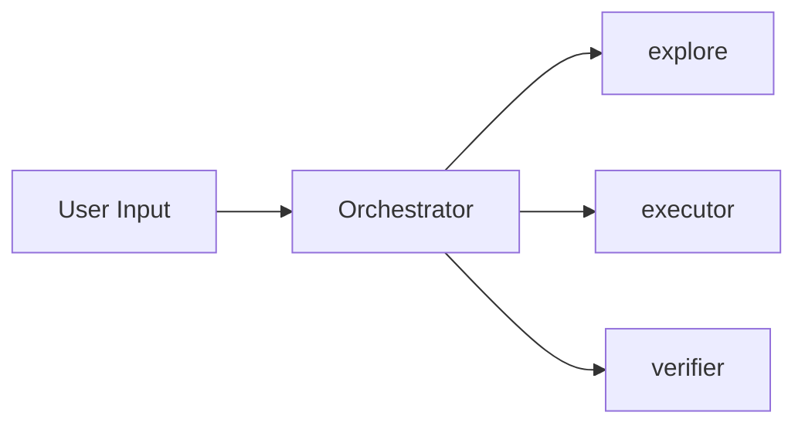

# AI Development Study Wiki

## 개요
AI/ML 개발 학습을 위한 LLM 기반 지식 위키. Andrej Karpathy의 LLM Wiki 패턴을 기반으로 하되, 일반 개념 노드뿐 아니라 특정 프로젝트/사례/소스 요약도 함께 수용하기 위해 **페이지 타입** 축을 추가한 하이브리드 모델을 사용한다.
LLM이 원본 소스를 읽고 구조화된 마크다운 위키로 컴파일하는 방식.

## 디렉토리 구조

```
ai-wiki/
  raw/             # 원본 소스 (논문, 기사, 코드 스니펫 등) - 불변, 읽기 전용
  wiki/            # LLM이 생성/관리하는 마크다운 파일들
  index.md         # 전체 페이지 카탈로그 (카테고리 × 타입별, 1줄 요약)
  log.md           # 활동 기록 (append-only, 최신이 위)
  CLAUDE.md        # 이 파일 - 스키마/규칙 정의
```

## 두 축 분류 모델

위키 페이지는 **두 개의 독립된 축**으로 분류된다:

1. **카테고리(category)** — 문서의 *주제 영역* (무엇에 관한 글인가)
2. **페이지 타입(page_type)** — 문서의 *성격* (어떤 종류의 글인가)

이 두 축을 섞지 말 것. 예: OMC Hook System은 `category: tooling`(주제는 도구)이면서 `page_type: project-internal`(성격은 특정 프로젝트 내부 디테일)이다.

## 카테고리 (Category)

| 카테고리 | 설명 |
|----------|------|
| foundations | 수학, 통계, 선형대수, 확률론 등 기초 |
| architectures | Transformer, Attention, MoE, SSM 등 모델 구조 |
| training | 사전학습, 파인튜닝, RLHF, DPO 등 학습 기법 |
| inference | 양자화, KV 캐시, 스펙디코딩, 서빙 최적화 |
| rag | 검색 증강 생성, 임베딩, 벡터DB, 청킹 전략 |
| agents | LLM 에이전트, 도구 사용, 계획, 멀티에이전트 |
| applications | 실제 구현 사례, 프로덕션 패턴, 프레임워크 |
| papers | 논문 요약 및 핵심 인사이트 |
| tooling | 개발 도구, 라이브러리, 인프라 |
| concepts | 핵심 개념, 용어 정의, 비교 |

## 페이지 타입 (Page Type)

| 타입 | 설명 | 누적 원칙 | 예시 |
|------|------|-----------|------|
| `concept` | source-agnostic 일반 개념. 여러 글/논문에서 반복 언급되는 재사용 가능 지식 노드 | 새 소스에서 등장하면 기존 페이지를 병합 갱신 | vibe-coding, red-green-tdd, cognitive-debt, subagents |
| `entity` | 특정 프로젝트/도구/제품/인물 자체에 대한 허브 문서 | 해당 대상의 진화에 따라 갱신 | Claude Code, oh-my-claudecode, Simon Willison |
| `project-internal` | 특정 프로젝트 *내부* 구현·기능·설정 디테일 | 프로젝트 버전의 스냅샷. 프로젝트별로 그룹핑 | omc-hook-system, omc-autopilot |
| `case-study` | "어떻게 만들었나" narrative. 시간에 박제된 사례 | 보통 갱신하지 않음. 후일담은 하단에 섹션 추가 | gif-optimization-case-study |
| `summary` | 특정 소스(글, 가이드, 책)의 압축 요약 | 같은 소스가 업데이트되면 재수집해서 갱신 | agentic-engineering-guide |
| `paper` | 논문 요약 + 핵심 인사이트 + 실무 관점 | 저자의 후속 논문·인용 논문을 교차참조 | (아직 없음) |

### 타입별 편집 규범

**concept**
- source-agnostic하게 작성. 특정 프로젝트의 구현 디테일로 오염시키지 말 것
- 여러 소스에서 같은 개념이 등장하면 **기존 페이지를 병합 갱신** (덮어쓰기 금지)
- `sources:` 배열에 원본 추가만 하고 기존 내용은 보존·확장
- 예시/인용은 다양한 소스에서 가져와도 되지만 "이 개념은 X에서만 의미 있다"는 뉘앙스 금지

**entity**
- 대상(프로젝트/제품/도구/인물)의 정체성 문서. 허브 역할
- `project` 필드 필수 (프로젝트명, 제품명, 인명 등 대상 식별자)
- 관련 project-internal 페이지들을 카탈로그로 링크
- 변화가 느리며 대상의 버전/세대에 따라 갱신

**project-internal**
- 특정 프로젝트의 내부 구현·기능·설정·파이프라인 등 **그 프로젝트를 모르면 의미가 없는 내용**
- `project` 필드 필수
- 파일명은 `<프로젝트약어>-<기능명>.md` 권장 (예: `omc-hook-system`)
- **concept → project-internal 역방향 참조는 신중히** — 일반 개념 설명을 특정 프로젝트 구현에 바인딩하지 말 것
- 프로젝트 버전 스냅샷이므로 버전/날짜 변동 시 재갱신 고려

**case-study**
- "이런 상황에서 이렇게 만들었고 이런 결과가 나왔다"는 narrative
- 시간에 박제된 문서 — 원본 사례가 변해도 보통 건드리지 않음
- 후속 사례가 생기면 별도 case-study로 추가
- 사례에 등장한 개념/도구는 자유롭게 concept·entity·project-internal로 링크

**summary**
- 특정 소스(블로그 포스트, 가이드, 챕터, 책)의 압축 요약
- 원본 구조를 일부 반영해도 OK (가이드 목차 등)
- 같은 소스가 업데이트되면 재수집해서 갱신
- summary에서 추출 가능한 개념은 **별도 concept 페이지로 분리**하는 것이 원칙

**paper**
- 논문 한 편당 한 페이지
- 핵심 기여, 방법, 결과, 한계, 실무 적용 관점 포함
- 저자의 후속 논문, 인용 논문, 반박/확장 논문을 교차참조

### 타입 간 교차참조 규칙

| 출발 타입 | 도착 타입 | 권장도 |
|-----------|-----------|--------|
| concept | concept | 자유 (핵심 가치) |
| concept | entity | OK (대표 구현 소개) |
| concept | project-internal | **신중** (개념이 특정 프로젝트에 오염 위험) |
| concept | case-study | OK (사례 예시) |
| concept | summary | OK (출처 연결) |
| entity | project-internal | 자유 (허브 → 디테일) |
| entity | concept | 자유 (기반 개념 연결) |
| project-internal | concept | 자유 (구현이 실현하는 개념) |
| project-internal | project-internal | 자유 (같은 프로젝트 내부) |
| case-study | concept/entity/project-internal | 자유 (등장 요소 모두 링크) |
| summary | concept | 자유 (핵심 개념 추출) |
| paper | concept/paper | 자유 |

## 페이지 템플릿

모든 위키 페이지는 다음 YAML 프론트매터로 시작한다:

```yaml
---
title: 페이지 제목
category: foundations | architectures | training | inference | rag | agents | applications | papers | tooling | concepts
page_type: concept | entity | project-internal | case-study | summary | paper
project: 프로젝트/제품/인명   # page_type이 entity 또는 project-internal일 때 필수, 그 외 생략
tags: [태그1, 태그2]
sources: [raw/파일명.md]
created: YYYY-MM-DD
updated: YYYY-MM-DD
---
```

## 작업 규칙

### Ingest (수집)
1. 소스를 `raw/`에 저장 (원본 보존, 수정 금지)
2. 소스의 주제·성격 분석 후 **생성할 페이지별로 카테고리 + 페이지 타입을 판정**
3. 타입에 맞는 편집 규범을 적용해 페이지 생성/갱신:
   - `concept` 페이지는 기존 페이지 있으면 병합 갱신
   - `project-internal` 페이지는 `project` 필드 필수
   - `summary`/`case-study`/`paper`는 소스 단위 문서
4. 페이지 간 `[[위키링크]]` 교차참조 추가 (교차참조 규칙 준수)
5. `index.md` 업데이트 — **카테고리 내에서 타입별로 서브섹션 구분**
6. `log.md`에 활동 기록 추가 — 생성/갱신 페이지를 타입별로 분류해서 기재

### Query (질의)
1. `index.md`를 읽고 관련 페이지 식별
2. 관련 페이지를 읽고 답변 합성
3. 좋은 답변이 나오면 새 위키 페이지로 저장 고려 (적절한 타입으로)
4. 출처가 불분명한 내용은 추측하지 않고 "조사 필요"로 표시

### Lint (점검)
1. 페이지 간 모순 식별
2. 오래된 정보 표시
3. 고아 페이지 (index에 없는 페이지) 정리
4. 누락된 교차참조 추가
5. 지식 갭 식별 및 `index.md`에 TODO로 기록
6. **타입 일관성 검사**: project-internal인데 `project` 필드 누락, concept인데 특정 프로젝트 구현 디테일 포함 등

## 교차참조 규칙
- 같은 개념이 여러 페이지에 등장하면 `[[개념명]]` 형식으로 링크
- 페이지 하단에 `## 관련 문서` 섹션으로 연관 페이지 목록
- 약어는 첫 등장 시 풀네임 병기 (예: RLHF (Reinforcement Learning from Human Feedback))
- 타입 간 참조는 위의 "타입 간 교차참조 규칙" 표를 따른다

## 작성 스타일

### 🇰🇷 언어 규칙 (필수)

**모든 위키 페이지는 한국어로 작성해야 한다.** 예외 없음.

- **본문**: 헤딩, 설명, 요약, 리스트, 표 모두 한국어
- **영어 원문 소스**라도 페이지는 한국어로 번역/재구성. 영어 원문을 그대로 복사 금지
- **기술 용어**: 괄호로 영어 병기 허용 — 예: "에이전트 루프(agent loop)", "페이지 타입(page_type)"
- **짧은 원문 인용**: 저자의 핵심 문장을 인용할 때 `> "..."` blockquote로만 영어 허용. 한국어 설명을 반드시 병기
- **파일명**: kebab-case 영문 기본 (예: `agentic-engineering.md`) — 내부에서 사용하는 식별자이므로 예외
- **프론트매터 키/코드 블록/Mermaid 문법 키워드**: 원문 유지

Lint 점검 시 본문이 영어 위주인 페이지는 Critical 위반이다.

### 기타 작성 규칙

- 간결하고 실용적인 설명 우선
- 코드 예시는 Python 기본
- 수식은 LaTeX 형식 (`$...$`)
- "왜 중요한가", "실무에서 어떻게 쓰이나" 관점 포함

## 다이어그램 작성 규칙 (Mermaid)

구조·흐름·관계를 설명할 때 **Mermaid 다이어그램**을 우선 사용한다. GitHub, VS Code, 대부분의 마크다운 렌더러가 Mermaid를 기본 지원하므로 이미지 첨부 없이 텍스트로 관리·수정·diff 추적이 가능하다.

### 언제 Mermaid를 쓰는가

다음 중 하나라도 해당하면 Mermaid 다이어그램을 **반드시 고려**한다:

- **프로세스/파이프라인**: 단계가 2개 이상이며 순서가 중요한 흐름
- **아키텍처**: 컴포넌트 간 관계, 데이터 흐름, 호출 경로
- **의사결정 트리**: 조건 분기가 2단계 이상인 분류/라우팅 로직
- **상태 전이**: 상태 머신, 라이프사이클, red/green 사이클 등
- **계층/카탈로그**: 트리 구조, 분류 체계, 부모-자식 관계
- **시퀀스/통신**: 참여자 간 메시지 순서가 중요한 상호작용

### 언제 Mermaid를 쓰지 않는가

- 단순 정의·설명 — 글로 충분한 경우 억지로 그리지 말 것
- 2-3개 항목의 1차원 목록 — 그냥 bullet list가 낫다
- 에세이·논증 — 시각화할 구조가 없는 경우

### Mermaid 다이얼렉트 선택 가이드

| 용도 | 다이얼렉트 | 예시 상황 |
|------|-----------|-----------|
| 일반 흐름·파이프라인·아키텍처 | `flowchart TD` (top-down) 또는 `flowchart LR` (left-right) | 에이전트 루프, 5-Phase 파이프라인 |
| 메시지/호출 순서 | `sequenceDiagram` | 부모-자식 에이전트 통신 |
| 상태 머신·라이프사이클 | `stateDiagram-v2` | TDD red/green 사이클, 훅 라이프사이클 |
| 분류 체계·타입 관계 | `classDiagram` 또는 `flowchart` | 페이지 타입 상속, 에이전트 카탈로그 |
| 트리/계층 | `flowchart TD` | 서브에이전트 트리, 카테고리 분류 |

### 작성 규칙

1. **ASCII art 금지**: 박스·화살표를 ASCII로 그리지 말고 반드시 Mermaid로 대체한다. 기존 페이지에 남아 있는 ASCII 다이어그램은 발견 시 Mermaid로 리팩토링.
2. **간결성**: 한 다이어그램에 10개 이상 노드가 들어가면 분할을 고려. 복잡한 시스템은 "하이레벨 + 상세" 두 단계로 나눠서 그린다.
3. **레이블 한국어 OK**: 노드 레이블은 한국어를 사용해도 된다. 단 다이얼렉트 키워드(`flowchart`, `-->`, `sequenceDiagram` 등)는 원어 유지.
4. **코드 펜스**: ```` ```mermaid ```` 로 감싼다. 닫는 펜스 잊지 말 것.
5. **렌더링 확인**: 가능한 경우 작성 후 GitHub/Obsidian 등에서 렌더링을 확인. 문법 오류는 전체 블록이 코드로 노출되는 대참사로 이어진다.
6. **설명 병기**: 다이어그램만 두지 말고 하단에 1-2문장 설명을 붙인다. 다이어그램이 "무엇을 보여주는지"를 글로도 설명.
7. **스타일 지시 자제**: `classDef`, `style` 등 색상/폰트 지정은 꼭 필요한 경우만. 기본 스타일로 두면 렌더러별로 일관된 외관이 나온다.

### 예시

**Bad (ASCII)**:
```
User → Parent → [explore]
              → [executor]
              → [verifier]
```

**Good (Mermaid)**:
````markdown

````

### 타입별 적용 힌트

- **concept**: 개념 본질을 설명하는 1개 핵심 다이어그램 (상태/흐름/관계)
- **entity**: 허브 페이지 상단에 아키텍처 하이레벨 다이어그램 권장
- **project-internal**: 해당 기능의 내부 동작 시퀀스/파이프라인
- **case-study**: 작업 진행 흐름 또는 before/after 비교
- **summary**: 원본 소스의 장 구조를 간단한 트리로
- **paper**: 모델 구조, 학습 파이프라인, 실험 설계
