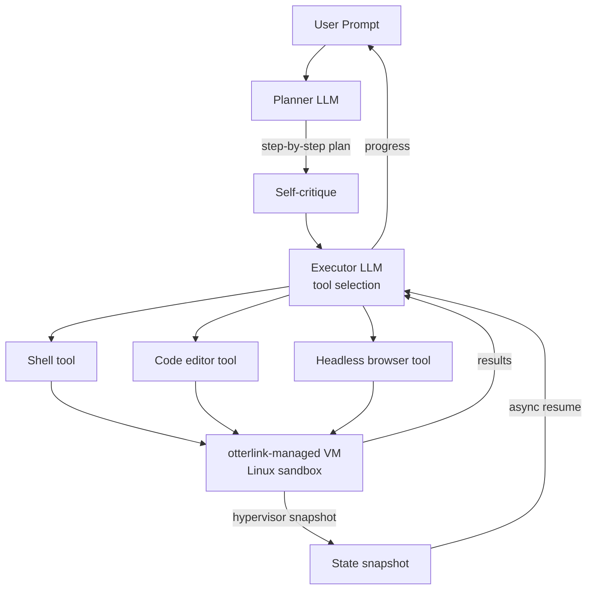

# Devin / Cognition AI 하네스

## 한국어 요약 — 핵심 포인트

Cognition(2024년 첫 공개, 2025-2026 production 운영 중)이 공개한 Devin의 엔지니어링 디테일:

1. **Sandboxed compute environment** — shell + code editor + browser를 컨테이너가 아닌 VM-level 격리로 제공. 클라우드 IDE 형태로 노출.
2. **otterlink hypervisor** — 자체 VM hypervisor. "Devin을 수만 동시 머신으로 스케일." 비동기 엔지니어링 워크플로우를 위한 hypervisor-level state snapshotting.
3. **Long-horizon planning** — Planner LLM이 step-by-step plan으로 확장 + 자기비판. Executor가 step별로 도구 선택 (shell/editor/browser).
4. **Multi-Devin** — 사용자가 여러 Devin을 병렬 spawn. 각자 자체 cloud IDE 보유.
5. **DeepWiki** — 저장소를 자동 인덱싱(2시간 간격)해 architecture diagram 포함 wiki 생성. 5M+ COBOL 라인 / 500GB repo도 처리.
6. **SWE-1.5 자체 모델** — 수천억 파라미터 frontier-size. 강한 OSS base 모델을 post-training. Cascade agent harness로 RL. Cerebras 추론으로 950 tok/s (Haiku 4.5 6배, Sonnet 4.5 13배). SWE-Bench Pro 거의 frontier 수준.
7. **2025 production 데이터** — PR merge rate 34% → 67%. 2x 자원 효율, 4x 문제 해결 속도. Goldman Sachs / Santander / Nubank 등 수천 기업 사용. 보안 vulnerability: 인간 30분 vs Devin 1.5분 (20x).
8. **실패 모드** — 명확한 사전 요구사항이 있을 때만 잘 동작. mid-task 변경 시 성능 저하. Junior 엔지니어 4-8h급 작업 sweet spot.

## 1. Original launch (cognition.ai/blog/introducing-devin)

### Sandboxed compute
> "common developer tools including the shell, code editor, and browser within a sandboxed compute environment"

### Long-term reasoning & planning
> "advances in long-term reasoning and planning"

> Devin "plan and execute complex engineering tasks requiring thousands of decisions"

> "recall relevant context at every step, learn over time, and fix mistakes"

### Collaboration
> "actively collaborate with the user" — 진행 보고 + 피드백 수용 + "design choices as needed."

### SWE-bench
> "correctly resolves 13.86% of the issues end-to-end, far exceeding the previous state-of-the-art of 1.96%"

(Devin 발표 시점 기준. 이후 SWE-Bench Verified로 표준화됨.)

## 2. Devin 2.0 (cognition.ai/blog/devin-2)

### Multi-Devin parallelization
> "Spin up multiple parallel Devins, each equipped with its own interactive, cloud-based IDE."

→ 사용자가 단일 인터페이스에서 여러 Devin 인스턴스를 띄울 수 있음. 각 인스턴스는 독립 cloud IDE.

### DeepWiki (knowledge system)
> "Devin now automatically indexes your repositories every couple hours, creating detailed wikis complete with comprehensive architecture diagrams, direct links to sources, documentation, and more."

→ 정기 인덱싱 + diagram 자동 생성. 회사 내부 모놀리스 / 레거시 코드베이스 이해에 핵심.

### Planning system
> "Each time you start a session, Devin responds in seconds with relevant files, findings, and a preliminary plan."

→ 세션 시작 즉시 빠른 코드베이스 분석 + 구조화된 preliminary plan.

### Devin Search
> "Devin Search enables you to ask questions directly about your codebase, and quickly get detailed answers with cited code."

→ 인덱스된 코드베이스에 대한 semantic search + source attribution.

## 3. 2025 Performance Review (annual review)

### PR merge rate
> "67% of its PRs are now merged vs 34% last year"

### 운영 스케일
> "at thousands of companies, including Goldman Sachs, Santander, and Nubank"

> "merged hundreds of thousands of PRs"

### Sweet spot
> "tasks with clear, upfront requirements and verifiable outcomes that would take a junior engineer 4-8 hrs of work"

### 실패 모드 1: 모호함
> "Devin does best with clear requirements"

> "can't independently tackle an ambiguous coding project end-to-end like a senior engineer could."

### 실패 모드 2: mid-task 변경
> "Devin handles clear upfront scoping well, but not mid-task requirement changes. It usually performs worse when you keep telling it more after it starts the task."

### 실패 모드 3: 검증 불가
> "When outcomes aren't straightforwardly verifiable, additional human review is necessary"

### Parallelization 강점
> "infinite capacity"
> "infinitely parallelizable and never sleeps"

> "Once it gets instructions on how to update each repo, a fleet of Devins can execute on every repo in parallel"

### 구체 사례
- 보안 fix: "saved 5-10% of total developer time"
- ETL 마이그레이션: "A large bank was migrating hundreds of thousands of proprietary ETL framework files"
- 모더나이제이션: "A fleet of Devins will go off and write the tests" 수백 repo

### 효율 데이터
- 18개월간 "4x faster at problem solving"
- "2x more efficient in resource consumption"
- 보안 vulnerability: 인간 30분 vs Devin 1.5분 (~20x)
- ETL 마이그레이션: 3-4h vs 30-40h (10x)
- Java version 마이그레이션: 14x

### 코드베이스 이해
> "massively better"
> "doubled PR merge rate"

DeepWiki 효과:
> "comprehensive, always-updating documentation with system diagrams"
> "5M lines of COBOL or 500GB repos"
> "explain with architecture diagrams, map dependencies, and flag any breaking changes"

### 통합
> Devin이 "Slack, Teams, and Jira"에서 협업.
> "@" 멘션으로 자연어 요청: "_can you pull yesterday's sales by channel?_" / "_can you check why this number looks off?_"

> "Engineers working with Devin have to adjust to learning how to 'manage' Devin effectively"

## 4. SWE-1.5 모델 (cognition.ai/blog/swe-1-5)

### 스케일
> "a frontier-size model with hundreds of billions of parameters"

> "post-training a strong open-source model as the base."

### Training: Cascade agent harness + RL
> "End-to-end reinforcement learning (RL) on real task environments using our custom Cascade agent harness"

> "variant of unbiased policy gradient"

### Custom environments
> "manually created a dataset that aims to mirror the wide distribution of real-world tasks & languages"

3가지 grading 메커니즘:
1. Classical tests
2. Rubrics for code quality
3. Agentic grading using browser automation

> "SWE-1.5 is trained at a relatively small scale" — Cognition의 첫 환경 활용 시도.

### 인프라: otterlink hypervisor
> "Our RL rollouts require high-fidelity environments with code execution and even web browsing"

> "our VM hypervisor `otterlink`"

> "allows us to scale Devin to tens of thousands of concurrent machines"

→ Devin과 SWE-1.5는 동일한 VM hypervisor 인프라(otterlink)를 공유. 이 hypervisor가 RL training과 production 모두에 동일하게 사용된다는 점이 핵심 — 실제 환경과 학습 환경이 일치.

### Inference: Cerebras
> "we worked with Cerebras, the fastest inference provider, to deploy and optimize SWE-1.5"

> "training an optimized draft model for faster speculative decoding"

### 속도
- 950 tok/s
- Haiku 4.5 대비 6x
- Sonnet 4.5 대비 13x
- 설정 편집 task: 5초 미만 (기존 ~20초)

### 평가
> SWE-Bench Pro: "near-frontier performance, while completing tasks in a fraction of the time"

> 내부 dogfooding이 우선 검증.

## 5. Devin 아키텍처 종합

### Sandbox (VM-level)
> "Cognition equipped Devin with common developer tools including the shell, code editor, and browser within a sandboxed compute environment."

> 다른 분석에 따르면 "VM-level isolation for security (replacing container-based approaches), hypervisor-level state snapshotting to handle asynchronous engineering workflows, and orchestration systems managing thousands of concurrent sessions." [교차검증 필요 — 이 부분은 Cognition 1차 소스 외에 2차 분석 글에서 인용됨]

### Planner-Executor 분리
> "The prompt is handed to a planner LLM that expands the goal into a step-by-step plan and self-critiques each step before execution, with a lightweight executor then selecting the right tool for each step (shell, code editor, or headless browser), all running inside a tightly sandboxed workspace." [교차검증 필요]

## 6. 엔터프라이즈 / 프로덕션 관점

| 차원 | Devin 특성 |
|---|---|
| 격리 | VM-level (otterlink hypervisor) |
| 스케일 | 수만 동시 머신 |
| Snapshot | hypervisor-level — async workflow 가능 |
| 추론 | Cerebras (950 tok/s) |
| 통합 | Slack/Teams/Jira |
| Sweet spot | 4-8h junior 작업, 명확한 사양 |
| 코드 이해 | DeepWiki (2h 간격 인덱스) |
| Parallelism | Multi-Devin per user |
| 모델 | SWE-1.5 (frontier-size, MoE 가능성) |

## 7. 다른 하네스와 차이

- **vs OpenHands**: OpenHands는 opt-in sandbox. Devin은 항상 VM-level 격리.
- **vs Claude Code**: Claude Code는 로컬 머신 + 표면별 최적화. Devin은 클라우드 IDE 우선.
- **vs Cursor**: Cursor는 IDE 경험 강조. Devin은 비동기 fully-autonomous workflow.

## 출처
- https://cognition.ai/blog/introducing-devin (Devin 첫 공개)
- https://cognition.ai/blog/devin-2 (Devin 2.0)
- https://cognition.ai/blog/devin-annual-performance-review-2025 (2025 Performance Review)
- https://cognition.ai/blog/swe-1-5 (SWE-1.5 모델)
- https://cognition.ai/blog/1 (Cognition 블로그 인덱스)
