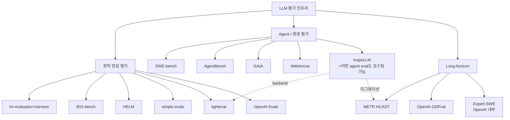

# Evaluation Harness 비교 종합

본 문서는 같은 날 수집된 8개 개별 harness raw 파일들을 합치는 비교 layer. 각 harness 의 1차 소스는 별도 raw/2026-05-06-eval-harness-*.md 참조.

## 9개 harness 의 위치



## 한 줄 정체성

| Harness | 한 줄 |
|---|---|
| **lm-evaluation-harness** | 학술 벤치마크 60+개 통합 표준, HF Open LLM Leaderboard 백엔드 |
| **BIG-bench** | 200+ collaborative task, JSON + programmatic 이중 spec |
| **HELM** | Scenario/Adapter/Metric 명시 분리 + 7-metric multi-dim 평가 |
| **OpenAI Evals** | YAML+JSONL 코드-리스 eval, model-graded mainstream화 |
| **simple-evals** | OpenAI 의 zero-shot CoT minimal 평가 (launch reference) |
| **Inspect AI** | Solver/Scorer/Tool/Sandbox first-class, UK AISI 차세대 표준 |
| **lighteval** | HF 의 다중 backend 통합, inspect-ai 를 1차 backend 로 |
| **SWE-bench** | 실제 GitHub issue 2,294개, Docker 3-tier image, unit test pass |
| **AgentBench** | 8개 환경 generalization, server-client Docker |
| **GAIA** | 466개 real-world 질문 (3 levels), 답만 제출 (quasi exact match) |
| **WebArena** | 4 시뮬레이션 사이트, 812 task, BrowserEnv + Playwright |
| **METR HCAST** | 189 task, human baseline time 측정, 50%-time-horizon metric |
| **GDPval** | 9 sectors × 44 occupations, expert deliverable, head-to-head 비교 |

## 추상화 비교

| Harness | 1차 추상화 | tool 통합 | sandbox | async | task spec |
|---|---|---|---|---|---|
| lm-eval | LM, Task, Instance | none | none | partial | YAML |
| BIG-bench | Task (json/py) | none | none | none | JSON / py |
| HELM | Scenario/Adapter/Metric | none | none | partial | Spec class |
| OpenAI Evals | Eval, CompletionFn | partial | none | none | YAML+JSONL |
| simple-evals | SamplerBase | none | none | none | Python |
| Inspect AI | **Task/Solver/Scorer/Tool/Sandbox** | **first-class** | **first-class** | **first-class** | Python decorator |
| lighteval | Pipeline, Model | inherited (inspect-ai) | inherited | yes | Python |
| SWE-bench | TestSpec | implicit (Docker) | **Docker (3-tier)** | parallel workers | Python class |
| AgentBench | Agent/Task/Evaluator | env-specific | **Docker (8환)** | server-client | JSON |
| GAIA | (없음) | agent 책임 | agent 책임 | agent 책임 | JSONL |
| WebArena | BrowserEnv | Playwright | Docker AMI | sync gym | JSON config |
| HCAST (Inspect 위) | (Inspect 와 동일) | Inspect tool | Inspect sandbox | yes | Inspect Task |
| GDPval | (custom grader + human) | n/a | n/a | n/a | task bundle |

## 주요 차원에서의 비교

### 1) 채점 방식

```mermaid
flowchart LR
    A[채점 방식] --> B[exact-match / accuracy]
    A --> C[programmatic test]
    A --> D[model-graded]
    A --> E[human pairwise]

    B --> B1[lm-eval, simple-evals, lighteval]
    B --> B2[GAIA quasi exact]
    C --> C1[SWE-bench unit test]
    C --> C2[AgentBench env scorer]
    C --> C3[WebArena url/string/program]
    D --> D1[OpenAI Evals modelgraded]
    D --> D2[Inspect AI model_graded_qa]
    D --> D3[HELM (일부 metric)]
    E --> E1[GDPval]
    E --> E2[MT-bench / Arena]
```

### 2) Sandboxing 깊이

| 단계 | 의미 | 채택 |
|---|---|---|
| 0. 없음 | 모델 호출만, 외부 상태 없음 | lm-eval, BIG-bench, HELM, simple-evals |
| 1. agent-side | 평가자는 답만 받음 | OpenAI Evals, GAIA |
| 2. Docker single-shot | task 별 컨테이너 spawn | SWE-bench |
| 3. Docker stateful | env 살아 있는 채로 multi-turn | AgentBench, WebArena |
| 4. Sandbox abstraction | Docker/k8s/Modal/local 추상화 | **Inspect AI** |

### 3) Reproducibility 위험

> METR Vivaria → Inspect 마이그레이션 시 GPT-4o, o3 두 모델만 통계적으로 유의미하게 다른 결과
>
> "scaffold sensitivity"

같은 모델, 같은 task 라도:
- prompt 템플릿 차이 (chat vs raw)
- tool 정의 차이 (signature/description 한 글자)
- system message 유무
- max_tokens / stop tokens

→ 결과가 달라진다. **HAL** (Princeton) 는 같은 agent 를 여러 harness 위에 돌려 변동성을 정량화하는 메타-평가.

### 4) Cost / 자원

| Harness | rollout 당 token | storage | 비용 특성 |
|---|---|---|---|
| lm-eval, simple-evals | 짧음 | 없음 | 단일 호출 |
| HELM | 중간 (5-shot) | 모델 응답 캐시 | scenario 합산 큼 |
| SWE-bench | 매우 김 | 120GB+ | Docker 빌드 비용 |
| AgentBench | 중간~큼 | 환경별 ~15GB | 환경 부팅 비용 |
| GAIA | 매우 김 (multi-step tool) | 작음 | tool API 비용 |
| WebArena | 중간 | AMI 이미지 큼 | 시뮬레이션 인프라 |
| HCAST long-task | 수백k tokens / rollout | Inspect 의존 | sandbox 컨테이너 시간 |
| GDPval | task 당 deliverable 생성 | reference file | human grader 비용 |

## 어떤 harness 를 언제 쓰는가

1. **모델 release 시 학술 baseline 보고** → lm-evaluation-harness, simple-evals
2. **multi-dim trust 평가** (bias/toxicity/calibration 등) → HELM
3. **custom domain-specific eval** (코드 없이) → OpenAI Evals
4. **agent / tool-use eval, sandbox 필요** → Inspect AI
5. **HF 생태계, 1000+ task, Hub push** → lighteval
6. **코드 agent 결정성** → SWE-bench
7. **agent generalization 8 환경** → AgentBench
8. **AGI 가까운 real-world 질문** → GAIA
9. **웹 agent** → WebArena
10. **장기 agent 시간 horizon** → METR HCAST (Inspect 위)
11. **경제적 가치 task** → GDPval

## 의존 관계

- **lighteval → inspect-ai** (lighteval 가 inspect-ai 를 1차 backend 로 wrap)
- **METR HCAST → inspect-ai** (Vivaria 에서 마이그레이션)
- **AgentBench → ALFWorld / WebShop / Mind2Web** (3개 dataset 흡수)
- **lm-eval → BIG-bench** (BIG-bench task 들을 lm-eval 의 `bbh` group 으로 흡수)

## 미커버 항목 (수집 후속 후보)

이번 wave 에서 다루지 않은 인접 항목:
- **Vellum / Braintrust / Phoenix / OpenLLMetry** — production-grade observability + eval
- **promptfoo** — open-source LLM eval CLI
- **DeepEval** — pytest-style LLM eval (이미 `wiki/tooling/argilla.md`, `wiki/tooling/braintrust.md` 일부 인접)
- **AlpacaEval / Chatbot Arena / MT-Bench** — pairwise / human-vs-model (alpacaeval.md 일부 존재)
- **HAL (Princeton Holistic Agent Leaderboard)** — agent harness 메타-평가
- **Terminal-Bench / OSWorld** — 데스크톱 agent

## 출처 (cross-reference)

- raw/2026-05-06-eval-harness-lm-eval-eleutherai.md
- raw/2026-05-06-eval-harness-big-bench.md
- raw/2026-05-06-eval-harness-helm-stanford.md
- raw/2026-05-06-eval-harness-openai-evals.md
- raw/2026-05-06-eval-harness-simple-evals.md
- raw/2026-05-06-eval-harness-inspect-ai.md
- raw/2026-05-06-eval-harness-lighteval.md
- raw/2026-05-06-eval-harness-agent-benchmarks.md
- raw/2026-05-06-eval-harness-long-horizon-metr-gdpval.md
