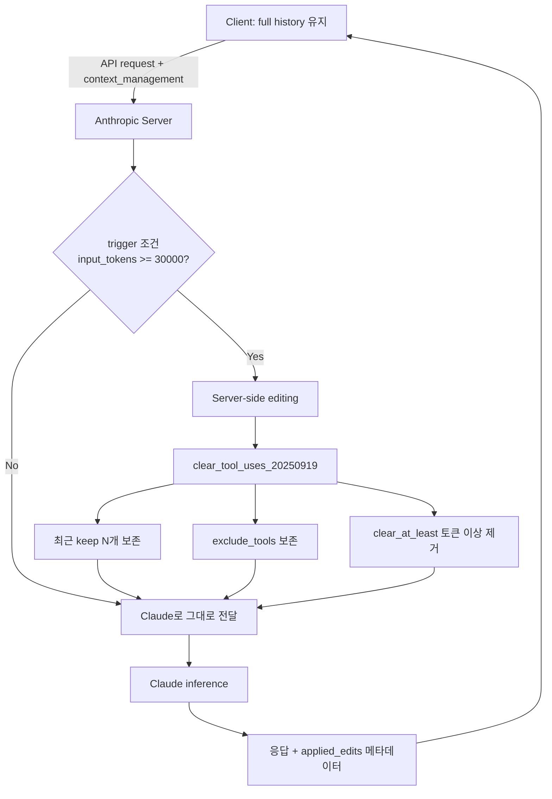

# Context Window Management

장시간 실행되는 에이전트에서 **컨텍스트 윈도우는 유한 자원**이다. Anthropic이 2025년 9월 공개한 "context rot" 개념과 `clear_tool_uses_20250919` API는 이 자원을 적극적으로 큐레이션하기 위한 표준 해법으로 자리잡았다.

## 1. Context Rot 현상

### 정의
> "Context rot is the concept that as the number of tokens in the context window increases, the model's ability to accurately recall information from that context decreases."

컨텍스트 윈도우가 가득 차지 않더라도, 토큰이 많아질수록 정보 회상 정확도가 하락하는 현상.

### 근본 원인
> "LLMs have an 'attention budget' that they draw on when parsing large volumes of context, and every new token introduced depletes this budget by some amount."

Transformer는 모든 토큰이 다른 모든 토큰을 attention하므로 n² pairwise relationship이 생긴다. 컨텍스트가 길어질수록 이 관계 포착 능력이 stretched thin.

### Anthropic의 처방
> "Context as a precious, finite resource with diminishing marginal returns."
> "Pursue the smallest possible set of high-signal tokens that maximize the likelihood of some desired outcome."

## 2. Anthropic Context Editing API

### Beta header
```
anthropic-beta: context-management-2025-06-27
```

### 두 가지 server-side strategy
1. `clear_tool_uses_20250919`: 오래된 tool result/call 자동 삭제
2. `clear_thinking_20251015`: extended thinking 블록 정리

### Client-side compaction (SDK)
Python/TypeScript/Ruby SDK의 `tool_runner` 와 함께 사용. 대화 전체를 요약으로 압축.

> "For most use cases, server-side compaction is the primary strategy for managing context in long-running conversations."

## 3. Tool Result Clearing 상세 파라미터

### 기본 사용
```python
response = client.beta.messages.create(
    model="claude-opus-4-7",
    max_tokens=4096,
    messages=[{"role": "user", "content": "Search for recent developments in AI"}],
    tools=[{"type": "web_search_20250305", "name": "web_search"}],
    betas=["context-management-2025-06-27"],
    context_management={"edits": [{"type": "clear_tool_uses_20250919"}]},
)
```

### 고급 설정
```python
context_management={
    "edits": [
        {
            "type": "clear_tool_uses_20250919",
            # 임계값을 넘으면 clearing 트리거
            "trigger": {"type": "input_tokens", "value": 30000},
            # 최근 N개 tool_use는 보존
            "keep": {"type": "tool_uses", "value": 3},
            # 최소 이 토큰 수만큼 clear (cache invalidation 비용 회수용)
            "clear_at_least": {"type": "input_tokens", "value": 5000},
            # 특정 도구는 clear 대상에서 제외
            "exclude_tools": ["web_search"],
        }
    ]
}
```

### 파라미터 정리
| 파라미터 | 타입 | 의미 |
|----------|------|------|
| `trigger` | `{type: "input_tokens", value: N}` | input token이 N을 넘으면 발동 |
| `keep` | `{type: "tool_uses", value: N}` | 가장 최근 N개 tool_use는 보존 |
| `clear_at_least` | `{type: "input_tokens", value: N}` | 발동 시 최소 N 토큰만큼 비움 |
| `exclude_tools` | `[string]` | 이 도구의 결과는 보존 |
| `clear_tool_inputs` | `bool` | true면 tool 입력(arguments)까지 함께 clear (기본 false) |

### 동작 메커니즘
> "When activated, the API automatically clears the oldest tool results in chronological order. The API replaces each cleared result with placeholder text so Claude knows it was removed."

오래된 것부터 chronological 순서로 제거하며, placeholder로 대체. 클라이언트는 full conversation history를 그대로 유지 (server-side에서 prompt가 Claude에 도달하기 전 적용).

## 4. Thinking Block Clearing

### 모델별 기본 동작
| 모델 | 기본 |
|------|------|
| Opus 4.5+ | 모든 thinking block 보존 |
| Opus 4.1 이하 | 마지막 assistant turn의 thinking만 보존 |
| Sonnet 4.6+ | 모든 보존 |
| Sonnet 4.5 이하 | 마지막 turn만 |
| 모든 Haiku (4.5까지) | 마지막 turn만 |

### 권장 설정
> "If your code runs across multiple model tiers, set `keep` explicitly rather than relying on the per-model default."

## 5. Prompt Caching 상호작용

### Tool result clearing
> "Invalidates cached prompt prefixes when content is cleared. To account for this, clear enough tokens to make the cache invalidation worthwhile. Use the `clear_at_least` parameter."

clearing이 일어나면 cache prefix가 무효화되어 cache write cost가 발생. `clear_at_least` 로 충분히 비워서 cache invalidation cost를 회수.

### Thinking block clearing
- thinking block을 keep할 때 → cache hit 가능
- clear할 때 → 해당 지점에서 cache invalidate

## 6. Anthropic의 Context Engineering 4축

`effective-context-engineering-for-ai-agents` 블로그(2025-09)에서 제시한 4가지 전략:

### A. Compaction
> "Maximizing recall to ensure your compaction prompt captures every relevant piece of information, then improving precision."

대화가 컨텍스트 한계에 가까워지면 요약. Claude Opus 4.6에 자동 context compaction 도입.

### B. Structured Note-Taking
> "Persistent external memory through regular note-writing (like NOTES.md files or to-do lists)."

NOTES.md, TODO 파일 등 외부 파일에 메모를 적어 working context를 절약.

### C. Sub-Agent Architectures
> "Specialized sub-agents handle focused tasks, returning condensed summaries (typically 1,000-2,000 tokens) to the main coordinator."

서브 에이전트가 isolated context에서 작업 후 1-2K 토큰 요약만 부모에게 반환.

### D. Just-in-Time Retrieval
> "Maintain lightweight identifiers (file paths, stored queries, web links, etc.) and use these references to dynamically load data into context at runtime using tools."

데이터 자체가 아니라 식별자(path/URL/ID)만 유지하고 필요할 때 tool로 로드.

## 7. Mermaid: Context Editing Flow



## 8. 엔터프라이즈 적용 관점

### Cache + Edit 조합 비용 모델
- 매 clearing 시점에 cache write cost 1회 발생
- 이후 stable한 prefix는 cache hit으로 90% 비용 절감
- 따라서 `clear_at_least` 를 충분히 크게 설정 (예: 5000~10000 tokens)해서 자주 invalidate 되지 않도록 함

### Context rot 방지 워크플로우
1. **Just-in-Time** 우선: 큰 데이터는 path/ID로 보관, 필요시 read tool로 로드
2. **Sub-agent isolation**: 100K+ 토큰 작업은 sub-agent에 위임, 1-2K 요약 반환
3. **Notes pattern**: 장기 추적 정보는 NOTES.md에 기록
4. **Tool result clearing**: 그래도 누적되면 자동 정리

## 관련 문서 후보 (ingest 시)
- `wiki/agents/context-rot` (concept) - 새로 만들 필요
- `wiki/agents/context-editing-api` (concept, Anthropic 고유)
- 기존 `agent-context-management.md`, `context-folding.md` 와 차별화: 이 raw는 server-side API와 attention budget 이론에 초점
