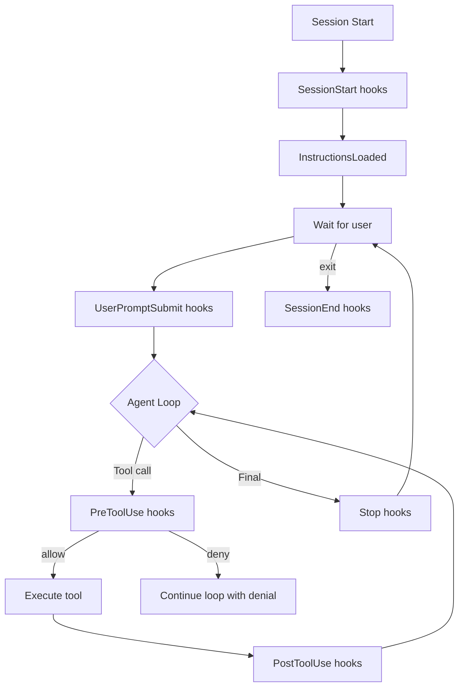

# Hook System Architecture (Claude Code)

LLM 코딩 에이전트의 행동을 결정론적으로 통제하려면 모델 자체에 의존하기보다 **이벤트 훅(event hook)** 으로 lifecycle을 둘러싸는 것이 안전하다. Claude Code의 hook 시스템은 30+ 종의 이벤트와 5종의 handler 타입으로 구성된 표준 사례.

> 기존 `wiki/tooling/claude-code-hooks-system.md` 와 차별화: 이 raw는 2026년 신규 이벤트(FileChanged, CwdChanged, ConfigChange, InstructionsLoaded, PermissionRequest 등)와 5가지 handler 타입(command/http/mcp_tool/prompt/agent)에 초점.

## 1. Hook 라이프사이클 (3가지 cadence)

### Once per session
- `SessionStart` - 세션 시작 (matcher: `startup|resume|clear|compact`)
- `SessionEnd` - 세션 종료 (matcher: `clear|resume|logout|other`)
- `Setup` - CLI flag 시점 (matcher: `init|maintenance`)

### Once per turn
- `UserPromptSubmit` - 사용자 프롬프트 제출 시
- `Stop` - Claude 응답 정상 완료
- `StopFailure` - 응답 실패 (matcher: `rate_limit|authentication_failed`)

### Every tool call
- `PreToolUse` - 도구 실행 직전 (가장 강한 enforcement point)
- `PostToolUse` - 도구 실행 직후
- `PostToolUseFailure` - 도구 실행 실패
- `PostToolBatch` - 배치 종료

### Async events (2026 신규)
- `FileChanged` - 감시 파일 변경
- `ConfigChange` - 설정 파일 변경 (matcher: `user_settings|project_settings|local_settings|policy_settings|skills`)
- `CwdChanged` - 작업 디렉토리 변경
- `Notification` - 알림 발생
- `SubagentStart`, `SubagentStop`
- `InstructionsLoaded` - CLAUDE.md / `.claude/rules/*.md` 로딩
- `PreCompact`, `PostCompact` - 컨텍스트 압축 직전/후 (matcher: `manual|auto`)
- `Elicitation`, `ElicitationResult`
- `WorktreeCreate`, `WorktreeRemove`
- `UserPromptExpansion`
- `PermissionRequest`, `PermissionDenied`
- `TaskCreated`, `TaskCompleted`
- `TeammateIdle`

## 2. Handler 5가지 타입

### A. Command hook
```json
{
  "type": "command",
  "command": "\"$CLAUDE_PROJECT_DIR\"/.claude/hooks/script.sh",
  "async": false,
  "shell": "bash"
}
```
stdin으로 JSON 받음, exit code + stdout으로 응답.

### B. HTTP hook
```json
{
  "type": "http",
  "url": "http://localhost:8080/hooks/endpoint",
  "timeout": 30,
  "headers": {"Authorization": "Bearer $MY_TOKEN"},
  "allowedEnvVars": ["MY_TOKEN"]
}
```
JSON POST. 보안 - `allowedEnvVars` 로 화이트리스트.

### C. MCP tool hook
```json
{
  "type": "mcp_tool",
  "server": "my_server",
  "tool": "security_scan",
  "input": {"file_path": "${tool_input.file_path}"}
}
```
연결된 MCP 서버의 tool을 호출.

### D. Prompt hook
```json
{
  "type": "prompt",
  "prompt": "Should this command be allowed? $ARGUMENTS",
  "model": "claude-3-5-sonnet-20241022",
  "timeout": 30
}
```
LLM에게 yes/no 결정을 위임.

### E. Agent hook (experimental)
```json
{
  "type": "agent",
  "prompt": "Verify this configuration is safe: $ARGUMENTS",
  "model": "claude-3-5-sonnet-20241022",
  "timeout": 60
}
```
서브에이전트를 spawn 해서 검증.

## 3. 설정 위치 우선순위

| Location | Scope | Shareable |
|----------|-------|-----------|
| `~/.claude/settings.json` | 전역 | No |
| `.claude/settings.json` | 프로젝트 | Yes |
| `.claude/settings.local.json` | 프로젝트 (로컬) | No |
| Managed policy settings | 조직 전체 | Yes (enterprise) |
| Plugin `hooks/hooks.json` | 플러그인 활성 시 | Yes |
| Skill/Agent frontmatter | 컴포넌트 활성 시 | Yes |

## 4. Matcher 패턴

| 패턴 | 의미 |
|------|------|
| `*` 또는 `""` 또는 omit | 모두 매치 |
| `Bash` | 정확히 일치 |
| `Edit\|Write` | OR (pipe-separated) |
| `^Bash`, `mcp__.*` | JavaScript regex (특수문자 포함 시) |

이벤트별 matcher 의미:
- `PreToolUse/PostToolUse`: 도구명 (`Bash`, `mcp__memory__.*`)
- `SessionStart`: `startup|resume|clear|compact`
- `Setup`: `init|maintenance`
- `Notification`: `permission_prompt|idle_prompt|auth_success|elicitation_complete`
- `SubagentStart/Stop`: agent 종류 (`general-purpose|Explore|Plan|<custom>`)
- `PreCompact/PostCompact`: `manual|auto`
- `FileChanged`: literal 파일명 (regex 아님, `.envrc|.env`)
- `StopFailure`: 에러 타입

## 5. Hook 입력/출력

### 공통 입력
```json
{
  "session_id": "abc123",
  "transcript_path": "/path/to/transcript.jsonl",
  "cwd": "/current/working/dir",
  "permission_mode": "default|plan|acceptEdits|auto|dontAsk|bypassPermissions",
  "hook_event_name": "PreToolUse",
  "agent_id": "subagent-123",
  "agent_type": "Explore"
}
```

### Exit Code 규약
| Code | 의미 | 동작 |
|------|------|------|
| 0 | 성공 | stdout 파싱 후 진행 |
| 2 | 차단 에러 | stderr를 Claude에 전달, 도구 실행 차단 |
| 그 외 | 비차단 에러 | stderr 첫 줄만 transcript에 표시, 진행 |

### JSON 응답 포맷
```json
{
  "continue": true,
  "stopReason": "Build failed",
  "suppressOutput": false,
  "systemMessage": "Warning",
  "decision": "block",
  "reason": "Reason for blocking",
  "hookSpecificOutput": {
    "hookEventName": "PreToolUse",
    "additionalContext": "Context for Claude",
    "permissionDecision": "allow|deny|ask|defer",
    "permissionDecisionReason": "Reason"
  }
}
```

### PreToolUse 결정값
- `allow`: permission prompt 건너뜀
- `deny`: 도구 호출 차단 (Claude에게 메시지)
- `ask`: 사용자에게 컨펌 요청
- `defer`: graceful exit, 나중에 재개 (non-interactive 전용)

## 6. PreToolUse `updatedInput` 패턴

PreToolUse는 도구 입력 자체를 수정 가능:
```json
{
  "hookSpecificOutput": {
    "hookEventName": "PreToolUse",
    "permissionDecision": "allow",
    "updatedInput": {
      "command": "npm run lint"
    }
  }
}
```
`npm test` 호출이 들어왔을 때 `npm run lint` 로 변경 가능.

## 7. 컨텍스트 주입 한도

> "Output injected into context (additionalContext, systemMessage, plain stdout) is capped at 10,000 characters. Excess is saved to file with preview and path."

10K 문자 cap. 초과 시 파일로 저장되고 preview만 주입.

## 8. 환경 변수

- `$CLAUDE_PROJECT_DIR` - 프로젝트 루트
- `${CLAUDE_PLUGIN_ROOT}` - 플러그인 설치 디렉토리
- `${CLAUDE_PLUGIN_DATA}` - 플러그인 persistent data
- `CLAUDE_ENV_FILE` - SessionStart/Setup/CwdChanged/FileChanged에서 환경변수 영속화 path
- `$CLAUDE_CODE_REMOTE` - web 환경에서 "true"

## 9. 실전 예시: 위험 명령 차단

```bash
#!/bin/bash
COMMAND=$(jq -r '.tool_input.command' < /dev/stdin)

if echo "$COMMAND" | grep -q 'rm -rf'; then
  jq -n '{
    hookSpecificOutput: {
      hookEventName: "PreToolUse",
      permissionDecision: "deny",
      permissionDecisionReason: "Destructive rm -rf blocked"
    }
  }'
else
  exit 0
fi
```

설정:
```json
{
  "hooks": {
    "PreToolUse": [
      {
        "matcher": "Bash",
        "hooks": [
          {
            "type": "command",
            "if": "Bash(rm *)",
            "command": "\"$CLAUDE_PROJECT_DIR\"/.claude/hooks/block-rm.sh"
          }
        ]
      }
    ]
  }
}
```

## 10. 보안 모델

- 모든 hook은 Claude Code의 환경/권한으로 실행
- HTTP hook은 status code만으로 차단 불가 → JSON `decision` 필수
- `PreToolUse` 가 가장 강한 enforcement point (실행 전)
- `PostToolUse` 는 informational, 이미 실행된 행동을 막지 못함
- Enterprise: `allowManagedHooksOnly` 로 user/project/plugin hook 차단 가능

## 11. Mermaid: Hook Lifecycle



## 12. 엔터프라이즈 적용 관점

### 패턴별 활용
1. **Validation**: `PreToolUse` 로 SAST 스캔, regex blocklist
2. **Audit log**: `PostToolUse`, `SessionEnd` 로 모든 도구 호출 기록 → SIEM 전송
3. **Context injection**: `SessionStart` 에서 git branch, 운영 환경 등 자동 주입
4. **Auto-approval**: 읽기 전용 명령(`ls/cat/grep`) `allow`, 쓰기 명령은 `ask`
5. **Escalation**: 의심스러운 커맨드 → `prompt` hook으로 LLM에 위임 → `ask` 응답
6. **Compliance**: `Stop` hook에서 PR description, ticket 링크 검증, 빈 commit 차단

### Anti-pattern
- `PostToolUse` 에서 destructive command를 막으려 함 (이미 실행됨, 불가)
- HTTP hook을 timeout 짧게 → permission flow 자체가 hang
- `additionalContext` 에 10K 초과 텍스트 주입 → 자동 truncate 됨

## 관련 문서 후보 (ingest 시)
- 기존 `wiki/tooling/claude-code-hooks-system.md` 갱신 (2026 async events 추가)
- `wiki/agents/event-driven-harness` (concept) - source-agnostic 패턴화
