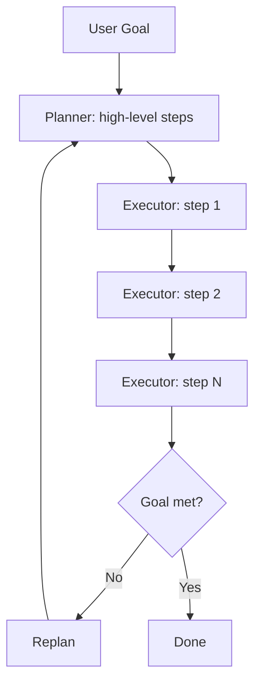
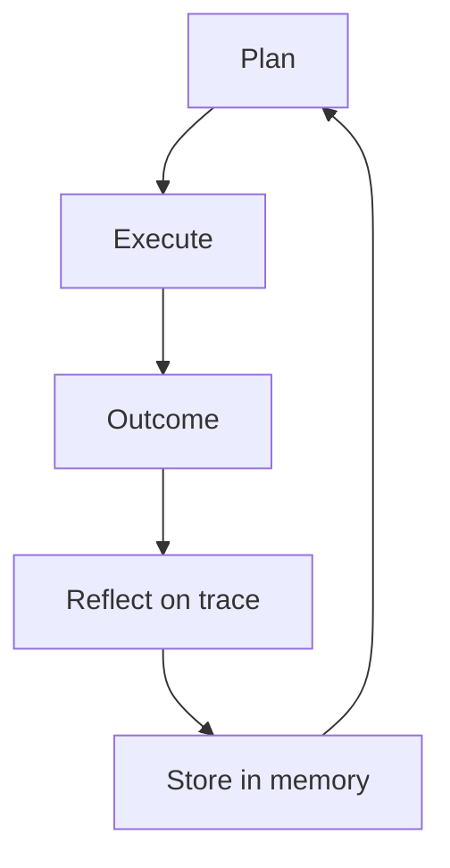
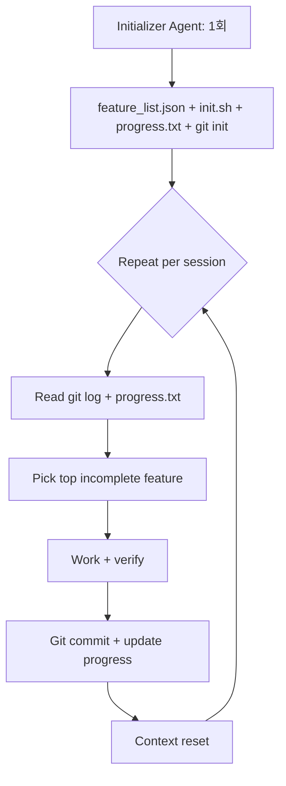

# Long-horizon Agent Loop

장시간(20분~수시간) 실행되는 에이전트는 단일 ReAct 루프로는 collapse 한다. Anthropic의 harness design 시리즈(2025-09 → 2025-11)와 Plan-and-Act(arXiv 2503.09572)는 이 문제의 두 축 - **반복(loop)** 과 **격리(reset)** - 을 다룬다.

> 기존 `wiki/agents/anthropic-harness-design.md`, `wiki/agents/react-pattern.md`, `wiki/agents/orchestrator-worker-pattern.md` 와 차별화: 이 raw는 "context anxiety", "Ralph Loop", "context reset vs compaction trade-off", Sonnet 4.5 vs Opus 4.5 차이 등 production 운영 lesson에 초점.

## 1. ReAct Loop의 한계

### 기본 ReAct
```
Thought → Action → Observation → Thought → Action → ... → Final Answer
```

### 한계
1. **Myopic decisions**: 다음 action에만 최적화, 전체 전략 누락
2. **Error propagation**: 초반 한 번의 잘못된 observation이 cascade
3. **Long-horizon weakness**: 컨텍스트가 길어질수록 coherence loss
4. **Self-evaluation 실패**: 모델이 자기 결과를 confidently praise (편향)

> "Models tend to lose coherence on lengthy tasks as the context window fills."
> "Agents consistently respond by confidently praising the work—even when, to a human observer, the quality is obviously mediocre."

## 2. Plan-and-Act / Plan-and-Execute (arXiv 2503.09572)

### 분리 구조
| 모듈 | 역할 |
|------|------|
| **Planner** | 고수준 plan을 step sequence로 생성 |
| **Executor** | 각 step을 environment-specific action으로 변환 |

### 장점
- Plan은 한 번 수립 → Executor 단계에서 myopic 결정 방지
- Replan trigger 시점에만 plan 갱신 (보통 매 N step 또는 실패 시)

## 3. Reflection / Critique Loop

### 패턴
```
Execute → Outcome → Reflect on trace → Store in memory → Inform future plan
```

### Reflexion 개념
> "After a task failure or completion, the agent reflects on its entire execution trace (including thoughts, actions, and observations) to identify errors or inefficiencies. It then stores this reflection in its memory to inform future planning."

→ 모델 retrain 없이 "learning from mistakes" 효과.

## 4. Anthropic Harness Design (2025-09 / 11)

### Context Management: Compaction vs Reset

**Compaction**:
> "Earlier parts of the conversation are summarized in place so the same agent can keep going on a shortened history."

장점: 연속성 유지
단점: **context anxiety 잔존** (clean slate 아님)

**Context Reset**:
> "Creating a harness that worked well across context resets was key to keeping the model on task."

장점: 진짜 clean slate
단점: **handoff artifact** 가 다음 에이전트가 작업을 이어받을 만큼의 state를 담아야 함

### Sonnet 4.5 vs Opus 4.5

> "Claude Sonnet 4.5 exhibited context anxiety strongly enough that compaction alone wasn't sufficient to enable strong long task performance, so context resets became essential to the harness design."

> "Opus 4.5 largely removed that behavior on its own, so context resets could be dropped entirely. The agents were run as one continuous session across the whole build, with the Claude Agent SDK's automatic compaction handling context growth along the way."

→ 모델 capability 향상에 따라 harness 패턴이 진화. Sonnet 4.5 시기엔 reset 필수, Opus 4.5에서는 compaction만으로 충분.

## 5. Two-Agent Split: Initializer + Coding Agent

### Initializer Agent (1회 실행)
- 환경 setup (init script)
- Feature list 생성 (200+ items, JSON 포맷)
- claude-progress.txt 초기화
- Initial git commit

### Coding Agent (매 세션)
1. Working directory 확인
2. git log + progress.txt 읽고 orient
3. 가장 높은 priority incomplete feature 선택
4. 앱 동작 verify (Puppeteer MCP browser test)
5. 작업 + commit + progress 업데이트

> "An initializer agent that sets up the environment on the first run, and a coding agent that is tasked with making incremental progress."

## 6. 환경 Scaffolding (handoff artifact 4종)

| 아티팩트 | 포맷 | 목적 |
|----------|------|------|
| `feature_list.json` | JSON (model-induced corruption resistant) | 요구사항 + pass/fail |
| `init.sh` | Shell script | dev server startup + smoke test |
| `claude-progress.txt` | Plain text | 세션별 작업 로그 |
| Git history | git | versioning + rollback |

> "Structured requirements with pass/fail status, resistant to model-induced corruption."

JSON이 plain text보다 model이 무심코 깨뜨릴 가능성 낮음.

## 7. Failure Modes & Solutions

| Failure mode | 대처 |
|--------------|------|
| Premature completion (양치기 완료 선언) | feature_list.json 의 모든 항목 starting failing 상태 |
| Undocumented progress | git commit + progress.txt 강제 |
| Inadequate testing | Browser automation (Puppeteer MCP) 강제 |
| Coherence loss | Context reset + handoff |
| Self-praise bias | Generator/Evaluator 분리 |

## 8. Ralph Loop Pattern

### 정의
> "A two-phase Ralph Loop pattern. It uses an Initializer Agent that sets up the environment, then a Coding Agent in every subsequent session reads git logs and progress files to orient itself, picks the highest-priority incomplete feature, works on it, commits, and writes summaries."

### 흐름
```
[Initializer] (1회)
    ↓ feature_list.json + init.sh + progress.txt + git init
[Coding Agent] (반복)
    git log → progress.txt → pick top feature → work → commit → update progress
    ↓ context reset
[Coding Agent] (다음 세션, fresh context)
    동일 routine
```

## 9. Mermaid: Long-horizon Loop Patterns

### A. Plan-and-Execute


### B. Reflexion Loop


### C. Ralph Loop (Anthropic)


## 10. Verifier / Critic 분리

### 핵심 통찰
> "The solution involved separating generator and evaluator roles rather than relying on self-assessment."

같은 모델 인스턴스가 generate + evaluate 하면 self-praise 편향 발생 → 별도 agent로 평가.

### 패턴 변형
- Generator + Critic (separate context)
- Generator + Test runner (deterministic verifier)
- Generator + Human approval gate

## 11. 엔터프라이즈 적용 관점

### 모델별 권장 패턴
| 모델 | 권장 |
|------|------|
| Sonnet 4.5 / 이전 | Context reset 강제, two-agent split |
| Opus 4.5+ | Continuous session + compaction |
| Haiku | Verifier role 한정 (cost-efficient) |

### Long-horizon 작업 체크리스트
- [ ] Initializer agent로 한 번 환경 setup
- [ ] feature_list.json 등 structured artifact (JSON 권장)
- [ ] init.sh + smoke test로 매 세션 시작 verify
- [ ] git commit 강제로 progress 추적
- [ ] Generator와 Verifier role 분리
- [ ] Browser automation 등 deterministic verifier 도입

### Anti-pattern
- 단일 ReAct loop로 multi-hour 작업 처리 (coherence loss)
- 자체 평가에 의존 (self-praise 편향)
- Plain text progress file (모델이 corrupt 시킬 위험)
- Compaction만으로 Sonnet 4.5 long task 처리 (context anxiety 미해결)

## 관련 문서 후보 (ingest 시)
- `wiki/agents/ralph-loop` (concept) - 새로 만들 가치 높음
- `wiki/agents/context-reset-vs-compaction` (concept)
- `wiki/agents/initializer-coding-agent-split` (concept)
- 기존 `anthropic-harness-design.md` 갱신 (Ralph Loop, Sonnet 4.5 vs Opus 4.5 비교)
