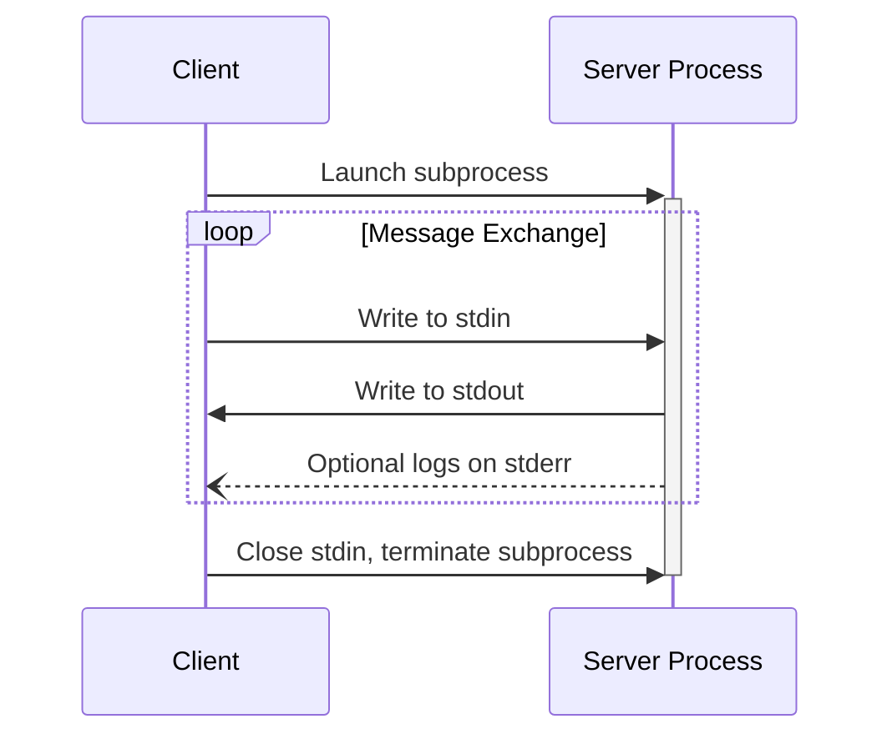
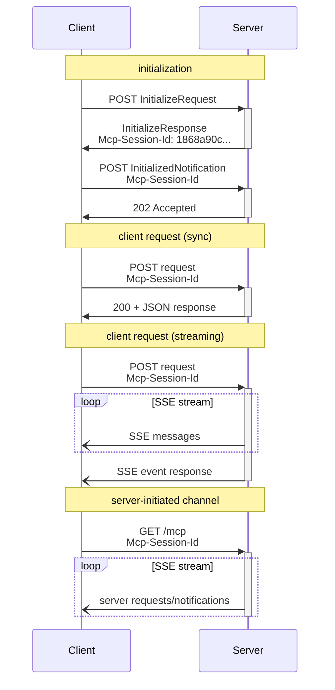

# MCP (Model Context Protocol) Specification

MCP는 LLM 호스트와 외부 데이터 소스/도구 사이의 통합을 표준화하는 오픈 프로토콜이다. JSON-RPC 2.0 기반 + stateful connection + capability negotiation. 2025-11에 Streamable HTTP transport가 도입되며 legacy SSE를 대체.

> 기존 `wiki/tooling/mcp.md`, `wiki/tooling/mcp-architecture.md`, `wiki/tooling/mcp-specification-2025-11-25.md` 와 차별화: 이 raw는 **2025-06-18 protocol version의 transport spec, security model, session management** 핵심 부분을 1차 소스에서 직접 인용.

## 1. 아키텍처: Hosts / Clients / Servers

MCP는 3-tier 구조:
- **Hosts**: LLM 애플리케이션 (Claude Desktop, Claude Code, IDE, etc.) - connection을 initiate
- **Clients**: Host 내부의 connector
- **Servers**: context/capability를 제공하는 서비스

> "MCP takes some inspiration from the Language Server Protocol, which standardizes how to add support for programming languages across a whole ecosystem of development tools."

## 2. Capabilities (3+3+3)

### Server → Client 제공
| Capability | 설명 |
|------------|------|
| **Resources** | 사용자 또는 모델이 사용할 context/data |
| **Prompts** | 템플릿화된 메시지/워크플로우 |
| **Tools** | 모델이 실행할 함수 |

### Client → Server 제공
| Capability | 설명 |
|------------|------|
| **Sampling** | Server-initiated 에이전트 행동, recursive LLM 호출 |
| **Roots** | Server가 작동할 URI/filesystem 경계 조회 |
| **Elicitation** | Server가 사용자에게 추가 정보 요청 |

### Utilities
- Configuration, Progress tracking, Cancellation, Error reporting, Logging

## 3. Transport Layer

### A. stdio Transport (권장)

> "Clients SHOULD support stdio whenever possible."

#### 동작 방식
- Client가 server를 subprocess로 launch
- Server는 stdin에서 JSON-RPC 메시지 read, stdout으로 send
- Messages는 newline으로 구분, **embedded newline 금지**
- Server는 stderr에 UTF-8 로그 기록 가능
- Server는 stdout에 valid MCP 메시지 외 아무것도 쓰지 않아야 함



### B. Streamable HTTP Transport (2025-11 신규)

> "This replaces the HTTP+SSE transport from protocol version 2024-11-05."

#### 핵심 사양
- 단일 HTTP endpoint (POST + GET 지원)
- POST: Client → Server 메시지 전송
- GET: SSE stream 열기 (Server → Client notification)
- Streaming은 SSE를 사용 (옵셔널)

#### POST 요청 규칙
1. Client는 `Accept: application/json, text/event-stream` 헤더 포함 필수
2. Body는 단일 JSON-RPC request/notification/response
3. **Notification/Response 입력 시**: 서버는 `202 Accepted` (no body), 거절 시 4xx
4. **Request 입력 시**: 서버는 `Content-Type: text/event-stream` (SSE) 또는 `application/json` (단일 응답) 중 선택

#### GET 요청 (Server → Client 채널)
- Client가 SSE stream을 열기 위해 GET 요청
- 서버는 `text/event-stream` 또는 `405 Method Not Allowed`
- 서버는 GET stream에 client request에 대한 response를 보내지 않음 (resumability 제외)

#### Resumability & Redelivery
```
SSE event id 부여 → 연결 끊김 시 client는 GET + Last-Event-ID 헤더로 재연결
서버는 이전 stream에서만 replay (다른 stream 메시지는 replay 안 함)
```

#### Multiple Connections
- Client는 동시에 여러 SSE stream에 연결 가능
- Server는 각 메시지를 **하나의 stream에서만** 송신 (broadcast 금지)

## 4. Session Management

### Mcp-Session-Id 헤더
1. Server가 initialize 응답에 `Mcp-Session-Id` 헤더로 세션 ID 부여 (옵션)
2. Session ID는 globally unique + cryptographically secure (UUID, JWT, hash)
3. 가시 ASCII 문자(0x21-0x7E)만 사용
4. Client는 이후 모든 요청에 `Mcp-Session-Id` 헤더 포함 필수
5. 서버가 세션 종료 시 → 해당 ID 요청에 `404 Not Found`
6. Client가 `404` 받으면 → 새 InitializeRequest로 새 세션 시작
7. Client가 명시 종료 → `DELETE /mcp` + `Mcp-Session-Id`

## 5. Protocol Version Negotiation

```
MCP-Protocol-Version: 2025-06-18
```

- Client는 모든 후속 요청에 protocol version 헤더 포함
- Initialization 단계에서 negotiate된 버전 사용
- 헤더 없으면 server는 `2025-03-26` 가정 (backwards compat)
- 서버는 unsupported version 시 `400 Bad Request`

## 6. Security Model

### 4가지 핵심 원칙
1. **User Consent and Control**
   > "Users must explicitly consent to and understand all data access and operations."

2. **Data Privacy**
   > "Hosts must obtain explicit user consent before exposing user data to servers."
   > "Hosts must not transmit resource data elsewhere without user consent."

3. **Tool Safety**
   > "Tools represent arbitrary code execution and must be treated with appropriate caution."
   > "Descriptions of tool behavior such as annotations should be considered untrusted, unless obtained from a trusted server."

4. **LLM Sampling Controls**
   > "Users must explicitly approve any LLM sampling requests."
   > "The protocol intentionally limits server visibility into prompts."

### Streamable HTTP 보안 경고
> "Servers MUST validate the Origin header on all incoming connections to prevent DNS rebinding attacks."
> "When running locally, servers SHOULD bind only to localhost (127.0.0.1) rather than all network interfaces (0.0.0.0)."
> "Servers SHOULD implement proper authentication for all connections."
> "Without these protections, attackers could use DNS rebinding to interact with local MCP servers from remote websites."

3가지 hardening:
1. `Origin` 헤더 검증 (DNS rebinding 차단)
2. localhost(127.0.0.1) 바인딩
3. 인증 구현

## 7. Backwards Compatibility (HTTP+SSE → Streamable HTTP)

### Server side
- 신/구 endpoint를 동시 호스팅 (legacy SSE + new MCP endpoint)

### Client side
1. URL 받은 후 InitializeRequest를 POST 시도
2. 성공 → Streamable HTTP server
3. 실패 (4xx) → GET으로 SSE stream 열기 → `endpoint` event 받으면 legacy HTTP+SSE server 로 인식

## 8. JSON-RPC 메시지 포맷

```json
{
  "jsonrpc": "2.0",
  "id": 1,
  "method": "tools/call",
  "params": {
    "name": "search",
    "arguments": {"query": "MCP spec"}
  }
}
```

- UTF-8 encoded
- Stateful connection 유지
- Capability negotiation은 initialization phase에서

## 9. Mermaid: Streamable HTTP Session Flow



## 10. 엔터프라이즈 적용 관점

### Transport 선택
| 시나리오 | 권장 Transport |
|----------|---------------|
| Local IDE/CLI 통합 | stdio |
| Cloud-hosted MCP server | Streamable HTTP |
| 다중 클라이언트 동시 접속 | Streamable HTTP |
| Latency-critical | stdio (subprocess 직접) |
| Browser-based MCP client | Streamable HTTP |

### Production 보안 체크리스트
- [ ] Origin 헤더 검증 활성화
- [ ] localhost-only binding (development)
- [ ] OAuth 2.1 또는 JWT 인증 (production)
- [ ] User consent UI 구현
- [ ] Tool annotation을 untrusted로 처리 (sandbox)
- [ ] Sampling 호출에 사용자 승인 게이트

### Session ID 운영
- UUID v7 또는 ULID로 정렬 가능 + 보안성
- 세션 만료 시 클라이언트가 자동 재초기화
- DELETE 미지원 시 405 응답 → TTL 기반 cleanup

## 관련 문서 후보 (ingest 시)
- 기존 `wiki/tooling/mcp-specification-2025-11-25.md` 갱신 (Streamable HTTP 추가)
- `wiki/tooling/mcp-streamable-http` (concept)
- `wiki/tooling/mcp-security-model` (concept)
