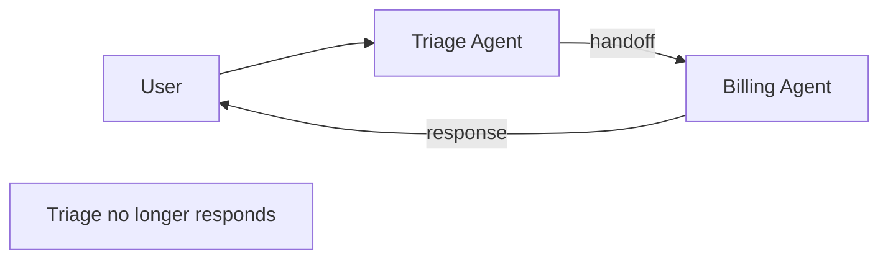
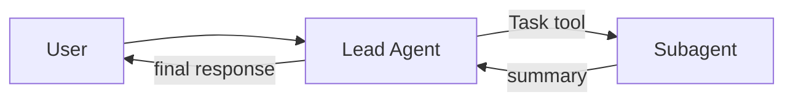

# Multi-agent Frameworks 비교

OpenAI는 2024-10에 `Swarm` 실험 프레임워크를 공개하고 2025-03에 production-ready한 `Agents SDK`로 진화시켰다. 핵심 추상은 **handoff** (제어권 이양)다. Anthropic Claude Code는 **subagent spawn** (부모-자식)으로 다른 모델을 채택. 두 패턴의 차이를 1차 소스에서 정리.

> 기존 `wiki/agents/orchestrator-worker-pattern.md`, `wiki/agents/parent-child-spawn-pattern.md` 와 차별화: 이 raw는 OpenAI Agents SDK의 **handoff()** 와 Anthropic의 **subagent + Task tool** 를 직접 비교, framework-level API 차이에 초점.

## 1. OpenAI Agents SDK 핵심 추상

### 3가지 primitive
> "The Agents SDK has a very small set of primitives: Agents, Handoffs, and Guardrails."

| Primitive | 역할 |
|-----------|------|
| **Agent** | LLM + instructions + tools |
| **Handoffs** | 다른 agent에 제어 이양 |
| **Guardrails** | 입출력 검증 |

### Provider 호환
> "It is provider-agnostic, supporting the OpenAI Responses and Chat Completions APIs, as well as 100+ other LLMs."

→ Anthropic, Google, local 모델 모두 사용 가능.

## 2. Handoff vs Agent-as-Tool

### Handoff (제어권 이양)
> "Handoffs are the clearest fit when a specialist should own the next response rather than merely helping behind the scenes."

- 대화의 다음 응답을 specialist agent가 담당
- 부모는 더 이상 응답 생성 안 함

### Agent-as-Tool (도구로 호출)
> "The agent-as-tool pattern (`Agent.as_tool()`) is preferred when you want structured input for a nested specialist without transferring the conversation."

- 부모가 specialist에 질의 → 결과를 받아 자기 응답 작성
- 대화 제어권은 부모 유지

### 비교표
| 측면 | Handoff | Agent-as-Tool |
|------|---------|---------------|
| 다음 응답 주체 | 새 agent | 부모 agent |
| 사용 시점 | 전문 영역 전환 (지원→영업) | 보조 정보 수집 |
| 제어 흐름 | 일방향 (return 없을 수도) | 양방향 (결과 반환) |
| Input | 메타데이터 (reason, priority) | structured argument |

## 3. handoff() 함수 시그니처

```python
from agents import handoff, Agent

triage = Agent(...)
billing = Agent(...)
support = Agent(...)

triage.handoffs = [
    handoff(
        agent=billing,
        tool_name_override="transfer_to_billing",
        tool_description_override="Transfer to billing specialist",
        on_handoff=on_billing_transfer,
        input_type=BillingHandoffInput,  # Pydantic schema
        input_filter=billing_input_filter,
        is_enabled=True,
        nest_handoff_history=True,
    ),
    handoff(agent=support),
]
```

| 파라미터 | 의미 |
|----------|------|
| `agent` | 이양 대상 agent |
| `tool_name_override` | 기본 `transfer_to_<agent_name>` 변경 |
| `tool_description_override` | LLM이 routing 결정에 사용할 설명 |
| `on_handoff` | callback (data fetching 등) |
| `input_type` | 메타 schema (reason, priority 등) |
| `input_filter` | 다음 agent로 전달되는 입력 가공 |
| `is_enabled` | bool 또는 callable로 동적 제어 |
| `nest_handoff_history` | per-call conversation history nesting |

### on_handoff callback
> "A callback function executed when the handoff is invoked. This is useful for things like kicking off some data fetching as soon as you know a handoff is being invoked."

→ 이양 결정 직후 미리 데이터 fetch 가능.

### input_type 의도
> "Small piece of model-generated metadata such as `reason`, `language`, `priority`, or `summary`. The parsed input passes to `on_handoff` but doesn't replace the receiving agent's main conversation input."

원래 대화 입력을 대체하지 않고 메타데이터로만 활용.

### HandoffInputData 구조
input_filter가 받는 데이터:
| 필드 | 의미 |
|------|------|
| `input_history` | run 이전 대화 |
| `pre_handoff_items` | handoff turn 이전 items |
| `new_items` | 현재 turn (handoff call 포함) |
| `input_items` | 다음 agent에 전달될 (filter된) items |
| `run_context` | RunContextWrapper |

## 4. Recommended Prompt Prefix

```python
from agents.extensions.handoff_prompt import RECOMMENDED_PROMPT_PREFIX, prompt_with_handoff_instructions

# 방법 A: 직접 prefix 사용
agent = Agent(
    name="Triage",
    instructions=f"{RECOMMENDED_PROMPT_PREFIX}\n\nYou are a triage agent.",
    handoffs=[...]
)

# 방법 B: 자동 wrap
agent = Agent(
    name="Triage",
    instructions=prompt_with_handoff_instructions("You are a triage agent."),
    handoffs=[...]
)
```

→ LLM이 handoff 메커니즘을 이해하도록 표준 prompt 삽입.

## 5. Anthropic Claude Code Subagent (비교)

### 핵심 차이
| 측면 | OpenAI Handoff | Anthropic Subagent |
|------|----------------|---------------------|
| 추상 단위 | Agent + Handoff registry | Markdown file (.claude/agents) |
| 호출 방식 | `transfer_to_X` tool call | Task tool 또는 description 매칭 |
| Context | `nest_handoff_history` 옵션 | 별도 context window (default isolated) |
| 부모 응답 | 없음 (handoff 후 sub가 담당) | 결과 받아 부모가 응답 |
| 모델 혼용 | provider-agnostic | Claude 시리즈 우선 |
| 격리 | history filter | worktree 격리 옵션 |

### Anthropic 패턴 (subagent + Task)
```yaml
---
name: code-reviewer
description: Reviews code for quality and best practices
tools: Read, Glob, Grep
model: sonnet
---

You are a code reviewer.
```

부모가 Task tool로 invoke:
```
Task(
    subagent_type="code-reviewer",
    description="Review the auth module",
    prompt="..."
)
```

→ Anthropic은 **agent-as-tool** 모델에 가까움. OpenAI handoff는 진짜 제어 이양.

## 6. Routine Pattern (OpenAI Cookbook)

OpenAI cookbook은 routine을 "system prompt + tools" 의 결합으로 정의:

```python
def routine(instructions: str, tools: list):
    return Agent(instructions=instructions, tools=tools)
```

handoff와 결합하면 **multi-routine orchestration**:
```
[Triage routine] → handoff to → [Billing routine] → handoff to → [Refund routine]
```

각 routine은 자기 영역만 알고, 외부는 handoff로 위임.

## 7. Guardrails

### Input Guardrail
```python
@input_guardrail
async def topic_check(ctx, agent, input_data):
    # 이 agent에게 적합한 주제인지 검증
    if not_relevant(input_data):
        return GuardrailFunctionOutput(
            output_info="off-topic",
            tripwire_triggered=True,
        )
    return GuardrailFunctionOutput(output_info=None, tripwire_triggered=False)
```

### Output Guardrail
LLM 응답 검증 (PII 누출, jailbreak 탐지 등).

### Tripwire 동작
`tripwire_triggered=True` → 즉시 raise → 후속 처리 차단.

## 8. Mermaid: Handoff vs Subagent

### A. OpenAI Handoff (제어 이양)


### B. Anthropic Subagent (도구로서)


## 9. 엔터프라이즈 적용 관점

### Handoff 적합 use case
- 고객 지원 라우팅 (triage → billing → refund)
- Multi-stage 대화 (greeter → onboarding → checkout)
- 권한 escalation (read-only → admin)

### Agent-as-Tool 적합 use case
- 백그라운드 정보 수집 (parent가 합성)
- Verifier/Critic 분리
- Parallel sub-task 분배 (research, web_search 등)

### 모델 선택
- **OpenAI Agents SDK**: provider-agnostic 필요 시, 다양한 LLM 혼용
- **Anthropic Subagent**: Claude 단독 환경, Code 자동화
- **LangGraph**: 복잡한 state machine, 노드 그래프 시각화 필요 시

### Anti-pattern
- Handoff와 agent-as-tool를 혼동 → 응답 주체 모호
- on_handoff에서 무거운 작업 → handoff latency 증가
- nest_handoff_history 무분별 사용 → context 폭증
- guardrail tripwire 미처리 → uncaught exception 전파
- recommended prompt prefix 미사용 → 모델이 handoff tool을 잘못 호출

### Production checklist
- [ ] Recommended prompt prefix 적용
- [ ] Input/Output guardrail 정의
- [ ] on_handoff에서 logging/audit
- [ ] handoff registry를 코드 review 대상에
- [ ] Multi-tenant: tool_name_override로 namespace 격리
- [ ] is_enabled callable로 권한 기반 동적 제어
- [ ] Tracing (OpenAI Agents SDK는 내장)

## 관련 문서 후보 (ingest 시)
- `wiki/agents/openai-agents-sdk` (entity)
- `wiki/agents/handoff-pattern` (concept)
- `wiki/agents/agent-as-tool-vs-handoff` (concept)
- `wiki/agents/agent-guardrails` (concept) - 새 문서

## Sources 추가 정보
- OpenAI Agents SDK: https://openai.github.io/openai-agents-python/
- GitHub: https://github.com/openai/openai-agents-python
- Swarm (2024-10 실험): https://github.com/openai/swarm
- Cookbook routine 패턴: https://cookbook.openai.com/examples/orchestrating_agents
