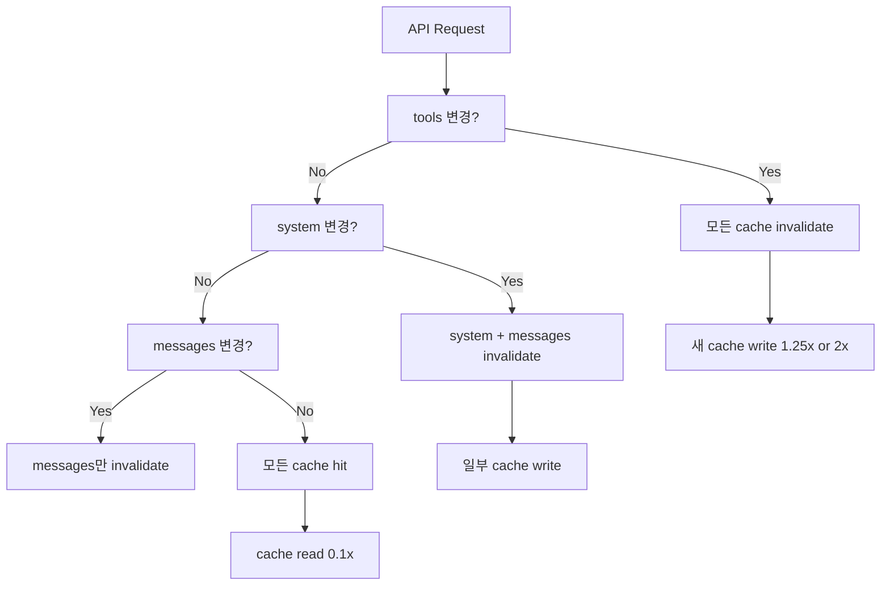

# Prompt Caching Strategy

LLM 에이전트 비용의 60-90%는 입력 토큰이 차지한다. Anthropic / OpenAI 모두 prompt caching을 도입했지만 **모델, 활성화 방식, 가격, TTL 정책이 크게 다르다**. 엔터프라이즈 운영에서는 cache breakpoint 설계가 cost-of-ownership을 좌우한다.

## 1. Anthropic Prompt Caching

### 활성화 방식 (2가지)
**A. Automatic caching (multi-turn 대화 권장)**
```python
response = client.messages.create(
    model="claude-opus-4-7",
    max_tokens=1024,
    cache_control={"type": "ephemeral"},  # top-level
    system="You are a helpful assistant.",
    messages=[...]
)
```
시스템이 자동으로 last cacheable block에 breakpoint 적용, 대화가 늘어나면 앞쪽으로 이동.

**B. Explicit cache breakpoints (fine-grained)**
```json
{
  "system": [
    {
      "type": "text",
      "text": "You are an AI assistant tasked with analyzing literary works.",
      "cache_control": {"type": "ephemeral"}
    }
  ]
}
```

### TTL 옵션
| TTL | 설정 | 가격 multiplier |
|-----|------|----------------|
| 5분 (기본) | `{"type": "ephemeral"}` | 1.25x base |
| 1시간 | `{"type": "ephemeral", "ttl": "1h"}` | 2x base |

> "When mixing TTLs in the same request, longer TTL entries must appear before shorter ones."

### Cache Breakpoint 규칙
- 최대 **4개 breakpoints** 정의 가능
- Breakpoint 자체는 추가 비용 없음
- **20-block lookback window**: 매 요청마다 breakpoint에서 거꾸로 최대 20개 블록 검사

> "Cache writes happen only at your breakpoint. Cache reads look backward. 20-block lookback window."

### 캐시 가능 블록
- `tools` 정의 (전체)
- `system` 메시지 블록
- `messages.content` 텍스트/이미지/문서 블록
- `tool_use` 와 `tool_result` 블록

### 캐시 불가
- `thinking` 블록은 직접 marking 불가 (이전 assistant turn에 포함되면 같이 캐시됨)
- Citations sub-block (top-level document만 가능)
- 빈 텍스트 블록

### 모델별 최소 토큰
| 모델 | 최소 토큰 |
|------|-----------|
| Opus 4.7, 4.6, 4.5, Haiku 4.5 | 4096 |
| Sonnet 4.6, Haiku 3.5 | 2048 |
| Sonnet 4.5, Opus 4.1, 4, Sonnet 4, 3.7 | 1024 |

미만이면 silently skip (에러 없음). `cache_creation_input_tokens` / `cache_read_input_tokens` 가 0이면 캐시 안 된 것.

### 가격 multiplier
| Operation | Multiplier | Opus 4.7 예 ($5/MTok base) |
|-----------|-----------|---------------------------|
| Base input | 1x | $5/MTok |
| 5분 cache write | 1.25x | $6.25/MTok |
| 1시간 cache write | 2x | $10/MTok |
| Cache read | 0.1x | $0.50/MTok |
| Output | 1x | $25/MTok |

→ Cache hit 시 input 비용 **90% 절감**.

### Cache Invalidation 계층
`tools` → `system` → `messages` 순서. 상위 변경 시 하위 모두 무효화.

| 변경 항목 | tools cache | system cache | messages cache |
|----------|-------------|--------------|----------------|
| Tool 정의 변경 | invalidated | invalidated | invalidated |
| tool_choice | preserved | invalidated | invalidated |
| Images 변경 | preserved | preserved | invalidated |
| Thinking 파라미터 | preserved | preserved | invalidated |

### Usage 응답 필드
```json
{
  "usage": {
    "input_tokens": 50,
    "cache_creation_input_tokens": 248,
    "cache_read_input_tokens": 1800,
    "output_tokens": 503
  }
}
```

`total = cache_read + cache_creation + input_tokens`

### Pre-warming
`max_tokens: 0` 으로 시스템 프롬프트만 미리 캐시:
```python
prewarm = client.messages.create(
    model="claude-opus-4-7",
    max_tokens=0,
    system=[{"type": "text", "text": "...", "cache_control": {"type": "ephemeral"}}],
    messages=[{"role": "user", "content": "warmup"}],
)
```

### 2026-02-05 변경
> "Starting February 5, 2026, prompt caching will use workspace-level isolation instead of organization-level isolation."

워크스페이스 단위 isolation으로 변경.

## 2. OpenAI Prompt Caching

### 핵심 차이: 자동, 수동 설정 없음
> "Prompt Caching works automatically on all your API requests (no code changes required) and has no additional fees associated with it."

cache_control 같은 필드 없음. 1024 토큰 이상이면 자동.

### 동작 메커니즘
1. **Routing**: 처음 256 토큰의 hash로 머신 라우팅
2. **Cache lookup**: 해당 머신에서 prefix match 검사
3. **Hit/Miss**: hit이면 사용, miss면 처음부터 처리 + 캐시 저장

### 캐시 정책
- 최소 **1024 토큰**
- Hit는 **128 토큰 단위**로 증가
- **5-10분 비활성** 후 evict, 최대 **1시간**
- gpt-5.5/5.5-pro/5.4/5.2 등은 extended retention으로 **24시간** 가능

### prompt_cache_key 파라미터
```python
response = client.chat.completions.create(
    model="gpt-5.5",
    messages=[...],
    prompt_cache_key="user_session_xyz"  # 라우팅 영향
)
```
> "Influence routing and improve cache hit rates. This is especially beneficial when many requests share long, common prefixes."

### Usage 필드
```python
response.usage.prompt_tokens_details.cached_tokens  # 캐시된 토큰 수
```

### 가격
> "Prompt Caching can reduce latency by up to 80% and input token costs by up to 90%."

(추가 fee 없음, cache write 비용도 없음)

## 3. Anthropic vs OpenAI 비교표

| 항목 | Anthropic | OpenAI |
|------|-----------|--------|
| 활성화 | 명시적 `cache_control` | 자동 |
| Cache write 비용 | 1.25x (5m) / 2x (1h) | 무료 |
| Cache read 비용 | 0.1x (90% 절감) | 0.5x (50% 절감 평균) |
| TTL | 5m (기본) / 1h | 5-10m / 최대 1h / extended 24h |
| 최소 토큰 | 모델별 1024-4096 | 1024 |
| Breakpoint 수 | 최대 4개 | N/A (자동) |
| Lookback | 20 블록 | 256 토큰 hash + prefix match |
| Routing 영향 | breakpoint 위치 | `prompt_cache_key` |
| Thinking 캐시 | 직접 불가, 함께 캐시됨 | 모델에 따라 다름 |

## 4. 캐시 친화 프롬프트 구조

### 공통 원칙
> "Place static content like instructions and examples at the beginning of your prompt, and put variable content, such as user-specific information, at the end."

### 권장 레이아웃
```
[System prompt]            ← 영구 캐시 대상
[Tools definitions]        ← 캐시 대상
[Few-shot examples]        ← 캐시 대상
[Long retrieved context]   ← 캐시 대상 (여기에 breakpoint)
---
[User-specific question]   ← 변동 (캐시 안 됨)
[Recent conversation]      ← 변동
```

### Anti-pattern
- 동적 timestamp를 system 앞에 두기 → 매 요청마다 invalidate
- User ID, session 정보를 system에 포함 → 사용자별 cache 분기 폭발
- 1시간 TTL 위에 5분 TTL이 오는 ordering 위반

## 5. 비용 분석 시나리오

### 시나리오: 100K 토큰 system + 1K 토큰 question, 100 requests/시간

**Anthropic (Opus 4.7) 캐시 미사용**:
- 100 × 100K × $5/MTok = $50/시간

**Anthropic 1시간 캐시**:
- 1번째: 100K × $10/MTok = $1.0 (cache write)
- 99번째까지: 100K × $0.50/MTok × 99 = $4.95
- 총 $5.95/시간 → 88% 절감

**OpenAI 자동 캐시 (gpt-5.5)**:
- 100K × $5/MTok × 100 (가정) → 90% cache 적용 시
- 약 $5-10/시간 (구체 수치는 모델/시점에 따라 변동)

## 6. Mermaid: Cache Hierarchy (Anthropic)



## 7. 엔터프라이즈 적용 관점

### Cache hit rate KPI
- `cache_read_input_tokens / (cache_read + cache_creation + input)` 모니터링
- 목표 70-90%

### 1시간 TTL 사용 시점
- 24시간 내 동일 시스템 프롬프트로 100+ 요청
- 5분 TTL 만료가 잦은 워크플로우 (사용자별 deep work)
- 2x cache write cost를 hit rate × 90% 절감으로 회수

### Pre-warming 운영 팁
- 새 모델 배포 후 startup script로 `max_tokens=0` warm-up
- 워크스페이스 단위 isolation을 고려해 워크스페이스마다 warm-up 필요

## 관련 문서 후보 (ingest 시)
- `wiki/inference/prompt-caching` (concept) - Anthropic vs OpenAI 비교 표
- `wiki/inference/cache-breakpoint-design` (concept)
- 새 문서로 작성 가치 높음 (기존 raw/wiki에 통합 비교 없음)
