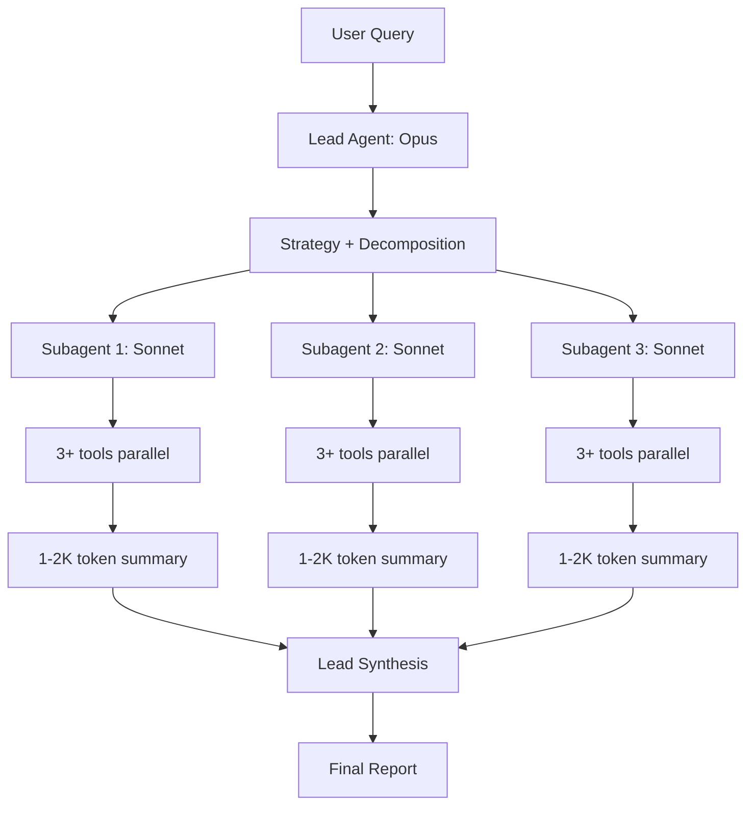

# Sub-agent Spawning / Multi-agent Orchestration

서브에이전트 spawn은 (1) **컨텍스트 격리(context isolation)** 와 (2) **병렬 처리(parallelism)** 를 위한 표준 패턴이다. Anthropic의 multi-agent research system 블로그(2025-06)와 Claude Code subagent 표준이 두 축을 형성한다.

> 기존 `wiki/agents/anthropic-multi-agent-research-system.md`, `wiki/agents/orchestrator-worker-pattern.md`, `wiki/agents/parent-child-spawn-pattern.md` 와 차별화: 이 raw는 production 운영 lessons (rainbow deployments, fault tolerance, token economics 15x), Claude Code의 subagent frontmatter 신규 필드(isolation/memory/effort)에 초점.

## 1. Anthropic Multi-Agent Research System (Engineering Blog)

### 아키텍처
> "The lead agent analyzes it, develops a strategy, and spawns subagents to explore different aspects simultaneously."

Orchestrator-worker 패턴: lead agent이 전략 수립 → subagents에 작업 분배 → 결과 수집/합성.

### 토큰 경제학
> "Agents typically use about 4× more tokens than chat interactions, and multi-agent systems use about 15× more tokens than chats."

| 시스템 | 토큰 사용 (vs 일반 chat) |
|--------|-------------------------|
| Single-turn chat | 1x |
| Single agent | ~4x |
| Multi-agent (orchestrator + workers) | ~15x |

### 성능
> "A multi-agent system with Claude Opus 4 as the lead agent and Claude Sonnet 4 subagents outperformed single-agent Claude Opus 4 by 90.2%."

### 핵심 prompt engineering 7원칙
1. **Delegation design**: Lead가 subagent에게 (a) objective, (b) output format, (c) tools/sources 가이드, (d) clear task boundaries 모두 명시
2. **Effort scaling**: 복잡도 가이드라인 임베딩으로 자원 낭비 방지
3. **Extended thinking**: lead는 planning, subagents는 interleaved thinking
4. **Parallel tool calling**: subagent가 3+ 도구 동시 호출 → research time **90% 단축**
5. **Self-improvement**: Claude 모델로 agent prompt 진단/개선
6. **Progressive search**: 넓게 시작 → 좁혀감

### 평가 방법론
> "Testing these queries often allowed us to clearly see the impact of changes" with just 20 test cases.

- LLM-as-judge with rubric (factual accuracy, citation precision, completeness, source quality, tool efficiency)
- Human testing for edge cases
- 작은 데이터셋(20 tests)으로 변경 영향 명확히 관찰

### Production 도전 과제
**A. Statefulness & error compounding**
> "Long-running agents require checkpoint resumption rather than restarts."
> "Without effective mitigations, minor system failures can be catastrophic for agents."

→ Checkpoint resume이 restart보다 중요.

**B. Debugging non-determinism**
> "Full production tracing for diagnosing failures without breaching privacy."

→ 프로덕션 trace 필수, privacy 고려.

**C. Rainbow deployments**
> "Rainbow deployments prevent breaking existing agents during updates by gradually shifting traffic between versions."

→ 점진적 traffic 이동으로 진행 중인 long-running agents 보호.

**D. Synchronous bottleneck**
> "Current architecture executes subagents synchronously, creating information flow constraints that asynchronous execution could address."

### Failure modes 관찰
- "Spawning 50 subagents for simple queries" → 단순 쿼리에 과잉 분기
- 모호한 task description으로 인한 작업 중복
- SEO-optimized content farms 선택 (authoritative source 대신)

→ 모두 prompt 개선으로 해결.

## 2. Claude Code Subagents

### 핵심 정의
> "Each subagent runs in its own context window with a custom system prompt, specific tool access, and independent permissions."

### 빌트인 subagents
| Agent | Model | Tools | 용도 |
|-------|-------|-------|------|
| Explore | Haiku | Read-only | 빠른 codebase 탐색 |
| Plan | Inherit | Read-only | plan mode에서 컨텍스트 수집 |
| general-purpose | Inherit | All | 복잡한 multi-step 작업 |
| statusline-setup | Sonnet | - | `/statusline` 설정 |
| claude-code-guide | Haiku | - | Claude Code 기능 Q&A |

> "Subagents cannot spawn other subagents (preventing infinite nesting)."

### Scope 우선순위
| Location | Scope | Priority |
|----------|-------|----------|
| Managed settings | 조직 | 1 (highest) |
| `--agents` CLI flag | 세션 | 2 |
| `.claude/agents/` | 프로젝트 | 3 |
| `~/.claude/agents/` | 사용자 | 4 |
| Plugin `agents/` | 플러그인 | 5 (lowest) |

### Frontmatter 필드 (전체)
```yaml
---
name: code-reviewer
description: Reviews code for quality and best practices
tools: Read, Glob, Grep
disallowedTools: Write, Edit
model: sonnet  # or opus, haiku, claude-opus-4-7, inherit
permissionMode: default  # acceptEdits | auto | dontAsk | bypassPermissions | plan
maxTurns: 10
skills: [skill-name]
mcpServers: [slack]
hooks: {...}
memory: user  # project | local
background: false
effort: medium  # low | medium | high | xhigh | max
isolation: worktree  # 격리된 git worktree에서 실행
color: blue
initialPrompt: "..."
---
```

### 신규 필드 (2026)
**A. `isolation: worktree`**
> "Run the subagent in a temporary git worktree, giving it an isolated copy of the repository. The worktree is automatically cleaned up if the subagent makes no changes."

→ 멀티 에이전트가 동시에 같은 코드베이스 수정 시 충돌 방지.

**B. `memory: user|project|local`**
지속 메모리 디렉토리 → cross-session learning.
- `user`: `~/.claude/agent-memory/`
- `project`: `.claude/agent-memory/`
- `local`: `.claude/agent-memory.local/`

**C. `skills` field (preload)**
> "The full skill content is injected, not just made available for invocation. Subagents don't inherit skills from the parent conversation."

부모와 달리 skill 자동 inherit 안 됨, 명시적으로 preload 필요.

**D. `background: true`**
백그라운드 task로 항상 실행.

**E. `effort` override**
세션 effort 레벨을 subagent별로 override.

### 모델 우선순위 (resolve order)
1. `CLAUDE_CODE_SUBAGENT_MODEL` 환경변수
2. Per-invocation `model` parameter
3. Subagent frontmatter `model`
4. Main conversation model

### Tool 상속과 제약
- `tools: Read, Grep` → 명시 도구만 허용
- `disallowedTools: Write, Edit` → 상속에서 제외
- 둘 다 생략 → 부모와 동일

### Working directory 동작
> "A subagent starts in the main conversation's current working directory. Within a subagent, `cd` commands do not persist between Bash or PowerShell tool calls and do not affect the main conversation's working directory."

각 bash 호출마다 cwd reset (이는 worktree isolation과 별개).

## 3. Subagents vs Agent Teams 차이

> "Subagents work within a single session; agent teams coordinate across separate sessions."

| 측면 | Subagents | Agent Teams |
|------|-----------|-------------|
| 세션 | 단일 | 별도 세션 |
| 통신 | parent-child | 동등한 teammate 간 |
| 격리 | context window 분리 | 세션 자체 분리 |
| 사용 | 보조 작업 위임 | 동시 다발적 협업 |

## 4. Plugin Subagent 보안 제약

> "For security reasons, plugin subagents do not support the `hooks`, `mcpServers`, or `permissionMode` frontmatter fields."

플러그인은 위 3개 필드 무시. 필요 시 `.claude/agents/` 로 복사하거나 settings의 `permissions.allow` 사용.

## 5. CLI에서 subagent 직접 정의

```bash
claude --agents '{
  "code-reviewer": {
    "description": "Expert code reviewer. Use proactively after code changes.",
    "prompt": "You are a senior code reviewer.",
    "tools": ["Read", "Grep", "Glob", "Bash"],
    "model": "sonnet"
  }
}'
```

세션 한정, 디스크 저장 안 됨. 자동화 스크립트에 유용.

## 6. Mermaid: Multi-agent Architecture



## 7. 엔터프라이즈 적용 관점

### 비용 모델
- 15x 토큰 비용을 90% 성능 향상으로 정당화하는 use case에서만 도입
- Lead = Opus, Workers = Sonnet/Haiku 조합으로 비용 최적화
- Cache hit 70%+ 유지 시 실질 비용 5-7x로 감소

### 격리 전략
1. **Context isolation**: subagent 별도 context (default)
2. **Worktree isolation**: `isolation: worktree` 로 코드 격리
3. **Permission isolation**: `tools/disallowedTools` 로 권한 축소
4. **Model isolation**: subagent별 다른 모델

### Anti-pattern
- subagent 안에서 또 subagent spawn 시도 → 차단됨
- description이 모호 → 잘못된 subagent로 routing 또는 미invoke
- Skill을 부모로부터 자동 상속 가정 → 명시 필요
- `cd` 명령으로 working directory 변경 의존 → bash 호출 사이 reset됨

### Long-running 운영 패턴
1. Checkpoint 마다 state persist (memory 필드 활용)
2. Rainbow deployment로 traffic 점진 이동
3. Production tracing으로 non-deterministic 디버깅
4. Async execution 도입 검토 (sync는 bottleneck)

## 관련 문서 후보 (ingest 시)
- 기존 `anthropic-multi-agent-research-system.md` 갱신 (production lessons)
- `wiki/agents/subagent-isolation-patterns` (concept)
- `wiki/agents/agent-team-vs-subagent` (concept)
