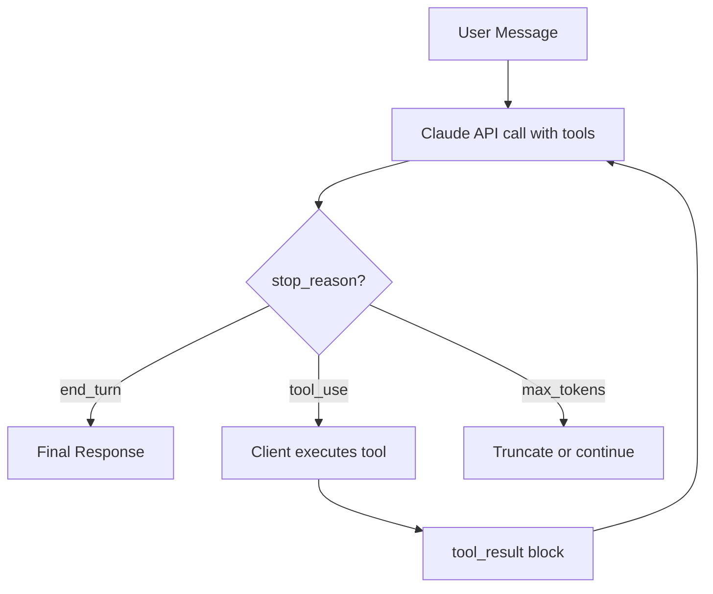

# Tool Orchestration Patterns

Harness 엔지니어링에서 "툴 오케스트레이션"은 LLM이 다수의 외부 도구를 호출할 때 어떻게 라우팅·병렬화·결과 처리를 하느냐의 문제다. 2025년 11월 Anthropic이 advanced-tool-use beta를 공개하면서, 단순한 single-tool round-trip 모델에서 **툴 검색(tool discovery)·코드 기반 오케스트레이션(programmatic tool calling)·예시 기반 정확도 향상**의 3축으로 진화했다.

## 1. Anthropic Tool Use 기본 모델

### Client tools vs Server tools
- **Client tools**: 사용자 코드에서 실행. Claude가 `stop_reason: "tool_use"` 와 함께 `tool_use` 블록을 반환 → 클라이언트가 실행 → `tool_result` 를 다음 메시지로 전달.
- **Server tools**: Anthropic 인프라에서 실행. `web_search_20260209`, `code_execution`, `web_fetch`, `tool_search` 등.

### Stop reasons (agent loop)
- `end_turn`: Claude가 응답 완료
- `tool_use`: tool_use 블록을 처리해서 다시 호출 필요
- `max_tokens`: 토큰 한도 도달
- `stop_sequence`: 사용자 stop sequence 매칭

```python
import anthropic

client = anthropic.Anthropic()
response = client.messages.create(
    model="claude-opus-4-7",
    max_tokens=1024,
    tools=[{"type": "web_search_20260209", "name": "web_search"}],
    messages=[{"role": "user", "content": "What's the latest on the Mars rover?"}],
)
```

### Tool use system prompt 토큰 비용
Claude Opus 4.7 / Sonnet 4.5/4.6 기준:
- `tool_choice: auto | none`: 346 tokens 추가
- `tool_choice: any | tool`: 313 tokens 추가
- Haiku 3.5 / Haiku 3: auto 264 / any 340

(Tools 파라미터에 1개 이상 도구가 정의된 경우)

### tool_choice 옵션
- `auto`: Claude가 도구 사용 여부 결정 (기본)
- `any`: 반드시 어떤 도구든 사용
- `tool`: 특정 도구만 사용
- `none`: 도구 사용 금지

### Strict tool use
`strict: true` 지정 시 tool call이 schema에 정확히 부합하도록 강제 (2025년 추가).

## 2. Advanced Tool Use Features (2025-11-20 beta)

beta header `advanced-tool-use-2025-11-20` 와 함께 사용:

```python
client.beta.messages.create(
    betas=["advanced-tool-use-2025-11-20"],
    model="claude-sonnet-4-5-20250929",
    tools=[...]
)
```

### A. Tool Search Tool
**문제**: 5개 MCP 서버 / 58개 도구 환경에서 도구 정의가 약 55K 토큰을 소비. 작업 시작 전부터 컨텍스트 윈도우 절반이 도구 정의로 점유.

**해결**: `defer_loading: true` 로 도구를 초기 컨텍스트에서 제외, Claude가 필요할 때 검색.

```json
{
  "tools": [
    {"type": "tool_search_tool_regex_20251119", "name": "tool_search_tool_regex"},
    {"name": "github.createPullRequest", "defer_loading": true}
  ]
}
```

**성능**:
- Opus 4: 49% → 74% (MCP 평가)
- Opus 4.5: 79.5% → 88.1%
- 토큰: 77K → 8.7K (95% 컨텍스트 보존)

### B. Programmatic Tool Calling (PTC)
**문제**: 전통적 tool calling은 (1) 매 호출마다 inference round-trip이 발생하고 (2) 중간 결과(tool_result)가 모두 컨텍스트로 들어가 "context pollution" 발생.

**해결**: Claude가 sandboxed Python 코드를 작성해 도구를 호출 → 결과는 코드 변수로 처리 → 최종 요약만 컨텍스트에 진입.

```python
# Claude가 직접 작성하는 코드
team = await get_team_members("engineering")
expenses = await asyncio.gather(*[
    get_expenses(m["id"], "Q3") for m in team
])
exceeded = [m for m, exp in zip(team, expenses)
            if sum(e["amount"] for e in exp) > budgets[m["level"]]]
```

**Tool opt-in 메커니즘**:
```json
{
  "name": "get_expenses",
  "allowed_callers": ["code_execution_20250825"]
}
```

**성능**:
- 토큰 37% 절감 (43,588 → 27,297)
- 19+ inference passes 제거
- Internal knowledge retrieval: 25.6% → 28.5%

**제약**: `disable_parallel_tool_use: true` 와 호환되지 않음.

### C. Tool Use Examples
도구 정의 schema에 concrete usage examples를 추가, 복잡한 nested 파라미터 정확도 72% → 90%.

## 3. OpenAI vs Anthropic Tool Use 차이

| 항목 | OpenAI Function Calling | Anthropic Tool Use |
|------|------------------------|---------------------|
| 명칭 | function/tool | tool |
| 병렬 도구 호출 | 기본 활성, `parallel_tool_calls: false` 로 비활성화 | 모델이 자율 결정, `disable_parallel_tool_use: true` 로 비활성화 |
| 도구 개수 한도 | 최대 128 tools/request | 최대 64 tools/request |
| Strict mode | `strict: true` (구조화된 출력 보장) | `strict: true` (2025년 추가) |
| Stop reason | `finish_reason: "tool_calls"` | `stop_reason: "tool_use"` |
| 응답 포맷 | `tool_calls: [{id, function: {name, arguments}}]` | `content: [{type: "tool_use", id, name, input}]` |
| 동적 도구 검색 | 지원 안 함 | Tool Search Tool (defer_loading) |
| 코드 기반 오케스트레이션 | 없음 (Assistants API의 code_interpreter는 별개) | Programmatic Tool Calling |

### Sonnet 3.7 차이점
> "Claude Sonnet 3.7 may be less likely to make parallel tool calls in a response, even when you have not set disable_parallel_tool_use. Upgrade to Claude 4 models, which have built-in token-efficient tool use and improved parallel tool calling."

Claude 4 / Opus 4.7 은 token-efficient tool use 가 내장되어 병렬 호출 빈도가 높음.

## 4. 엔터프라이즈 적용 관점

### 언제 Tool Search 필요?
- 도구 정의가 10K+ 토큰
- 10+ 도구가 동시에 등록된 환경 (MCP 멀티 서버)

### 언제 PTC 필요?
- 3+ 의존성 있는 도구 호출 (예: list_users → for each → get_expenses → aggregate)
- 큰 데이터셋 집계 (필터링/매핑이 다수의 round-trip 없이 1회 코드 실행으로 처리)

### 비용 모델
- Tool 정의 토큰: input token으로 청구
- Tool use 시스템 프롬프트: 313~346 tokens 자동 추가
- Server tool은 별도 사용량 과금 (web_search는 검색 횟수당)

## Mermaid: Tool Use Loop



## 관련 문서 후보 (ingest 시)
- `wiki/agents/tool-orchestration-patterns` (concept)
- `wiki/agents/programmatic-tool-calling` (concept, Anthropic 고유)
- `wiki/agents/tool-search-tool` (concept, defer_loading 패턴)
- 기존 `tool-use-patterns.md`, `tool-calling-optimization.md` 와 차별화: 이 raw는 advanced-tool-use beta(2025-11-20) 신기능에 초점
