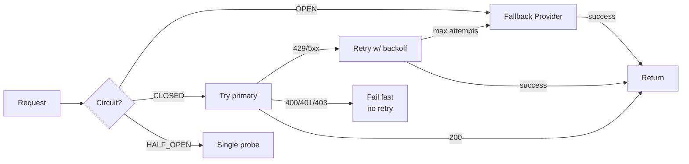
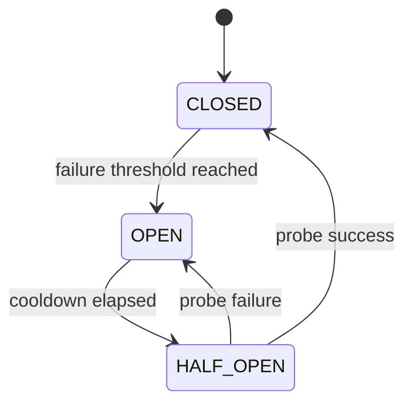
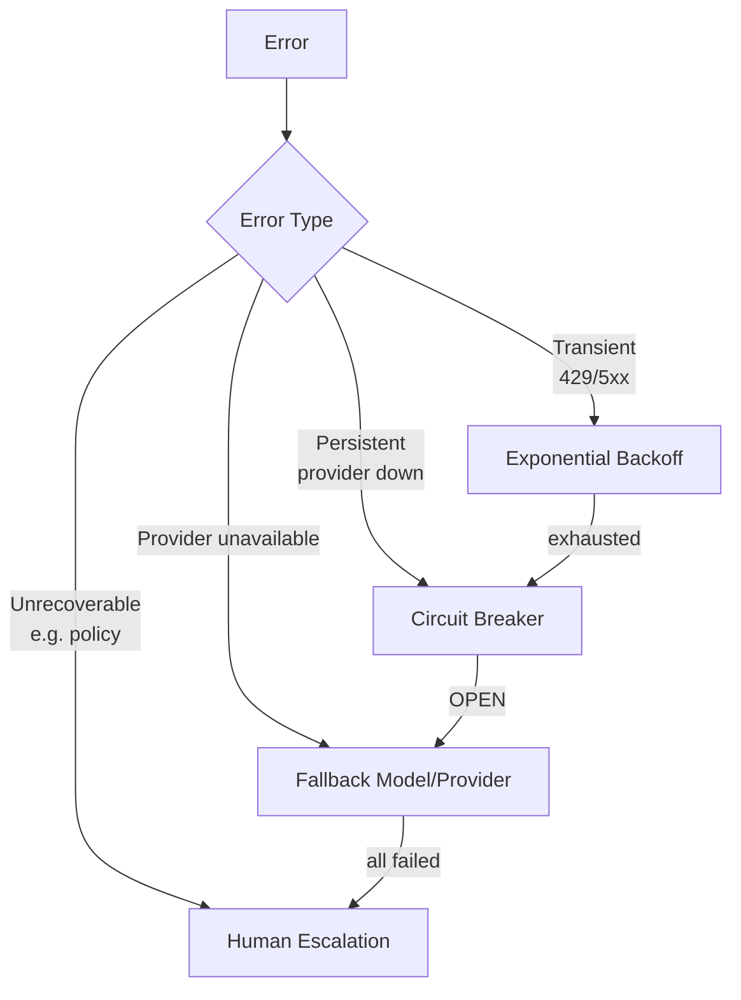

# Failure Recovery — Retry / Circuit Breaker / Fallback

## 핵심 요약 (한국어)

LLM 운영의 3 단 resilience 계층:
1. **Retry with exponential backoff + jitter**: transient 실패 (429, 5xx, network)
2. **Circuit breaker**: 연속/지속 실패 시 트래픽 차단, 회복 detect
3. **Fallback routing**: provider/model 단위 대체

각 패턴은 **다른 종류의 실패에 답한다** — 함께 layered.



## Retryable vs Non-Retryable Status Codes

> "Only retry on transient errors like rate limits (HTTP 429), server errors (HTTP 500,
> 502, 503, 504), and network timeouts. Don't retry on authentication failures (HTTP 401,
> 403), bad requests (HTTP 400), or context window overflow."

| HTTP Status | Retry? | 이유 |
|---|---|---|
| 429 | ✓ | rate limit, transient |
| 500, 502, 503, 504 | ✓ | server transient |
| Network timeout / TLS fail | ✓ | connectivity transient |
| 400 | ✗ | malformed request, deterministic fail |
| 401, 403 | ✗ | auth issue, retry 가 해결 못 함 |
| Context window overflow | ✗ | input 자체 문제 |

## Exponential Backoff 권장 설정

> "Start with a 1-2 second base delay, double on each retry, and stop after 5-7 attempts."

```python
delay = base_delay * (2 ** attempt) + random.uniform(0, jitter)
```

권장 값:
- `base_delay = 1.0` ~ `2.0` seconds
- `multiplier = 2`
- `max_attempts = 5` ~ `7`
- jitter: full jitter (0 ~ delay) 또는 equal jitter (delay/2 ~ delay)

**중요**: Anthropic 응답의 `retry-after` header 가 있으면 **해당 값 절대 우선**.

## Circuit Breaker — 3 State 머신



### n1n.ai 권장 임계값 (실제 구현)
- **Failure threshold**: 1분에 3회 실패 → OPEN
- **Cool-down**: 30초
- **HALF_OPEN probe**: 1회 success → CLOSED, 1회 failure → OPEN (cooldown 재시작)
- **Latency smoothing**: exponential smoothing α=0.2 (새 측정에 20% 가중)

### Production LLM Circuit Breaker 4 신호 (권장)

> "A production LLM circuit breaker should monitor at least four signals:
> - Token consumption rate against provider TPM limit — trip at 85% to leave headroom
> - P95 latency — if P95 exceeds 3× baseline, open the circuit before errors accumulate
> - Cost per hour — a dollar-denominated cap that catches runaway agents
> - Error rate / failure count"

| 신호 | Trip 임계값 |
|---|---|
| Token consumption | 85% of TPM |
| P95 latency | 3x baseline |
| $/hr | runaway agent cap (dollar 단위) |
| Error count | 1분에 3회 (또는 % 기준) |

## Fallback Routing 전략

### 종류
1. **Same provider, different model**: Sonnet 한도 도달 → Haiku
2. **Different provider**: Anthropic 다운 → OpenAI / Bedrock 동일 모델
3. **Degraded quality fallback**: 고급 모델 → 저렴한 모델, 응답 품질 trade

### 한계
> "The system checks the primary every time, even if it's failing, before routing to the
> fallback. This adds latency."

→ circuit breaker 와 결합해서 OPEN 상태에서는 primary 우회.

## Layered Architecture — 권장 적용 순서

> "Use a layered approach:
> - exponential backoff for transient errors
> - circuit breakers for persistent failures
> - fallback models for LLM unavailability
> - human escalation for unrecoverable errors"



## Routing Score (multi-signal)

n1n.ai 의 weighted routing score:
```
{"success_rate": 0.4, "latency": 0.3, "cost": 0.3}
```

각 후보 provider 마다 위 가중치로 점수화 → 최적 routing.

## SRE Error Budget 차용

LLM agent 에 SRE error budget 적용:
- SLO 99.9% → error budget 0.1% (4주)
- 1,000,000 requests / 4주 → 1,000 errors 허용
- 단일 incident 가 budget 의 20% 초과 → postmortem 의무
- budget 소진 → feature freeze (P0 + security 만 release)

> "If the service has exceeded its error budget for the preceding four-week window, we
> will halt all changes and releases other than P0 issues or security fixes until the
> service is back within its SLO." — Google SRE Workbook

## 실제 Production 데이터 (2026-02 Datadog State of AI Engineering)

> "5% of all LLM call spans reported an error and 60% of those errors were caused by
> exceeded rate limits"

→ rate limit 이 단일 최대 실패 원인 → retry + circuit breaker 가 주된 ROI

## Anthropic API 특화 처리

```python
import time
import random
from anthropic import APIError, RateLimitError, APIStatusError

def call_with_retry(client, **params):
    max_attempts = 6
    base = 1.0
    for attempt in range(max_attempts):
        try:
            return client.messages.create(**params)
        except RateLimitError as e:
            # retry-after header 절대 우선
            ra = e.response.headers.get("retry-after")
            sleep = float(ra) if ra else base * (2 ** attempt) + random.uniform(0, 1)
            time.sleep(sleep)
        except APIStatusError as e:
            if e.status_code in (500, 502, 503, 504):
                time.sleep(base * (2 ** attempt) + random.uniform(0, 1))
            else:
                raise  # 4xx (400/401/403) 는 즉시 실패
    raise APIError("Max retries exceeded")
```

## Backpressure 와 Acceleration Limit

Anthropic docs:
> "you might also encounter 429 errors due to acceleration limits on the API if your
> organization has a sharp increase in usage. To avoid hitting acceleration limits, ramp
> up your traffic gradually"

→ 신규 deploy 시 traffic ramp-up (10% → 25% → 50% → 100%) 필요. 폭주 traffic 은
single bucket exhaustion 보다 acceleration limit 에 먼저 걸림.

## Agent 특화 — Tool Call Circuit Breaker

LLM agent 의 tool 호출도 동일 패턴 적용:
- 같은 tool 의 연속 실패 → 그 tool 만 OPEN
- agent 는 fallback strategy 또는 error 보고
- agent 의 tool retry loop 가 무한 루프 되는 것 방지

## 관련 문서

- Portkey: https://portkey.ai/blog/retries-fallbacks-and-circuit-breakers-in-llm-apps/
- Maxim AI: https://www.getmaxim.ai/articles/retries-fallbacks-and-circuit-breakers-in-llm-apps-a-production-guide/
- n1n.ai SRE patterns: https://explore.n1n.ai/blog/circuit-breakers-llm-api-sre-reliability-patterns-2026-02-15
- Fastio retry guide: https://fast.io/resources/ai-agent-retry-patterns/
- Google SRE error budget: https://sre.google/workbook/error-budget-policy/
- Backpressure deep dive: https://tianpan.co/blog/2026-04-15-backpressure-llm-pipelines
