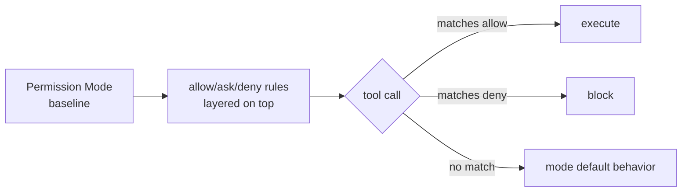

# Claude Code Permission Modes 와 Tool Allowlist/Denylist

## 핵심 요약 (한국어)

Claude Code 는 6 가지 permission mode 를 제공하며, mode 가 baseline 을 설정하면 그 위에
**permission rules (allow/ask/deny)** 를 layered 로 얹는 구조다. `bypassPermissions` 만
permission layer 를 통째로 건너뛴다. 모든 mode 는 **protected paths** (`.git`, `.vscode`,
`.idea`, `.husky`, `.claude` 일부 제외, `.gitconfig`, `.bashrc/.zshrc`, `.mcp.json`,
`.claude.json` 등) 쓰기를 자동 승인하지 않는다 — 단 `bypassPermissions` 만 허용.



## 6 가지 Permission Mode

> "The mode you pick shapes the flow of a session: default mode has you review each
> action as it comes, while looser modes let Claude work in longer uninterrupted stretches"

| Mode | What runs without asking | Best for |
|---|---|---|
| `default` | Reads only | Getting started, sensitive work |
| `acceptEdits` | Reads, file edits, common filesystem cmds (`mkdir`, `touch`, `rm`, `rmdir`, `mv`, `cp`, `sed`) | Iterating on code |
| `plan` | Reads only (no edits at all) | Exploring before changing |
| `auto` | Everything, with background safety classifier | Long tasks, prompt fatigue |
| `dontAsk` | Only pre-approved tools | Locked-down CI/scripts |
| `bypassPermissions` | Everything (incl. protected paths from v2.1.126) | Isolated containers/VMs only |

### default
파일 read 는 자유, 모든 edit/명령은 매 호출마다 prompt.

### acceptEdits
파일 edit 와 일반 filesystem bash command 자동 승인. **scope 는 working directory 또는
`additionalDirectories` 내부에 한정**된다. 다음 prefix 도 자동 인정:
- env vars: `LANG=C`, `NO_COLOR=1`
- wrappers: `timeout`, `nice`, `nohup`

PowerShell tool 활성 시 `Set-Content`, `Add-Content`, `Clear-Content`, `Remove-Item` 도 자동 승인.

### plan
> "Claude reads files, runs shell commands to explore, and writes a plan, but does not
> edit your source. Permission prompts still apply the same as default mode."

`/plan` prefix 또는 `--permission-mode plan` 으로 진입. 승인 시 다음 옵션 제공:
- Approve and start in auto mode
- Approve and accept edits
- Approve and review each edit manually
- Keep planning with feedback
- Refine with Ultraplan

### auto (2026-03-24 출시, v2.1.83+)
> "A separate classifier model reviews actions before they run, blocking anything that
> escalates beyond your request, targets unrecognized infrastructure, or appears driven
> by hostile content Claude read."

**자격 조건 (모두 충족 필요)**:
- Plan: Max, Team, Enterprise, or API (Pro 불가)
- Admin: Team/Enterprise 는 admin 이 enable 해야 함
- Model: Sonnet 4.6, Opus 4.6, Opus 4.7 (Team/Ent/API), Max 는 Opus 4.7 only
- Provider: Anthropic API only (Bedrock/Vertex/Foundry 불가)

**Default Block 목록**:
- `curl | bash` 같은 download-and-execute
- 외부 endpoint 로 sensitive data 송신
- production deploy/migration
- cloud storage mass deletion
- IAM/repo permission 부여
- shared infrastructure 변경
- session 시작 전 존재하던 파일 irreversible 삭제
- force push, push to `main`

**Default Allow 목록**:
- working directory local file ops
- lock file/manifest 에 선언된 dependency install
- `.env` 읽고 매칭되는 API 로 credential 송신
- read-only HTTP requests
- session 시작 branch 또는 Claude 가 만든 branch 로 push

**Fallback 임계값**:
- 연속 3 회 block 또는 누적 20 회 block → auto mode pause, manual prompting 재개
- 허용된 action 1 건이면 consecutive counter reset, total counter 는 session 동안 유지

**Subagent classifier check 3 단계**:
1. spawn 전: 위임된 task description 평가
2. 실행 중: 각 action 을 parent 와 동일 rule 로 평가 (subagent frontmatter `permissionMode` 무시)
3. 완료 시: full action history review, 우려 시 결과 앞에 보안 경고 prepend

### dontAsk
> "auto-denies every tool call that would otherwise prompt. Only actions matching your
> `permissions.allow` rules and read-only Bash commands can execute"

`ask` rule 은 prompt 대신 deny 됨 → CI 에서 fully non-interactive.

### bypassPermissions
> "disables permission prompts and safety checks so tool calls execute immediately. As of
> v2.1.126 this includes writes to protected paths"

**예외 — circuit breaker**: `rm -rf /`, `rm -rf ~` 같은 filesystem root/home 삭제는 여전히 prompt.
`--dangerously-skip-permissions` 와 동일. 진입 자체가 startup flag 필요.

## settings.json 설정

```json
{
  "permissions": {
    "defaultMode": "acceptEdits",
    "disableAutoMode": "disable",
    "disableBypassPermissionsMode": "disable"
  }
}
```

`disableAutoMode` / `disableBypassPermissionsMode` 는 managed settings 에서 admin 이 잠글 수 있다.

## Boundaries (대화 내 명시)

> "If you tell Claude 'don't push' or 'wait until I review before deploying', the
> classifier blocks matching actions even when the default rules would allow them."

- conversation transcript 에서 매번 re-read → context compaction 으로 message 가 사라지면 boundary 도 사라짐
- hard guarantee 가 필요하면 **deny rule** 사용 권장

## Classifier 평가 순서 (auto mode)

1. allow/deny rules 매칭 → 즉시 결정
2. read-only 또는 working directory edit (protected paths 제외) → auto-approve
3. 그 외 → classifier
4. classifier block 시 Claude 에게 사유 전달 → 대안 시도

auto mode 진입 시 **broad allow rule 자동 drop**:
- 무차별 `Bash(*)` / `PowerShell(*)`
- wildcard interpreter (`Bash(python*)`)
- package manager run command
- `Agent` allow rules

좁은 rule (`Bash(npm test)`) 은 carryover. auto mode 종료 시 dropped rule 복원.

## Cost 영향

> "The classifier runs on a server-configured model that is independent of your `/model`
> selection... Classifier calls count toward your token usage. Each check sends a portion
> of the transcript plus the pending action, adding a round-trip before execution."

- Read 와 working-directory edit (protected paths 제외) 은 classifier 우회 → 주된 overhead 는 shell/network operation

## Production 운영 관점 - Threat Model

- **Prompt injection 방어**: classifier 가 user message + tool call + CLAUDE.md 만 보고
  tool result 는 strip 됨 → 파일/웹페이지 hostile content 가 직접 조작 불가
- **Server-side probe** 가 incoming tool result 의 suspicious content 를 사전 flag
- **bypassPermissions 의 한계**: "offers no protection against prompt injection or
  unintended actions"

## 실무 권장 패턴

1. **Local dev**: `default` 또는 `acceptEdits`
2. **Long autonomous task**: `auto` (Anthropic API + 자격 모델 한정)
3. **Container/VM 격리**: `bypassPermissions` (network egress 차단 환경)
4. **CI**: `dontAsk` + 명시적 allow rule 만
5. **Sensitive prod work**: `default` 강제, `disableBypassPermissionsMode`/`disableAutoMode` lock

## 관련 문서

- [Permissions](https://code.claude.com/docs/en/permissions): allow/ask/deny syntax, managed policies
- [Auto mode config](https://code.claude.com/docs/en/auto-mode-config): trusted infrastructure
- [Hooks](https://code.claude.com/docs/en/hooks): `PreToolUse`, `PermissionRequest`
- [Sandboxing](https://code.claude.com/docs/en/sandboxing): filesystem/network isolation for Bash
