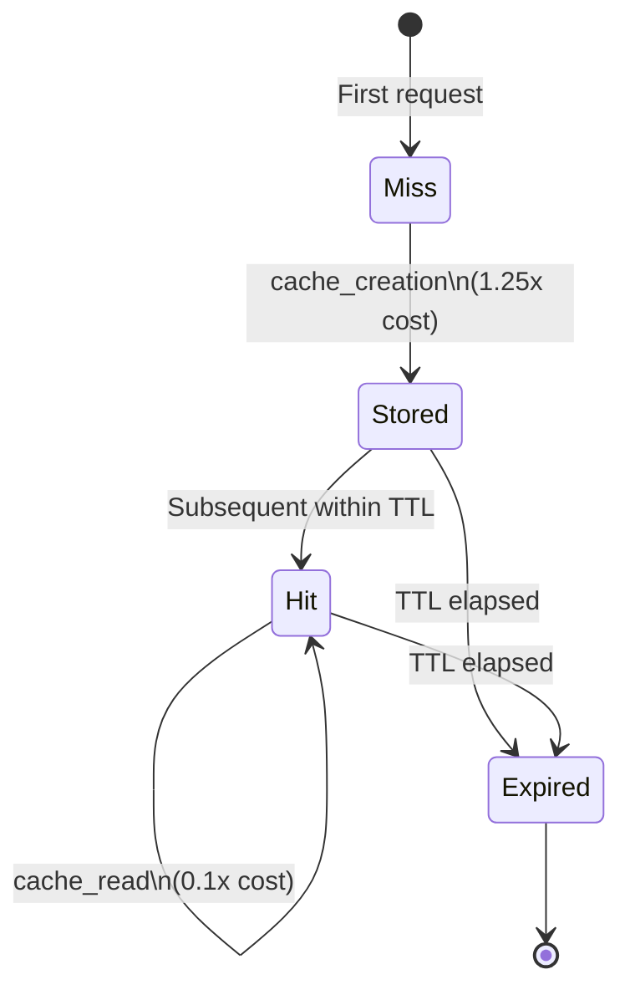

# Cost Control / Budget Enforcement — Prompt Caching ROI

## 핵심 요약 (한국어)

Anthropic prompt caching 은 **budget enforcement 의 가장 효과적인 단일 기법**. 5분 ephemeral
또는 1시간 extended TTL, **cache write 1.25x / 1h cache write 2x / cache read 0.1x**
multiplier. 또한 cache read 토큰은 (대부분 모델에서) ITPM 한도에 카운트되지 않아 **비용**과
**rate limit** 양쪽에서 이득. break-even 은 5분 윈도우 내 약 13 회 재사용.



## 가격 구조 (per 1M tokens)

### Claude Opus 4.7
- Base Input: $5
- 5min Cache Write: $6.25 (1.25x)
- 1h Cache Write: $10 (2x)
- Cache Hit/Refresh: $0.50 (0.1x)
- Output: $25

### Claude Sonnet 4.6
- Base Input: $3
- 5min Cache Write: $3.75
- 1h Cache Write: $6
- Cache Hit/Refresh: $0.30
- Output: $15

### Claude Haiku 4.5
- Base Input: $1
- 5min Cache Write: $1.25
- 1h Cache Write: $2
- Cache Hit/Refresh: $0.10
- Output: $5

### Pricing Multiplier 정리
- 5-min cache write: **1.25x base**
- 1-hour cache write: **2x base**
- Cache read: **0.1x base** (90% off)

## Cache Breakpoint 규칙

- 요청당 최대 **4 개 explicit `cache_control` breakpoint**
- breakpoint 는 free, cache write/read 만 과금
- cache 계층 순서:
  1. `tools` array
  2. `system` array
  3. `messages` array
- 어느 단계든 변경되면 그 단계 + 이후 모두 invalidate

## 최소 캐시 가능 길이

| 모델 | 최소 토큰 |
|---|---|
| Opus 4.7 / 4.6 / 4.5 | 4,096 |
| Sonnet 4.6 | 2,048 |
| Sonnet 4.5 / 4 / 3.7 | 1,024 |
| Haiku 4.5 | 4,096 |
| Haiku 3.5 | 2,048 |

미달 시 **error 없이 silent skip** — `cache_creation_input_tokens` 와 `cache_read_input_tokens`
모두 0. 응답 monitoring 으로 검증 필요.

## Break-even 계산 (Opus 4.7, 100K token system prompt)

**First request (cache write)**:
- System: 100,000 × $6.25/M = $0.625
- User msg: 100 × $5/M = $0.0005
- Total: **$0.6255**

**Subsequent (cache hit, within 5 min)**:
- Cached system: 100,000 × $0.50/M = $0.05
- User msg: 100 × $5/M = $0.0005
- Total: **$0.0505**
- Saving per request: **92% reduction**

**Break-even**: 5분 window 내 **13 회 재사용** 시 cache 비용 ≤ 매번 uncached 처리 비용.

## 토큰 카운팅 — 빌링 정확성

```python
total_input_tokens = (
    cache_read_input_tokens
    + cache_creation_input_tokens
    + input_tokens
)
```

`input_tokens` 는 **마지막 cache breakpoint 이후** 토큰만 의미. 즉:
- 200K 캐시된 문서 + 50 토큰 user 질문 → `input_tokens: 50`, 총 input 은 200,050

세 항목 모두 input billing 에 카운트되지만 단가가 다름:
- `input_tokens`: 1x
- `cache_creation_input_tokens`: 1.25x or 2x
- `cache_read_input_tokens`: 0.1x

## Cache Invalidation 트리거 (전체)

다음 변경 시 **full cache invalidation**:
- Tool definitions
- System prompt
- Web search toggle
- Citations toggle
- Speed setting (`speed: "fast"`)
- 어디든 image 추가/제거
- Extended thinking settings
- Non-tool result added to extended thinking (모델 의존)

`messages` 캐시는 다음에만 영향:
- `tool_choice` 변경
- image 추가/제거

## Pre-warming 패턴

```python
prewarm = client.messages.create(
    model="claude-opus-4-7",
    max_tokens=0,
    system=[{
        "type": "text",
        "text": "Expert system prompt...",
        "cache_control": {"type": "ephemeral"}
    }],
    messages=[{"role": "user", "content": "warmup"}]
)
```

- output 0 토큰 청구
- cache write 비용만 발생
- 사용자 traffic 도달 전에 warm 상태 유지

## 1시간 TTL

```python
cache_control = {"type": "ephemeral", "ttl": "1h"}
```

5분 vs 1시간 비교:
- 5분: 1.25x write
- 1시간: 2x write
- break-even 차이: 1시간 캐시는 동일 절감을 위해 더 긴 시간 동안 충분한 hit 필요

## Concurrent Request 주의

> "cache entry only available after first response begins; queue subsequent requests
> after initial cache write"

→ cold start 시 첫 요청이 200ms+ TTFB 가질 때까지 후속 요청을 hold 해야 cache 효과 극대화.

## 일반적 실수 패턴

> "Common mistake: Placing breakpoint on changing content (timestamps, per-request data).
> Move it to stable content instead."

→ breakpoint 는 항상 stable section 의 마지막에 둘 것.

## Cost Control Strategy — Production Playbook

### 1. Token Budget Guard
- 호출 전 `input_tokens` 추정 (tokenizer count)
- 회당 budget cap, session budget cap, daily budget cap 의 3 단계
- 초과 시 reject 또는 truncate

### 2. Tier-based Routing
- Critical path: Opus
- Standard: Sonnet
- High volume / low complexity: Haiku
- 비실시간: Batch API (50% 비용)

### 3. Autorun Cost Cap (Claude Code 등)
- `--max-cost` 플래그 또는 hook 으로 누적 cost 추적
- 임계 도달 시 session 종료

### 4. Cache hit rate monitoring
- 응답의 `cache_read_input_tokens` 비율 추적
- 목표: ≥ 50% (보통 80%+ 가능)
- Console Usage page 에서 가시화

### 5. ROI Threshold 결정
- system prompt 가 ≥ 1024 토큰 (Sonnet 기준) + 5분 내 ≥ 13 회 재사용 → 캐싱 ROI 양수
- 그 미만은 비활성화 (write premium 만 발생)

## 캐시 가능/불가능

✓ **가능**: Tool definitions, System messages, Text messages (user/assistant), Images,
Documents, Tool use blocks, Tool result blocks

✗ **직접 불가**: Thinking blocks (이전 turn 의 다른 content 와 함께만 캐시),
Sub-content blocks (citations 등 — 상위 document 만 캐시 가능), Empty text blocks

## 관련 문서

- Anthropic prompt caching: https://platform.claude.com/docs/en/build-with-claude/prompt-caching
- Pricing: https://www.anthropic.com/pricing
- Rate limits 관계: 위 raw 의 cache-aware ITPM 섹션 참조
- Batch API (50% 비용): https://platform.claude.com/docs/en/build-with-claude/batch-processing
