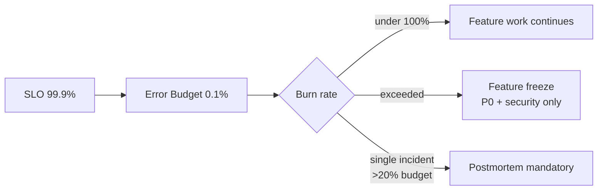
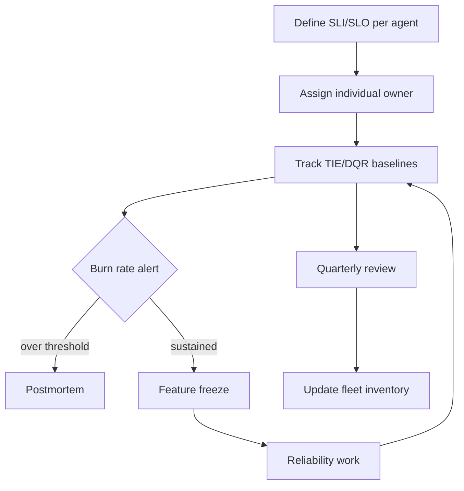

# SRE Error Budget — LLM Agent 적용

## 핵심 요약 (한국어)

Google SRE 의 **error budget** 개념을 LLM agent 운영에 적용. 정의:
> "An error budget is 1 minus the SLO of the service. A 99.9% SLO service has a 0.1%
> error budget."

2026 년 LLM agent 운영의 새 위기는 **Agent Sprawl** — framework 채택은 9% (2025 초) →
18% (2026), 70%+ 조직이 3 개 이상 모델 운영. SRE governance 부재 상태에서 microservice
sprawl (2015-2020) 과 동일한 패턴 반복.

## Error Budget 기본 (Google SRE Workbook)

### 정의
> "An error budget is 1 minus the SLO of the service."

| SLO | Error Budget (4주, 1M req) |
|---|---|
| 99.0% | 10,000 errors |
| 99.5% | 5,000 errors |
| 99.9% | 1,000 errors |
| 99.95% | 500 errors |
| 99.99% | 100 errors |

### Policy 의 의무 사항 (Example Game Service)
> "If the service has exceeded its error budget for the preceding four-week window, we
> will halt all changes and releases other than P0 issues or security fixes until the
> service is back within its SLO."

→ **Feature freeze** 가 강제 메커니즘.

### Postmortem 의무
> "a single incident consumes more than 20% of error budget over four weeks"
- → P0 action item 1 개 이상 도출

### 분기별 escalation
> "if a single outage category exceeds 20% of quarterly budget, teams must schedule
> reliability work in their next planning cycle"

## LLM Agent 의 SLI 정의 — 새 challenge

전통 web service 와 다른 점:
- **품질** 자체가 SLI (correctness, helpfulness 등)
- **비용** SLI (per-task token 또는 dollar)
- **Tool Invocation Efficiency** (TIE) — task 당 tool call 수
- **Decision Quality Rate** (DQR) — 모델이 옳은 선택을 한 비율

### 권장 LLM Agent SLI

| SLI | 측정 | 임계값 예 |
|---|---|---|
| 가용성 | success span ratio | 99.9% |
| 응답 지연 P95 | OTel `gen_ai.client.operation.duration` | task class 의존 |
| TTFT P95 | `gen_ai.server.time_to_first_token` | < 1s for chat UX |
| Tool Invocation Efficiency | tool call / task | baseline ±20% |
| Decision Quality Rate | LLM-as-judge or rubric | ≥ 90% |
| 비용 per task | total cost / task count | budget cap 의존 |
| Refusal rate | refusal output / total | task 종류별 baseline |

## Agent Sprawl 위기 (2026 Datadog 데이터)

### 채택률 변화
> "LangChain, LangGraph, Pydantic AI, Vercel AI SDK — up from 9% of organizations in
> early 2025 to nearly 18% by 2026"

### Multi-model proliferation
> "70%+ of organizations run three or more models" with the share running six+ models
> nearly doubling

### 누적되는 tech debt
> "Teams add models faster than they retire them"

### 에러 발생 분포 (2026-02)
> "5% of all LLM call spans reported an error and 60% of those errors were caused by
> exceeded rate limits"

→ rate limit 이 error budget burn 의 단일 최대 원인.

## 3 가지 신뢰성 위협 (article 정리)

### 1. Framework-Invisible Complexity
> "Orchestration frameworks add retry logic, fallback handlers, and routing that remain
> invisible to observability layers. Tool Invocation Efficiency (TIE) baselines can drift
> 30-40% after major framework upgrades with no agent logic changes, causing false
> incident RCAs."

→ framework version 을 SLO ownership 에 포함, upgrade 전 baseline freeze.

### 2. Multi-Model SLO Orphaning
> "70% of organizations running 3+ models have unowned SLOs. Models lack named owners,
> baselines, or error budgets, causing degradation to surface as customer complaints
> rather than alerts."

### 3. LLM Tech Debt Liability
> "Deprecated models buried in agent chains miss migration windows, with Decision Quality
> Rate declining too gradually to trigger threshold alerts until production incidents
> occur."

## SRE 적용 권장 — Governance Framework

### 1. Per-model SLO ownership
- **개인 단위 owner** (팀 아님), task-class-specific 임계값
- 모든 모델이 SLO + 명명된 owner 필수

### 2. TIE baseline monitoring
- task 당 tool call 수, framework upgrade 직전 freeze
- post-upgrade ±20% 초과 시 alert

### 3. DQR tracking
- baseline refresh < 90 일 cycle
- 모델 deprecation 으로 인한 quality drift 조기 detect

### 4. Deprecation alert
- end-of-life 60 일 / 30 일 / 7 일 전 자동 알림
- 모델 deprecation 시 SLO 재calibration

### 5. Agent fleet inventory
- framework version, model deprecation date, current baseline, SLO owner 추적
- 분기별 multi-model SLO review
- shadow traffic 으로 framework promotion 전 검증

## Error Budget Burn Rate Alert

### Multi-window multi-burn-rate
Google SRE 의 권장 alerting:

| Burn Rate | Alert Window | 의미 |
|---|---|---|
| 14.4 | 1h | 1 시간에 1 일치 budget 소진 |
| 6 | 6h | 6 시간에 1 주치 budget 소진 |
| 3 | 24h | 1 일에 1 개월치 budget 소진 |
| 1 | 72h | 정상 burn |

→ 가장 빠른 alert 는 짧은 window + 큰 burn rate 조합.

## 운영 — Production Playbook

## LLM Agent 특수 — Quality SLO

전통 SRE 에서는 binary success/fail 이지만 LLM agent 는 **quality gradient**.

권장:
- **dual SLO**: availability SLO (99.9%) + quality SLO (DQR ≥ 90%)
- 두 budget 을 독립 추적
- quality SLO burn 은 model upgrade / prompt regression / retrieval drift 가 주된 원인

## Refusal & Drift 패턴

production 모니터링 단서:
- refusal rate 의 갑작스런 증가 = prompt change 또는 model migration
- output token 분포 변화 = 응답 길이 drift
- tool call distribution = agent strategy drift
- cost per task 증가 = model upgrade 또는 prompt bloat

## 관련 문서

- Google SRE Workbook (Error Budget Policy): https://sre.google/workbook/error-budget-policy/
- Google SRE Book (SLO 정의): https://sre.google/sre-book/service-level-objectives/
- Datadog State of AI Engineering: https://www.datadoghq.com/state-of-ai-engineering/
- Agent Sprawl 분석: https://dev.to/ajaydevineni/agent-sprawl-is-your-next-production-incident-an-sre-response-to-datadogs-state-of-ai-engineering-3k83
- Agent Factory SRE foundations: https://agentfactory.panaversity.org/docs/AI-Cloud-Native-Development/observability-cost-engineering/sre-foundations-slis-slos-error-budgets
- Backendbytes 가이드: https://backendbytes.com/articles/sre-slos-slis-error-budgets/
