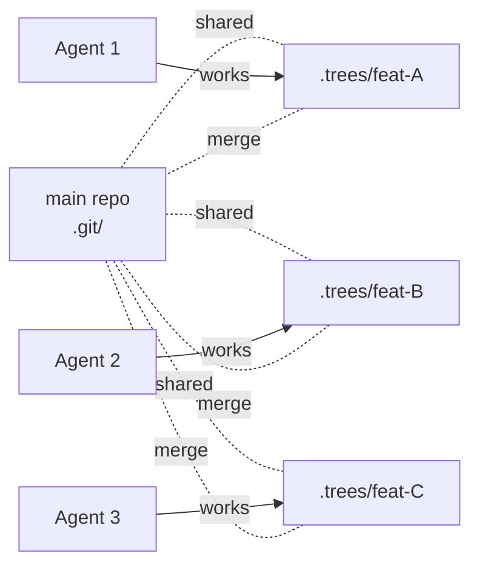

# Git Worktree 기반 병렬 Agent 격리

## 핵심 요약 (한국어)

Git worktree 는 **하나의 저장소에 여러 working directory** 를 두어 병렬 agent 가 서로
다른 branch 에서 동시 작업하게 하는 격리 도구. 단, **process isolation 은 아니다** —
같은 환경 변수, 같은 로컬 DB, 같은 network 공유. 또한 같은 branch 를 두 worktree 에
checkout 하는 것은 git 이 거부.

**2026-04 Claude Code Issue #48927** 사례에서 worktree cleanup race condition 으로
`.git/` 디렉토리와 작업 트리 전체가 삭제되는 catastrophic data loss 발생 — 운영 도입 시
**worktree path validation guard** 필수.



## Worktree Lifecycle

### Create
```bash
git worktree add .worktrees/feat-auth -b feature/auth
# or from existing branch
git worktree add .worktrees/feat-auth feature/auth
```

### List
```bash
git worktree list
```

### Cleanup
```bash
git worktree remove .worktrees/feat-auth
git worktree remove --force .worktrees/feat-auth   # uncommitted changes 무시
git worktree prune                                  # 끊어진 reference 정리
```

## Setup Tax (실비용)

새 worktree 는 gitignored 파일 부재:
- `node_modules/`, `.venv/`, package cache
- build artifact (`dist/`, `.next/`, `__pycache__/`)
- `.env*` secret

> "Budget several minutes of setup per worktree on a modern monorepo"

→ 자동화 스크립트 필요 (`.env` copy, install, port 할당).

## Production-grade Setup Script (Augment Code)

```bash
#!/usr/bin/env bash
set -euo pipefail
TASK_ID="${1:?Usage: $0 <task-id> [base-branch]}"
BASE_BRANCH="${2:-main}"
REPO_ROOT="$(git rev-parse --show-toplevel)"
TREES_DIR="${REPO_ROOT}/.trees"

sanitize_branch_name() {
  echo "$1" | sed 's/[^a-zA-Z0-9-]/-/g' | cut -c1-50
}

BRANCH_NAME="agent/$(sanitize_branch_name "${TASK_ID}")"
WORKTREE_PATH="${TREES_DIR}/${TASK_ID}"

mkdir -p "${TREES_DIR}"
grep -qxF '.trees/' "${REPO_ROOT}/.gitignore" \
  || echo '.trees/' >> "${REPO_ROOT}/.gitignore"

git fetch origin "${BASE_BRANCH}"
git worktree add -b "${BRANCH_NAME}" \
  "${WORKTREE_PATH}" "origin/${BASE_BRANCH}"

cd "${WORKTREE_PATH}"
npm ci --prefer-offline
[ -f "${REPO_ROOT}/.env.local" ] && cp "${REPO_ROOT}/.env.local" .env.local

# 결정론적 port 할당 (branch 명 hash → 3100~9999 범위)
PORT=$(( 3100 + $(echo "${BRANCH_NAME}" | cksum | cut -d' ' -f1) % 6899 ))
echo "DEV_PORT=${PORT}" >> .env.local
echo "Ready: cd ${WORKTREE_PATH} (port ${PORT})"
```

## 자동 Cleanup Script (merged branch)

```bash
git fetch origin main
git worktree list --porcelain | grep "^worktree " | awk '{print $2}' | while read -r path; do
  [ "${path}" = "$(git rev-parse --show-toplevel)" ] && continue
  branch=$(git -C "${path}" branch --show-current 2>/dev/null || echo "")
  if [ -n "${branch}" ]; then
    if git merge-base --is-ancestor "${branch}" origin/main 2>/dev/null; then
      git worktree remove "${path}" --force
      git branch -D "${branch}" 2>/dev/null || true
    fi
  fi
done
git worktree prune
```

## Isolation Guarantee — 그 한계

> "A worktree is a second working directory pointing at the same Git repository, locked
> to a different branch."

격리되는 것:
- 각 worktree 가 자체 filesystem view (특정 branch)
- 파일 edit 는 완전 분리
- 다른 worktree 에서의 commit 은 즉시 visible (shared `.git`)

**격리 안 되는 것** (중요):
- process: 같은 환경 변수
- 로컬 DB / 로컬 file 외부 자원
- network port (수동 분리 필요)
- system 단위 자원 (cron, daemon)

## Parallel Agent 실용 ceiling

> "Three to five concurrent Agents in my experience, before things get unwieldy. The
> bottleneck is rarely Git."

→ rate limit, review overhead, port collision 이 filesystem 보다 먼저 hard limit.

## 같은 Branch 동시 checkout 불가

> "Git refuses to check out the same branch in two worktrees on purpose."

→ 한 task 를 두 agent 가 병렬 처리하려면 **branch 분해** 필수.

## 일반적 Pitfall 5종

1. **Submodule 비용 증폭**: 각 worktree 가 자체 submodule set → 디스크 사용 multiplied.
   `git submodule update --init --recursive` 명시 필요.
2. **Hook 실행 실패**: `.git/hooks/` 공유, 새 worktree 의 `node_modules` 부재로 hook 실패.
   bootstrap 완료 후 commit 또는 `extensions.worktreeConfig`.
3. **Cross-worktree 경고 부재**: 두 worktree 가 같은 파일 수정해도 git 이 경고 안 함 →
   strict file domain 분담 + `git config rerere.enabled true`.
4. **IDE 지원 갭**: pre-2026.1 JetBrains, pre-2025-07 VS Code 는 worktree 부분 지원.
5. **Locked worktree**: `git worktree lock` 된 상태는 `git worktree remove` 거부 → unlock 필요.

## Catastrophic Bug — Claude Code Issue #48927

### 재현 (2026-04-16, v2.1.109, Opus, Ubuntu)

1. branch `dev/mode-2` 에서 Claude Code session 시작
2. `isolation: worktree` 로 4 개 parallel subagent 발사 (Layer 1)
3. 약 15 분 대기, main working dir 에 결과 생성
4. 4 개 commit 만들기
5. 두 번째 4 개 parallel subagent 발사 (Layer 2)
6. 약 8 분 후 모든 git 명령: `fatal: not a git repository`

### 파괴된 것
- `.git/` 디렉토리 완전 사라짐
- 원본 source code 삭제
- `docs/`, `tests/`, config, `README.md` 삭제
- Layer 1 의 4 개 commit (push 안 했으므로 unrecoverable)
- 살아남은 것: Layer 2 가 만든 `install.sh`, `uninstall.sh`, `pyproject.toml` 일부

### Root Cause
- worktree cleanup race condition / path confusion
- main repository root 를 isolated worktree dir 로 오인하고 삭제
- parallel cleanup 의 race

### 권장 Fix (issue 작성자)
1. **main `.git/` 절대 삭제 금지** — explicit guard
2. cleanup path 가 `.claude/worktrees/` 하위인지 validate
3. cleanup 전: 해당 path 가 진짜 worktree 인가 (즉 `.git` 이 file → main repo pointer) 확인
4. parallel cleanup serialize

### 관련 issue
- #38287 — worktree cleanup 이 unmerged commit branch 무성서 삭제
- #29110 — spawned agent 의 worktree data loss
- #12586 — 사용자 동의 없는 worktree 생성
- #37331 — Claude 가 모든 파일 삭제, `.git` 교체

## 운영 권장 — Worktree Hardening

### 1. Path validation guard
```bash
# pseudo-code in agent harness
ALLOWED_PREFIX=".trees/"
case "${cleanup_path}" in
  "${ALLOWED_PREFIX}"*) ;;  # OK
  *) echo "REFUSE: cleanup outside ${ALLOWED_PREFIX}"; exit 1 ;;
esac

# 또한 .git 이 directory 인 path 에서 cleanup 절대 금지
if [ -d "${cleanup_path}/.git" ]; then
  echo "REFUSE: target has .git directory (not a worktree)"; exit 1
fi
```

### 2. Pre-cleanup snapshot
- worktree 작업 시작 전 main repo 의 `.git` 를 별도 backup
- 또는 critical work 는 항상 push 후 cleanup

### 3. Serialize cleanup
- parallel subagent 끝난 후 cleanup 은 sequential
- cleanup 완료 후 다음 layer launch

### 4. Disposable container 결합
- worktree + container 결합 시 host filesystem 격리
- container 내부에서 cleanup 실패해도 host repo 무사

## 실측 효과 (Augment Code / 다양한 사례)

> "Real-world testing showed 3.2x faster feature delivery, zero merge conflicts from
> parallel agents, and a 40% reduction in manual code review cycles because each agent's
> output was isolated and testable before integration."

## 관련 문서

- Augment Code 가이드: https://www.augmentcode.com/guides/git-worktrees-parallel-ai-agent-execution
- TDS 글: https://towardsdatascience.com/ai-agents-need-their-own-desk-and-git-worktrees-give-it-one/
- PADISO Claude Code worktrees: https://www.padiso.co/blog/claude-code-worktrees-parallel-agent-sessions/
- MindStudio: https://www.mindstudio.ai/blog/git-worktrees-parallel-ai-coding-agents
- Issue #48927 (catastrophic bug): https://github.com/anthropics/claude-code/issues/48927
- Upsun: https://devcenter.upsun.com/posts/git-worktrees-for-parallel-ai-coding-agents/
