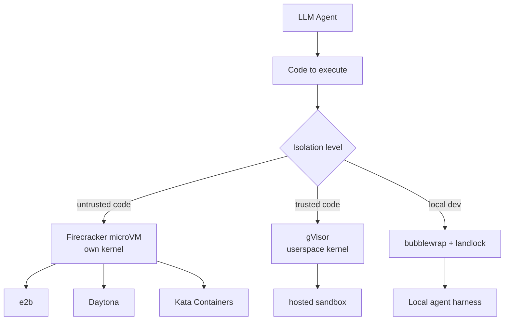
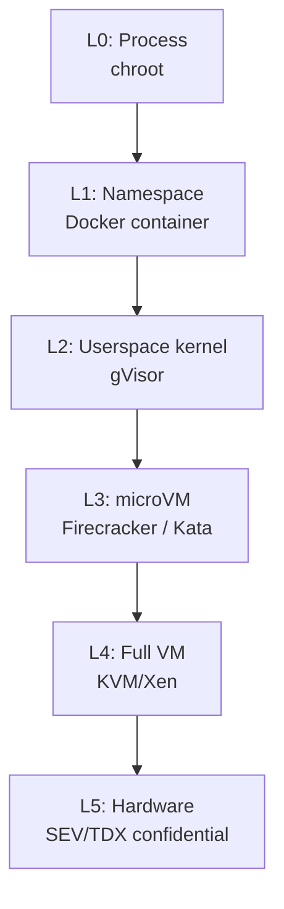

# Hosted Sandbox / microVM — Agent Code 실행 격리

## 핵심 요약 (한국어)

2025-2026 사이 LLM agent 가 코드를 직접 실행하는 use case 가 폭증 (Claude/GPT/Gemini/Codex
millions of sessions/day) → "agent's code 가 어디서 실행되는가" 가 모든 platform 의 핵심
질문이 됨. **Container 는 sandbox 가 아니다** (host kernel 공유) → 표준이
**Firecracker/Kata microVM** 으로 이동, gVisor 가 lighter fallback.

> "The minimum acceptable isolation for a production agent execution sandbox is typically
> a Firecracker/Kata microVM, with gVisor used in some environments as a fallback or
> lighter-weight option depending on the threat model."



## 왜 Container 는 Sandbox 가 아닌가

> "Unlike containers, which share the host system's kernel, each Firecracker microVM has
> its own kernel, providing true hardware-level isolation."

container 의 한계:
- shared kernel → kernel exploit 시 host 전체 노출
- namespace + cgroup 만으로는 untrusted code 격리 불충분
- AWS 의 Lambda 가 Firecracker 로 전환한 이유

## Firecracker microVM

### Spec
- Rust 로 작성된 KVM-based microVM hypervisor
- AWS 가 OSS 로 release (Apache 2.0)
- VM 1개당 KVM kernel + minimal device

### Boot Time
- 일반 VM: 수 초 ~ 수십 초
- Firecracker microVM cold boot: ~125ms
- e2b 의 pre-warmed snapshot pool 사용 시: **~150ms** restoration/provisioning

> "E2B uses pre-warmed microVM pools and VM snapshots to achieve roughly 150ms
> restoration/provisioning times by booting microVMs to a fully initialized state, taking
> a full snapshot, then restoring incoming requests from that snapshot."

→ snapshot 기반 multiplexing 이 hosted sandbox 의 사실상 표준 패턴.

## e2b — Hosted Agent Sandbox

### 정체성
> "E2B is an open-source secure cloud environment (sandbox) made for running AI-generated
> code and agents."

### 아키텍처
- Firecracker microVM 위에 sandbox 실행
- 각 sandbox = 자체 kernel
- pre-warmed pool + snapshot multiplexing
- API: SDK (Python/JS/Go) + REST + MCP server

### Use case
- code interpreter 류 (LLM 이 데이터 분석 코드 실행)
- web scraping agent
- 자동화 작업 (browser, shell)

## OpenHands Runtime

### 옵션
- Docker container runtime (default, 빠른 dev)
- e2b runtime (격리 강도 ↑)
- Modal, Daytona 등 hosted alternative

OpenHands 는 **AGENT_RUNTIME** 환경변수로 runtime 교체:
```bash
export AGENT_RUNTIME=e2b
```

> "OpenHands documentation includes E2B as a supported runtime for executing agent code."

## Daytona, Beam, Modal 등 alternative

- **Daytona**: 개발 환경 sandbox, GPU 지원
- **Beam**: Python-first sandbox, fast cold start
- **Modal**: serverless container + GPU
- **Cloudflare Workers**: edge runtime, V8 isolate (격리 약함, 비용 ↓)

## gVisor — Light alternative

- Google 이 OSS 로 release (Apache 2.0)
- **userspace kernel** (host syscall intercept)
- container-like 인터페이스 + 더 강한 격리
- overhead: ~10-20% 성능 페널티
- Firecracker 보다 light 하지만 일부 syscall (특히 networking) compatibility 문제

→ trust boundary 가 microVM 보다 약함, 그러나 container 보다 훨씬 강함.

## Kata Containers

- VM-isolated container runtime (OCI 호환)
- Firecracker 또는 QEMU backend
- container API + VM 격리
- Kubernetes 와 통합 용이 (RuntimeClass)

## 격리 강도 — 정리



| Level | 격리 | 적용 |
|---|---|---|
| L0 | 약 | sandbox-exec, bubblewrap+landlock (untrusted user, trusted code) |
| L1 | 약중 | Docker (multi-tenant 부적합) |
| L2 | 중상 | gVisor (medium-trust workload) |
| L3 | 상 | Firecracker, Kata (untrusted code, hosted agent) |
| L4 | 최상 | full VM (legacy) |
| L5 | 최상 + memory | confidential VM (regulatory) |

## 비교 — Local vs Hosted Sandbox

| 측면 | Local (bwrap+landlock) | Hosted (e2b/Firecracker) |
|---|---|---|
| 격리 강도 | 중상 | 상 |
| Cold start | ms | ~150ms |
| Cost | 무료 (host 자원) | API 호출당 비용 |
| 운영 부담 | 직접 관리 | managed service |
| Multi-tenant | 부적합 | 적합 |
| 적합 use case | dev workstation, single-user | hosted agent platform |

## 운영 권장 — 격리 선택 매트릭스

| 시나리오 | 권장 격리 |
|---|---|
| 로컬 dev, trusted user 가 LLM 호출 | sandbox-exec / bwrap+landlock+seccomp |
| 단일 조직 internal agent | container + bwrap layer |
| Multi-tenant SaaS agent | Firecracker microVM (e2b 등) |
| Untrusted user code 실행 | Firecracker + network 차단 |
| Compliance-critical | Confidential VM (SEV/TDX) |

## Network Policy 패턴

격리 강도와 별개로 network 는 별도 정책:
- **default off**: agent 외부 통신 명시 승인 필요 (Codex 패턴)
- **whitelist domain**: 특정 도메인만 허용 (npm registry, pypi 등)
- **proxy 강제**: 모든 outgoing traffic 이 logging proxy 통과
- **VPC 격리**: hosted sandbox 가 자체 VPC 에서만 작동

## 비용 모델 비교 (참고)

| 서비스 | 단가 모델 | 특징 |
|---|---|---|
| e2b | per-second sandbox runtime | 250ms 단위 과금 |
| Modal | per-second container | GPU 옵션 |
| Daytona | per-second + storage | 개발 환경 |
| 자체 host (Firecracker) | EC2/bare metal cost | scale 시 가장 저렴 |

## 관련 참조

- e2b 공식: https://e2b.dev/
- e2b Dwarves breakdown: https://memo.d.foundation/breakdown/e2b
- OpenHands runtimes: https://docs.openhands.dev/
- Beam alternatives: https://www.beam.cloud/blog/best-e2b-alternatives
- Spheron 가이드: https://www.spheron.network/blog/ai-agent-code-execution-sandbox-e2b-daytona-firecracker/
- Northflank microVM: https://northflank.com/blog/secure-runtime-for-codegen-tools-microvms-sandboxing-and-execution-at-scale
- microVM 2026 state: https://emirb.github.io/blog/microvm-2026/
- Firecracker repo: https://github.com/firecracker-microvm/firecracker
- awesome-sandbox 큐레이션: https://github.com/restyler/awesome-sandbox
