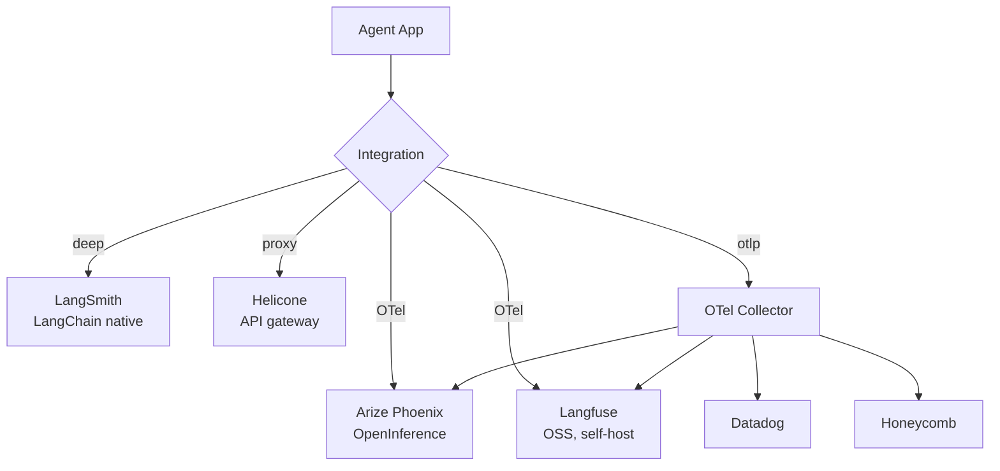

# LLM/Agent Observability 플랫폼 비교 (2026-05)

## 핵심 요약 (한국어)

2026 년 5월 시점 6 개 플랫폼이 안착:
- **LangSmith**: LangChain/LangGraph native, 가장 deep 한 framework 통합
- **Langfuse**: open-source 리더, self-host 가능 (2026-01 ClickHouse 인수)
- **Arize Phoenix**: ML-grade rigor, OpenInference + OTel 기반 vendor-agnostic
- **Helicone**: drop-in proxy, base URL 1 줄 변경 (가장 simple)
- **Datadog LLM Observability**: enterprise default
- **Honeycomb LLM Observability**: event-based deep tracing

**Datadog 2026 State of AI Engineering 결론**:
> "Workflows that worked in dev fail in prod for reasons traditional APM doesn't surface
> — model drift, tool-call retry loops, prompt regressions."

→ infra observability 와 LLM observability 는 별개 layer, 둘 다 필요.

## LangSmith — LangChain native

### Core
- LangChain 과 LangGraph 에 가장 깊은 통합
- node-by-node state diff, full agent execution graph
- model + tool call breakdown
- replay against new model versions

### SDK / Language
> "native tracing for popular agent frameworks and OpenTelemetry... SDKs supporting
> Python, TypeScript, Go, and Java."

### OTel 호환
> "send LangSmith trace data to your tools or ingest OTel data into LangSmith"

→ 양방향 OTel pipeline 지원. 기존 OTel collector 와 결합 가능.

### Multi-turn
> "message threading for multi-turn chat interactions"

### Monitoring metrics
- token usage, latency P50/P99, error rate, cost breakdown, feedback score
- alerting: webhook + PagerDuty

### Evaluator
> "online LLM-as-judge and code evals... tool and agent trajectory monitoring"

### Auto-insight
> "unsupervised topic clustering... templates for error analysis"

### Deployment
- Managed cloud (GCP us-central-1)
- BYOC (bring-your-own-cloud)
- Self-hosted Kubernetes (data residency 대응)

### Privacy
> "we will not train on your data"

## Langfuse — OSS 리더

### Stack
- Postgres + ClickHouse
- 2026-01 ClickHouse 가 인수, OSS code 활성 maintain
- framework-agnostic, OTel 통해 모든 LLM SDK / agent framework 지원

### Data Model
- **Trace**: 전체 request lifecycle
- **Observation**: trace 안의 개별 op (LLM call, tool exec, retrieval step)
- **Score**: trace/observation 평가
- **Session**: multi-turn 그루핑

### 호출 처리
> "Langfuse SDKs send tracing data asynchronously in the background"

→ 호출 latency overhead 없음.

### 통합
- OpenAI SDK, Anthropic SDK, LangChain, LlamaIndex, 직접 OTel 송신

## Helicone — Proxy 패턴

### 핵심
> "Helicone routes LLM API calls through its proxy, capturing observability without SDK
> changes — change one base URL, get traces."

→ 가장 simple 한 install. trade-off: trace depth 가 framework-native 보다 얕음 (API call
level, agent execution level 아님).

### 적합 시나리오
- 비-LangChain 환경의 빠른 monitoring 도입
- multi-provider routing 과 결합

## Arize Phoenix — OSS / OTel 정통

### 정체성
> "Phoenix is fully open source and self-hostable — no feature gates or restrictions."
> "Phoenix is built on top of OpenTelemetry and is powered by OpenInference instrumentation."
> "agnostic of vendor, framework, and language."

### OpenInference
- Arize 의 OTel-기반 LLM instrumentation 표준
- repo: https://github.com/Arize-ai/openinference
- Phoenix 는 OpenInference 의 reference receiver

### Auto-instrumentation
> "popular frameworks (LlamaIndex, LangChain, DSPy, Mastra, Vercel AI SDK), providers
> (OpenAI, Bedrock, Anthropic), and languages (Python, TypeScript, Java)"

### Agent 지원
> "out-of-the-box support for popular frameworks including OpenAI Agents SDK, Claude
> Agent SDK, LangGraph, Vercel AI SDK, Mastra, and CrewAI."

### Eval
- LLM-as-judge
- code-based check
- human label
- experiment / regression test

## OpenTelemetry GenAI semconv 와의 관계

| 플랫폼 | OTel 채택 |
|---|---|
| LangSmith | trace 양방향 호환 |
| Langfuse | OTel 직접 ingest |
| Helicone | API call 단위 |
| Arize Phoenix | OpenInference (OTel-기반) → 표준 정합 |
| Datadog LLM Obs | OTel + Datadog APM |
| Honeycomb | OTel 기반 |

→ OTel `gen_ai.*` semconv 표준화로 vendor lock-in 감소. 단 spec 이 Development 단계라
정착에 시간 필요.

## 선택 가이드 (production 기준)

| 시나리오 | 권장 |
|---|---|
| LangChain/LangGraph 기반 | LangSmith |
| 자체 호스팅 + 데이터 주권 | Langfuse / Phoenix |
| Datadog 사용 중 | Datadog LLM Observability |
| 빠른 install, 다양한 provider | Helicone |
| OTel 표준 + multi-vendor | Phoenix + OpenInference |
| ML 정밀도 + Eval | Phoenix or Arize AX |

## 운영 — 두 layer 동시 필요

> "LLM observability and infrastructure observability are different layers. The LLM
> platform (LangSmith, Langfuse, Arize) handles agent traces, eval, and LLM-specific
> metrics. The infra platform (Datadog, Honeycomb, New Relic) handles host metrics,
> app errors, request traces, deployment health. Most production deployments need both"

## Trace 표준화 권장 패턴

1. **LangChain/LangGraph 사용 시**: LangSmith 자동 trace + OTel export
2. **그 외**: OpenInference (Phoenix instrumentation) 또는 직접 OTel + `gen_ai.*` attribute
3. **Multi-vendor**: OTel collector 가 fan-out → LLM platform + APM 둘 다 송신
4. **Sensitive 데이터**: `gen_ai.input.messages`/`output.messages` 는 opt-in,
   PII redaction layer 사이에 끼워 넣기

## 관련 문서

- LangSmith observability: https://www.langchain.com/langsmith/observability
- Langfuse: https://langfuse.com/
- Arize Phoenix: https://arize.com/docs/phoenix
- OpenInference repo: https://github.com/Arize-ai/openinference
- Helicone: 검색 결과 참조
- 2026 비교: https://www.digitalapplied.com/blog/agent-observability-platforms-langsmith-langfuse-arize-2026
- Latitude 비교: https://latitude.so/blog/best-llm-observability-tools-agents-latitude-vs-langfuse-langsmith
- Datadog State of AI Engineering: https://www.datadoghq.com/state-of-ai-engineering/
