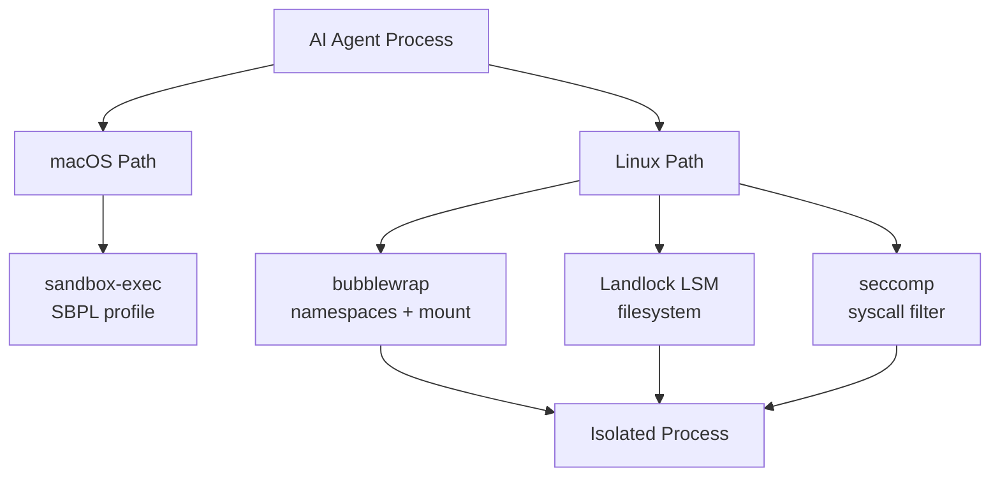

# AI Agent Sandbox / Isolation 전략

## 핵심 요약 (한국어)

2026 년 5월 현재 AI agent sandbox 의 사실상 표준 스택:
- **macOS**: `sandbox-exec` (Seatbelt) — Chrome 등 critical 3rd party 도 사용
- **Linux**: `bubblewrap` (namespaces) + `landlock` (filesystem LSM) + `seccomp` (syscall filter) 의 defense-in-depth
- **Windows**: native 미흡 → WSL2 안에서 Linux sandbox 실행 (Cursor 채택 패턴)

**주요 운영 사례 (2026-05 시점)**:
- **Claude Code**: Linux=bubblewrap, macOS=Seatbelt, **off by default**
- **OpenAI Codex**: Linux=Landlock+seccomp, **on by default** (sandboxing enabled by default 인 유일한 메이저 agent)
- **Cursor**: 위와 동일 + macOS 에서 Seatbelt 의 deprecated API 위험을 인지하고도 채택

## Linux Stack 구성 요소

### bubblewrap
- 50KB 정도의 sandbox binary, GNOME 팀이 maintain, Flatpak 의 backend
- root 없이 실행 — `CLONE_NEWUSER` 로 user namespace 생성
- 격리: PID, UTS, IPC namespace
- mount isolation: ephemeral tmpfs `$HOME`, project dir 만 writable
- network: `--unshare-net` 로 완전 차단

### Landlock LSM
- Linux 5.13 부터 kernel 에 포함 (root 권한 불필요)
- ABI V1 (5.13+), V2 (5.19+), V3 (6.2+) — graceful degradation
- 역할: filesystem access control at VFS level
- bubblewrap 보완 영역:
  - `/proc` 를 통한 escape path 차단
  - permitted mount 안에서의 symlink trick 방어
- Cursor 의 정책: ignored file 을 "Landlocked copy" 로 overlay → 읽기/쓰기 모두 불가

### seccomp
- syscall whitelist/blacklist
- Codex 의 default sandbox 와 ai-jail 등에서 활용
- Landlock 이 filesystem 만 다루므로 seccomp 가 unsafe syscall 차단 담당

## macOS Stack — sandbox-exec (Seatbelt)

> "still used by critical third-party applications like Chrome" — Cursor blog

- profile: SBPL (Sandbox Profile Language) — Apple deprecated 표시했으나 여전히 동작
- Cursor 는 runtime 에 dynamic profile 생성: "permissions with fine granularity, restricting
  syscalls and reads or writes to specific files and directories"
- **한계**: GPU (Metal), Display (Cocoa) 는 system-level 이라 sandbox-exec 로 제한 불가
- **위험**: Apple 이 향후 deprecated API 제거 가능성

## Windows
> "existing primitives are tailored to browsers and do not support general-purpose
> developer tools"

→ Cursor 는 WSL2 안에서 Linux sandbox 실행. native Windows sandbox API 는 dev tool 부적합.

## Threat Model

### 차단 대상
1. **Credential theft**: dotfile (`.aws`, `.ssh`, `.gnupg`) unmount
2. **Supply-chain attack**: 컴파일된 dependency 가 filesystem 접근
3. **Persistent system modification**: system file read-only
4. **Symlink exploitation**: Landlock 이 permitted mount 내 symlink 차단
5. **`/proc` escape**: Landlock coverage

### Acknowledged but Unaddressed
- Kernel vulnerability (namespace escape 자체)
  - 완화: immutable OS layer
- macOS GPU/display isolation — 아키텍처적 한계

## 대안 비교

| 도구 | 격리 강도 | 구동 비용 | 적합 환경 |
|---|---|---|---|
| sandbox-exec (Mac) | 중 | ms | macOS dev |
| bubblewrap+Landlock+seccomp | 중상 | ms | Linux dev |
| Firejail | 중 | ms | dev (setuid root 필요 — 권장 안 함) |
| nsjail/minijail | 중상 | ms | production (복잡) |
| systemd-nspawn | 상 | seconds | system container |
| Docker | 상 | seconds | reproducible env |
| gVisor | 매우 상 | ~100ms+ | 멀티테넌트 untrusted code |
| Firecracker microVM | 최상 | ~125ms boot | per-tenant VM 격리 |
| e2b sandbox | 최상 (Firecracker 기반) | API 호출 | hosted sandbox |
| OpenHands runtime | Docker container | seconds | agent eval |

## Cursor Production Data

- "Sandboxed agents stop 40% less often than unsandboxed ones, saving users hours of
  manual review and approval"
- "approximately a third of requests on supported platforms" 가 sandbox 에서 실행

## 운영 권장 — Defense in Depth

1. **Process layer**: bubblewrap (Linux) / sandbox-exec (Mac)
2. **Filesystem layer**: Landlock (Linux) — bubblewrap 보완
3. **Syscall layer**: seccomp (Linux)
4. **Network layer**: 별도 firewall, agent 가 외부 access 시 explicit prompt
5. **Path-based**: Claude Code 의 protected paths (`.git`, `.bashrc`, `.mcp.json` 등) 정책 layer

## ai-jail Configuration 안정성 패턴

> "Development policy: never remove fields, never rename, new fields always with
> `#[serde(default)]`...Regression tests for old `.ai-jail` formats guarantee that
> updating the binary never breaks existing configs."

운영 환경에서 sandbox 설정 schema 가 binary 와 분리되어 있을 때 backward compat 핵심.

## Signal Handling 정확성

> "handler only calls `libc::kill`, which is async-signal-safe. Process reaping uses
> `waitpid` in a loop with retry on EINTR."

sandbox supervisor 가 child 를 정확히 reap 해야 zombie process 누적/file handle leak 방지.

## 관련 참조

- ai-jail repo: https://github.com/akitaonrails/ai-jail
- ai-jail sandbox alternatives: https://github.com/akitaonrails/ai-jail/blob/master/docs/sandbox-alternatives.md
- Cursor blog: https://cursor.com/blog/agent-sandboxing
- Sandbox comparison 2026: https://michaellivs.com/blog/sandbox-comparison-2026/
- Pierce Freeman deep dive: https://pierce.dev/notes/a-deep-dive-on-agent-sandboxes
- Claude Code sandboxing docs: https://code.claude.com/docs/en/sandboxing
- OpenAI Codex agent approvals: https://developers.openai.com/codex/agent-approvals-security
