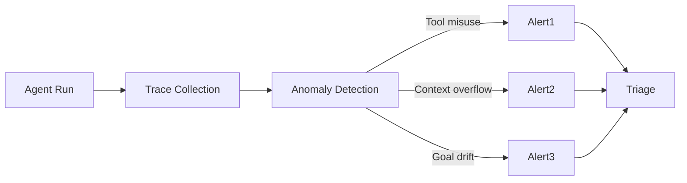

# Error Budget for Agents + Failure Mode Taxonomy

## Part 1: Error Budget for Agents (SRE 차용)

### 기본 SRE 정의

> An error budget is the quantifiable amount of unreliability or downtime that a service can tolerate over a specific period without breaching its Service Level Objectives (SLOs).

전통 SRE 공식:
```
Error Budget = (1 - SLO%) × Time Period
예: SLO 99.9% 월간 → 43.8분 downtime 허용
```

### Agent에 적용 - Reliability Budget

기존 metric (latency, availability) 외에 agent specific:

| Metric | 정의 | 예시 SLO |
|---|---|---|
| Task Success Rate | task 완료율 | 95% |
| Tool Call Accuracy | 올바른 도구 호출 비율 | 98% |
| Verification Pass Rate | verifier 통과율 | 90% |
| Hallucination Rate | 환각 비율 | < 2% |
| Goal Drift Rate | 목표 이탈 비율 | < 5% |

### 2025 Drift Threshold 도전

> A critical challenge emerging in 2025 is reliability drift in AI agents. In regulated production environments, TIE baselines can drift 30–40% after a framework major version upgrade with no corresponding change in the agent's task logic.

핵심:
- Framework 업그레이드만으로 30-40% drift 가능
- Agent 로직 변경 없는데도 baseline 이동
- "shadow traffic comparison before upgrades" 권장

> Decision Quality Rate declines slowly — too slowly to trigger a threshold alert — until accumulated drift surfaces as a production incident.

문제: **점진적 drift는 threshold 알람 미발동 → 누적된 후 사고로 표면화**.

### Decision Tree 통합 (2025 SRE Playbook)

```
if automated_remediation_safe AND error_budget > threshold AND not human_review_required:
    proceed
else:
    escalate
```

### 권장 패턴

> Treating model deprecation like dependency vulnerabilities and maintaining baselines through shadow traffic comparison before upgrades.

1. **Model deprecation = dependency vulnerability**: 의존성 취약점처럼 관리
2. **Shadow traffic 비교**: 새 모델/프레임워크를 traffic 일부에 흘려서 baseline 비교
3. **Rolling baseline 유지**: 매일/매주 baseline metric 측정

## Part 2: Failure Mode Taxonomy

### 14가지 unique failure mode (Cemri et al., arxiv 2503.13657)

> 14 unique modes, clustered into 3 categories:
> (i) system design issues
> (ii) inter-agent misalignment
> (iii) task verification

### 6가지 Agent-specific failure mode (Latitude / Galileo)

> Six distinct failure modes are unique to agents:
> 1. Tool misuse
> 2. Context loss
> 3. Goal drift
> 4. Retry loops
> 5. Cascading errors in multi-agent systems
> 6. Silent quality degradation

#### 1. Tool Misuse
> Tool misuse is the most common agent-specific failure mode in production — and the most insidious: a single malformed argument at step 2 silently corrupts every subsequent step that depends on that output.

특징:
- 잘못된 인자, 잘못된 도구 선택, 결과 잘못 해석
- **silent**: 즉시 에러 안 남
- **cascading**: 후속 단계 모두 오염
- **most common in production**

Mitigation:
- 도구 input/output schema 엄격
- 결과 sanity check
- 각 step 검증

#### 2. Context Loss / Overflow

> This fault can lead to various errors (e.g., context overflow, truncated prompts, inaccurate token usage metrics, or inconsistent multi-turn behaviour).

원인:
- Context window 한계
- 압축 과정에서 핵심 정보 누락
- Tool result가 너무 큼

Mitigation:
- Compaction / summarization
- External memory (vector DB)
- Context budget 모니터링

#### 3. Goal Drift

> Goal drift is an emergent failure: no individual step fails, but the cumulative effect of small reasoning deviations produces an output that doesn't serve the original intent.

특징: **점진적**, **emergent** — 단일 step은 실패 아님

Mitigation:
- 매 step마다 원본 goal과 비교
- Verifier가 final result를 goal 대비 평가
- Long-horizon에서는 주기적 re-grounding

#### 4. Retry Loops / Infinite Loops

> An agent may, for example, generate a seemingly reasonable sequence of actions, yet misinterpret tool outputs, become trapped in infinite reasoning cycles, or maintain incorrect or outdated assumptions about the external file-system state.

Mitigation:
- Max iteration 강제
- Circuit breaker (같은 에러 N번 → abort)
- Cost budget cap

#### 5. Cascading Errors (Multi-agent)

한 sub-agent의 잘못된 출력이 parent + 다른 sub-agent로 전파.

Mitigation:
- Inter-agent message validation
- 신뢰 boundary 정의
- Sub-agent output을 ground truth로 신뢰 금지

#### 6. Silent Quality Degradation

> An AI agent fails silently: it completes the workflow, returns a response, and produces output that looks correct until downstream consequences make the error.

이게 가장 위험: 외관상 성공 → downstream에서 발견

Mitigation:
- 결과 quality scoring
- Sample verification (인간 review)
- 다운스트림 metric 모니터링

### Hallucination Specific Taxonomy (arxiv 2509.18970)

LLM-based agents 환각 분류:
- **Factual Hallucination**: 사실 오류
- **Tool Hallucination**: 존재하지 않는 도구/파라미터 호출
- **Memory Hallucination**: 이전 대화/결과를 잘못 회상
- **Plan Hallucination**: 실행 불가능한 계획 생성

## Part 3: Failure Detection Framework (Latitude)

### 관측성 기반 진단



### Detection 시그널

| Failure Mode | 시그널 |
|---|---|
| Tool misuse | tool error rate, schema validation fail, retry pattern |
| Context overflow | token usage, compaction frequency |
| Goal drift | goal-output similarity declining |
| Retry loop | identical action N+1 times |
| Cascading | error rate downstream of one sub-agent |
| Silent quality | result quality score variance |

## 통합 Taxonomy 표

| 카테고리 | Failure Mode | Detection 난이도 | 영향 범위 |
|---|---|---|---|
| System Design | Tool misuse | 중 (silent하지만 trace로 검출) | High (cascading) |
| System Design | Context overflow | 쉬움 (token metric) | High |
| Inter-agent | Cascading errors | 어려움 | Critical |
| Task verification | Goal drift | 어려움 | Medium-High |
| Task verification | Silent quality degrade | 매우 어려움 | High (downstream) |
| Resource | Retry loop | 쉬움 (iteration count) | High (cost) |
| Knowledge | Hallucination (factual) | 어려움 (검증 필요) | Medium |
| Knowledge | Tool hallucination | 쉬움 (schema check) | Low |
| Knowledge | Memory hallucination | 어려움 | Medium |

## SLO 예시 (Production Agent)

```yaml
slos:
  task_success_rate:
    target: 0.95
    window: 30d
    error_budget: 0.05
  tool_call_accuracy:
    target: 0.98
    window: 7d
  hallucination_rate:
    target: 0.02
    window: 7d
  context_overflow_rate:
    target: 0.01
    window: 24h
  retry_loop_rate:
    target: 0.005
    window: 24h
```

## 핵심 인사이트

1. **Error budget을 agent에 차용**: SLO + remaining budget = 자동 vs 인간 결정 게이트
2. **Drift threshold가 새 challenge**: 30-40% baseline 이동도 점진적이라 알람 미발동
3. **Shadow traffic comparison**: model/framework 업그레이드 전 필수
4. **Tool misuse가 production에서 가장 흔함**: silent + cascading
5. **Goal drift는 emergent**: 개별 step은 OK, 누적이 문제
6. **Silent quality degradation이 가장 위험**: 외관상 성공
7. **Multi-agent failure는 곱셈**: cascading이 폭발적
8. **Detection은 trace 기반 관측성에 의존**

## 참고

- Why Multi-Agent LLM Systems Fail (Cemri et al.): https://arxiv.org/pdf/2503.13657
- LLM Agents Hallucination Survey: https://arxiv.org/html/2509.18970v1
- Agentic AI Faults Taxonomy: https://arxiv.org/html/2603.06847v1
- Galileo 7 Failure Modes: https://galileo.ai/blog/agent-failure-modes-guide
- Latitude Failure Detection: https://latitude.so/blog/ai-agent-failure-detection-guide
- AgentWiki Common Failure Modes: https://agentwiki.org/common_agent_failure_modes
- SRE Playbook 2025: https://www.gsdcouncil.org/blogs/sre-playbook-engineering-resilience-in-ai-and-automation
- Datadog State of AI 2026 (Agent Sprawl): https://dev.to/ajaydevineni/agent-sprawl-is-your-next-production-incident-an-sre-response-to-datadogs-state-of-ai-engineering-3k83
- Redis Multi-Agent Failure: https://redis.io/blog/why-multi-agent-llm-systems-fail/
