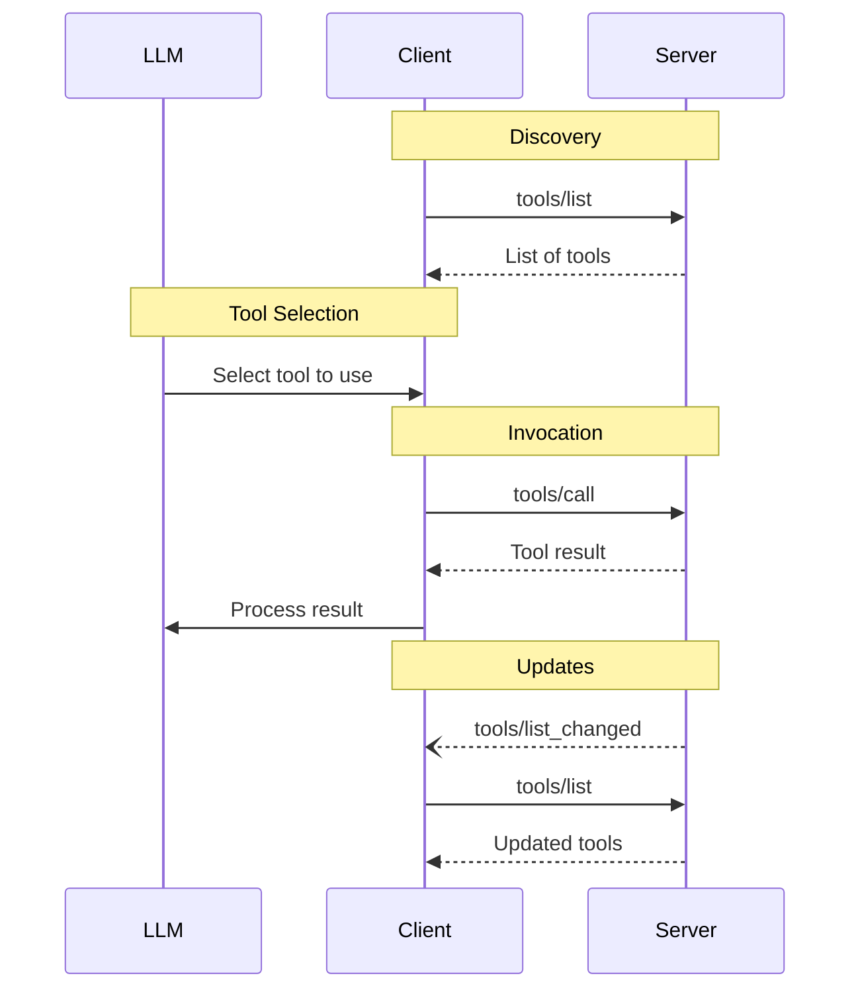

# MCP Tools 스펙 - 2025-06-18

## 모델 제어 모델

> Tools in MCP are designed to be **model-controlled**, meaning that the language model can discover and invoke tools automatically based on its contextual understanding and the user's prompts.

> For trust & safety and security, there SHOULD always be a human in the loop with the ability to deny tool invocations.
> Applications SHOULD:
> - Provide UI that makes clear which tools are being exposed to the AI model
> - Insert clear visual indicators when tools are invoked
> - Present confirmation prompts to the user for operations, to ensure a human is in the loop

핵심: 도구는 모델이 자동 호출하지만, 사용자가 거부할 수 있는 UI가 권장됨.

## Capability 선언

```json
{
  "capabilities": {
    "tools": {
      "listChanged": true
    }
  }
}
```

`listChanged`: 도구 목록 변경 알림 발생 가능 여부.

## Protocol 메시지

### tools/list (Pagination 지원)

요청:
```json
{
  "jsonrpc": "2.0",
  "id": 1,
  "method": "tools/list",
  "params": { "cursor": "optional-cursor-value" }
}
```

응답:
```json
{
  "jsonrpc": "2.0",
  "id": 1,
  "result": {
    "tools": [
      {
        "name": "get_weather",
        "title": "Weather Information Provider",
        "description": "Get current weather information for a location",
        "inputSchema": {
          "type": "object",
          "properties": {
            "location": {
              "type": "string",
              "description": "City name or zip code"
            }
          },
          "required": ["location"]
        }
      }
    ],
    "nextCursor": "next-page-cursor"
  }
}
```

### tools/call

요청:
```json
{
  "jsonrpc": "2.0",
  "id": 2,
  "method": "tools/call",
  "params": {
    "name": "get_weather",
    "arguments": { "location": "New York" }
  }
}
```

응답:
```json
{
  "jsonrpc": "2.0",
  "id": 2,
  "result": {
    "content": [
      {
        "type": "text",
        "text": "Current weather in New York:\nTemperature: 72°F\nConditions: Partly cloudy"
      }
    ],
    "isError": false
  }
}
```

### List Changed Notification

```json
{
  "jsonrpc": "2.0",
  "method": "notifications/tools/list_changed"
}
```

## Tool 정의 (Data Type)

| 필드 | 설명 |
|---|---|
| `name` | 고유 식별자 |
| `title` | (옵션) 사람이 읽는 표시 이름 |
| `description` | 기능 설명 |
| `inputSchema` | JSON Schema (입력 파라미터) |
| `outputSchema` | (옵션) JSON Schema (출력 구조) |
| `annotations` | (옵션) 행동 메타데이터 |

> For trust & safety and security, clients MUST consider tool annotations to be untrusted unless they come from trusted servers.

## Tool Result 포맷

### Unstructured Content (`content` 배열)

#### Text
```json
{ "type": "text", "text": "Tool result text" }
```

#### Image
```json
{
  "type": "image",
  "data": "base64-encoded-data",
  "mimeType": "image/png",
  "annotations": {
    "audience": ["user"],
    "priority": 0.9
  }
}
```

#### Audio
```json
{
  "type": "audio",
  "data": "base64-encoded-audio-data",
  "mimeType": "audio/wav"
}
```

#### Resource Link
```json
{
  "type": "resource_link",
  "uri": "file:///project/src/main.rs",
  "name": "main.rs",
  "description": "Primary application entry point",
  "mimeType": "text/x-rust",
  "annotations": {
    "audience": ["assistant"],
    "priority": 0.9
  }
}
```

#### Embedded Resource
```json
{
  "type": "resource",
  "resource": {
    "uri": "file:///project/src/main.rs",
    "mimeType": "text/x-rust",
    "text": "fn main() {\n    println!(\"Hello world!\");\n}",
    "annotations": {
      "audience": ["user", "assistant"],
      "priority": 0.7,
      "lastModified": "2025-05-03T14:30:00Z"
    }
  }
}
```

### Structured Content

`structuredContent` 필드로 JSON 객체 반환. 호환을 위해 `content`에도 직렬화된 JSON을 함께 넣어야 함.

```json
{
  "jsonrpc": "2.0",
  "id": 5,
  "result": {
    "content": [
      {
        "type": "text",
        "text": "{\"temperature\": 22.5, \"conditions\": \"Partly cloudy\", \"humidity\": 65}"
      }
    ],
    "structuredContent": {
      "temperature": 22.5,
      "conditions": "Partly cloudy",
      "humidity": 65
    }
  }
}
```

### Output Schema 검증

> If an output schema is provided:
> - Servers MUST provide structured results that conform to this schema.
> - Clients SHOULD validate structured results against this schema.

목적:
- 엄격한 schema 검증
- 프로그래밍 언어 통합 시 타입 정보
- 클라이언트/LLM이 결과 파싱 가이드
- 문서화 + 개발 경험

## 에러 처리 - 두 채널

### 1. Protocol Errors (JSON-RPC 표준)

알려지지 않은 도구, 잘못된 인자, 서버 오류 등:

```json
{
  "jsonrpc": "2.0",
  "id": 3,
  "error": {
    "code": -32602,
    "message": "Unknown tool: invalid_tool_name"
  }
}
```

### 2. Tool Execution Errors (`isError: true`)

API 실패, 잘못된 입력 데이터, 비즈니스 로직 오류:

```json
{
  "jsonrpc": "2.0",
  "id": 4,
  "result": {
    "content": [
      { "type": "text", "text": "Failed to fetch weather data: API rate limit exceeded" }
    ],
    "isError": true
  }
}
```

차이:
- Protocol error → 시스템 레벨, JSON-RPC error 객체
- Tool execution error → 비즈니스 레벨, result 안에 `isError: true`

## Security 의무 사항

### Server MUST

> 1. Servers MUST:
> - Validate all tool inputs
> - Implement proper access controls
> - Rate limit tool invocations
> - Sanitize tool outputs

### Client SHOULD

> 2. Clients SHOULD:
> - Prompt for user confirmation on sensitive operations
> - Show tool inputs to the user before calling the server, to avoid malicious or accidental data exfiltration
> - Validate tool results before passing to LLM
> - Implement timeouts for tool calls
> - Log tool usage for audit purposes

## Message Flow



## 핵심 인사이트

1. **모델이 도구를 선택**: 도구 선택은 LLM이 contextual understanding으로
2. **이중 에러 채널**: protocol vs. execution
3. **Annotation은 untrusted**: 신뢰 못 하는 서버라면 annotation도 무시
4. **Output schema = 엄격 검증**: client가 schema validation 수행 권장
5. **HITL이 SHOULD**: spec은 "human in the loop with ability to deny" 권장

## 참고

- 본 페이지: https://modelcontextprotocol.io/specification/2025-06-18/server/tools
- Resources spec: https://modelcontextprotocol.io/specification/2025-06-18/server/resources
- Annotations: https://modelcontextprotocol.io/specification/2025-06-18/server/resources#annotations
