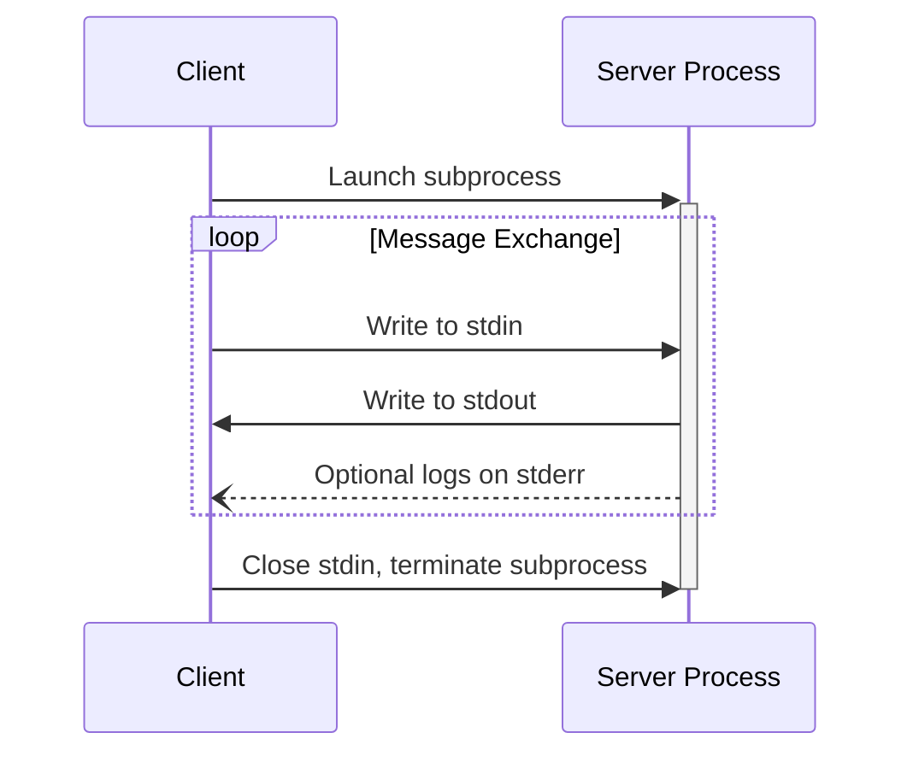
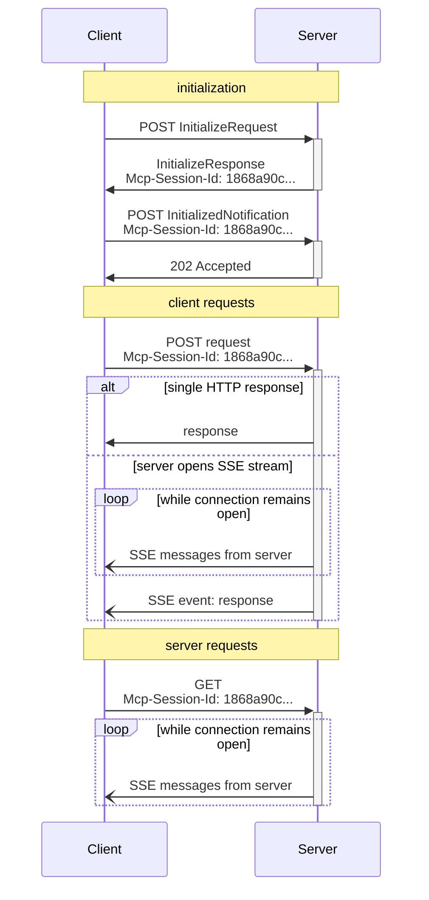

# MCP Transports - 2025-06-18 spec

## 두 가지 표준 transport

> The protocol currently defines two standard transport mechanisms for client-server communication:
> 1. stdio, communication over standard in and standard out
> 2. Streamable HTTP
>
> Clients SHOULD support stdio whenever possible.

핵심: HTTP+SSE 분리형 transport는 deprecated. **2025-03-26부터 Streamable HTTP가 새 표준**이며 2024-11-05의 HTTP+SSE는 backwards-compat용으로만 유지.

## stdio Transport



규칙:
- 클라이언트가 서버를 **subprocess로 실행**
- stdin/stdout JSON-RPC 메시지 교환, **newline 구분, embed 금지**
- stderr는 로깅용 (선택)
- stdout에 MCP 메시지가 아닌 것 출력 금지
- stdin에 MCP 메시지가 아닌 것 입력 금지

장점: 로컬 프로세스, 인증 불필요, 권한은 OS subprocess 권한 그대로.

## Streamable HTTP Transport (replaces HTTP+SSE)

> The server MUST provide a single HTTP endpoint path (hereafter referred to as the **MCP endpoint**) that supports both POST and GET methods. For example, this could be a URL like `https://example.com/mcp`.

핵심: **단일 엔드포인트 (POST + GET 모두 지원)** 로 단순화. 이전 spec(2024-11-05)은 POST 엔드포인트와 SSE 엔드포인트가 분리돼 있었음.

### Security Warning (스펙이 명시)

> 1. Servers MUST validate the Origin header on all incoming connections to prevent DNS rebinding attacks
> 2. When running locally, servers SHOULD bind only to localhost (127.0.0.1) rather than all network interfaces (0.0.0.0)
> 3. Servers SHOULD implement proper authentication for all connections

### POST 흐름 (클라이언트 → 서버)

1. 모든 클라이언트 → 서버 메시지는 **새 HTTP POST 요청**
2. `Accept: application/json, text/event-stream` 헤더 필수
3. 본문은 단일 JSON-RPC request/notification/response
4. 입력이 *response/notification* 이면 서버는 `202 Accepted` (no body) 응답
5. 입력이 *request* 이면 서버는 둘 중 선택:
   - `Content-Type: application/json` → 단일 JSON 응답
   - `Content-Type: text/event-stream` → SSE 스트림 시작

### SSE 스트림 규칙

서버가 SSE를 시작한 경우:
- 스트림 안에 결국 JSON-RPC *response*가 와야 함
- response 전에 서버 → 클라이언트 *request/notification* 전송 가능 (관련 메시지여야 함)
- response 전송 전에 스트림 닫지 말 것 (단, 세션 만료 시 예외)
- response 전송 후 스트림 종료 권장
- disconnection ≠ cancellation (취소는 명시적 `CancelledNotification`)
- `Last-Event-ID` 헤더로 재연결 시 redeliver 가능

### GET 흐름 (서버 → 클라이언트 푸시 채널)

> The client MAY issue an HTTP GET to the MCP endpoint. This can be used to open an SSE stream, allowing the server to communicate to the client, without the client first sending data via HTTP POST.

서버 측 푸시 알림 채널로 사용. 응답 코드:
- `200 OK + Content-Type: text/event-stream` → SSE 스트림 시작
- `405 Method Not Allowed` → 서버가 SSE 미지원

### Session Management

```
Mcp-Session-Id: 1868a90c... (서버가 InitializeResult 응답 헤더에서 부여)
```

규칙:
- 서버 **MAY** 세션 ID 부여 (보안 강한 UUID/JWT/해시), visible ASCII (0x21-0x7E)
- 부여되면 클라이언트는 모든 후속 요청에 `Mcp-Session-Id` 헤더 포함 필수
- 서버가 세션 헤더 없는 요청을 받으면 `400 Bad Request`
- 서버가 세션 종료 후 `404 Not Found` 반환 → 클라이언트는 새 `InitializeRequest`
- 클라이언트는 `HTTP DELETE + Mcp-Session-Id` 로 명시적 세션 종료 가능

### Sequence (Initialize → Operation)



### Protocol Version Header

> If using HTTP, the client MUST include the `MCP-Protocol-Version: <protocol-version>` HTTP header on all subsequent requests to the MCP server.

예: `MCP-Protocol-Version: 2025-06-18`

> If the server receives a request with an invalid or unsupported MCP-Protocol-Version, it MUST respond with `400 Bad Request`.

backwards-compat 기본값: 헤더 없으면 서버는 `2025-03-26` 가정.

### Backwards Compatibility 전략

서버:
- 신/구 엔드포인트 모두 호스팅

클라이언트:
1. POST `InitializeRequest` 시도
2. 성공 → 새 transport
3. 4xx (특히 405/404) → GET 요청 → SSE에서 `endpoint` event 수신 → 구 transport로 폴백

## Custom Transports

> Implementers who choose to support custom transports MUST ensure they preserve the JSON-RPC message format and lifecycle requirements defined by MCP.

WebSocket, gRPC 등 양방향 채널 위에 구현 가능하나, JSON-RPC + lifecycle 의무는 유지.

## 핵심 변경 (2024-11-05 → 2025-06-18)

| 항목 | 2024-11-05 | 2025-06-18 |
|---|---|---|
| HTTP transport | POST + 별도 SSE 엔드포인트 | 단일 MCP 엔드포인트 (Streamable HTTP) |
| 세션 ID | 명시적 표준 없음 | `Mcp-Session-Id` 헤더 표준화 |
| 버전 헤더 | 없음 | `MCP-Protocol-Version` 필수 |
| Origin 검증 | 명시 없음 | DNS rebinding 방지를 위해 MUST |
| Resumability | 없음 | `Last-Event-ID`로 재연결 |

## 참고

- spec: https://modelcontextprotocol.io/specification/2025-06-18/basic/transports
- 이전 transport (2024-11-05): https://modelcontextprotocol.io/specification/2024-11-05/basic/transports
