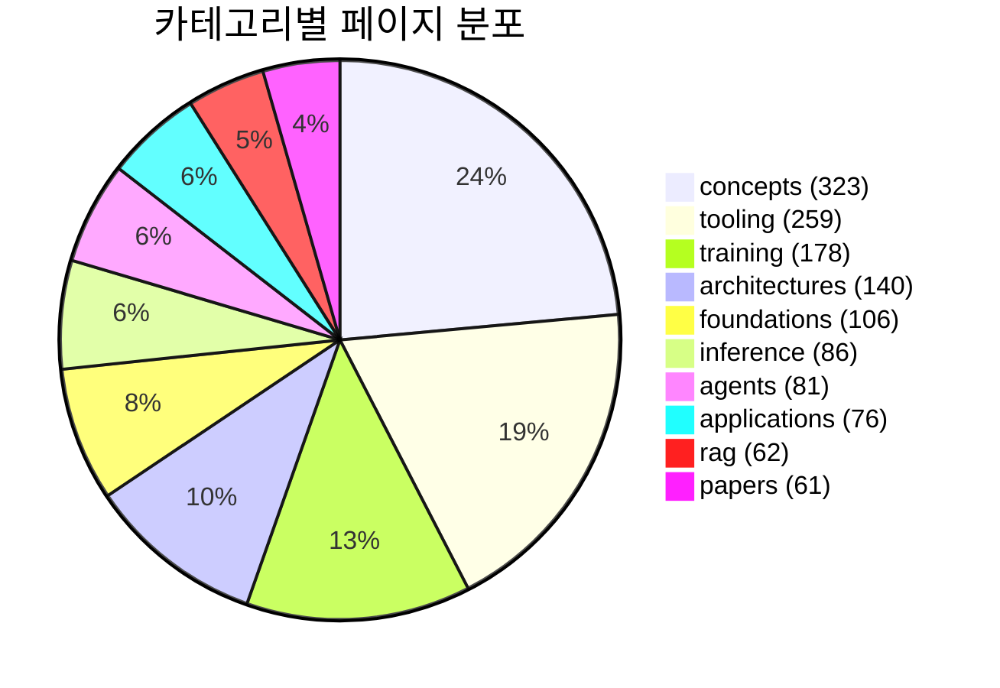
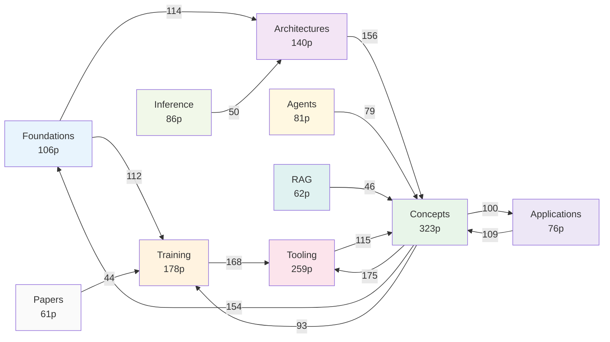

# Wiki Knowledge Graph Report (2026-04-20)

## 기본 통계

| 항목 | 값 |
|------|-----|
| 전체 페이지 (노드) | 1,372 |
| 전체 wikilink (엣지) | 10,724 |
| 평균 outgoing links | 7.8 |
| 평균 incoming links | 5.2 |
| 중앙값 incoming | 2 |
| 최대 incoming | 100 (transformer-architecture) |
| 고아 페이지 (incoming=0) | 350 |
| 고립 노드 (in+out=0) | 0 |

## 카테고리별 분포

## 타입별 분포

| 타입 | 페이지 수 | 비율 |
|------|-----------|------|
| concept | 936 | 68.2% |
| entity | 257 | 18.7% |
| paper | 81 | 5.9% |
| summary | 68 | 5.0% |
| project-internal | 24 | 1.7% |
| case-study | 6 | 0.4% |

## 카테고리 간 지식 흐름

Concepts가 위키의 중심 허브로, 거의 모든 카테고리와 양방향 연결. Training-Tooling 축이 두 번째 주요 경로.

## 허브 페이지 (Top 20)

| 순위 | 페이지 | incoming |
|------|--------|----------|
| 1 | transformer-architecture | 100 |
| 2 | mixed-precision-training | 79 |
| 3 | pretraining-data-curation | 67 |
| 4 | rag-pipeline | 63 |
| 5 | data-parallelism-fsdp | 63 |
| 6 | evaluation-harness | 60 |
| 7 | learning-rate-scheduling | 50 |
| 8 | distributed-training-overview | 45 |
| 9 | lora-qlora-finetuning | 44 |
| 10 | context-engineering | 44 |
| 11 | agentic-engineering-guide | 41 |
| 12 | model-serving | 40 |
| 13 | supervised-fine-tuning | 39 |
| 14 | orchestrator-worker-pattern | 39 |
| 15 | how-coding-agents-work | 39 |
| 16 | diffusion-models | 39 |
| 17 | vision-transformer-vit | 38 |
| 18 | rlhf-pipeline | 38 |
| 19 | tensor-pipeline-parallelism | 37 |
| 20 | subagents | 37 |

## 고아 페이지 (incoming=0, 상위 15)

| 페이지 | outgoing | 비고 |
|--------|----------|------|
| training-learning-guides | 22 | 가이드 허브 |
| llm-training-cost-guide | 19 | 비용 분석 |
| llama-2-3 | 17 | 모델 엔티티 |
| weaviate | 15 | 벡터 DB |
| ralph-pattern | 14 | OMC 패턴 |
| pinecone | 14 | 벡터 DB |
| orpo | 14 | 정렬 알고리즘 |
| transformer-attention-mechanisms | 13 | 어텐션 심화 |
| speaker-diarization | 13 | 오디오 |
| compound-ai-systems | 13 | 복합 AI |
| safety-training-refusal | 13 | 안전 학습 |
| ml-learning-path | 13 | 학습 경로 |
| kto | 13 | 정렬 알고리즘 |
| vercel-ai-sdk-extract-json-middleware | 12 | SDK 상세 |
| trl-library | 12 | HF 도구 |

## 권장 조치

1. **고아 350개 중 핵심 개념 우선 연결**: compound-ai-systems, orpo, kto, weaviate 등은 관련 페이지에서 반드시 참조되어야 함
2. **허브 과밀 점검**: transformer-architecture(100 incoming)는 너무 많은 페이지가 참조 -> 하위 개념 분할 검토
3. **카테고리 간 브릿지 강화**: papers -> 나머지 카테고리 연결이 약함 (논문과 개념의 교차참조 부족)
