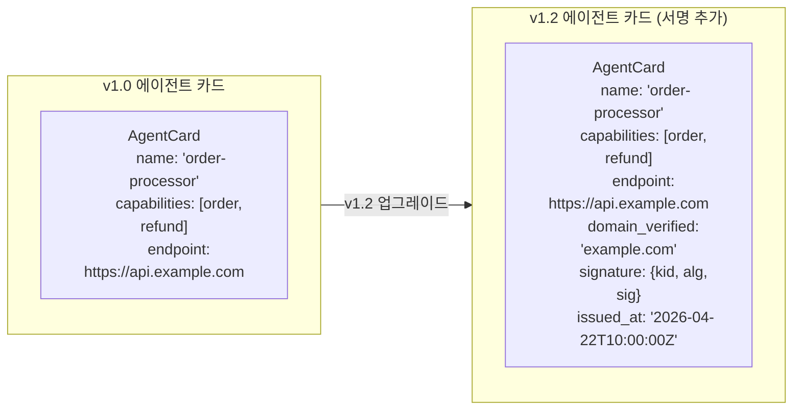
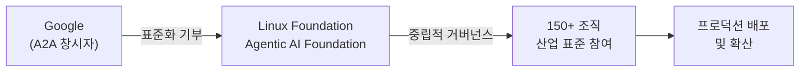
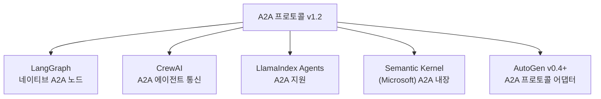
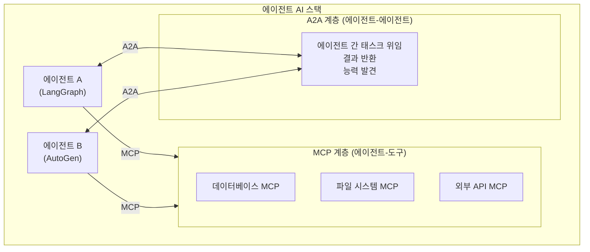
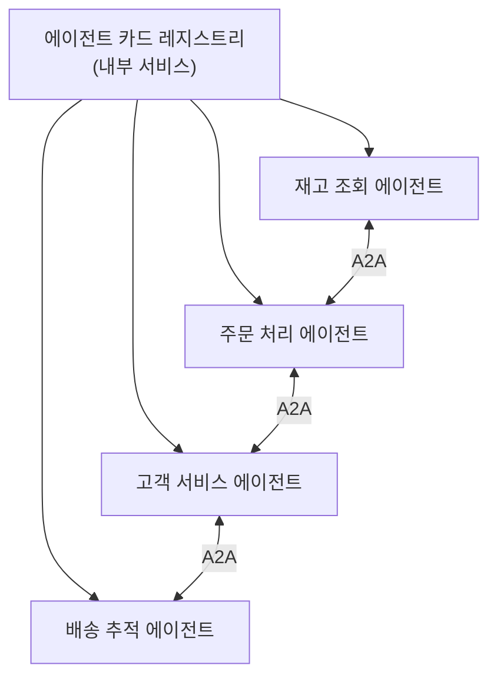

# A2A 프로토콜 v1.2 업그레이드 및 생산 배포 현황

Google이 2026년 4월 Cloud Next에서 발표한 A2A(Agent-to-Agent) 프로토콜 v1.2 업그레이드 내용을 정리한 문서다. 암호화 서명 에이전트 카드(도메인 검증), Linux Foundation Agentic AI Foundation 거버넌스 이관, 150개 이상 조직 프로덕션 배포가 주요 내용이다. [[mcp|MCP(Model Context Protocol)]]와 A2A의 상호 보완 관계가 명확해졌다.

기존 A2A 프로토콜의 개념적 배경은 [[a2a-protocol|A2A 프로토콜]] 페이지를 참조한다.

## 소스 정보

- 출처: https://cloud.google.com/blog/products/ai-machine-learning/agent2agent-protocol-is-getting-an-upgrade
- 출처2: https://developers.googleblog.com/en/a2a-a-new-era-of-agent-interoperability/
- 발표 행사: Google Cloud Next '26 (2026년 4월 22-23일)

## v1.2 주요 변경사항

### 1. 암호화 서명 에이전트 카드 (Signed Agent Cards)

A2A의 핵심 메타데이터 단위인 에이전트 카드(Agent Card)에 암호화 서명이 추가됐다.



**도메인 검증(Domain Verification)**이 핵심이다. 에이전트 카드가 선언하는 엔드포인트 도메인이 카드를 서명한 도메인과 일치하는지 검증한다. 이로써 "자신이 주문 처리 에이전트라고 주장하는" 사기 에이전트를 식별할 수 있다.

암호화 서명 체계:
- **알고리즘**: ECDSA P-256 또는 Ed25519 지원 ([교차검증 필요])
- **키 관리**: 에이전트 운영자가 PKI 인프라를 통해 키 관리
- **검증**: 수신 에이전트가 발신 에이전트 카드 서명을 검증 후 신뢰 결정

### 2. Linux Foundation Agentic AI Foundation 이관

A2A 프로토콜의 거버넌스가 Google에서 **Linux Foundation Agentic AI Foundation**으로 이관됐다. 이는 A2A가 특정 기업의 프로토콜이 아닌 중립적 산업 표준으로 자리매김하는 전략적 선언이다.



Linux Foundation 이관의 의미:
- **중립성**: Google, Microsoft, AWS 등 경쟁사들이 공동 참여 가능
- **영속성**: 특정 기업의 전략적 결정과 무관하게 프로토콜 지속
- **표준화**: W3C, OpenTelemetry 등 기존 Linux Foundation 프로젝트와 유사한 성숙 경로

### 3. 150개 이상 조직 프로덕션 배포

A2A v1.0 출시(2025년 초) 이후 1년 여 만에 150+ 조직이 프로덕션 환경에 배포했다. 공개된 주요 배포 사례:

| 조직 유형 | 활용 사례 |
|---------|---------|
| 금융 서비스 | 에이전트 간 계좌 조회/처리 워크플로 |
| 고객 서비스 | 전문 에이전트 간 문의 라우팅 |
| 소프트웨어 개발 | 코딩/리뷰/테스트 에이전트 협업 |
| 헬스케어 | 의료 기록 조회-분석 에이전트 체인 |

## 주요 프레임워크 네이티브 지원

v1.2와 함께 다음 에이전트 프레임워크들에 네이티브 A2A 지원이 내장됐다.



이전에는 각 프레임워크가 자체 에이전트 통신 방식을 사용했으나, v1.2부터 표준 A2A 인터페이스를 통해 서로 다른 프레임워크의 에이전트가 통신할 수 있다.

**LangGraph 예시** (개념적):

```python
# LangGraph + A2A 통신 (개념적 예시)
from langgraph.agents import A2AAgent  # [교차검증 필요] - 실제 API 확인 필요

# A2A 에이전트 카드 등록
my_agent = A2AAgent(
    name="data-analyst",
    capabilities=["analyze_data", "generate_report"],
    endpoint="https://my-company.com/agents/data-analyst"
)

# 다른 프레임워크 에이전트와 통신
result = await my_agent.delegate_to(
    agent_card_url="https://other-company.com/agents/visualizer/.well-known/agent.json",
    task="데이터를 차트로 시각화해줘",
    artifacts=[data_artifact]
)
```

## MCP와 A2A의 상호 보완 관계 명확화

v1.2와 함께 [[mcp|MCP(Model Context Protocol)]]와 A2A의 역할 분담이 공식적으로 명확해졌다.



| 프로토콜 | 담당 | 주체 |
|---------|------|------|
| [[mcp|MCP]] | 에이전트 ↔ 도구 (DB, API, 파일 등) | Anthropic (표준화) |
| A2A | 에이전트 ↔ 에이전트 (작업 위임, 협업) | Google → Linux Foundation |

이 분리로 인해 복잡한 멀티에이전트 시스템을 구성할 때:
- MCP로 각 에이전트의 도구 접근 구성
- A2A로 에이전트 간 협업 조율

두 계층이 독립적으로 발전하면서도 상호 보완하는 구조가 확립됐다.

## v1.0 → v1.2 마이그레이션

기존 A2A v1.0 구현이 v1.2로 업그레이드할 때의 변경 사항:

### 하위 호환성

v1.2는 v1.0과 하위 호환성을 유지한다. 서명 검증은 선택적(optional)이므로 기존 v1.0 구현은 v1.2 환경에서 서명 없이 동작한다. 다만 서명된 에이전트 카드를 요구하는 엄격 모드(strict mode) 에이전트와는 통신 불가하다. [교차검증 필요]

### 주요 변경 사항 요약

| 항목 | v1.0 | v1.2 |
|------|------|------|
| 에이전트 카드 서명 | 없음 | ECDSA/Ed25519 서명 선택적 |
| 거버넌스 | Google | Linux Foundation |
| 프레임워크 지원 | 라이브러리 형태 | 네이티브 내장 (5개 프레임워크) |
| 도메인 검증 | 없음 | 카드 서명으로 검증 |

## 엔터프라이즈 배포 고려사항

### 에이전트 카드 레지스트리

대규모 엔터프라이즈에서는 조직 내 모든 에이전트의 카드를 중앙 레지스트리에 등록해 관리한다.



`.well-known/agent.json` 규약에 따라 각 에이전트는 자신의 능력을 JSON 파일로 공개하고, 레지스트리가 이를 주기적으로 수집·검증한다.

### 보안 고려사항

1. **서명 키 로테이션**: 에이전트 카드 서명 키를 주기적으로 교체하는 정책 수립
2. **제로 트러스트**: 서명된 카드도 능력(capabilities)을 검증 없이 신뢰하지 않을 것
3. **감사 로그**: A2A 에이전트 간 모든 통신 이력 보존 (규정 준수 목적)
4. **네트워크 격리**: 내부 에이전트는 내부 레지스트리, 외부 에이전트 접근은 게이트웨이 통과

## 향후 로드맵 (예상)

v1.2 이후 A2A의 발전 방향으로 예상되는 항목들:

- **스트리밍 개선**: 장기 실행 에이전트 작업의 실시간 진행 상황 업데이트 표준화
- **멀티모달 아티팩트**: 이미지, 오디오, 비디오 등 멀티모달 결과물 전달 표준화
- **에이전트 능력 협상**: 요청 전 에이전트 간 능력/버전 협상 메커니즘
- **분산 레지스트리**: DNS 기반 에이전트 발견 메커니즘

[위 항목들은 로드맵에 대한 예상이며 공식 발표 내용이 아님. 교차검증 필요]

## 관련 문서

- [[a2a-protocol]] - A2A 프로토콜 개념적 배경 및 아키텍처
- [[mcp]] - A2A와 상호 보완하는 Model Context Protocol
- [[multi-agent-orchestration]] - A2A를 활용한 멀티에이전트 시스템 설계
- [[magentic-ui]] - A2A 환경에서 동작하는 Microsoft 웹 에이전트
- [[agent-capability-discovery]] - 에이전트 능력 발견 패턴
