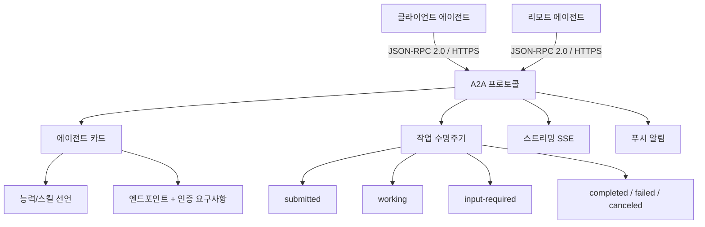
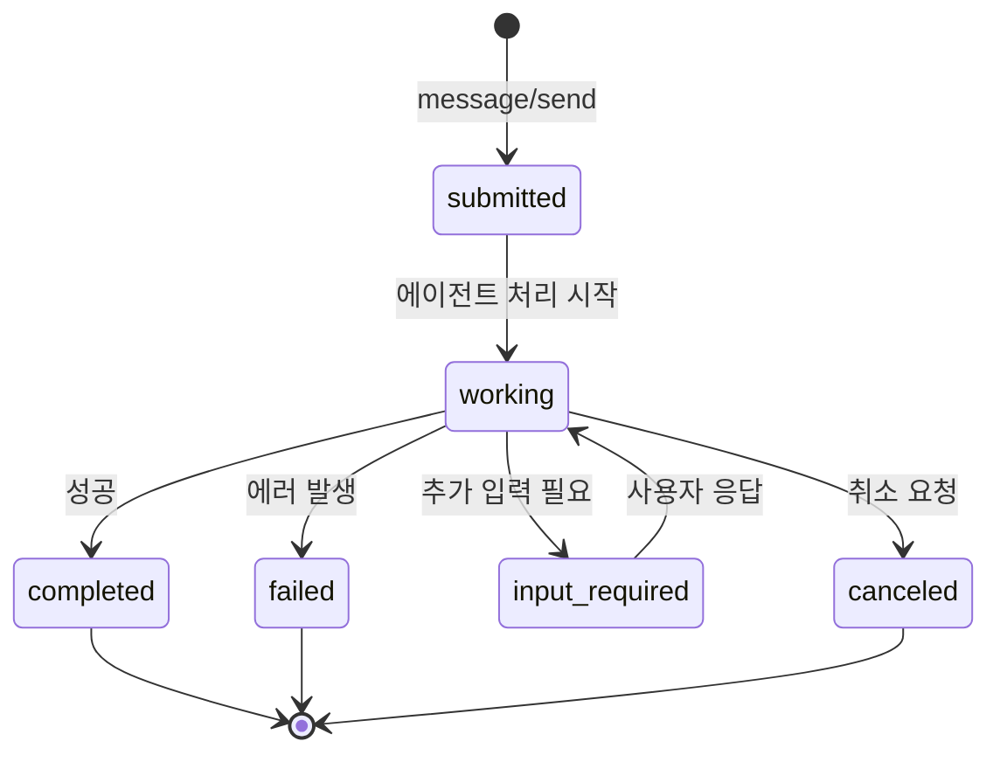

## 개요

A2A(Agent-to-Agent) 프로토콜은 서로 다른 프레임워크와 벤더로 구축된 AI 에이전트들이 원활하게 통신하고 협업할 수 있도록 하는 개방형 표준이다. Google이 시작하여 Linux Foundation에 기부했으며, 2026년 현재 150+ 조직이 지원하고 있다. JSON-RPC 2.0 over HTTPS를 기반으로 하며, Google, Microsoft, AWS 등 주요 클라우드 플랫폼에 통합되었다. [[model-context-protocol-mcp]]가 에이전트-도구 상호작용을 담당한다면, A2A는 에이전트-에이전트 상호작용을 담당하는 상호 보완적 프로토콜이다.

## 핵심 특징

- **에이전트 상호운용성**: 이기종 프레임워크(LangGraph, [[crewai]], Semantic Kernel 등)로 구축된 에이전트들을 하나의 복합 시스템으로 연결
- **작업 위임**: 에이전트가 하위 작업을 다른 에이전트에 위임하고 조율
- **보안 통신**: 내부 메모리, 도구, 독점 로직을 노출하지 않고 에이전트 간 상호작용
- **스트리밍 및 비동기**: SSE(Server-Sent Events) 기반 스트리밍, 비동기 작업, 푸시 알림 지원
- **엔터프라이즈 지원**: 프로덕션 배포를 위한 엔터프라이즈급 인증/인가, RBAC, 감사 로그

## 기술 상세

### 프로토콜 아키텍처

A2A는 3계층 구조로 설계되어 있다. Layer 1은 핵심 데이터 구조(Agent Card, Task, Message, Part), Layer 2는 추상 연산(에이전트 발견, 작업 관리), Layer 3는 프로토콜 바인딩(JSON-RPC, gRPC, HTTP/REST)을 구체적으로 매핑한다.

### JSON-RPC 메서드

A2A 서버가 반드시 지원해야 하는 핵심 RPC 메서드는 다음과 같다.

| 메서드 | 설명 | 응답 방식 |
|--------|------|-----------|
| `message/send` | 에이전트에 메시지를 전송하고 완전한 응답 수신 | 동기 |
| `message/stream` | 메시지를 전송하고 SSE로 실시간 스트리밍 응답 수신 | 비동기 스트리밍 |
| `tasks/get` | 이전에 생성된 작업의 상태와 결과 조회 | 동기 |

모든 요청/응답은 JSON-RPC 2.0 포맷이며, HTTP(S) 위에서 동작한다.

### 작업 수명주기 (Task Lifecycle)

Task는 A2A의 기본 작업 단위로, 고유 ID로 식별되며 상태 기반으로 진행된다.

- **submitted**: 작업이 제출된 상태
- **working**: 에이전트가 처리 중
- **input-required**: 에이전트가 사용자에게 추가 정보를 요청
- **completed/failed/canceled**: 최종 상태

A2A 연산은 비동기 실행을 기본으로 설계되어, 요청은 즉시 반환되고 처리는 백그라운드에서 계속된다.

### 에이전트 카드 (Agent Card)

에이전트 카드는 A2A 서버가 **반드시** 공개해야 하는 JSON 메타데이터 문서다. 서버의 정체성, 능력(skills), 서비스 엔드포인트, 인증 요구사항을 기술한다.

주요 필드:
- **identity**: 에이전트 이름, 설명, 버전
- **skills**: 에이전트가 수행할 수 있는 작업 목록 (자연어 설명 포함)
- **endpoint**: A2A 서비스 URL
- **authentication**: 클라이언트가 사용해야 하는 인증 방식 (OAuth, API Key 등)
- **capabilities**: 스트리밍, 푸시 알림 등 지원 기능 플래그

다른 에이전트는 카드를 조회하여 적합한 협업 대상을 발견하고 작업을 위임할 수 있다.

### 메시지와 Part

Message는 클라이언트-에이전트 간 통신 턴으로, `role`("user" 또는 "agent")과 하나 이상의 Part로 구성된다. Part는 텍스트, 파일, 구조화된 데이터 등 다양한 콘텐츠 유형을 담을 수 있어 멀티모달 상호작용을 지원한다.

### MCP와의 관계

| 프로토콜 | 영역 | 통신 대상 | 핵심 추상화 |
|---|---|---|---|
| A2A | 에이전트 간 협업 | 에이전트 <-> 에이전트 | Task, Agent Card |
| [[model-context-protocol-mcp]] | 도구 통합 | 에이전트 <-> 도구/서버 | Tool, Resource |

두 프로토콜은 경쟁 관계가 아니라 상호 보완적이다. MCP로 도구를 연결하고, A2A로 에이전트 간 협업을 구성하는 것이 일반적인 활용 패턴이다. 하나의 에이전트가 MCP 클라이언트이자 A2A 서버로 동시에 동작할 수 있다.

### 공식 SDK

| 언어 | 패키지 |
|---|---|
| Python | 공식 SDK |
| JavaScript | 공식 SDK |
| Java | 공식 SDK |
| C# / .NET | 공식 SDK |
| Go | 공식 SDK |

### 채택 현황

- Google Cloud, AWS Bedrock AgentCore, Microsoft Azure에 네이티브 통합
- LangChain Agent Server에서 A2A 엔드포인트 지원
- 150+ 조직이 지원
- Linux Foundation 산하 프로젝트로 거버넌스 운영
- DeepLearning.AI 무료 강의 제공

## 관련 문서
- [[agent-network-protocol]] -- 에이전트 네트워크 프로토콜 (ANP)

- [[acp-protocol]] - Agent Communication Protocol (IBM/BeeAI 계열)
- [[google-adk|Google ADK]] - A2A를 네이티브 지원하는 Google의 에이전트 개발 킷
- [[model-context-protocol-mcp]] - 에이전트-도구 통신 프로토콜
- [[crewai]] - A2A 네이티브 지원 멀티에이전트 프레임워크
- [[microsoft-agent-framework]] - Microsoft의 에이전트 프레임워크
- [[orchestrator-worker-pattern]] - 멀티에이전트 오케스트레이션 패턴
