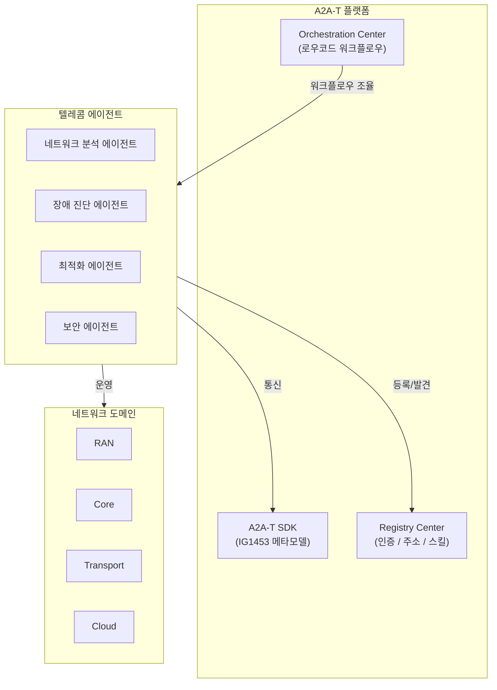

## 개요

A2A-T(Agent-to-Agent for Telecom)는 Huawei가 MWC 2026에서 발표한 텔레콤 산업 특화 에이전트 간 통신 프로토콜이다. 범용 [[a2a-protocol]]을 통신 네트워크 운영의 특수한 요구사항에 맞게 확장하여, 다중 벤더/다중 도메인 환경에서 AI 에이전트가 네트워크 자동화 작업을 협업할 수 있도록 한다. TM Forum 파트너들과 공동 개발했으며, SDK, Registry Center, Orchestration Center 세 가지 핵심 구성요소를 오픈소스로 공개하여 "에이전틱 인터넷(Agentic Internet)" 시대를 가속화하는 것을 목표로 한다.

## A2A vs A2A-T 비교

| 구분 | [[a2a-protocol]] | A2A-T |
|------|------|-------|
| 범위 | 범용 에이전트 간 통신 | 텔레콤 산업 전문화 |
| 주도 | Google -> Linux Foundation | Huawei + TM Forum |
| 메타모델 | Agent Card | IG1453 (텔레콤 특화) |
| 대상 | 모든 산업 | 통신사, 네트워크 장비사 |
| 통합 시간 | - | 수개월 -> 수일 단축 |
| 라이선스 | 오픈 표준 | 오픈소스 |

## 핵심 구성요소

### 1. A2A-T 프로토콜 SDK

표준화된 에이전트 통합을 위한 소프트웨어 개발 키트이다. TM Forum의 IG1453 베타 및 개선된 IG1453A 메타모델을 포함하며, 자동화된 네트워크 운영에서 다중 에이전트 협업을 위한 통합 프레임워크를 제공한다.

### 2. Registry Center (레지스트리 센터)

에이전트의 인증(Authentication), 주소 지정(Addressing), 스킬 관리(Skill Management)를 담당한다. 텔레콤 도메인에 특화된 에이전트 발견과 접근 제어를 제공한다.

### 3. Orchestration Center (오케스트레이션 센터)

로우코드/노코드 시각적 워크플로우와 미리 구축된 솔루션 패키지를 제공한다. 네트워크 운영자가 코딩 없이도 다중 에이전트 워크플로우를 구성할 수 있다.

## 텔레콤 특화 기능

### 다중 도메인 지원

통신 네트워크는 RAN(무선 접속), Core(코어), Transport(전송), Cloud(클라우드) 등 여러 도메인으로 구성된다. A2A-T는 도메인 간 워크플로우를 표준화하여, 하나의 에이전트가 여러 도메인에 걸친 작업을 조율할 수 있다.

### 다중 벤더 호환성

텔레콤 환경은 여러 장비 벤더의 제품이 혼재한다. A2A-T는 벤더 중립적 프로토콜로 설계되어, 벤더 간 상호연결 장벽을 제거한다.

### 네트워크 자동화

| 사용 사례 | 설명 |
|---------|------|
| 장애 진단 | 다중 도메인에 걸친 장애 원인 자동 추적 |
| 용량 최적화 | 트래픽 패턴 분석 기반 자원 재배치 |
| 보안 대응 | 네트워크 위협 자동 탐지 및 격리 |
| 구성 관리 | 네트워크 장비 구성 변경 자동화 |

### 통합 효과

| 측면 | 기존 | A2A-T 도입 후 |
|------|------|-------------|
| 통합 시간 | 수개월 | 수일 |
| 벤더 간 호환 | 개별 인터페이스 | 표준 프로토콜 |
| 워크플로우 구성 | 코딩 필수 | 로우코드/노코드 |
| 에이전트 발견 | 수동 | Registry 자동 |

## TM Forum 연계

A2A-T는 TM Forum의 자율 네트워크(Autonomous Networks) 이니셔티브와 긴밀하게 연계되어 있다. IG1453 메타모델은 TM Forum에서 정의한 텔레콤 에이전트 상호작용 가이드라인으로, A2A-T SDK에 기본 포함된다. 업계 합의(Industry Agreement)에서 실제 배포(Deployment)로의 전환을 목표로 한다.

## 에이전틱 인터넷 (Agentic Internet)

Huawei는 A2A-T를 "에이전틱 인터넷" 비전의 핵심 인프라로 위치시킨다. 에이전틱 인터넷은 AI 에이전트가 통신 네트워크를 자율적으로 운영하고 최적화하는 차세대 인터넷 패러다임이다. A2A-T는 이 비전에서 에이전트 간 통신 표준 역할을 담당한다.

## 도입 시 고려사항

**적합 케이스**:
- 다중 벤더 네트워크를 운영하는 통신사
- 네트워크 자동화 수준을 높이려는 텔레콤 사업자
- TM Forum 자율 네트워크 이니셔티브에 참여하는 조직
- 에이전트 기반 네트워크 운영으로 전환하려는 장비 벤더

**제약사항**:
- 2026년 3월 발표 직후로, 실제 프로덕션 배포 사례는 제한적
- 텔레콤 도메인에 특화되어 범용 에이전트 통신에는 [[a2a-protocol]] 권장
- Huawei 주도로 지정학적 요인이 채택에 영향을 줄 수 있음

## 관련 문서

- [[a2a-protocol]] - A2A 프로토콜 (범용 에이전트 간 통신)
- [[acp-protocol]] - Agent Communication Protocol (IBM/BeeAI 계열)
- [[model-context-protocol-mcp]] - MCP (에이전트-도구 통합)
- [[aws-agent-registry]] - AWS Agent Registry (에이전트 카탈로그)
