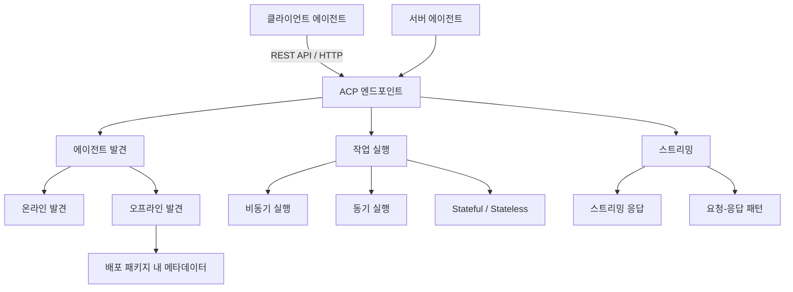

## 개요

ACP(Agent Communication Protocol)는 AI 에이전트, 애플리케이션, 인간 간의 상호운용성을 위한 개방형 프로토콜이다. REST 기반의 단순한 HTTP 엔드포인트를 사용하며, 비동기 우선(async-first) 설계로 장기 실행 작업을 효과적으로 처리한다. MCP의 JSON-RPC보다 단순한 통합을 지향하며, 이기종 에이전트의 발견-협상-실행 전체 수명주기를 지원한다. Linux Foundation 산하 A2A 이니셔티브의 일부로 운영된다.

## 핵심 특징

- **JSON-RPC over HTTP/WebSockets**: 프레임워크마다 다른 JSON 포맷, 인증 방식, 스트리밍 방법을 통일하는 공통 와이어 포맷 제공
- **3가지 통신 모드**: 동기(plain HTTP POST), 비동기(taskId 기반 폴링/구독), 스트리밍(WebSocket/SSE 기반 증분 델타 메시지)
- **멀티모달 지원**: MimeType 기반 콘텐츠 식별로 텍스트, 이미지, 오디오, 비디오, 커스텀 포맷 처리
- **SDK 선택적**: 표준 HTTP 도구만으로 통합 가능. `acp-python-sdk`와 `acp-typescript-sdk`는 비동기 클라이언트로 호출, 스트림 구독, 매니페스트 검증 기능 제공
- **에이전트 발견**: 에이전트가 단축 매니페스트를 브로드캐스트하고 컨트롤 플레인이 자동 인덱싱하여 피어 발견 지원
- **캐퍼빌리티 토큰 보안**: 위조 불가능한 서명 객체로 리소스 타입, 연산, 만료를 인코딩. Kubernetes RBAC와 브리징하여 기존 클러스터 역할에 매핑
- **OTLP 계측**: 모든 호출이 OpenTelemetry 트레이스를 자동 방출. BeeAI는 기본적으로 Arize Phoenix로 트레이스 전송
- **프레임워크 비의존**: BeeAI, LangChain, [[crewai]], 커스텀 구현 등 어떤 프레임워크와도 호환

## 기술 상세

### 아키텍처



### 에이전트 생명주기 상태 머신

ACP는 에이전트의 상태를 명시적으로 관리한다:

```
INITIALIZING -> ACTIVE -> DEGRADED -> RETIRING -> RETIRED
```

각 상태 전환은 매니페스트에 반영되어 피어 에이전트가 대상의 가용성을 실시간으로 파악할 수 있다.

### BeeAI 참조 구현

IBM이 ACP의 참조 구현을 BeeAI 프레임워크 내에서 제공한다:
- CLI: `beeai run`, `beeai list`, `beeai compose`
- 웹 UI: `localhost:8333`에서 접근
- 로컬 LLM(Ollama) 및 호스팅 API 모두 지원
- OTLP 트레이스를 Arize Phoenix로 자동 전송

### ACP vs A2A vs MCP 비교

| 항목 | ACP | [[a2a-protocol]] | [[model-context-protocol-mcp]] |
|---|---|---|---|
| 영역 | 에이전트 간 메시징, 태스크 핸드오프, 생명주기 | 크로스벤더 인터넷 발견 | 모델-도구 와이어링 |
| 전송 | JSON-RPC over HTTP/WebSockets | JSON-RPC 2.0 / HTTPS | JSON-RPC 2.0 / stdio,SSE |
| 설계 철학 | 로컬 우선, 프라이빗 클러스터 최적화 | 공개 인터넷 상호운용성 | 도구/리소스 노출 |
| SDK 필요 | 선택적 (acp-python-sdk, acp-typescript-sdk) | 공식 SDK 제공 | SDK/클라이언트 필요 |
| 보안 모델 | 캐퍼빌리티 토큰 + K8s RBAC 브리징 | Agent Card + OAuth 2.0 | Bearer 토큰 |
| 관찰 가능성 | OTLP 네이티브 계측 | 미명시 | 미명시 |
| 주도 | IBM / BeeAI / AGNTCY (Cisco) | Google / Linux Foundation | Anthropic |
| 후원 기업 | AWS, Microsoft, Salesforce, SAP, Snowflake | Google, Salesforce, SAP 등 | Anthropic, 커뮤니티 |

ACP는 MCP의 메시지 타입을 의도적으로 재사용하며, ACP 에이전트가 Google Agent Card를 내보내 A2A 메시에 참여하는 것도 가능하다. 즉, 세 프로토콜은 경쟁보다는 **레이어드 보완 관계**에 가깝다: MCP(도구 레이어) -> ACP(에이전트 간 메시징 레이어) -> A2A(인터넷 발견 레이어).

### 에이전트 발견 모드

| 모드 | 설명 | 적합한 환경 |
|---|---|---|
| 온라인 | 실시간 에이전트 검색 및 메타데이터 조회 | 클라우드, 연결된 환경 |
| 오프라인 | 배포 패키지에 메타데이터 내장 | 보안, 에어갭, scale-to-zero 환경 |

### 주요 사용 사례

- **에이전트 교체**: 프레임워크에 관계없이 에이전트를 유연하게 교체
- **멀티에이전트 팀**: 여러 에이전트의 조율된 협업
- **크로스 플랫폼 통합**: 서로 다른 플랫폼 간 에이전트 연동
- **기업 간 파트너십**: 조직 경계를 넘는 에이전트 협업

### 메시지 엔벨로프

구조화된 메시지 엔벨로프가 task id, 메타데이터, 선택적 스트림 채널을 포함하여 작업을 청크 단위로 분할하거나 중단 후 재개할 수 있다.

### 운영 모드

Stateful(상태 유지)과 Stateless(무상태) 모드를 모두 지원하여, 장기 실행 대화형 에이전트부터 단순 요청-응답 에이전트까지 유연하게 대응한다.

### 거버넌스

ACP는 Linux Foundation 산하 **AGNTCY 이니셔티브**(Cisco 주도, "에이전트의 인터넷을 위한 스택")의 일부로 운영된다. AWS, Microsoft, Salesforce, SAP, Snowflake가 후원 기업으로 참여하고 있다.

## 관련 문서

- [[a2a-protocol]] - Google 주도 에이전트 간 프로토콜
- [[model-context-protocol-mcp]] - Anthropic의 도구 통합 프로토콜
- [[crewai]] - ACP 호환 멀티에이전트 프레임워크
- [[orchestrator-worker-pattern]] - 오케스트레이션 패턴
