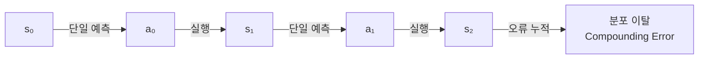
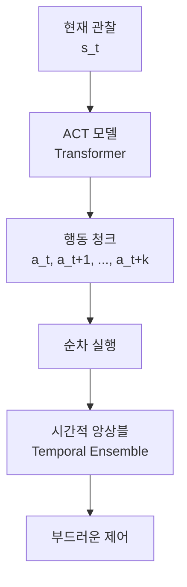
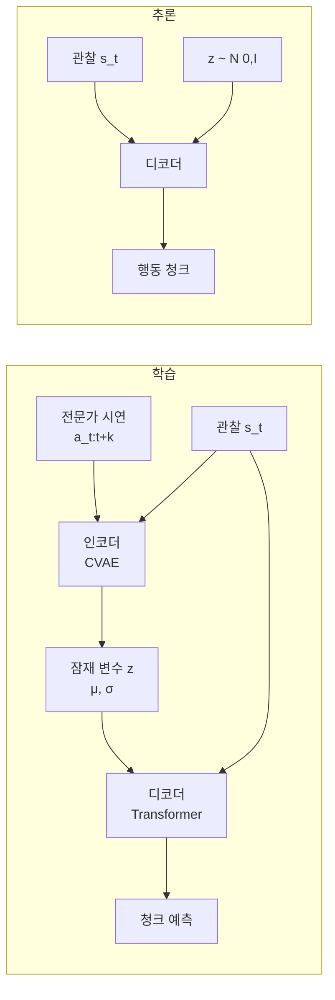
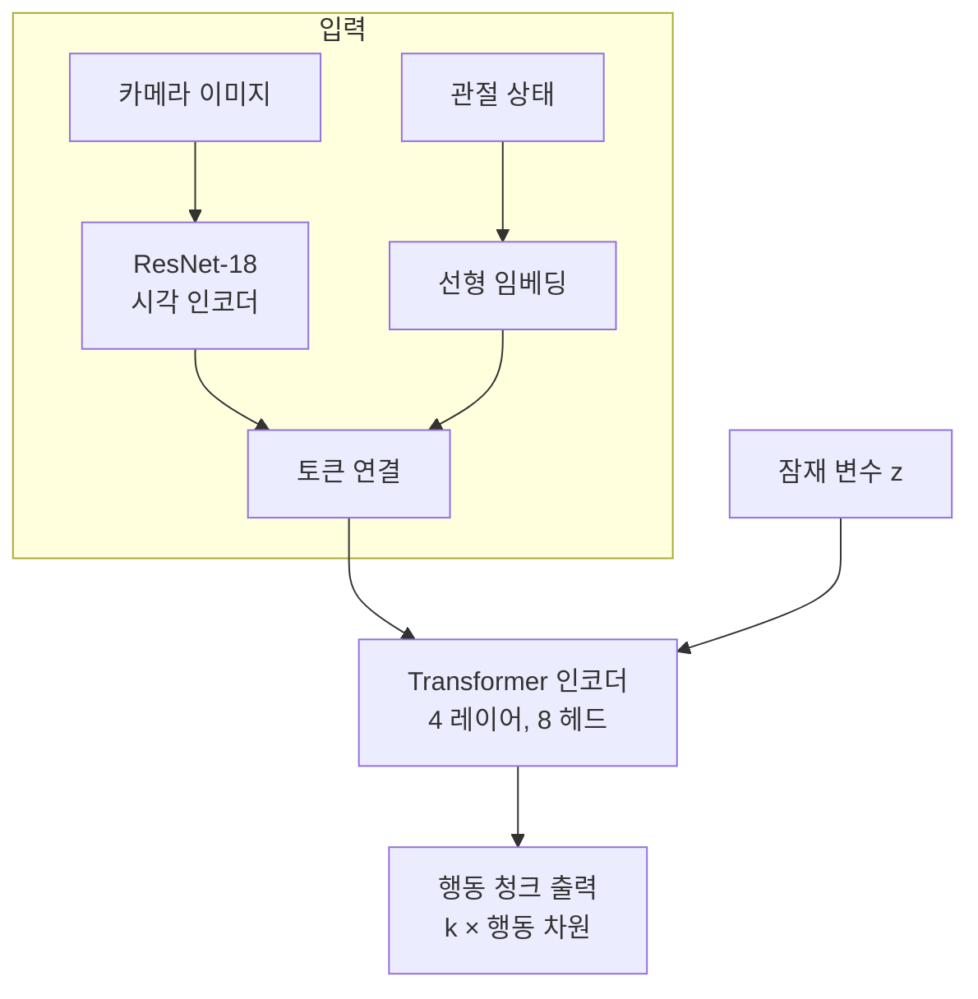

# ACT - 행동 청킹 트랜스포머 (Action Chunking with Transformers)

## 핵심 개념

ACT(Action Chunking with Transformers)는 Stanford에서 개발한 로봇 모방 학습 알고리즘이다. 기존 단일 행동 예측 방식의 누적 오류 문제를 **행동 청크(action chunk) 단위 예측**으로 해결하고, CVAE(Conditional Variational Autoencoder)로 다중 모드 행동 분포를 처리한다. ALOHA(A Low-cost Open-source Hardware System for Bimanual Teleoperation) 플랫폼과 함께 검증되었다.

## 문제: 단일 행동 예측의 한계

전통적인 행동 복제(Behavior Cloning)는 현재 상태 $s_t$에서 다음 행동 $a_t$ 하나를 예측한다. 이 방식에는 구조적인 한계가 있다.

- **누적 오류(Compounding Error)**: 각 단계의 작은 오차가 이후 상태에서 증폭됨
- **다중 모드 분포 처리 어려움**: 같은 상황에서 전문가가 서로 다른 방식으로 행동하는 경우 평균화(averaging)가 발생
- **단기 시야(myopic prediction)**: 현재 프레임만 보므로 장기 일관성이 떨어짐

## 해결: 행동 청킹 (Action Chunking)

ACT는 현재 상태에서 **k개 행동 시퀀스(청크)**를 한 번에 예측한다.

$$\pi(a_{t:t+k} \mid s_t)$$

청크 예측의 장점:
- 누적 오류의 파급 범위가 청크 단위로 제한됨
- 장기 행동 패턴(예: 컵 집기 → 이동 → 놓기)을 하나의 단위로 학습
- 추론 빈도 감소로 연산 효율 향상

## CVAE 기반 행동 분포 모델링

단순 MSE 손실로 k-step 시퀀스를 예측하면 다중 모드 데이터에서 평균화 문제가 발생한다. ACT는 CVAE로 이를 해결한다.

**CVAE 역할**:
- 잠재 변수 $z$가 "어떤 방식으로 할 것인가"를 인코딩
- 학습 시: 실제 청크에서 $z$ 추출, KL 발산으로 정규화
- 추론 시: $z \sim \mathcal{N}(0, I)$로 샘플링, 다양한 해결책 생성 가능

## 시간적 앙상블 (Temporal Ensemble)

연속된 청크 예측 간 부드러운 전환을 위해 시간적 앙상블을 사용한다.

- 매 $k$ 스텝마다 새 청크를 예측하는 대신 매 스텝에서 새 청크를 예측
- 여러 청크의 중첩 구간에서 **지수 가중 평균**으로 최종 행동 계산
- 결과적으로 로봇 동작이 갑작스러운 점프 없이 부드럽게 이어짐

$$a_t^{\text{final}} = \frac{\sum_{i} w_i \cdot a_t^{(i)}}{\sum_i w_i}, \quad w_i = e^{-m \cdot i}$$

여기서 $m$은 최근 예측을 더 강조하는 지수 감쇠 계수다.

## 아키텍처 상세

- **시각 인코더**: ResNet-18 고정(fine-tune 없음) 또는 학습 가능
- **트랜스포머**: 관찰 토큰과 잠재 변수 $z$를 함께 처리
- **출력 헤드**: 청크 크기 $k$ × 행동 차원(양손 14 DoF 등)

## ALOHA 플랫폼에서의 검증

Stanford Mobile ALOHA 및 ALOHA 2는 저비용 양손 로봇 플랫폼이다.

- **양손 조작 태스크**: 접시 닦기, 계란 요리, 옷 접기, 캐비닛 조립
- **50-200개 시연** 데이터로 복잡한 태스크 학습 성공
- ALOHA 2에서 더 넓은 작업 공간, 개선된 하드웨어로 성능 향상

## 비교: Diffusion Policy, VQ-BeT

| 항목 | ACT | Diffusion Policy | VQ-BeT |
|------|-----|-----------------|--------|
| 다중 모드 처리 | CVAE 잠재 변수 | 역방향 확산 과정 | 벡터 양자화 토큰 |
| 추론 속도 | 빠름 (단일 포워드) | 느림 (반복 역산) | 중간 |
| 행동 청킹 | 명시적 청크 | 청크 가능 | 시퀀스 모델링 |
| 구현 복잡도 | 중간 | 높음 | 높음 |
| 시각-언어 확장 | 가능 (OpenVLA 등) | 가능 | 가능 |

## 실무 적용 관점

1. **데이터 수집 비용 절감**: 50-100개 시연으로 복잡한 태스크 학습 가능
2. **청크 크기 $k$ 선택**: 태스크의 시간 스케일에 맞게 조정 (보통 10-100 스텝)
3. **시간적 앙상블 감쇠 계수 $m$**: 커질수록 최근 예측에 집중, 반응성 증가
4. **멀티모달 확장**: ACT++, OpenVLA 등에서 언어 조건 행동 생성으로 확장

## 관련 문서

- [[diffusion-policy]] - 확산 과정 기반 행동 생성 정책
- [[behavior-cloning]] - 모방 학습 기본 개념
- [[transformer-architecture|transformer-architectures]] - 트랜스포머 구조 상세
- [[imitation-learning]] - 모방 학습 전반
- [[robot-learning-sim2real|robot-learning]] - 로봇 학습 개요
