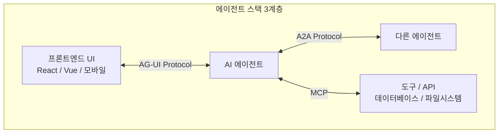
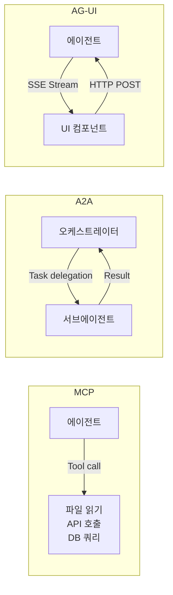

# AG-UI Protocol (Agent-User Interface Protocol)

## 개요

AG-UI는 AI 에이전트와 프론트엔드 UI 사이의 통신을 표준화하는 오픈 프로토콜이다. MCP(에이전트-도구), A2A(에이전트 간 통신)에 이어 에이전트 스택의 세 번째 통신 레이어를 채운다.

CopilotKit이 주도해 제안했으며, Google/AWS/Microsoft/Mastra/LangChain 등이 채택 의사를 밝혔다.

## 에이전트 프로토콜 3계층 구조

| 프로토콜 | 통신 방향 | 역할 |
|----------|----------|------|
| MCP | 에이전트 - 도구 | 외부 도구/리소스 접근 |
| A2A | 에이전트 - 에이전트 | 멀티에이전트 협력 |
| AG-UI | 에이전트 - 프론트엔드 | 사용자 인터페이스 통신 |

## 기술 명세

### 전송 방식

- **HTTP POST**: 사용자 입력 전송 (프론트엔드 -> 에이전트)
- **SSE (Server-Sent Events) 스트림**: 에이전트 응답 스트리밍 (에이전트 -> 프론트엔드)

SSE를 선택한 이유는 WebSocket 대비 단방향 스트림에 단순하고, 방화벽·프록시 호환성이 높으며, HTTP/2와 자연스럽게 통합되기 때문이다.

### 핵심 이벤트 타입

| 이벤트 타입 | 설명 |
|------------|------|
| `TEXT_MESSAGE_CONTENT` | 텍스트 스트리밍 (청크 단위 전송) |
| `TOOL_CALL_START` | 도구 호출 시작 알림 |
| `TOOL_CALL_END` | 도구 호출 완료 + 결과 |
| `STATE_DELTA` | 에이전트 내부 상태 변화 (공유 상태 동기화) |
| `STEP_STARTED` / `STEP_FINISHED` | 에이전트 작업 단계 경계 |
| `RUN_STARTED` / `RUN_FINISHED` | 전체 실행 세션 경계 |

### 공유 상태 (Shared State)

AG-UI의 핵심 차별화 기능 중 하나는 **에이전트와 UI가 상태를 공유**할 수 있다는 점이다. `STATE_DELTA`로 에이전트가 UI 상태를 직접 업데이트할 수 있어, 에이전트가 생성하는 내용이 UI에 실시간 반영된다.

## MCP vs A2A vs AG-UI 비교

## 채택 현황 (2026-04 기준)

- **CopilotKit**: 프로토콜 제안자, 자사 프레임워크에 기본 통합
- **LangChain / LangGraph**: 에이전트 프레임워크 레벨 지원 추가 중
- **Mastra**: 에이전트-UI 통신 레이어로 채택
- **Google / AWS / Microsoft**: 공식 지지 표명

## 실무 시사점

- 에이전트 기반 앱을 개발할 때 직접 WebSocket/폴링을 구현하는 대신 AG-UI 표준을 활용하면 프레임워크 간 에이전트 교체가 용이해진다.
- 스트리밍 도구 호출 결과를 UI에 점진적으로 반영하는 패턴(예: 코드 생성 중 실시간 미리보기)을 표준화된 방식으로 구현 가능.
- 에이전트 내부 상태를 UI에 노출하는 `STATE_DELTA`는 디버깅과 사용자 투명성 향상에 유용하다.

## 관련 문서

- [[MCP]] - 에이전트-도구 통신 표준
- [[A2A Protocol]] - 에이전트 간 통신 표준
- [[Mastra]] - AG-UI를 채택한 에이전트 프레임워크
- [[orchestrator-worker-pattern]] - 에이전트 아키텍처 기초
