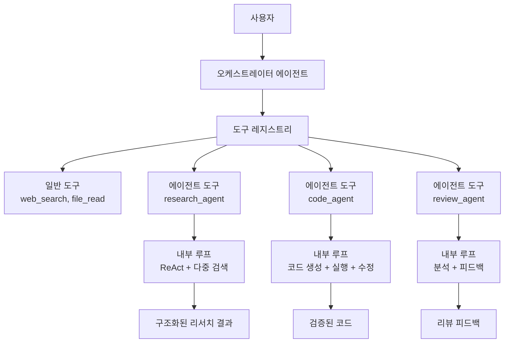
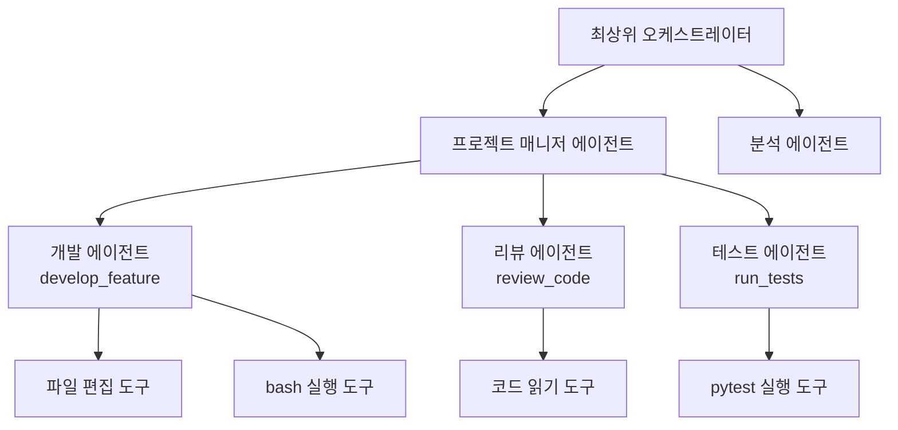
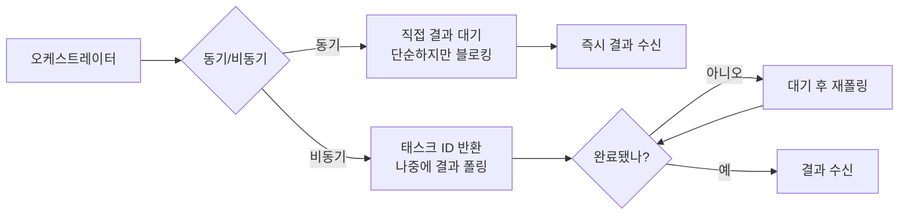
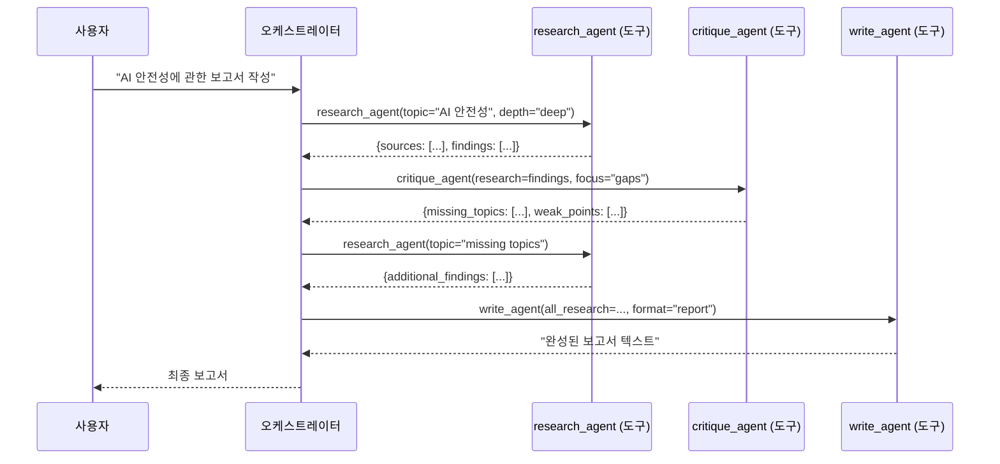

# 에이전트를 도구로 사용하는 패턴 (Agent-as-Tool)

## 개요

Agent-as-Tool 패턴은 에이전트(agent)를 일반 함수나 API처럼 도구(tool)로 노출하는 설계 방식이다. 호출하는 쪽에서는 내부 구현을 알 필요 없이 입력-출력 계약(input-output contract)만 알면 되며, 에이전트 자체의 복잡한 내부 루프(think-act-observe)는 캡슐화된다.

이 패턴을 통해 여러 에이전트를 마치 함수 라이브러리처럼 구성할 수 있고, 고수준 오케스트레이터가 저수준 전문 에이전트를 도구처럼 호출하는 계층적 멀티에이전트 시스템을 구축할 수 있다.

## 왜 중요한가

- **추상화(abstraction)**: 복잡한 에이전트 동작을 단순한 함수 시그니처로 숨김
- **재사용성**: 동일 에이전트를 다른 오케스트레이터들이 재사용 가능
- **교체 가능성(substitutability)**: 내부 구현을 바꿔도 인터페이스가 동일하면 호출자 변경 없음
- **테스트 용이성**: 에이전트를 모킹(mocking)하거나 개별 테스트 가능
- **확장성**: 새 능력을 기존 호출자 코드 수정 없이 새 에이전트 도구 추가로 달성

## 개념 다이어그램



오케스트레이터 입장에서 `research_agent`와 `web_search`는 동일한 인터페이스를 가진 도구다. 내부가 단순 API 호출인지, 복잡한 에이전트 루프인지 알 필요가 없다.

## 함수 시그니처로서의 에이전트

에이전트를 도구로 정의할 때는 일반 함수 도구와 동일한 형식을 따른다.

```python
# 일반 도구 (simple tool)
def web_search(query: str, num_results: int = 5) -> list[SearchResult]:
    """웹에서 정보를 검색한다."""
    ...

# 에이전트 도구 (agent-as-tool) - 인터페이스는 동일
def research_agent(
    topic: str,
    depth: Literal["shallow", "deep"] = "shallow",
    output_format: Literal["summary", "detailed"] = "summary"
) -> ResearchReport:
    """
    주어진 주제에 대해 심층 리서치를 수행한다.
    내부적으로 여러 번의 검색과 분석을 자동으로 수행한다.
    """
    # 내부: ReAct 루프로 여러 검색 + 합성
    ...
```

호출자 코드에서는 두 도구를 동일하게 다룬다.

## LLM 함수 호출(function calling)과의 통합

Anthropic, OpenAI 등의 API는 도구를 JSON 스키마로 정의한다. 에이전트 도구도 동일 방식으로 등록 가능하다.

```json
{
  "name": "research_agent",
  "description": "주어진 주제에 대해 심층 리서치를 수행하고 구조화된 보고서를 반환한다. 단순 웹 검색보다 깊이 있는 정보가 필요할 때 사용하라.",
  "input_schema": {
    "type": "object",
    "properties": {
      "topic": {
        "type": "string",
        "description": "리서치할 주제"
      },
      "depth": {
        "type": "string",
        "enum": ["shallow", "deep"],
        "description": "리서치 깊이. shallow는 개요, deep은 세부 분석"
      }
    },
    "required": ["topic"]
  }
}
```

오케스트레이터 LLM은 이 스키마를 보고 언제 `research_agent`를 호출할지 스스로 결정한다.

[[function-call-evolution]] 문서에서 함수 호출 기능의 발전 과정을 다룬다.

## 계층적 멀티에이전트 구성

Agent-as-Tool을 활용하면 계층적 에이전트 구조를 자연스럽게 표현할 수 있다.



각 레이어는 하위 레이어의 도구들을 호출하지만, 하위 레이어의 내부 구현을 알지 못한다.

## 구현 패턴: 에이전트 래퍼(Agent Wrapper)

기존 에이전트를 도구 인터페이스로 감싸는 래퍼 패턴.

```python
from anthropic import Anthropic
from typing import Any

class AgentTool:
    """에이전트를 도구 인터페이스로 래핑하는 기본 클래스"""

    def __init__(self, name: str, description: str, system_prompt: str):
        self.name = name
        self.description = description
        self.system_prompt = system_prompt
        self.client = Anthropic()

    def get_schema(self) -> dict:
        """도구 스키마 반환 - 서브클래스에서 정의"""
        raise NotImplementedError

    def run(self, **kwargs: Any) -> str:
        """에이전트를 실행하고 결과를 반환"""
        input_text = self._format_input(**kwargs)
        # 내부적으로 에이전트 루프 실행
        result = self._execute_agent_loop(input_text)
        return result

    def _execute_agent_loop(self, input_text: str) -> str:
        # 내부 ReAct 루프 (외부에 노출되지 않음)
        ...


class ResearchAgentTool(AgentTool):
    def __init__(self):
        super().__init__(
            name="research_agent",
            description="주어진 주제에 대한 심층 리서치를 수행한다",
            system_prompt="당신은 정확하고 포괄적인 리서치를 수행하는 전문 연구원입니다..."
        )

    def get_schema(self) -> dict:
        return {
            "name": self.name,
            "description": self.description,
            "input_schema": {
                "type": "object",
                "properties": {
                    "topic": {"type": "string"},
                    "depth": {"type": "string", "enum": ["shallow", "deep"]}
                },
                "required": ["topic"]
            }
        }
```

## 동기 vs. 비동기 에이전트 도구

에이전트 도구는 실행 시간이 길 수 있으므로 비동기(async) 처리가 중요하다.



장기 실행 에이전트(예: 심층 리서치)는 비동기 방식이 적합하다. [[agent-interrupt-resume]] 패턴과 결합하면 중간 진행 상황을 확인하거나 취소도 가능하다.

## 에이전트 도구 레지스트리 (Agent Tool Registry)

여러 에이전트 도구를 관리하는 레지스트리 패턴.

```python
class AgentToolRegistry:
    def __init__(self):
        self._tools: dict[str, AgentTool] = {}

    def register(self, tool: AgentTool) -> None:
        self._tools[tool.name] = tool

    def get_schemas(self) -> list[dict]:
        """LLM API에 전달할 전체 도구 스키마 목록"""
        return [tool.get_schema() for tool in self._tools.values()]

    def execute(self, tool_name: str, **kwargs) -> str:
        if tool_name not in self._tools:
            raise ValueError(f"알 수 없는 도구: {tool_name}")
        return self._tools[tool_name].run(**kwargs)


# 사용
registry = AgentToolRegistry()
registry.register(ResearchAgentTool())
registry.register(CodeReviewAgentTool())
registry.register(DataAnalysisAgentTool())

# 오케스트레이터에 전달
schemas = registry.get_schemas()
```

## 실제 사례: 멀티에이전트 리서치 파이프라인



각 에이전트는 독립적이며, 오케스트레이터만 전체 흐름을 알고 있다.

## 인터페이스 설계 원칙

좋은 에이전트 도구 인터페이스의 특징.

| 원칙 | 설명 | 예시 |
|------|------|------|
| 단일 책임 | 하나의 잘 정의된 기능만 | `code_review_agent` (코드 리뷰만) |
| 명확한 입출력 | 타입이 명시된 입력과 출력 | 입력: `str`, 출력: `ReviewResult` |
| 멱등성(idempotency) | 동일 입력은 동일 출력 | 캐싱 가능 |
| 실패 정보 | 성공/실패를 구분 가능한 반환값 | `Result[T, Error]` 패턴 |
| 시간 제한 | 최대 실행 시간 명시 | `timeout_seconds=60` |

## Agent-as-Tool vs. 직접 Spawn

| 비교 항목 | Agent-as-Tool | Parent-Child Spawn |
|-----------|---------------|-------------------|
| 인터페이스 | 함수 시그니처로 추상화 | 직접 태스크 위임 |
| 결합도 | 느슨한 결합 | 더 강한 결합 |
| 재사용성 | 높음 (레지스트리 등록) | 낮음 (특정 워크플로우 종속) |
| 디버깅 | 도구 단위 독립 테스트 용이 | 전체 흐름 추적 필요 |
| 적합한 경우 | 반복 재사용 능력 | 특정 목표를 위한 일회성 분해 |

두 패턴은 상호 배타적이지 않다. [[parent-child-spawn-pattern]]에서 자식 에이전트를 생성할 때 Agent-as-Tool 인터페이스를 사용하는 방식으로 결합 가능하다.

## 한계 및 트레이드오프

### 장점
- 깔끔한 추상화 경계
- 독립적인 테스트 및 버전 관리 가능
- 레지스트리를 통한 동적 능력 추가

### 단점
- **숨겨진 복잡성**: 내부 에이전트 루프의 실패가 외부에서 불투명
- **지연 시간(latency)**: 에이전트 도구 호출은 일반 함수보다 수십-수백 배 느림
- **상태 관리**: 에이전트 도구가 내부 상태를 가질 때 멱등성 보장 어려움
- **비용 예측 불가**: 에이전트 내부 루프 횟수가 가변적

## 관련 문서

- [[function-call-evolution]] - LLM 함수 호출 기능의 발전
- [[tool-use]] - LLM 도구 사용 기초
- [[parent-child-spawn-pattern]] - 서브에이전트 동적 생성
- [[agent-task-decomposition-patterns]] - 태스크 분해 전략
- [[agent-memory-systems]] - 에이전트 도구의 상태 및 메모리 관리
- [[agent-observability-tracing]] - 에이전트 도구 내부 추적
