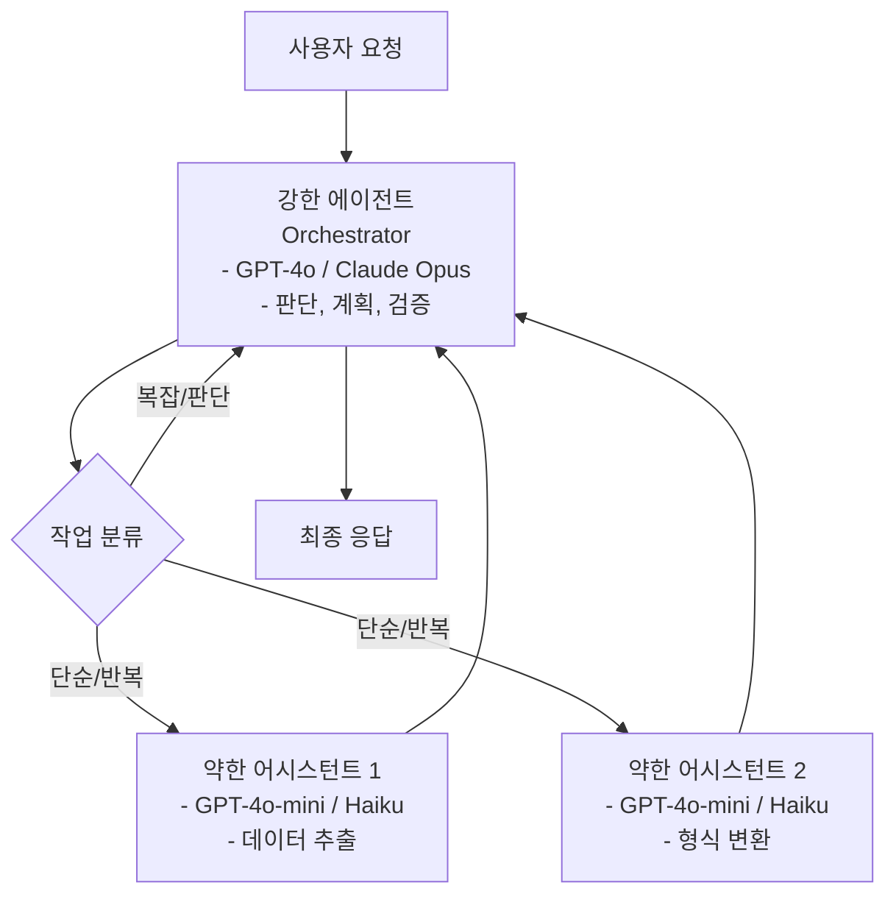

# 비대칭 에이전트-어시스턴트 패턴

## 개념 정의

비대칭 에이전트-어시스턴트 패턴은 강력한(high-capability) 에이전트가 약한(low-capability) 어시스턴트를 도구처럼 활용하여 비용과 성능을 동시에 최적화하는 멀티에이전트 설계 패턴이다. "비대칭(asymmetric)"이란 두 에이전트의 능력과 역할이 의도적으로 불균형하게 설계됨을 의미한다.

핵심 아이디어: 모든 하위 작업에 최강 모델을 투입하는 것은 비경제적이다. 판단과 계획은 강한 에이전트가, 반복적이고 예측 가능한 실행은 약한 어시스턴트가 담당하면 비용 대비 성능이 최적화된다.



강한 에이전트가 오케스트레이터 역할을 하며, 단순 작업은 약한 어시스턴트에 위임하고 결과를 검증한다.

## 왜 비대칭인가?

### 작업 복잡도의 불균등 분포

실제 에이전트 작업을 분석하면, 전체 작업의 약 70-80%는 단순하고 반복적이다:
- 형식 변환 (JSON -> CSV)
- 데이터 추출 (텍스트에서 특정 필드 추출)
- 간단한 분류 (긍정/부정/중립)
- 요약 (구조화된 문서의 요약)
- 번역 (일반 텍스트)

나머지 20-30%만 복잡한 추론이 필요하다:
- 모호한 요구사항 해석
- 상충하는 제약 조건 처리
- 복잡한 계획 수립
- 결과 품질 검증

### 비용 분포

| 구성 | 강한 에이전트 비율 | 월 추정 비용 (예시) |
|------|------------------|-------------------|
| 모든 작업에 강한 에이전트 | 100% | $1,000 |
| 비대칭 패턴 (80/20) | 20% | $240 |
| 순수 약한 에이전트 | 0% | $80 (품질 불가) |

비대칭 패턴이 비용을 76% 절감하면서도 품질을 유지한다.

## 역할 설계

### 강한 에이전트 (Orchestrator)

**특성**: 높은 추론 능력, 높은 컨텍스트 이해도, 비싼 비용

**담당 작업**:
- 사용자 의도 해석 및 작업 분해
- 하위 작업 라우팅 결정
- 약한 어시스턴트 결과 검증
- 에러 복구 계획
- 최종 응답 합성

### 약한 어시스턴트 (Worker)

**특성**: 낮은 추론 능력, 빠른 속도, 저렴한 비용

**담당 작업**:
- 명확하게 정의된 단순 작업 실행
- 구조화된 데이터 처리
- 반복 실행이 필요한 배치 작업
- 패턴 매칭 기반 분류

## 라우팅 전략

### 규칙 기반 라우팅

```python
class TaskRouter:
    SIMPLE_PATTERNS = [
        r"다음 텍스트를 JSON으로 변환",
        r"목록에서 \d+개 항목 추출",
        r"긍정/부정/중립으로 분류",
    ]

    def route(self, task: str) -> str:
        import re
        for pattern in self.SIMPLE_PATTERNS:
            if re.search(pattern, task):
                return "weak"
        return "strong"  # 기본은 강한 에이전트
```

### LLM 기반 라우팅 (메타 판단)

```python
def classify_task_complexity(task: str, classifier_llm) -> str:
    """강한 에이전트가 작업 복잡도를 먼저 판단"""
    prompt = f"""
다음 작업의 복잡도를 평가하라:
작업: {task}

분류 기준:
- simple: 규칙/패턴 기반으로 해결 가능, 추론 불필요
- complex: 판단, 추론, 컨텍스트 이해 필요

분류 (simple/complex):"""
    result = classifier_llm.generate(prompt)
    return "weak" if "simple" in result else "strong"
```

### 신뢰도 기반 에스컬레이션

```python
class AsymmetricAgent:
    def __init__(self, strong_llm, weak_llm, confidence_threshold: float = 0.85):
        self.strong = strong_llm
        self.weak = weak_llm
        self.threshold = confidence_threshold

    def process(self, task: str) -> str:
        # 1. 먼저 약한 어시스턴트로 시도
        result, confidence = self.weak.generate_with_confidence(task)

        # 2. 신뢰도가 낮으면 강한 에이전트로 에스컬레이션
        if confidence < self.threshold:
            result = self.strong.generate(
                f"약한 모델의 시도: {result}\n\n개선된 답변:"
            )

        return result
```

## 병렬 실행 패턴

약한 어시스턴트는 독립적 하위 작업을 병렬로 처리할 수 있다:

```python
import asyncio

class ParallelAsymmetricAgent:
    async def process_batch(self, tasks: list[str]) -> list[str]:
        # 작업 분류
        simple_tasks = []
        complex_tasks = []

        for task in tasks:
            if self._is_simple(task):
                simple_tasks.append(task)
            else:
                complex_tasks.append(task)

        # 단순 작업: 약한 어시스턴트로 병렬 실행
        weak_results = await asyncio.gather(
            *[self.weak_agent.agenerate(t) for t in simple_tasks]
        )

        # 복잡 작업: 강한 에이전트로 순차 실행 (비용 절감)
        strong_results = []
        for task in complex_tasks:
            result = await self.strong_agent.agenerate(task)
            strong_results.append(result)

        return self._merge_results(tasks, simple_tasks, complex_tasks,
                                   weak_results, strong_results)
```

## 실무 적용 예시

### RAG 파이프라인
- **약한 어시스턴트**: 청크 분류, 유사도 점수 계산, 키워드 추출
- **강한 에이전트**: 검색 쿼리 재작성, 최종 답변 합성, 인용 검증

### 코드 리뷰 에이전트
- **약한 어시스턴트**: 문법 오류, 린팅 문제, 간단한 패턴 감지
- **강한 에이전트**: 아키텍처 결함, 보안 취약점, 로직 오류 분석

### 고객 지원 에이전트
- **약한 어시스턴트**: FAQ 매칭, 단순 상태 조회, 폼 데이터 추출
- **강한 에이전트**: 복잡한 불만 처리, 정책 예외 판단, 에스컬레이션 결정

### 데이터 파이프라인
- **약한 어시스턴트**: 대량 데이터 정제, 형식 변환, 중복 탐지
- **강한 에이전트**: 이상 데이터 해석, 비즈니스 규칙 적용 판단

## 적용 시 주의사항

### 라우팅 오류 비용
복잡한 작업을 약한 어시스턴트에 잘못 라우팅하면 오답이 생성되고 사용자 경험이 크게 저하된다. 라우팅 정확도를 주기적으로 모니터링하고 잘못 분류된 케이스를 수집하여 라우터를 개선해야 한다.

### 검증 비용
약한 어시스턴트의 결과를 강한 에이전트가 매번 검증하면 비용 절감 효과가 상쇄된다. 표본 검증(전체의 5-10% 무작위 검증)이나 자동화된 규칙 기반 검증으로 대체한다.

### 문맥 전달 복잡도
강한 에이전트가 가진 복잡한 컨텍스트를 약한 어시스턴트에 완전히 전달하기 어렵다. 약한 어시스턴트용 단순화된 컨텍스트를 별도로 구성하는 프롬프트 설계가 필요하다.

### 일관성 유지
동일한 작업이 어시스턴트에 따라 다르게 처리될 수 있다. 약한 어시스턴트용 응답 형식 스키마를 엄격히 정의하면 일관성이 높아진다.

### 새로운 복잡성
단순 단일 모델보다 시스템 복잡도가 증가한다. 두 종류의 모델 버전 관리, 라우팅 로직 유지보수, 디버깅 난이도 상승을 감수해야 한다.

## 관련 패턴: 역방향 비대칭

강한 에이전트가 세부 작업 지시를 생성하고 약한 어시스턴트가 실행하는 표준 패턴 외에, 반대 방향도 가능하다:

**약한 어시스턴트가 초안 생성 -> 강한 에이전트가 검토/수정**: 창의적 작업에서 다양한 초안을 저렴하게 생성하고 최선안을 강한 에이전트가 선택·완성하는 방식.

## 관련 문서

- [[plan-and-execute-pattern]] - 계획-실행 분리 에이전트
- [[react-pattern]] - 추론-행동 루프
- [[tool-use-patterns]] - 도구 사용 패턴
- [[agent-planning-strategies]] - 에이전트 계획 전략
- [[function-calling-tool-use]] - 함수 호출 메커니즘
- [[rewoo-efficiency-pattern]] - 계획 선행으로 효율 최적화
- [[tool-calling-optimization]] - 도구 호출 비용 최적화
