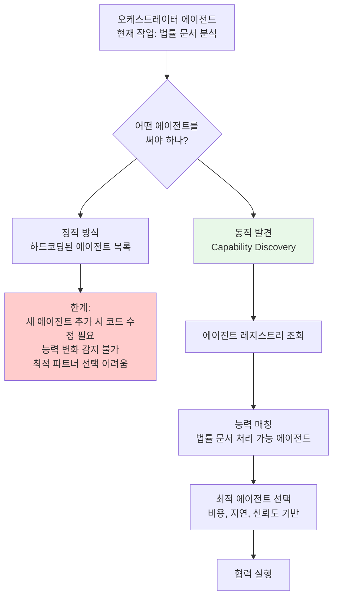
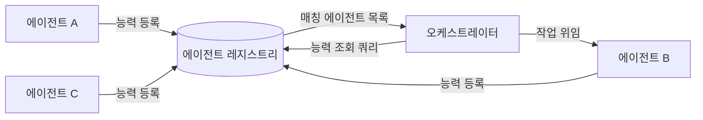

# 에이전트 능력 발견 (Agent Capability Discovery)

## 개요

에이전트 능력 발견(Agent Capability Discovery)은 멀티에이전트 시스템에서 **한 에이전트가 다른 에이전트 또는 도구의 기능(capability)을 런타임에 탐색하고, 현재 작업에 적합한 협력 파트너를 선택**하는 메커니즘이다.

전통적인 소프트웨어 통합에서는 서비스 간 API 명세가 빌드 타임에 고정된다. 반면 동적 에이전트 생태계에서는 새로운 에이전트가 언제든 등장하고 기존 에이전트의 능력이 변화할 수 있으므로, **런타임 능력 탐색**이 필수적이다.

## 왜 필요한가



## 표준 프로토콜

### [[a2a-protocol]] (Agent-to-Agent Protocol)

Google이 주도하는 A2A 프로토콜은 에이전트 간 통신과 능력 교환을 위한 표준이다. 각 에이전트는 **Agent Card**라는 JSON 명세를 공개하여 자신의 능력을 선언한다:

```json
{
  "name": "LegalDocumentAgent",
  "version": "1.2.0",
  "description": "계약서, 법률 의견서 분석 및 요약 전문 에이전트",
  "capabilities": [
    {
      "name": "analyze_contract",
      "description": "계약서에서 핵심 조항, 리스크, 의무사항을 추출한다",
      "input_schema": { "document_url": "string", "language": "string" },
      "output_schema": { "clauses": "array", "risks": "array" }
    }
  ],
  "pricing": { "per_call": 0.05, "currency": "USD" },
  "latency_p95_ms": 3200,
  "trust_score": 0.94
}
```

오케스트레이터는 에이전트 레지스트리에서 Agent Card를 조회하여 작업에 맞는 에이전트를 발견한다.

### [[model-context-protocol-mcp]] (MCP)

[[model-context-protocol-mcp]]는 Anthropic이 설계한 LLM-도구 통합 프로토콜이다. MCP 서버는 자신이 제공하는 도구(tools), 리소스(resources), 프롬프트 템플릿을 **표준화된 인터페이스로 선언**하며, 클라이언트(에이전트)는 연결 시 `tools/list` 요청으로 가용 도구를 동적으로 조회한다.

```
Client → Server: tools/list
Server → Client: {
  tools: [
    { name: "search_legal_db", description: "...", inputSchema: {...} },
    { name: "draft_clause", description: "...", inputSchema: {...} }
  ]
}
```

MCP의 능력 발견은 **도구 레벨**에서 작동하며, A2A는 **에이전트 레벨**에서 작동한다. 두 프로토콜은 보완적이다.

## 능력 발견 아키텍처

### 중앙집중식 레지스트리 (Centralized Registry)



- 장점: 단일 진실 소스(single source of truth), 중앙 모니터링
- 단점: 단일 장애점, 레지스트리 지연이 전체 지연에 추가됨

### 분산 발견 (Distributed Discovery)

DNS-SD(DNS Service Discovery) 또는 P2P 고시 방식. 에이전트들이 서로의 능력을 gossiping 프로토콜로 교환한다.
- 장점: 단일 장애점 없음, 확장성 우수
- 단점: 일관성 보장 어려움, 탐색 지연 가변적

## 능력 매칭 알고리즘

오케스트레이터가 협력 에이전트를 선택할 때 고려하는 차원:

| 차원 | 설명 | 예시 |
|------|------|------|
| 의미적 적합도 | 태스크 설명과 에이전트 능력 설명의 임베딩 유사도 | 코사인 유사도 > 0.8 |
| 신뢰도 | 과거 성공률, 평가 점수 | trust_score > 0.9 |
| 비용 | 호출당 비용 | $0.01/call 이하 |
| 지연 | 응답 시간 P95 | < 5초 |
| 가용성 | 현재 부하 상태 | 큐 깊이 < 10 |

LLM 기반 능력 매칭: 단순 임베딩 매칭 대신, 오케스트레이터 LLM에게 태스크 설명과 에이전트 카드 목록을 제공하고 최적 선택을 요청하는 방식도 사용된다. 이때 에이전트 카드가 LLM이 이해할 수 있는 자연어로 작성되어 있어야 한다.

## 능력의 동적 변화 처리

에이전트의 능력은 버전 업그레이드, 서비스 중단, 부하 증가 등으로 변할 수 있다:

- **TTL(Time-To-Live)**: 캐시된 능력 정보의 유효 기간을 설정하고 주기적으로 갱신
- **헬스체크(Health Check)**: 에이전트 호출 전 활성 상태 확인
- **능력 이벤트**: 능력 추가/제거 시 웹훅 또는 메시지 브로커로 레지스트리 업데이트 알림
- **Graceful Degradation**: 선택한 에이전트가 응답하지 않을 경우 다음 후보로 자동 전환(fallback)

## 보안 고려사항

능력 발견 시스템은 공격 표면이 될 수 있다:

- **스푸핑**: 악의적 에이전트가 높은 신뢰도로 위장하여 레지스트리에 등록
- **능력 과장**: 실제로 지원하지 않는 능력을 선언하여 위임 받은 후 오동작
- **대응**: 레지스트리 등록 시 서명 검증, 에이전트 인증(mTLS), 평판 기반 신뢰 점수 누적

## 관련 문서

- [[a2a-protocol]] - Google의 에이전트 간 통신 및 능력 교환 표준
- [[model-context-protocol-mcp]] - Anthropic의 LLM-도구 통합 프로토콜 (도구 레벨 발견)
- [[orchestrator-worker-pattern]] - 능력 발견을 활용하는 오케스트레이터-워커 패턴
- [[agent-protocols-standards]] - A2A, MCP, ACP 등 에이전트 프로토콜 비교
- [[subagents]] - 오케스트레이터가 서브에이전트를 발견·위임하는 패턴
