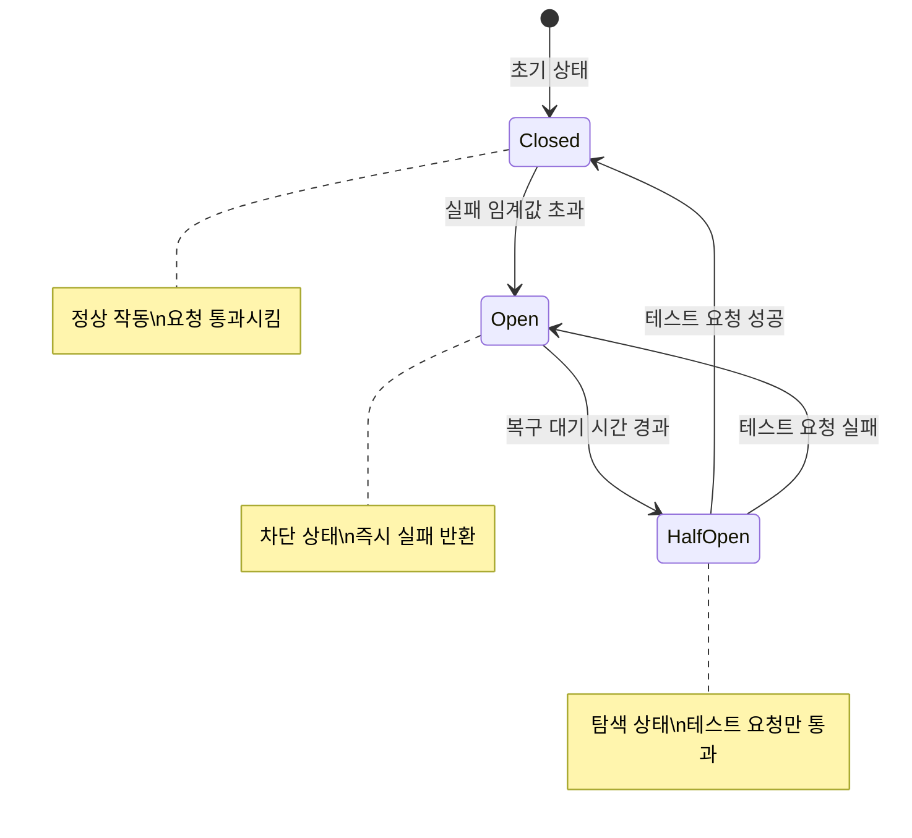
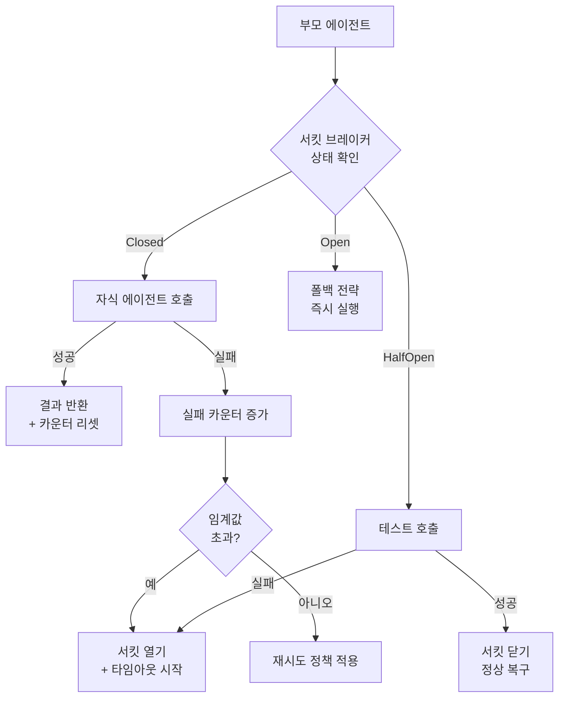
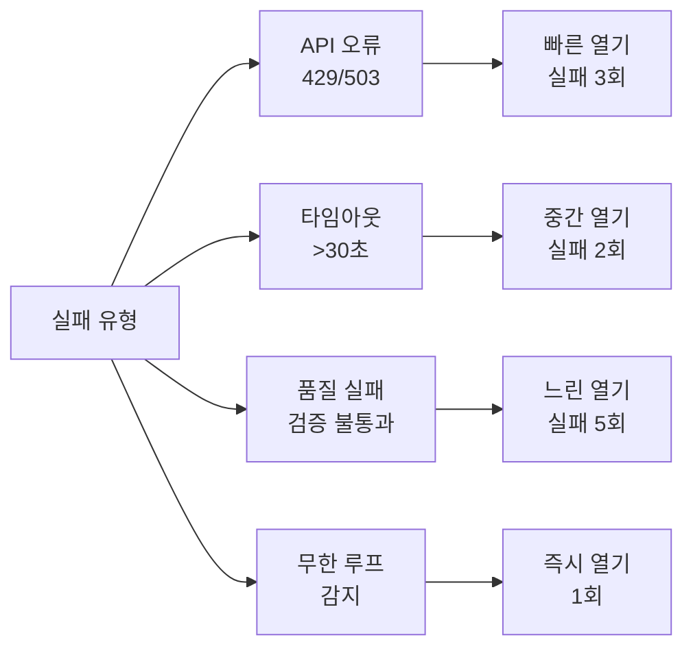
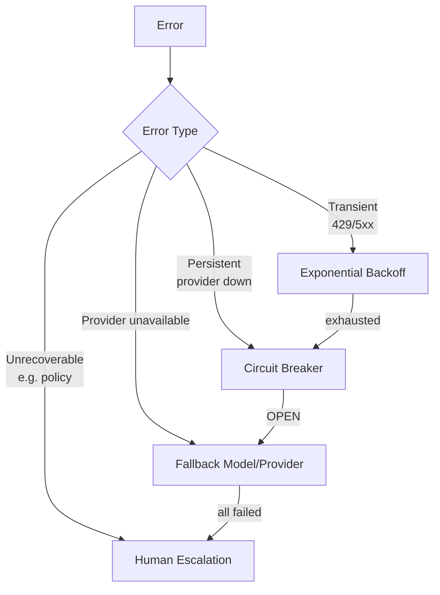

# 에이전트 서킷 브레이커 패턴

## 개요

서킷 브레이커(Circuit Breaker) 패턴은 분산 시스템 공학에서 반복적인 실패를 감지해 시스템 자원을 보호하는 안정성 패턴이다. LLM 에이전트 시스템에 적용하면, 특정 도구, 서브에이전트, 또는 외부 서비스가 반복 실패할 때 자동으로 차단(open)하여 추가 실패와 비용 낭비를 방지한다.

마이클 나이가드(Michael Nygard)가 "Release It!" 책에서 소프트웨어 안정성 패턴으로 정립했으며, 이를 LLM 에이전트의 비결정적·고비용 환경에 맞게 적용한다.

## 왜 중요한가

- **비용 통제**: 실패하는 LLM 호출이나 도구 호출이 반복되면 API 비용이 폭발적으로 증가
- **루프 방지**: 에이전트가 계속 실패하는 작업을 무한 재시도하는 상황 차단
- **빠른 실패(fail fast)**: 회복 불가한 상황을 조기에 감지해 전체 워크플로우 보호
- **폴백(fallback) 경로 활성화**: 서킷이 열리면 대안 경로를 즉시 시도 가능
- **복구 시간 확보**: 실패한 서비스가 회복할 시간을 주면서 부하를 주지 않음

## 서킷 브레이커 상태 다이어그램



세 가지 상태:
- **Closed (닫힘)**: 정상 작동. 모든 요청을 통과시키고 실패를 카운팅
- **Open (열림)**: 차단 상태. 모든 요청을 즉시 실패로 반환 (실제 시도 안 함)
- **Half-Open (반열림)**: 복구 탐색. 제한된 테스트 요청만 통과시켜 복구 여부 확인

## 구현 예시

```python
import time
from enum import Enum
from dataclasses import dataclass, field
from typing import Callable, Any
import logging

logger = logging.getLogger(__name__)

class CircuitState(Enum):
    CLOSED = "closed"
    OPEN = "open"
    HALF_OPEN = "half_open"

@dataclass
class CircuitBreakerConfig:
    failure_threshold: int = 5          # 실패 임계값
    success_threshold: int = 2          # Half-Open에서 Closed로 전환 성공 횟수
    timeout_seconds: float = 60.0       # Open 상태 유지 시간
    half_open_max_calls: int = 3        # Half-Open에서 허용할 최대 테스트 호출

class AgentCircuitBreaker:
    def __init__(self, name: str, config: CircuitBreakerConfig | None = None):
        self.name = name
        self.config = config or CircuitBreakerConfig()
        self.state = CircuitState.CLOSED
        self.failure_count = 0
        self.success_count = 0
        self.last_failure_time: float | None = None
        self.half_open_calls = 0

    def call(self, func: Callable, *args: Any, **kwargs: Any) -> Any:
        if self.state == CircuitState.OPEN:
            if self._should_attempt_reset():
                self._transition_to_half_open()
            else:
                raise CircuitOpenError(f"서킷 브레이커 [{self.name}] 열림 상태: 호출 차단됨")

        if self.state == CircuitState.HALF_OPEN:
            if self.half_open_calls >= self.config.half_open_max_calls:
                raise CircuitOpenError(f"서킷 브레이커 [{self.name}] 반열림: 최대 테스트 호출 초과")
            self.half_open_calls += 1

        try:
            result = func(*args, **kwargs)
            self._on_success()
            return result
        except Exception as e:
            self._on_failure()
            raise

    def _on_success(self) -> None:
        if self.state == CircuitState.HALF_OPEN:
            self.success_count += 1
            if self.success_count >= self.config.success_threshold:
                self._transition_to_closed()
                logger.info(f"서킷 브레이커 [{self.name}]: Closed로 복구")
        else:
            self.failure_count = 0  # 성공 시 실패 카운터 리셋

    def _on_failure(self) -> None:
        self.failure_count += 1
        self.last_failure_time = time.time()
        if self.state == CircuitState.HALF_OPEN:
            self._transition_to_open()
            logger.warning(f"서킷 브레이커 [{self.name}]: Half-Open 테스트 실패, Open으로 재전환")
        elif self.failure_count >= self.config.failure_threshold:
            self._transition_to_open()
            logger.error(f"서킷 브레이커 [{self.name}]: 실패 임계값 초과, Open으로 전환")

    def _should_attempt_reset(self) -> bool:
        if self.last_failure_time is None:
            return True
        return (time.time() - self.last_failure_time) >= self.config.timeout_seconds

    def _transition_to_open(self) -> None:
        self.state = CircuitState.OPEN
        self.success_count = 0
        self.half_open_calls = 0

    def _transition_to_half_open(self) -> None:
        self.state = CircuitState.HALF_OPEN
        self.half_open_calls = 0
        self.success_count = 0
        logger.info(f"서킷 브레이커 [{self.name}]: Half-Open으로 전환 (복구 탐색)")

    def _transition_to_closed(self) -> None:
        self.state = CircuitState.CLOSED
        self.failure_count = 0
        self.success_count = 0

class CircuitOpenError(Exception):
    pass
```

## 에이전트 도구에 서킷 브레이커 적용

```python
class ToolWithCircuitBreaker:
    def __init__(self, tool_name: str, tool_func: Callable):
        self.tool_name = tool_name
        self.tool_func = tool_func
        self.circuit_breaker = AgentCircuitBreaker(
            name=tool_name,
            config=CircuitBreakerConfig(
                failure_threshold=3,
                timeout_seconds=30.0
            )
        )
        self.fallback: Callable | None = None

    def with_fallback(self, fallback_func: Callable) -> "ToolWithCircuitBreaker":
        self.fallback = fallback_func
        return self

    def execute(self, *args: Any, **kwargs: Any) -> Any:
        try:
            return self.circuit_breaker.call(self.tool_func, *args, **kwargs)
        except CircuitOpenError:
            if self.fallback:
                logger.warning(f"도구 [{self.tool_name}] 서킷 열림, 폴백 실행")
                return self.fallback(*args, **kwargs)
            raise


# 실제 사용 예시
web_search_tool = ToolWithCircuitBreaker(
    tool_name="web_search",
    tool_func=search_api.search
).with_fallback(
    lambda query, **_: cached_search(query)  # 캐시 기반 폴백
)
```

## 에이전트 수준의 서킷 브레이커

개별 도구뿐 아니라 서브에이전트 전체에도 서킷 브레이커를 적용할 수 있다.



## 폴백 전략 조합

서킷이 열렸을 때 선택 가능한 폴백(fallback) 전략들.

| 폴백 전략 | 설명 | 적합한 경우 |
|-----------|------|-----------|
| 캐시 반환 | 마지막 성공 결과 반환 | 데이터가 크게 변하지 않는 경우 |
| 대안 서비스 | 백업 API/서비스 호출 | 동등한 대안이 존재하는 경우 |
| 축소 기능 | 핵심 기능만 제공 | 일부 기능 손실 허용 가능한 경우 |
| 오류 명시 | 사용자에게 명확한 오류 반환 | 폴백 불가, 투명성 우선 |
| 대기 후 재시도 | 일정 시간 후 재시도 | 일시적 장애가 예상되는 경우 |

```python
# 폴백 체인 패턴: 여러 폴백을 순차적으로 시도
class FallbackChain:
    def __init__(self, primary: Callable, fallbacks: list[Callable]):
        self.primary = primary
        self.fallbacks = fallbacks

    def execute(self, *args, **kwargs) -> Any:
        for func in [self.primary] + self.fallbacks:
            try:
                return func(*args, **kwargs)
            except (CircuitOpenError, Exception) as e:
                logger.warning(f"시도 실패: {func.__name__}, 다음 폴백 시도: {e}")
        raise RuntimeError("모든 폴백 시도 실패")
```

## LLM 특화 임계값 설정

일반 서비스와 달리 LLM 에이전트에서는 임계값을 다르게 설정해야 한다.



실패 유형별로 다른 임계값을 설정하는 이유:
- API 429(Rate Limit): 서비스가 과부하 상태이므로 빠르게 차단
- 타임아웃: 네트워크 문제일 수 있어 중간 정도
- 품질 실패: 에이전트 로직 문제일 수 있어 더 관대하게
- 무한 루프: 즉시 차단하여 비용 폭발 방지

```python
# 실패 유형별 서킷 브레이커 설정
circuit_configs = {
    "api_error": CircuitBreakerConfig(failure_threshold=3, timeout_seconds=60),
    "timeout": CircuitBreakerConfig(failure_threshold=2, timeout_seconds=30),
    "quality_failure": CircuitBreakerConfig(failure_threshold=5, timeout_seconds=120),
    "infinite_loop": CircuitBreakerConfig(failure_threshold=1, timeout_seconds=300),
}
```

## 모니터링 및 알림 통합

```python
from dataclasses import dataclass
from datetime import datetime

@dataclass
class CircuitBreakerMetrics:
    name: str
    state: CircuitState
    failure_count: int
    success_count: int
    last_state_change: datetime
    total_calls: int
    open_duration_seconds: float | None = None

class MonitoredCircuitBreaker(AgentCircuitBreaker):
    def __init__(self, name: str, config: CircuitBreakerConfig, alert_func: Callable):
        super().__init__(name, config)
        self.alert_func = alert_func
        self.total_calls = 0
        self.last_state_change = datetime.utcnow()

    def _transition_to_open(self) -> None:
        super()._transition_to_open()
        self.last_state_change = datetime.utcnow()
        # 알림 발송
        self.alert_func(f"서킷 브레이커 [{self.name}] 열림: 즉각 확인 필요")

    def get_metrics(self) -> CircuitBreakerMetrics:
        return CircuitBreakerMetrics(
            name=self.name,
            state=self.state,
            failure_count=self.failure_count,
            success_count=self.success_count,
            last_state_change=self.last_state_change,
            total_calls=self.total_calls
        )
```

[[agent-observability-tracing]]와 결합하면 서킷 브레이커 상태를 대시보드로 시각화할 수 있다.

## 한계 및 트레이드오프

### 장점
- 반복 실패로 인한 비용 폭발 방지
- 장애 격리로 시스템 전체 보호
- 자동 복구 탐색으로 운영 개입 최소화

### 단점
- **False Positive**: 일시적 네트워크 지연을 실패로 오판해 정상 서비스를 차단할 수 있음
- **임계값 튜닝 어려움**: LLM 에이전트의 비결정적 특성으로 최적 임계값 찾기 어려움
- **상태 공유 문제**: 분산 환경에서 여러 에이전트 인스턴스 간 서킷 상태를 공유해야 하는 복잡성
- **추가 복잡성**: 시스템 전체 이해가 어려워짐

### 분산 서킷 브레이커 (Distributed Circuit Breaker)

여러 에이전트 인스턴스가 있을 때 Redis 등 공유 저장소에 상태를 저장한다.

```python
import redis

class DistributedCircuitBreaker(AgentCircuitBreaker):
    def __init__(self, name: str, config: CircuitBreakerConfig, redis_client: redis.Redis):
        super().__init__(name, config)
        self.redis = redis_client
        self.state_key = f"circuit_breaker:{name}:state"

    @property
    def state(self) -> CircuitState:
        raw = self.redis.get(self.state_key)
        return CircuitState(raw.decode()) if raw else CircuitState.CLOSED

    @state.setter
    def state(self, value: CircuitState) -> None:
        self.redis.set(self.state_key, value.value)
```

## 2026-05-06 보강 — Production LLM 운영 디테일

### Retryable vs Non-Retryable Status Codes

> "Only retry on transient errors like rate limits (HTTP 429), server errors
> (HTTP 500, 502, 503, 504), and network timeouts. Don't retry on authentication
> failures (HTTP 401, 403), bad requests (HTTP 400), or context window overflow."

| HTTP Status | Retry? | 이유 |
|---|---|---|
| 429 | 가능 | rate limit, transient |
| 500, 502, 503, 504 | 가능 | server transient |
| Network timeout / TLS fail | 가능 | connectivity transient |
| 400 | 불가 | malformed request, deterministic fail |
| 401, 403 | 불가 | auth issue, retry 가 해결 못 함 |
| Context window overflow | 불가 | input 자체 문제 |

### Exponential Backoff 권장 설정

> "Start with a 1-2 second base delay, double on each retry, and stop after 5-7
> attempts."

```python
delay = base_delay * (2 ** attempt) + random.uniform(0, jitter)
```

권장 값:

- `base_delay = 1.0` ~ `2.0` seconds
- `multiplier = 2`
- `max_attempts = 5` ~ `7`
- jitter: full jitter (0 ~ delay) 또는 equal jitter (delay/2 ~ delay)

**중요**: Anthropic 응답의 `retry-after` header 가 있으면 **해당 값 절대 우선**.

### n1n.ai 권장 임계값 (실제 production 구현)

- **Failure threshold**: 1분에 3회 실패 → OPEN
- **Cool-down**: 30초
- **HALF_OPEN probe**: 1회 success → CLOSED, 1회 failure → OPEN (cooldown 재시작)
- **Latency smoothing**: exponential smoothing α=0.2 (새 측정에 20% 가중)

### Production LLM Circuit Breaker — 4 신호

> "A production LLM circuit breaker should monitor at least four signals:
> - Token consumption rate against provider TPM limit — trip at 85% to leave
>   headroom
> - P95 latency — if P95 exceeds 3× baseline, open the circuit before errors
>   accumulate
> - Cost per hour — a dollar-denominated cap that catches runaway agents
> - Error rate / failure count"

| 신호 | Trip 임계값 |
|---|---|
| Token consumption | 85% of TPM |
| P95 latency | 3x baseline |
| $/hr | runaway agent cap (dollar 단위) |
| Error count | 1분에 3회 (또는 % 기준) |

### Layered Architecture — 권장 적용 순서

> "Use a layered approach:
> - exponential backoff for transient errors
> - circuit breakers for persistent failures
> - fallback models for LLM unavailability
> - human escalation for unrecoverable errors"



### 산업 데이터 (2026-02 Datadog State of AI Engineering)

> "5% of all LLM call spans reported an error and 60% of those errors were
> caused by exceeded rate limits"

→ rate limit 이 단일 최대 실패 원인 → retry + circuit breaker 가 주된 ROI.

### Anthropic API 특화 처리

```python
import time
import random
from anthropic import APIError, RateLimitError, APIStatusError

def call_with_retry(client, **params):
    max_attempts = 6
    base = 1.0
    for attempt in range(max_attempts):
        try:
            return client.messages.create(**params)
        except RateLimitError as e:
            ra = e.response.headers.get("retry-after")
            sleep = float(ra) if ra else base * (2 ** attempt) + random.uniform(0, 1)
            time.sleep(sleep)
        except APIStatusError as e:
            if e.status_code in (500, 502, 503, 504):
                time.sleep(base * (2 ** attempt) + random.uniform(0, 1))
            else:
                raise  # 4xx (400/401/403) 는 즉시 실패
    raise APIError("Max retries exceeded")
```

### Backpressure 와 Acceleration Limit

Anthropic docs:

> "you might also encounter 429 errors due to acceleration limits on the API if
> your organization has a sharp increase in usage. To avoid hitting acceleration
> limits, ramp up your traffic gradually"

→ 신규 deploy 시 traffic ramp-up (10% → 25% → 50% → 100%) 필요.

### Routing Score (multi-signal)

n1n.ai 의 weighted routing score:

```
{"success_rate": 0.4, "latency": 0.3, "cost": 0.3}
```

각 후보 provider 마다 위 가중치로 점수화 → 최적 routing.

### Tool Call Circuit Breaker

LLM agent 의 tool 호출도 동일 패턴:

- 같은 tool 의 연속 실패 → 그 tool 만 OPEN
- agent 는 fallback strategy 또는 error 보고
- agent 의 tool retry loop 가 무한 루프 되는 것 방지

## 관련 문서

- [[agent-fallback-strategies]] - 에이전트 폴백 전략 전반
- [[agent-planning-strategies]] - 에이전트 계획 및 복구 전략
- [[agent-task-decomposition-patterns]] - 태스크 분해에서 실패 처리
- [[agent-safety-alignment]] - 에이전트 안전성 패턴
- [[agent-observability-tracing]] - 서킷 브레이커 모니터링
- [[parent-child-spawn-pattern]] - 자식 에이전트 실패 처리
- [[anthropic-api-rate-limits]] — 429 응답 헤더와 retry-after
- [[agent-rate-limiting-patterns]] — rate limit 일반 알고리즘
- [[agent-error-budget-sre]] — error budget burn 과 circuit breaker
