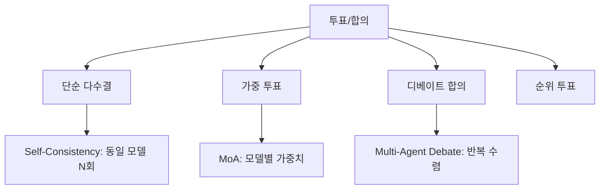

# 에이전트 합의와 투표

멀티에이전트 시스템에서 여러 에이전트의 출력을 **집단 의사결정**으로 통합하는 메커니즘. 다수결(majority voting)부터 가중 합의까지 다양한 프로토콜이 있다.

## 투표 방식 분류

| 방식 | 원리 | 비용 | 적합한 태스크 |
|------|------|------|-------------|
| 단순 다수결 | N개 응답 중 최빈값 | N회 호출 | 수학, 분류 |
| 가중 투표 | 모델 신뢰도별 가중치 | N회 | 전문 영역 혼합 |
| [[multi-agent-debate\|디베이트]] | 반복 비판+수정 후 합의 | N x R회 | 추론, 분석 |
| [[mixture-of-agents\|MoA]] | 레이어별 집계 | 2N회 | 범용 품질 향상 |

## Self-Consistency와의 관계

[[self-consistency-paper|Self-Consistency]]는 단일 모델의 다수결이고, 멀티에이전트 투표는 **이기종 모델의 다수결**이다. 이기종 앙상블이 동종보다 다양성이 높아 오류 상관이 낮다.

## 관련 문서

- [[multi-agent-debate]] -- 멀티에이전트 디베이트
- [[mixture-of-agents]] -- 에이전트 혼합
- [[multi-agent-orchestration]] -- 멀티에이전트 오케스트레이션
- [[contract-net-protocol]] -- 컨트랙트 넷 프로토콜
