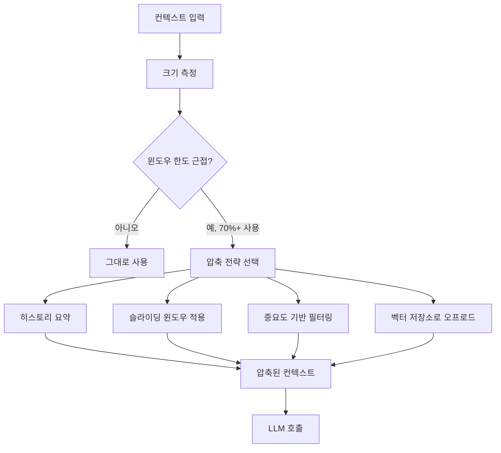
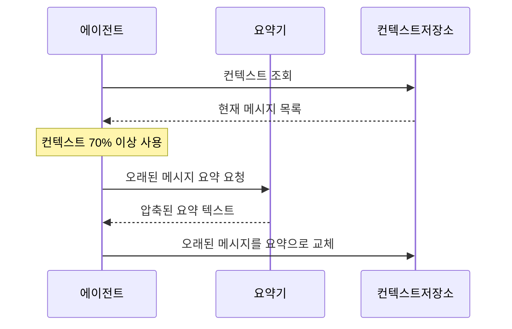
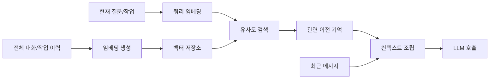
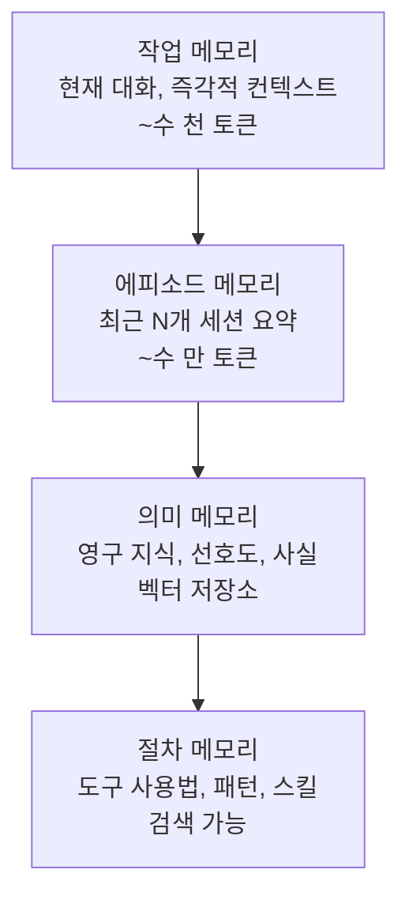

# 에이전트 컨텍스트 관리

## 개요

에이전트 컨텍스트 관리(Agent Context Management)는 장기 실행 에이전트가 제한된 컨텍스트 창(context window) 안에서 최대한 많은 관련 정보를 유지하면서 효율적으로 동작하게 하는 전략이다. 컨텍스트 창은 LLM이 한 번에 "기억"할 수 있는 토큰 수의 물리적 한계이며, 이 한계를 어떻게 관리하느냐가 에이전트의 장기 작업 수행 능력을 결정한다.

컨텍스트 관리가 중요한 이유:
- 대부분의 LLM은 컨텍스트가 길어질수록 "중간 망각(lost in the middle)" 현상이 나타난다
- 컨텍스트가 꽉 차면 에이전트가 갑자기 오래된 정보를 잃어 방향을 잃을 수 있다
- 불필요한 토큰은 API 비용을 높이고 응답 속도를 낮춘다
- 멀티턴 대화나 장기 태스크에서 히스토리 전체를 유지하는 것은 현실적이지 않다



## 컨텍스트 창 크기 현황

주요 LLM의 컨텍스트 창 크기 (2025년 기준):

| 모델 | 컨텍스트 창 | 실효 추론 범위 |
|------|-----------|--------------|
| Claude Sonnet/Opus | 200K 토큰 | 200K (Anthropic 기준 전체 활용 가능) |
| GPT-4o | 128K 토큰 | 중간 부분에서 성능 저하 가능 |
| Gemini 1.5 Pro | 1M 토큰 | 전체적으로 높은 재현율 주장 |
| Llama 3.1 | 128K 토큰 | 실효 범위 짧아짐 |

컨텍스트가 길더라도 "중간 망각(lost in the middle)" 연구에 따르면, 실제로 LLM이 주의를 기울이는 것은 **컨텍스트의 앞부분과 뒷부분**이다. 중간에 배치된 중요 정보는 잊혀질 수 있다.

## 핵심 전략

### 1. 슬라이딩 윈도우 (Sliding Window)

가장 오래된 대화/작업 이력을 버리고 최근 N개의 메시지만 유지한다.

```python
from collections import deque

class SlidingWindowContext:
    def __init__(self, max_messages: int = 20, max_tokens: int = 50000):
        self.max_messages = max_messages
        self.max_tokens = max_tokens
        self.messages: deque[dict] = deque()
        self._token_count = 0
    
    def add_message(self, role: str, content: str):
        """메시지를 추가하고 윈도우를 유지한다."""
        tokens = estimate_tokens(content)
        
        # 토큰 수 기반 오래된 메시지 제거
        while (self._token_count + tokens > self.max_tokens and 
               len(self.messages) > 2):  # 최소 2개(시스템+첫 사용자)는 유지
            removed = self.messages.popleft()
            self._token_count -= estimate_tokens(removed["content"])
        
        # 메시지 수 기반 제거
        while len(self.messages) >= self.max_messages:
            removed = self.messages.popleft()
            self._token_count -= estimate_tokens(removed["content"])
        
        self.messages.append({"role": role, "content": content})
        self._token_count += tokens
    
    def get_context(self) -> list[dict]:
        return list(self.messages)
```

**한계**: 오래된 중요 정보(초기 지시, 핵심 제약사항)가 버려질 수 있다.

**개선**: 시스템 프롬프트와 초기 지시는 항상 보존하고, 그 이후의 대화 이력만 슬라이딩 윈도우 적용.

### 2. 히스토리 요약 압축 (Summarization Compression)

대화 이력을 LLM으로 요약해 핵심 정보만 압축된 형태로 유지한다.



```python
async def compress_history(messages: list[dict], llm) -> str:
    """대화 이력을 압축된 요약으로 변환한다."""
    conversation_text = "\n".join([
        f"{m['role'].upper()}: {m['content']}"
        for m in messages
    ])
    
    summary = await llm.generate(f"""
    다음 대화 이력을 압축하세요. 
    중요한 결정, 발견된 사실, 현재 상태, 미완료 작업을 보존하세요.
    
    대화:
    {conversation_text}
    
    압축 요약 (원본의 20% 이하 길이):
    """)
    return summary

class SummarizingContext:
    def __init__(self, compress_threshold: float = 0.7, llm=None):
        self.compress_threshold = compress_threshold  # 70% 채워지면 압축
        self.messages: list[dict] = []
        self.summaries: list[str] = []  # 압축된 이전 컨텍스트
        self.llm = llm
        self.max_tokens = 100000
    
    async def add_message(self, role: str, content: str):
        self.messages.append({"role": role, "content": content})
        
        current_tokens = sum(estimate_tokens(m["content"]) for m in self.messages)
        if current_tokens > self.max_tokens * self.compress_threshold:
            await self._compress_old_messages()
    
    async def _compress_old_messages(self):
        # 앞쪽 절반을 요약으로 압축
        split_point = len(self.messages) // 2
        old_messages = self.messages[:split_point]
        self.messages = self.messages[split_point:]
        
        summary = await compress_history(old_messages, self.llm)
        self.summaries.append(summary)
```

### 3. 중요도 기반 필터링 (Importance-Based Filtering)

모든 메시지를 동등하게 취급하지 않고, 현재 작업과의 관련성에 따라 포함 여부를 결정한다.

```python
async def score_message_relevance(
    message: dict,
    current_task: str,
    llm
) -> float:
    """현재 태스크에 대한 메시지 관련성 점수를 계산한다 (0.0-1.0)."""
    score_prompt = f"""
    현재 작업: {current_task}
    
    메시지: {message['content']}
    
    이 메시지가 현재 작업을 진행하는 데 얼마나 중요한가요?
    0.0 (전혀 관련 없음) ~ 1.0 (매우 중요) 사이의 숫자만 반환하세요.
    """
    score = float(await llm.generate(score_prompt))
    return score

def filter_context_by_importance(
    messages: list[dict],
    scores: list[float],
    max_tokens: int,
    min_score: float = 0.3
) -> list[dict]:
    """중요도 점수에 따라 컨텍스트를 필터링한다."""
    # 점수 순으로 정렬, 점수가 낮은 것은 제거 후보
    scored_messages = sorted(
        zip(scores, messages),
        key=lambda x: x[0],
        reverse=True
    )
    
    filtered = []
    current_tokens = 0
    
    for score, msg in scored_messages:
        if score < min_score:
            continue
        msg_tokens = estimate_tokens(msg["content"])
        if current_tokens + msg_tokens <= max_tokens:
            filtered.append(msg)
            current_tokens += msg_tokens
    
    # 시간 순서 복원
    return sorted(filtered, key=lambda m: messages.index(m))
```

### 4. 벡터 저장소 메모리 (Vector Store Memory)

컨텍스트 창에 다 담을 수 없는 이전 정보를 벡터 저장소에 저장하고, 필요할 때 의미 검색으로 꺼내오는 패턴이다.



```python
from langchain.memory import VectorStoreRetrieverMemory
from langchain_community.vectorstores import Chroma
from langchain_anthropic import AnthropicEmbeddings

# 벡터 저장소 기반 메모리 설정
vectorstore = Chroma(embedding_function=AnthropicEmbeddings())
retriever = vectorstore.as_retriever(search_kwargs={"k": 5})

memory = VectorStoreRetrieverMemory(
    retriever=retriever,
    memory_key="relevant_history",
)

# 각 대화 후 메모리에 저장
memory.save_context(
    inputs={"input": user_message},
    outputs={"output": agent_response}
)

# 다음 대화에서 관련 기억 검색
relevant_history = memory.load_memory_variables({"prompt": current_query})
```

### 5. 계층적 메모리 구조 (Hierarchical Memory)

컨텍스트를 여러 수준으로 분리해 관리한다. [[agent-memory-systems]] 페이지에서 전체 메모리 계층 구조를 참조한다.



## 컨텍스트 폭발 회피 (Context Explosion Avoidance)

도구 사용 에이전트에서 자주 발생하는 컨텍스트 폭발 패턴과 대응:

**폭발 패턴 1: 대용량 도구 출력**

```python
# 나쁜 예: 전체 파일을 컨텍스트에 포함
file_content = read_file("large_log.txt")  # 10만 토큰
messages.append({"role": "tool", "content": file_content})

# 좋은 예: 필요한 부분만 추출
relevant_lines = extract_relevant_lines(file_content, query=current_task)
messages.append({"role": "tool", "content": relevant_lines})  # 수백 토큰
```

**폭발 패턴 2: 반복 도구 호출 누적**

```python
# 나쁜 예: 모든 도구 호출 결과를 누적
for step in range(50):
    result = tool.execute(...)
    all_results.append(result)
    context.extend(all_results)  # 폭발!

# 좋은 예: 도구 결과를 요약으로 교체
for step in range(50):
    result = tool.execute(...)
    summary = summarize_if_large(result, max_tokens=500)
    context.append({"role": "tool", "content": summary})
```

**폭발 패턴 3: 코드 실행 출력 누적**

코드 실행 에이전트에서 stdout이 컨텍스트를 채우는 경우:

```python
MAX_OUTPUT_TOKENS = 2000

def truncate_execution_output(output: str) -> str:
    tokens = estimate_tokens(output)
    if tokens <= MAX_OUTPUT_TOKENS:
        return output
    
    # 앞부분과 뒷부분만 유지 (중간 생략 표시)
    lines = output.split("\n")
    head_lines = lines[:30]
    tail_lines = lines[-20:]
    omitted_count = len(lines) - 50
    
    return "\n".join(head_lines) + f"\n... ({omitted_count}줄 생략) ...\n" + "\n".join(tail_lines)
```

## 컨텍스트 구조화 (Context Structuring)

중요 정보를 컨텍스트의 앞부분과 뒷부분에 배치해 "중간 망각" 효과를 최소화한다.

```python
def build_structured_context(
    system_prompt: str,
    current_task: str,
    relevant_history: list[dict],
    recent_messages: list[dict],
) -> list[dict]:
    """중요도에 따라 컨텍스트를 전략적으로 배치한다."""
    
    # 구조: [시스템] [현재 목표] [관련 이력] [최근 메시지]
    # 앞부분에 핵심 정보, 뒷부분에 최근 맥락
    context = [
        {"role": "system", "content": system_prompt},  # 항상 앞부분
    ]
    
    # 현재 목표를 명시적으로 주입
    context.append({
        "role": "system",
        "content": f"현재 수행 중인 주요 태스크: {current_task}"
    })
    
    # 관련 과거 기억 (벡터 검색으로 선별)
    if relevant_history:
        history_text = "\n".join([m["content"] for m in relevant_history])
        context.append({
            "role": "system",
            "content": f"관련 이전 컨텍스트:\n{history_text}"
        })
    
    # 최근 대화는 뒷부분에 (LLM이 주목하는 위치)
    context.extend(recent_messages)
    
    return context
```

## 성능 측정 지표

| 지표 | 설명 | 목표 |
|------|------|------|
| 컨텍스트 활용률 | 평균 컨텍스트 창 사용 비율 | 60-80% (폭발 방지) |
| 핵심 정보 보존율 | 압축 후 중요 정보 유지 비율 | 95%+ |
| 검색 재현율 | 벡터 검색으로 관련 기억을 찾는 비율 | 85%+ |
| 압축 지연 | 요약/압축 작업에 소요되는 추가 시간 | 500ms 이내 |

## 한계와 트레이드오프

- **압축 손실**: 요약 과정에서 세부 정보가 손실됨. 후에 필요할 수 있는 정보를 버릴 위험
- **검색 품질**: 벡터 검색으로 꺼낸 기억이 항상 관련성이 높지 않을 수 있음
- **비용**: 요약을 위한 추가 LLM 호출, 벡터 저장소 운용 비용
- **일관성 문제**: 메시지를 제거하면 에이전트가 이전에 "본" 정보를 못 보는 듯 행동할 수 있음

## 관련 문서

- [[agent-memory-systems]] -- 에이전트 메모리 계층 구조 전반
- [[context-folding]] -- 서브 궤적 압축 패턴
- [[agent-token-budget-management]] -- 토큰 예산 관리
- [[rag]] -- 벡터 검색 기반 외부 메모리
- [[prompt-caching-agentic]] -- 정적 컨텍스트 캐싱으로 비용 절감
