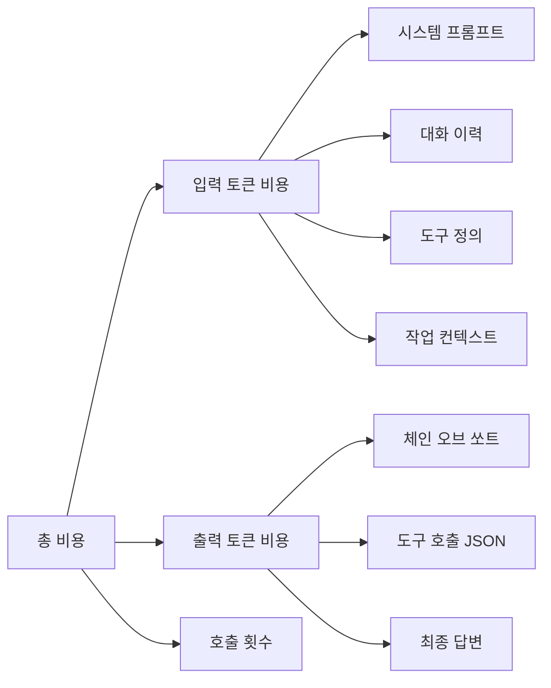
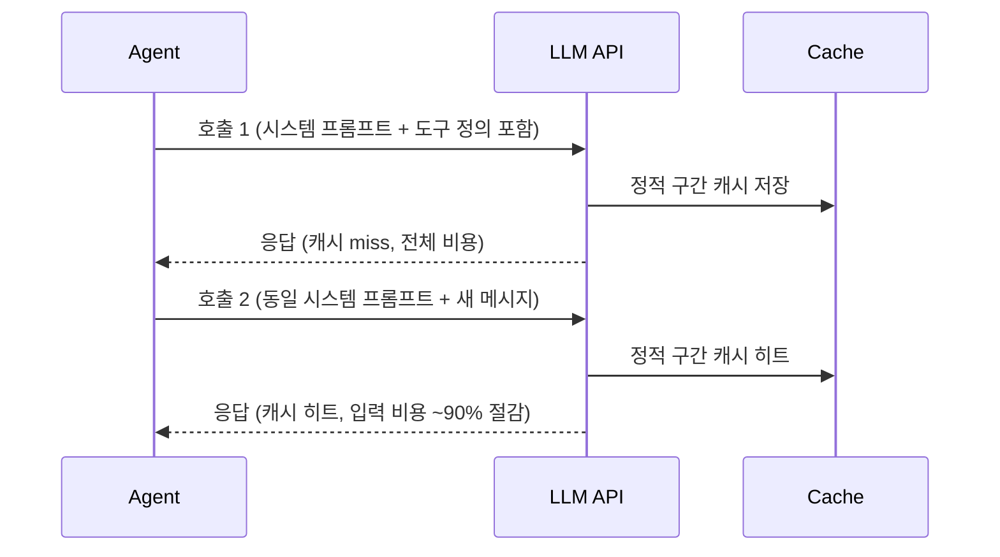

# 에이전트 비용 최적화 (Agent Cost Optimization)

LLM 에이전트의 운영 비용을 줄이면서 품질을 유지하는 전략의 집합. 토큰 예산 설정, 모델 라우팅, 프롬프트 캐싱, 컨텍스트 압축 등 여러 기법을 조합해 적용한다.

## 왜 중요한가

에이전트는 단일 LLM 호출과 달리 수십~수백 번의 연속 호출을 수행한다. [[how-coding-agents-work]]에서 분석한 대로 코딩 에이전트 하나가 복잡한 태스크에서 50~200회 LLM 호출을 하는 경우도 드물지 않다. 비용은 호출 수 x 평균 토큰 수 x 단가로 선형 이상 증가하므로, 최적화 없이는 프로덕션 단계에서 경제성이 급격히 악화된다.

## 비용 구조 분해



입력 토큰이 출력 토큰보다 저렴하지만, 에이전트 루프에서는 동일한 시스템 프롬프트와 도구 정의가 매 호출마다 반복 전송되어 누적 비용이 크다. 이 반복 비용이 [[prompt-caching-agentic]] 전략의 핵심 타겟이다.

## 전략 1: 토큰 예산 제어

```
시스템 프롬프트에 토큰 예산을 명시:
"당신은 최대 {budget}개의 토큰을 사용할 수 있습니다.
현재 사용량: {used}. 예산이 부족하면 작업을 간소화하세요."
```

- 각 태스크 유형별로 사전 예산 상한을 설정한다.
- 에이전트가 스스로 남은 예산을 인식하고 남은 스텝을 조절하도록 유도한다.
- Anthropic의 Claude API는 thinking 토큰에 대해 별도 `budget_tokens` 파라미터를 지원한다.

## 전략 2: 모델 라우팅

태스크 복잡도에 따라 다른 성능·비용의 모델로 라우팅하는 전략이다.

| 태스크 유형 | 권장 모델 계층 | 예시 |
|-------------|---------------|------|
| 단순 분류, 라벨링 | Nano/Haiku급 | 의도 분류, 키워드 추출 |
| 일반 생성, 요약 | Sonnet급 | 초안 작성, 번역 |
| 복잡 추론, 계획 | Opus/GPT-4급 | 아키텍처 설계, 다단계 추론 |
| 코드 생성 | 코드 특화 모델 | CodeLlama, DeepSeek Coder |

라우터 자체도 소형 LLM(분류 모델)이나 규칙 기반 로직으로 구현할 수 있다.

## 전략 3: 프롬프트 캐싱

[[prompt-caching-agentic]]의 핵심: 에이전트 루프에서 반복되는 정적 콘텐츠(시스템 프롬프트, 도구 정의, 긴 문서)를 캐시해 재사용한다.



Anthropic의 경우 캐시 히트 시 입력 토큰 비용이 기본가의 10%로 줄어든다. 캐시 수명(TTL)은 보통 5분이다.

## 전략 4: 컨텍스트 압축

대화 이력이 길어질수록 매 호출의 입력 토큰이 폭증한다. 주요 압축 기법:

- **슬라이딩 윈도우**: 최근 N개 메시지만 유지하고 이전 내용은 드롭
- **롤링 요약**: 오래된 메시지를 LLM으로 요약해 압축 저장
- **요점 추출**: 각 에이전트 스텝에서 핵심 결과만 다음 스텝으로 전달

[[context-folding]] 패턴은 이 중 롤링 요약을 체계화한 접근법이다.

## 전략 5: 도구 정의 최적화

도구 정의(JSON Schema)는 매 호출마다 전송된다. 불필요하게 많은 도구를 등록하면 낭비다.

- **동적 도구 로딩**: 현재 태스크 단계에 필요한 도구만 주입
- **도구 설명 압축**: `description` 필드를 최소화 (에이전트 성능에 큰 영향 없음을 확인한 경우)
- **도구 집계**: 유사한 도구를 하나의 멀티파라미터 도구로 병합

## 비용 모니터링 지표

실시간 비용 추적에 필요한 핵심 지표:

| 지표 | 설명 |
|------|------|
| Cost per Task | 태스크 완료당 평균 비용 |
| Token Efficiency | 출력 품질 / 총 토큰 수 |
| Cache Hit Rate | 캐시 히트 비율 (목표: 70%+) |
| Model Distribution | 모델별 호출 비율 |

## 관련 문서

- [[prompt-caching-agentic]] - 프롬프트 캐싱 심화
- [[how-coding-agents-work]] - 코딩 에이전트 내부 동작
- [[agent-observability-tracing]] - 비용 추적을 위한 옵저버빌리티
