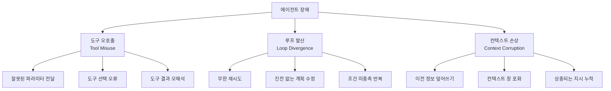
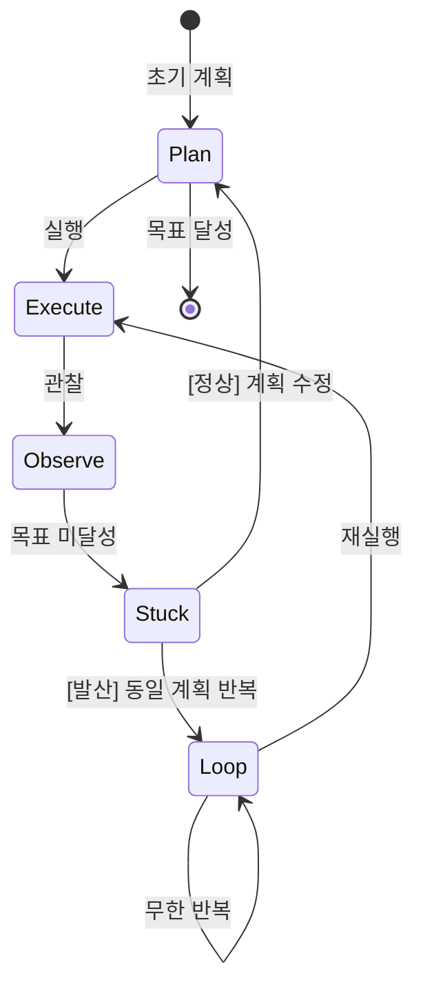
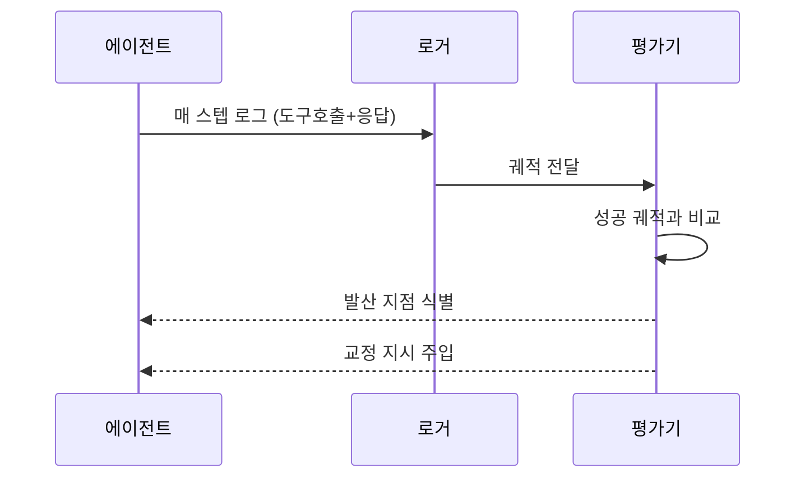

# 에이전트 디버깅 기법

LLM 에이전트 디버깅은 전통 소프트웨어 디버깅과 근본적으로 다르다. 비결정적 추론, 긴 컨텍스트 의존성, 외부 도구와의 동적 상호작용이 결합되어 재현이 어렵고 원인 추적이 복잡하다. 이 페이지는 에이전트에서 자주 발생하는 세 가지 장애 유형과 각각의 진단 방법을 다룬다.

## 주요 장애 유형 개요

## 1. 도구 오호출 (Tool Misuse)

에이전트가 도구를 잘못 사용하는 패턴은 세 가지로 나뉜다.

**잘못된 파라미터 전달**
LLM이 도구 스키마를 충분히 이해하지 못하거나 컨텍스트에서 추론한 값이 실제와 다를 때 발생한다. 예를 들어 파일 검색 도구에 절대 경로 대신 상대 경로를 전달하거나, 날짜 형식이 다른 값을 넣는 경우다.

**진단 방법**: 도구 호출 직전 LLM이 생성한 JSON 인수를 로깅하고, 실제 도구가 수신한 인수와 대조한다. 불일치가 있으면 도구 스키마 설명을 구체화한다.

**도구 선택 오류**
유사한 기능의 도구가 여러 개 있을 때 잘못된 도구를 선택한다. `search_web`과 `search_knowledge_base`가 공존할 때 내부 지식이 필요한 쿼리에 웹 검색을 사용하는 경우가 대표적이다.

**진단 방법**: 도구 선택 빈도를 추적하고 각 도구의 사용 맥락을 기록한다. 특정 도구가 비정상적으로 자주 선택되거나 거의 사용되지 않으면 도구 이름·설명 문구를 재검토한다.

## 2. 루프 발산 (Loop Divergence)

에이전트가 종료 조건에 도달하지 못하고 같은 작업을 반복하거나 진전 없이 계획을 수정하는 현상이다.

**발산 징후 감지**
- 연속 N회 이상 같은 도구를 동일 파라미터로 호출
- 계획 수정 횟수가 임계값 초과
- 에이전트 응답에 "다시 시도하겠습니다"가 반복 등장

**방지 전략**
오케스트레이터 레이어에서 반복 감지기를 구현한다. 최근 K번의 도구 호출 지문(함수명 + 핵심 파라미터 해시)을 저장하고 중복이 발생하면 에이전트에게 "현재 접근법이 작동하지 않고 있습니다. 근본적으로 다른 전략을 사용하십시오"라는 개입 메시지를 주입한다.

## 3. 컨텍스트 손상 (Context Corruption)

긴 에이전트 세션에서 컨텍스트 창이 누적되면서 정보 품질이 저하되는 현상이다. [[agent-observability-tracing]]에서 추적되는 가장 진단하기 어려운 장애 유형이다.

**주요 원인**

| 원인 | 설명 | 진단 신호 |
|------|------|-----------|
| 정보 덮어쓰기 | 이전 단계의 결론이 새 정보로 암묵적 교체 | 에이전트가 초기 제약을 무시하기 시작 |
| 컨텍스트 창 포화 | 입력 토큰이 한계에 도달해 초기 지시가 묻힘 | 시스템 프롬프트 준수 저하 |
| 상충 지시 누적 | 여러 도구 결과가 서로 모순 | 에이전트가 일관성 없는 판단 반복 |

**진단 방법**: 컨텍스트 창의 처음 1000토큰과 마지막 1000토큰을 비교 분석한다. 시스템 프롬프트의 핵심 제약이 에이전트 후반 응답에 반영되는지 자동 체크리스트로 검증한다.

## [[agent-trajectory-evaluation]]과의 연동

디버깅은 단일 실행의 사후 분석에서 끝나지 않는다. [[agent-trajectory-evaluation]]을 적용하면 성공·실패 궤적을 비교해 장애가 발생한 정확한 단계를 식별할 수 있다.

## [[agent-observability-tracing]] 활용

실시간 디버깅을 위해서는 에이전트 내부 상태를 외부에서 관찰할 수 있는 추적 인프라가 필요하다. LangSmith, Langfuse, Phoenix 같은 도구가 제공하는 스팬(span) 기반 추적은 위의 세 장애 유형을 모두 가시화한다.

## 실무 관점

- 에이전트 디버깅 로그는 구조화된 JSON 형식으로 저장해야 파싱 자동화가 가능하다.
- 재현 가능성을 높이려면 동일 시드와 temperature=0 설정으로 동일 입력을 재실행해 장애가 구조적인지 확률적인지 먼저 판별한다.
- 장애 재현이 어려울수록 테스트 시나리오로 변환해 회귀 테스트 스위트에 포함시킨다.

## 관련 문서

- [[agent-observability-tracing]] - 실시간 에이전트 상태 추적 인프라
- [[agent-trajectory-evaluation]] - 성공/실패 궤적 비교 평가 기법
- [[agent-testing-simulation]] - 디버깅 시나리오를 자동화된 테스트로 전환하는 방법
