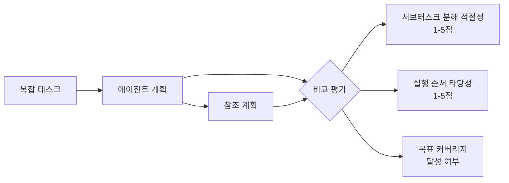
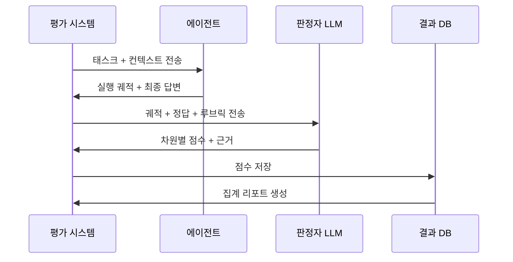

# 에이전트 평가 프레임워크 (Agent Evaluation Framework)

에이전트의 도구 정확도, 계획 품질, 비용 효율성을 종합적으로 측정하는 평가 체계. 단일 LLM 평가와 달리 **다단계 실행 과정 전체**를 평가 대상으로 삼는다.

## 왜 중요한가

벤치마크 점수 하나로 에이전트의 실제 유용성을 판단하기 어렵다. 높은 정확도를 보이는 에이전트도 비용이 너무 높거나, 성공하더라도 너무 많은 단계를 거치거나, 특정 오류 패턴을 반복할 수 있다. [[component-level-agent-evaluation]]과 [[agent-trajectory-evaluation]]은 이 다차원 평가의 필요성을 실증적으로 보여준다.

## 평가 차원

```mermaid
flowchart TD
    Eval[에이전트 평가] --> Outcome[결과 품질]
    Eval --> Process[프로세스 품질]
    Eval --> Efficiency[효율성]
    Eval --> Safety[안전성]

    Outcome --> TaskComp[태스크 완료율]
    Outcome --> Accuracy[답변 정확도]
    Outcome --> UserSat[사용자 만족도]

    Process --> ToolAcc[도구 호출 정확도]
    Process --> PlanQual[계획 품질]
    Process --> TrajScore[궤적 점수]

    Efficiency --> TokenEff[토큰 효율성]
    Efficiency --> StepCount[최소 스텝 수]
    Efficiency --> LatencyP95[p95 지연]

    Safety --> RefusalRate[거부율 (유해 요청)]
    Safety --> HalluRate[환각 발생률]
    Safety --> RecovRate[오류 복구율]
```

## 도구 정확도 평가

도구 호출의 품질을 세분화해 측정한다.

| 메트릭 | 정의 | 측정 방법 |
|--------|------|-----------|
| Tool Selection Rate | 올바른 도구를 선택한 비율 | 정답 도구 집합과 실제 선택 비교 |
| Argument Accuracy | 도구 인수를 정확히 채운 비율 | 인수별 정확도 평균 |
| Tool Error Rate | 도구 실행 시 오류 발생 비율 | 실행 로그 분석 |
| Redundant Calls | 불필요한 중복 도구 호출 비율 | 궤적 내 동일 호출 패턴 탐지 |

**평가 방법**: 황금 궤적(golden trajectory) 대비 실제 궤적을 비교하거나, LLM-as-a-Judge 방식으로 각 도구 호출의 적절성을 채점한다.

## 계획 품질 평가

에이전트가 복잡한 태스크를 얼마나 적절하게 분해하는지 측정한다.



**자동 평가 vs 인간 평가**:
- 자동 평가: LLM-as-a-Judge, 구조화된 루브릭(rubric) 기반 채점
- 인간 평가: 전문가 판단이 필요한 도메인 특화 태스크, 미묘한 추론 오류 탐지

[[agent-trajectory-evaluation]]은 궤적 수준에서 계획-실행-검증 전 단계를 평가하는 체계화된 방법론을 제공한다.

## 비용 효율성 평가

동일한 성능 목표를 달성하는 데 얼마나 효율적으로 자원을 사용하는지 측정한다.

| 메트릭 | 계산 방법 |
|--------|-----------|
| Cost per Correct Answer | 정답 1건당 총 LLM 비용 |
| Token Efficiency Ratio | 출력 품질 점수 / 총 토큰 수 |
| Steps to Completion | 태스크 완료까지 평균 스텝 수 |
| Parallelization Gain | 병렬 실행으로 절약된 시간 비율 |

## [[component-level-agent-evaluation]] 접근법

에이전트 전체를 블랙박스로 평가하는 대신 컴포넌트별로 분리해 평가하는 전략이다.

**장점**:
- 병목 지점(어떤 컴포넌트가 성능을 떨어뜨리는가)을 정확히 식별
- 각 컴포넌트를 독립적으로 개선하고 효과를 검증 가능
- 대규모 에이전트 테스트 비용 절감 (전체 실행 없이 단위 평가)

**주요 컴포넌트 평가 대상**:
- 라우터(router): 태스크를 올바른 전문 에이전트로 보내는가
- 계획 수립자(planner): 태스크 분해가 합리적인가
- 도구 호출자(tool caller): 도구를 올바르게 선택하고 인수를 채우는가
- 요약자(summarizer): 중간 결과를 정확히 압축하는가

## 평가 데이터셋 설계

**황금 데이터셋(Golden Dataset)** 구성 원칙:
1. 다양한 난이도 포함 (쉬운 30%, 중간 50%, 어려운 20%)
2. 태스크 유형 균형 (단일 도구, 다중 도구, 멀티스텝, 멀티에이전트)
3. 엣지 케이스 포함 (오류 복구, 모호한 지시, 자원 제한 상황)
4. 정기적 갱신 (모델 훈련 데이터로 오염 방지)

## 평가 파이프라인 구조



## 실무 평가 체크리스트

- [ ] 태스크 완료율 목표치 설정 (예: 80% 이상)
- [ ] 비용 상한 정의 (태스크당 최대 USD)
- [ ] 최대 허용 스텝 수 정의
- [ ] 최소 도구 호출 정확도 기준 설정
- [ ] 오류 복구 시나리오 포함
- [ ] 실제 사용자 시나리오 기반 테스트 케이스 확보

## 관련 문서

- [[component-level-agent-evaluation]] - 컴포넌트 단위 평가 전략
- [[agent-trajectory-evaluation]] - 궤적 기반 평가 방법론
- [[agent-observability-tracing]] - 평가를 위한 트레이스 수집
