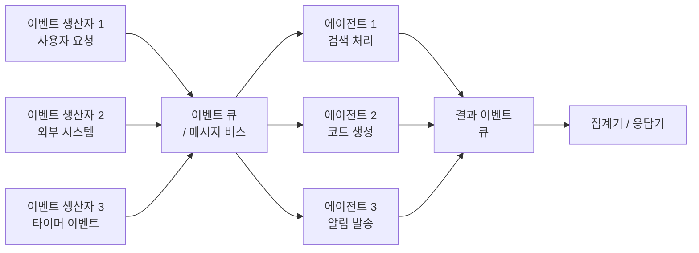
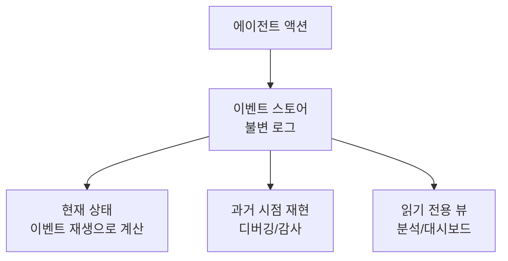
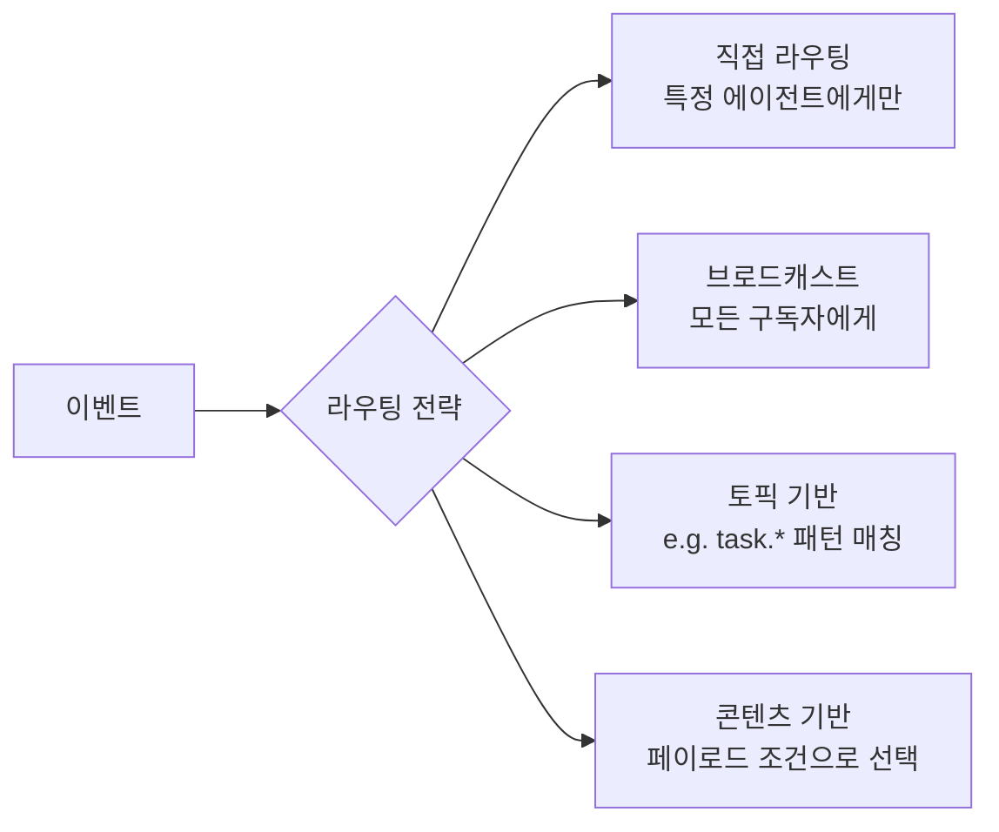
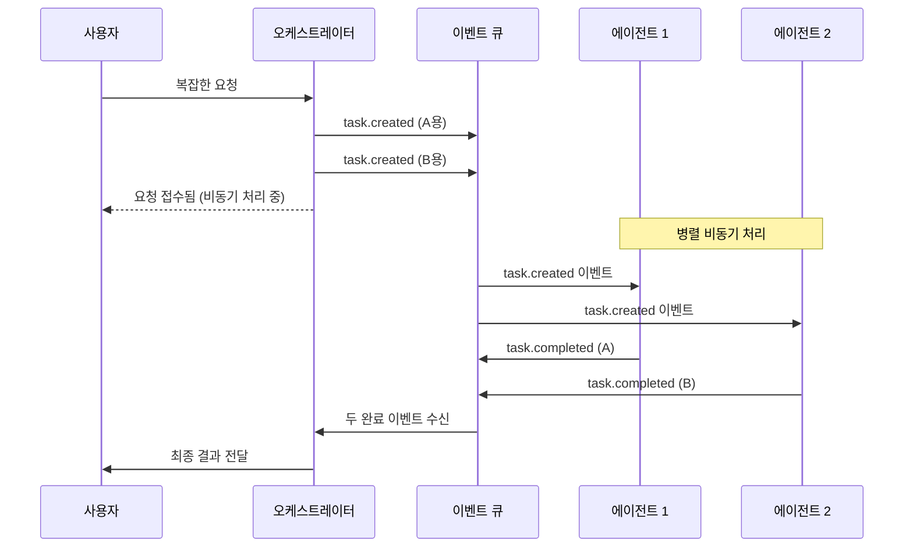
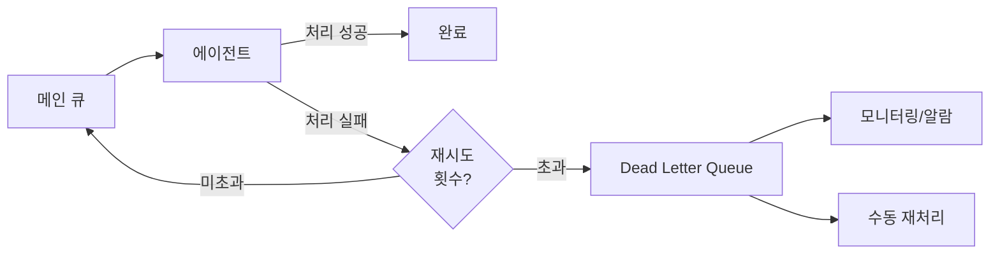
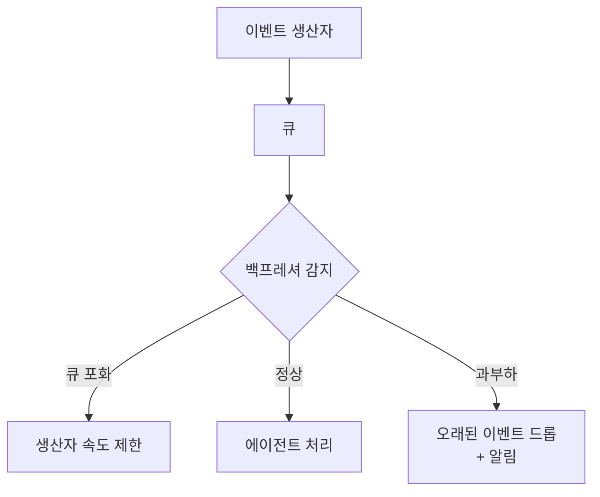

# 이벤트 주도 에이전트 패턴

## 개요

이벤트 주도(event-driven) 에이전트 패턴은 에이전트의 동작을 이벤트(event)의 발생과 그에 대한 반응으로 구성하는 아키텍처다. 요청-응답(request-response) 방식의 동기적 호출 대신, 에이전트는 이벤트 큐(event queue)나 메시지 버스(message bus)를 통해 비동기적으로 통신한다.

마이크로서비스(microservices) 아키텍처의 이벤트 소싱(event sourcing)과 CQRS(Command Query Responsibility Segregation) 패턴에서 영감을 받았으며, 여러 에이전트가 느슨하게 결합(loose coupling)된 상태로 협력하는 대규모 시스템에 적합하다.

## 왜 중요한가

- **느슨한 결합**: 이벤트 생산자와 소비자가 서로를 알 필요 없음
- **비동기 처리**: 긴 에이전트 작업을 블로킹 없이 처리
- **확장성**: 이벤트 큐를 통해 에이전트 인스턴스를 수평 확장 가능
- **감사 추적(audit trail)**: 모든 이벤트를 로그로 남기면 전체 처리 이력 확보
- **장애 격리**: 특정 에이전트 장애가 이벤트 큐에 의해 다른 에이전트에 직접 전파되지 않음

## 핵심 구성 요소



- **이벤트(Event)**: 발생한 사실을 나타내는 불변 메시지 (예: `UserRequestReceived`, `TaskCompleted`)
- **이벤트 큐/메시지 버스**: 이벤트를 임시 저장하고 라우팅 (예: Redis Streams, Kafka, RabbitMQ)
- **이벤트 핸들러(Event Handler)**: 특정 이벤트 유형에 반응하는 에이전트 또는 함수
- **이벤트 발행자(Event Publisher)**: 이벤트를 생성하고 큐에 전송

## 이벤트 스키마 설계

이벤트는 충분한 컨텍스트를 포함하는 자기 서술적(self-descriptive) 메시지여야 한다.

```python
from dataclasses import dataclass
from datetime import datetime
from typing import Any
import uuid

@dataclass
class Event:
    event_id: str           # 고유 식별자
    event_type: str         # 이벤트 유형 (예: "task.created")
    aggregate_id: str       # 관련 엔터티 ID (예: 태스크 ID)
    timestamp: datetime     # 발생 시각
    payload: dict[str, Any] # 이벤트 데이터
    correlation_id: str     # 연관 요청 추적용
    source_agent: str       # 발행한 에이전트 식별자

# 예시 이벤트들
task_created = Event(
    event_id=str(uuid.uuid4()),
    event_type="task.created",
    aggregate_id="task-001",
    timestamp=datetime.utcnow(),
    payload={"goal": "시장 조사 수행", "priority": "high"},
    correlation_id="req-abc123",
    source_agent="orchestrator"
)

task_completed = Event(
    event_id=str(uuid.uuid4()),
    event_type="task.completed",
    aggregate_id="task-001",
    timestamp=datetime.utcnow(),
    payload={"result": "...", "duration_seconds": 45},
    correlation_id="req-abc123",
    source_agent="research-agent-01"
)
```

## 이벤트 핸들러 패턴

각 에이전트는 자신이 처리할 이벤트 유형을 선언하고 핸들러를 등록한다.

```python
from typing import Callable

class EventBus:
    def __init__(self):
        self._handlers: dict[str, list[Callable]] = {}

    def subscribe(self, event_type: str, handler: Callable) -> None:
        if event_type not in self._handlers:
            self._handlers[event_type] = []
        self._handlers[event_type].append(handler)

    async def publish(self, event: Event) -> None:
        handlers = self._handlers.get(event.event_type, [])
        # 비동기 병렬 처리
        import asyncio
        await asyncio.gather(*[handler(event) for handler in handlers])


# 에이전트가 이벤트 구독
event_bus = EventBus()

async def handle_task_created(event: Event) -> None:
    """태스크 생성 이벤트 처리"""
    goal = event.payload["goal"]
    # 에이전트 로직 실행
    result = await research_agent.execute(goal)
    # 완료 이벤트 발행
    await event_bus.publish(Event(
        event_type="task.completed",
        aggregate_id=event.aggregate_id,
        payload={"result": result},
        correlation_id=event.correlation_id,
        ...
    ))

event_bus.subscribe("task.created", handle_task_created)
```

## 이벤트 소싱 (Event Sourcing)과의 결합

에이전트의 모든 상태 변화를 이벤트 스트림으로 저장하면, 언제든지 상태를 재현할 수 있다.



이벤트 소싱 적용 시 이점:
- 에이전트가 특정 시점에 왜 그런 결정을 내렸는지 완전히 재현 가능
- 버그 발견 시 실제 이벤트 스트림으로 재생 가능
- 여러 읽기 모델(read model)을 동일 이벤트 스트림에서 생성 가능

## 이벤트 라우팅 전략



### 토픽 기반 라우팅 예시

```python
# 와일드카드 패턴 매칭
event_bus.subscribe("task.*", handle_any_task)           # 모든 태스크 이벤트
event_bus.subscribe("task.completed", handle_completed)  # 완료 이벤트만
event_bus.subscribe("*.failed", handle_any_failure)      # 모든 실패 이벤트
```

## 비동기 에이전트 시스템

이벤트 주도 패턴은 자연스럽게 비동기 에이전트 시스템을 만든다.



사용자는 즉시 "요청 접수됨"을 받고, 결과는 나중에 비동기로 전달된다. 웹훅(webhook)이나 서버-센트 이벤트(SSE)로 결과를 Push하는 방식과 결합된다.

## 오류 처리 패턴

### Dead Letter Queue (DLQ)

처리 실패한 이벤트를 별도 큐에 격리한다.



### 이벤트 보상(Compensating Events)

실패한 작업을 되돌리는 보상 이벤트를 발행한다. [[agent-saga-pattern]]과 연결된다.

```python
# 예약 프로세스에서 실패 발생 시
async def handle_payment_failed(event: Event) -> None:
    """결제 실패 시 예약 취소 보상 이벤트 발행"""
    await event_bus.publish(Event(
        event_type="reservation.cancelled",
        aggregate_id=event.aggregate_id,
        payload={"reason": "payment_failed", "original_event_id": event.event_id},
        ...
    ))
```

## 백프레셔 (Backpressure) 관리

에이전트가 처리할 수 있는 속도보다 이벤트가 더 빠르게 들어올 때 처리 전략이 필요하다.



- **속도 제한(rate limiting)**: 생산자에게 슬로우다운 신호 전송
- **배압 신호(backpressure signal)**: `Queue Full` 응답으로 생산자가 재시도 지연
- **우선순위 큐**: 높은 우선순위 이벤트가 먼저 처리되도록

## 이벤트 중복 및 순서 처리

분산 시스템에서 이벤트는 중복 전달(at-least-once delivery)되거나 순서가 바뀔 수 있다.

```python
class IdempotentEventHandler:
    def __init__(self):
        self.processed_event_ids: set[str] = set()

    async def handle(self, event: Event) -> None:
        # 멱등성(idempotency) 보장: 중복 이벤트 무시
        if event.event_id in self.processed_event_ids:
            return
        self.processed_event_ids.add(event.event_id)
        await self._process(event)
```

순서 보장이 필요한 경우 이벤트에 `sequence_number`를 추가하고 순서 버퍼(sequence buffer)를 사용한다.

## 실제 적용 사례

### 문서 처리 파이프라인

```
document.uploaded
  → parsing.agent: 텍스트 추출 → document.parsed
  → embedding.agent: 벡터 생성 → document.embedded
  → indexing.agent: 검색 인덱스 업데이트 → document.indexed
  → notification.agent: 처리 완료 알림
```

각 단계가 이벤트로 연결되어, 특정 단계 실패 시 해당 단계만 재처리 가능하다.

### 멀티에이전트 리서치 시스템

```
research.request.received
  → web-search.agent (3개 병렬) → search.result.found
  → aggregation.agent → research.aggregated
  → critique.agent → research.critiqued
  → synthesis.agent → research.completed
```

## 마이크로서비스와의 비교

| 비교 항목 | 마이크로서비스 이벤트 | LLM 에이전트 이벤트 |
|-----------|-------------------|-------------------|
| 이벤트 생산자 | 서비스 (결정론적) | 에이전트 (LLM 기반) |
| 처리 시간 | 밀리초-초 단위 | 초-분 단위 |
| 재시도 전략 | 표준화된 재시도 | 태스크 재설계 가능 |
| 상태 복잡도 | 도메인 모델 기반 | 자연어 컨텍스트 포함 |

## 한계 및 트레이드오프

### 장점
- 느슨한 결합으로 에이전트 독립 교체/업그레이드
- 비동기 처리로 사용자 경험 개선
- 이벤트 로그로 완전한 감사 추적

### 단점
- **복잡성 증가**: 동기 시스템보다 디버깅과 추적이 어려움
- **최종 일관성(eventual consistency)**: 즉각적인 상태 동기화가 보장되지 않음
- **이벤트 스키마 관리**: 이벤트 형식 변경이 하위 호환성 문제 유발
- **순서 보장 어려움**: 분산 큐에서 이벤트 순서 유지 비용
- **인프라 요건**: 메시지 브로커 운영 부담 (Kafka, Redis Streams 등)

## 관련 문서

- [[agent-state-machine]] - 상태 전이를 명시적으로 모델링하는 FSM 패턴
- [[agent-saga-pattern]] - 이벤트 기반 다단계 트랜잭션 패턴
- [[agent-interrupt-resume]] - 이벤트로 에이전트 중단/재개
- [[multi-agent-orchestration]] - 멀티에이전트 조율 패턴
- [[agent-observability-tracing]] - 이벤트 기반 시스템 추적
