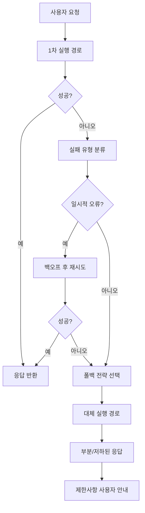
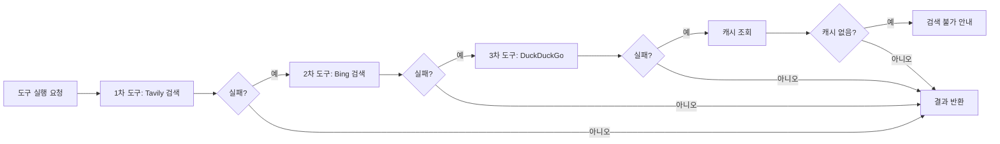
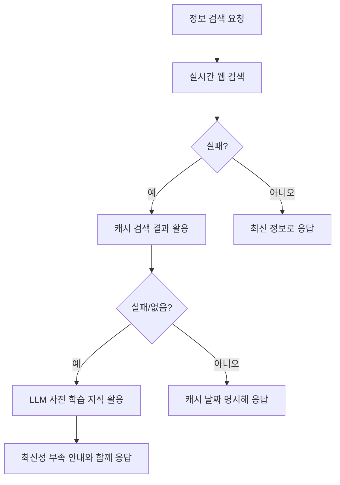
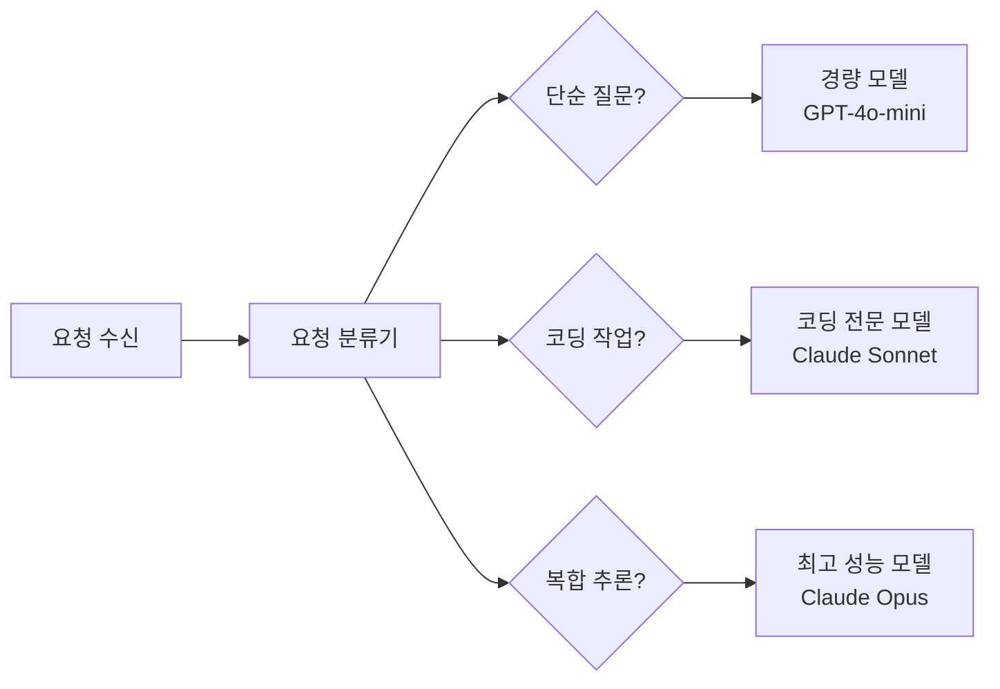
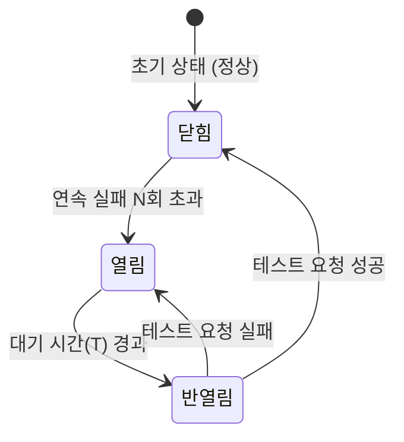

# 에이전트 폴백 전략

## 개요

에이전트 폴백 전략(Agent Fallback Strategies)은 에이전트의 주요 실행 경로가 실패했을 때 서비스 중단 없이 대체 경로로 전환하는 설계 패턴이다. "우아한 저하(graceful degradation)"라고도 불리며, 완전한 기능 제공이 불가능할 때 부분적으로나마 가치를 제공하는 것을 목표로 한다.

프로덕션 에이전트에서 폴백 전략이 필수인 이유:
- 외부 API(검색, 도구, LLM 제공자)는 항상 일시적으로 다운될 수 있다
- 고급 모델은 응답 지연이 크거나 비용이 높아 모든 요청에 항상 쓸 수 없다
- 입력이 특정 모델의 컨텍스트 한계를 초과할 수 있다
- 일부 도구는 특정 환경에서만 동작한다



## 폴백 유형

### 1. 도구 폴백 (Tool Fallback)

주요 도구가 실패했을 때 대체 도구를 사용한다.



```python
from typing import Callable, Any

class ToolWithFallback:
    def __init__(self, primary: Callable, fallbacks: list[Callable]):
        self.primary = primary
        self.fallbacks = fallbacks
    
    async def execute(self, *args, **kwargs) -> Any:
        """주요 도구 실패 시 순서대로 폴백을 시도한다."""
        all_tools = [self.primary] + self.fallbacks
        
        for i, tool in enumerate(all_tools):
            try:
                result = await tool(*args, **kwargs)
                if i > 0:
                    logger.info(f"폴백 도구 {i}번이 성공했습니다: {tool.__name__}")
                return result
            except Exception as e:
                logger.warning(f"도구 {tool.__name__} 실패: {e}")
                if i == len(all_tools) - 1:
                    raise RuntimeError(f"모든 도구가 실패했습니다: {e}") from e
```

### 2. 모델 폴백 (Model Fallback)

주요 LLM 제공자가 다운되거나 응답이 너무 느릴 때 대체 모델로 전환한다.

```python
@dataclass
class ModelConfig:
    provider: str
    model: str
    max_tokens: int
    cost_per_1k_tokens: float
    priority: int  # 낮을수록 우선

MODEL_CHAIN = [
    ModelConfig("anthropic", "claude-opus-4-5", 8192, 0.015, 1),
    ModelConfig("openai", "gpt-4o", 8192, 0.010, 2),
    ModelConfig("anthropic", "claude-sonnet-4-5", 8192, 0.003, 3),
    ModelConfig("openai", "gpt-4o-mini", 8192, 0.00015, 4),  # 마지막 폴백
]

async def generate_with_model_fallback(prompt: str, preferred_config: ModelConfig) -> str:
    """모델 장애 시 자동으로 다음 모델로 전환한다."""
    chain = sorted(
        [c for c in MODEL_CHAIN if c.priority >= preferred_config.priority],
        key=lambda x: x.priority
    )
    
    for config in chain:
        try:
            return await call_model(config, prompt)
        except (RateLimitError, ServiceUnavailableError) as e:
            logger.warning(f"{config.provider}/{config.model} 사용 불가: {e}")
    
    raise RuntimeError("사용 가능한 모델이 없습니다")
```

### 3. 기능 저하 폴백 (Capability Degradation)

고급 기능을 제공할 수 없을 때 기본 기능으로 저하한다.

**예시: 검색 기능 저하 단계**



| 저하 단계 | 제공 기능 | 사용자 안내 |
|---------|----------|------------|
| 정상 | 실시간 웹 검색 + LLM | 없음 |
| 1단계 저하 | 캐시 데이터 + LLM | "캐시 데이터 사용 (N시간 전)" |
| 2단계 저하 | LLM 사전 학습 지식만 | "인터넷 접근 불가, 최신 정보 없음" |
| 완전 실패 | 기본 안내 메시지 | "서비스 일시 중단" |

### 4. 다중 모델 라우팅 (Multi-Model Routing)

폴백을 반응적 실패 처리가 아닌 선제적 라우팅으로 접근한다. 요청 특성에 따라 최적 모델을 사전에 선택한다.



[[agent-model-routing]] 페이지에서 라우팅 전략 상세 내용을 참조한다.

## 서킷 브레이커 패턴 (Circuit Breaker)

특정 서비스/도구가 반복적으로 실패하면 일정 시간 동안 호출 자체를 차단해 시스템 부하를 줄이고 빠른 실패를 제공하는 패턴이다.



**상태 설명:**
- **닫힘 (Closed)**: 정상 동작. 요청이 실제 서비스로 전달됨
- **열림 (Open)**: 서비스 차단. 즉시 폴백 반환 (실제 호출 없음)
- **반열림 (Half-Open)**: 복구 테스트. 제한된 요청만 허용해 서비스 상태 확인

```python
from dataclasses import dataclass, field
from datetime import datetime, timedelta

@dataclass
class CircuitBreaker:
    failure_threshold: int = 5
    recovery_timeout_seconds: int = 60
    
    failure_count: int = 0
    last_failure_time: datetime | None = None
    state: str = "closed"  # closed, open, half_open
    
    def is_open(self) -> bool:
        if self.state == "open":
            # 복구 타임아웃 경과 시 half_open으로 전환
            if datetime.now() - self.last_failure_time > timedelta(seconds=self.recovery_timeout_seconds):
                self.state = "half_open"
                return False
            return True
        return False
    
    def record_success(self):
        self.failure_count = 0
        self.state = "closed"
    
    def record_failure(self):
        self.failure_count += 1
        self.last_failure_time = datetime.now()
        if self.failure_count >= self.failure_threshold:
            self.state = "open"
```

## 폴백 체인 설계 원칙

### 투명성 (Transparency)

사용자에게 폴백이 발생했음을 알린다. 무엇이 제한되는지 명확히 안내한다.

```python
@dataclass
class AgentResponse:
    content: str
    is_degraded: bool = False
    degradation_reason: str | None = None
    data_freshness: str | None = None  # "실시간", "1시간 전", "사전학습 데이터"

def format_response_with_notice(response: AgentResponse) -> str:
    if response.is_degraded:
        notice = f"\n\n[서비스 알림: {response.degradation_reason}]"
        if response.data_freshness:
            notice += f" 데이터 기준: {response.data_freshness}"
        return response.content + notice
    return response.content
```

### 폴백 우선순위 계층

1. 캐시된 결과 (가장 빠름, 최신성 낮음)
2. 대체 동등 도구 (유사 품질)
3. 경량 대체 모델 (낮은 비용, 낮은 품질)
4. 정적 응답/안내 메시지 (최후 수단)

### 폴백 모니터링

어떤 폴백이 얼마나 자주 발생하는지 추적한다. 특정 폴백이 자주 트리거된다면 해당 서비스의 의존성을 재검토해야 한다.

```python
import time
from functools import wraps

fallback_metrics = {}  # {service_name: {success: int, fallback_count: int}}

def track_fallback(service_name: str):
    def decorator(func):
        @wraps(func)
        async def wrapper(*args, **kwargs):
            try:
                result = await func(*args, **kwargs)
                fallback_metrics.setdefault(service_name, {"success": 0, "fallback": 0})
                fallback_metrics[service_name]["success"] += 1
                return result
            except Exception:
                fallback_metrics.setdefault(service_name, {"success": 0, "fallback": 0})
                fallback_metrics[service_name]["fallback"] += 1
                raise
        return wrapper
    return decorator
```

## 실무 적용 사례

### RAG 에이전트 폴백 체인

1. **벡터 검색 실패** → 키워드(BM25) 검색으로 폴백
2. **외부 문서 DB 불가** → 로컬 캐시 문서로 폴백
3. **LLM API 과부하** → 경량 모델로 폴백 + 응답 품질 안내
4. **모든 검색 실패** → LLM 지식만으로 응답 + 정보 제한 안내

### 코딩 에이전트 폴백 체인

1. **코드 실행 실패** → 오류 분석 + 자동 수정 시도
2. **수정 3회 실패** → 다른 구현 접근으로 전환
3. **근본적 해결 불가** → 사람에게 에스컬레이션 + 부분 완성 코드 제공

## 한계와 트레이드오프

- **복잡성 증가**: 폴백 체인이 길수록 코드와 유지보수 복잡도가 증가
- **일관성 문제**: 서로 다른 도구/모델의 응답 형식이 다를 수 있음
- **과신 위험**: 폴백이 자동으로 처리되면 실제 장애를 인식하지 못할 수 있음
- **성능 오버헤드**: 폴백 판단과 실행에 추가 지연이 발생

## 관련 문서

- [[agent-self-correction]] -- 에이전트 자기 교정 패턴
- [[agent-rate-limiting-patterns]] -- API 한도 관리와 백오프
- [[agent-model-routing]] -- 요청별 최적 모델 선택
- [[human-in-the-loop-patterns]] -- 사람 에스컬레이션 패턴
- [[agent-observability-tracing]] -- 폴백 발생 모니터링
