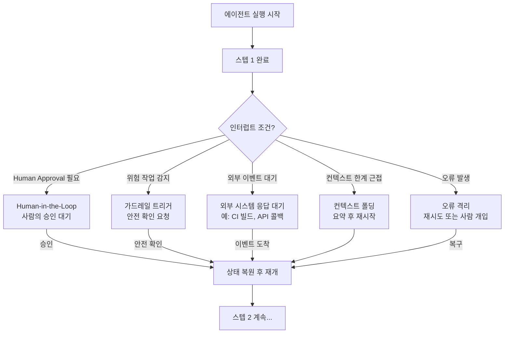

# 에이전트 인터럽트/재개 패턴 (Agent Interrupt & Resume)

## 개요

에이전트 인터럽트/재개 패턴(Agent Interrupt & Resume Pattern)은 장시간 실행되는 AI 에이전트가 **특정 시점에 실행을 중단(interrupt)하고, 상태를 저장(checkpoint)한 뒤, 이후 동일한 상태에서 실행을 재개(resume)** 할 수 있도록 설계하는 아키텍처 패턴이다.

단순한 요청-응답 에이전트와 달리, [[long-running-agent-patterns]]에서는 실행이 수 분에서 수 시간에 걸칠 수 있으며, 도중에 인간의 승인, 외부 이벤트 대기, 오류 복구 등의 이유로 실행을 일시 중단해야 하는 상황이 빈번하다.

## 인터럽트가 필요한 상황



## 핵심 구성요소

### 1. 체크포인트 (Checkpoint)

인터럽트 발생 시 저장해야 하는 에이전트 상태 스냅샷:

- **메시지 이력 (Message History)**: 현재까지의 대화 컨텍스트
- **도구 호출 결과 (Tool Results)**: 완료된 도구 실행 결과
- **중간 산출물 (Artifacts)**: 파일, 코드, 계획 등 생성된 결과물
- **실행 포인터 (Execution Pointer)**: 다음에 실행할 스텝 또는 노드
- **메타데이터**: 타임스탬프, 인터럽트 이유, 에이전트 ID

체크포인트는 **영속 저장소(데이터베이스, 파일 시스템)**에 직렬화하여 저장한다. 인메모리 상태는 프로세스 재시작 시 사라지므로 신뢰할 수 없다.

### 2. Durable Execution

**Durable Execution**은 실행이 어떤 이유로든 중단되더라도 자동으로 마지막 체크포인트에서 재개되는 실행 보장(execution guarantee)이다. Temporal, AWS Step Functions, Azure Durable Functions 같은 워크플로우 엔진이 이 추상화를 제공한다.

[[anthropic-harness-design]]에서도 장기 실행 작업에서 이와 유사한 내구 실행 패턴을 논의한다.

Durable Execution의 핵심 특성:
- **Idempotency**: 동일 스텝을 재실행해도 결과가 동일 (외부 부작용 방지)
- **At-least-once**: 스텝이 최소 한 번은 반드시 실행됨
- **Event sourcing**: 모든 실행 이벤트를 로그로 기록, 재생(replay)으로 상태 복원

### 3. Human-in-the-Loop (HITL) 인터럽트

에이전트가 자율적으로 실행하다가 **사람의 판단이 필요한 임계점**에서 멈추고 알림을 보내는 패턴. 인터럽트 트리거 조건 예시:

| 조건 | 예시 |
|------|------|
| 비가역적 작업 | 파일 삭제, 이메일 발송, 프로덕션 배포 |
| 고비용 작업 | API 비용 임계값 초과 예상 |
| 불확실성 높음 | LLM 신뢰도 점수 낮은 결정 |
| 정책 위반 감지 | 민감 정보 접근 시도 |

## 상태 저장 구조 예시

```python
@dataclass
class AgentCheckpoint:
    agent_id: str
    run_id: str
    created_at: datetime
    interrupt_reason: str  # "hitl_approval" | "error" | "context_limit" | "scheduled"
    message_history: list[dict]
    tool_results: list[dict]
    next_step: str
    artifacts: dict[str, Any]
    metadata: dict[str, Any]
```

## LangGraph에서의 구현

LangGraph는 그래프 노드 간 전환 시 자동으로 체크포인트를 저장하는 `checkpointer` 인터페이스를 제공한다. `interrupt_before` 또는 `interrupt_after` 설정으로 특정 노드 전후에 인터럽트를 강제할 수 있다.

```python
from langgraph.graph import StateGraph
from langgraph.checkpoint.sqlite import SqliteSaver

# SQLite 기반 체크포인터
checkpointer = SqliteSaver.from_conn_string(":memory:")

graph = StateGraph(AgentState)
# ... 노드/엣지 정의 ...

# 특정 노드 실행 전 항상 인터럽트
compiled = graph.compile(
    checkpointer=checkpointer,
    interrupt_before=["dangerous_tool_node"]
)
```

인터럽트 후 사람의 승인이 도착하면 동일 `thread_id`로 `graph.invoke(None, config)` 를 호출하여 재개한다.

## 재개 시 컨텍스트 복원 전략

장시간 인터럽트 후 재개 시 컨텍스트 창이 만료되거나 LLM이 이전 상태를 잃어버릴 수 있다. 이때:

1. **체크포인트 요약 주입**: 저장된 중간 산출물 요약을 시스템 프롬프트에 추가
2. **메시지 이력 트리밍**: 오래된 메시지를 압축하여 최근 컨텍스트만 유지
3. **재오리엔테이션 프롬프트**: "지금까지 완료한 작업: ..., 다음 목표: ..."형태로 현재 위치 안내

## 관련 문서

- [[long-running-agent-patterns]] - 인터럽트/재개가 필요한 장기 실행 에이전트 전반
- [[anthropic-harness-design]] - 인터럽트를 포함한 에이전트 하네스 설계 사례
- [[agent-memory-systems]] - 체크포인트에 저장되는 에이전트 메모리 구조
- [[context-folding]] - 컨텍스트 한계 도달 시 상태를 압축·재시작하는 패턴
