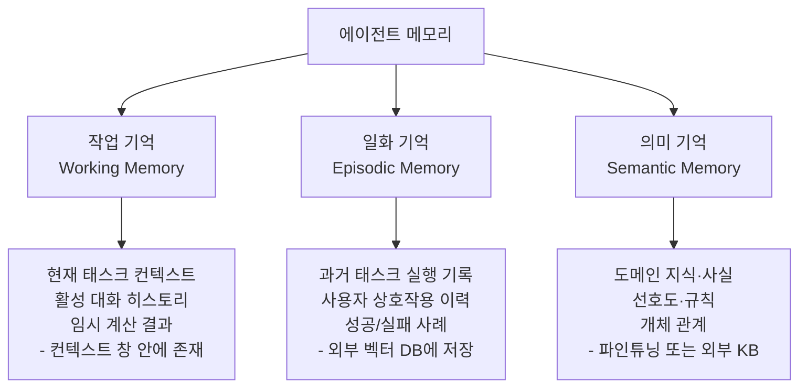
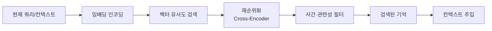

# Agent Memory Systems (Episodic / Semantic / Working)

에이전트가 세션을 넘어 경험·사실·작업 상태를 store/retrieve/update/summarize/discard 연산으로 관리하는 메모리 계층. 장기 실행 에이전트 능력의 핵심 축이다.

## 왜 중요한가

2025년 12월 47명의 저자가 참여한 "Memory in the Age of AI Agents" 서베이가 토큰 수준(token-level)/파라메트릭(parametric)/잠재(latent) 분류 체계를 정립했다. ICLR 2026 MemAgents 워크숍이 정식 채택되며 2026년 1월 이후 메모리 RL 학습 논문이 폭발적으로 증가했다.

## 메모리 3계층 분류



## 5가지 핵심 연산

| 연산 | 설명 | 구현 예시 |
|------|------|---------|
| store | 새 경험·사실을 메모리에 저장 | 벡터 임베딩 → DB 인서트 |
| retrieve | 현재 컨텍스트와 유관한 기억 조회 | 코사인 유사도 검색 |
| update | 기존 기억을 새 정보로 갱신 | 레코드 업데이트 |
| summarize | 긴 기억 시퀀스를 압축 | LLM 요약 생성 |
| discard | 오래됐거나 무관한 기억 삭제 | TTL 기반 만료 |

## 메모리 저장소 유형 비교

| 유형 | 속도 | 용량 | 영속성 | 예시 |
|------|------|------|--------|------|
| 컨텍스트 창 | 가장 빠름 | 수십만 토큰 | 세션 한정 | 작업 기억 |
| 인-컨텍스트 DB | 빠름 | 중간 | 세션 한정 | 임시 사실 저장 |
| 벡터 DB | 중간 | 수억 벡터 | 영속 | 일화 기억 |
| KV 스토어 | 빠름 | 큰 | 영속 | 키-값 사실 |
| 파라미터 | 가장 빠름 | 모델 크기 | 훈련 후 고정 | 의미 기억 |

## 검색 전략



## Agent-R: 반성(Reflection) 기반 메모리 갱신

Agent-R(Training Language Model Agents to Reflect via Iterative Self-Training)은 에이전트가 실행 결과를 **반성(reflect)**해 메모리를 자율 갱신하는 접근을 RL로 학습시킨다.

- 성공 사례: 메모리에 "이 전략이 효과적" 저장
- 실패 사례: 실패 원인 분석 후 "이 전략은 이 상황에서 비효율적" 업데이트

## 장기 기억과 RL 훈련의 결합

[[long-horizon-rl-training-for-agents|Long-Horizon RL]] 훈련에서 메모리 시스템은 다음 역할을 한다:

1. **롤아웃 효율화**: 이전 실행에서 배운 전략을 에피소딕 메모리로 재활용
2. **커리큘럼 구성**: 실패 패턴을 메모리에 기록해 어려운 케이스를 우선 훈련
3. **자기수정 가속**: 과거 실수를 즉시 조회해 반복 실수 방지

## 분류 체계: 서베이 기준

"Memory in the Age of AI Agents" 서베이(2025-12)의 3축 분류:

| 분류 축 | 유형 |
|--------|------|
| 저장 형태 | 토큰 수준 / 잠재 벡터 / 파라미터 |
| 수명 | 세션 내 / 세션 간 / 영속 |
| 접근 방식 | 명시적 조회 / 암묵적 내재화 |

## 최근 2026 연구 동향

### Graph-based Agent Memory 서베이 (arXiv 2602.05665)

Chang Yang 외 17명 (2026-02-05). 그래프 구조를 에이전트 메모리의 핵심 기술로 다루는 종합 서베이. 4차원 분류(temporal scope, content type, structure, implementation)와 memory lifecycle(extract → store → retrieve → evolve) 전 단계를 체계화했다.

대표 구현: GraphRAG(엔티티 중심), A-MEM(Zettelkasten), LiCoMemory(CogniGraph), [[plugmem-paper|PlugMem]](knowledge-centric), H-MEM(계층적 라우팅).

자세한 내용: [[graph-based-agent-memory-survey-paper]]

### PlugMem: Task-Agnostic 메모리 모듈 (arXiv 2603.03296)

Ke Yang 외 8명 (2026-03-06). 임의 LLM 에이전트에 plug-and-play 방식으로 연결 가능한 메모리 모듈. 경험을 원본 텍스트 그대로 저장하는 대신 **명제적·처방적 지식(propositional·prescriptive knowledge)**의 knowledge-centric 그래프로 구조화해 정보 밀도를 최대화한다.

핵심 시사점:
- "어떤 정보를 저장하는가"에서 "어떤 추상화 단위로 저장하는가"로 설계 패러다임 이동
- Long-horizon conversational QA, multi-hop retrieval, web agent 벤치마크에서 task-specific 설계 대비 우위

자세한 내용: [[plugmem-paper]]

## 실무 구현 패턴

```python
# 에이전트 메모리 시스템 개념 구조
class AgentMemorySystem:
    def __init__(self, vector_db, llm):
        self.vector_db = vector_db  # 일화 메모리
        self.working_memory = []    # 작업 기억 (컨텍스트)
        self.llm = llm

    def store(self, experience: dict):
        embedding = self.llm.embed(experience["content"])
        self.vector_db.insert(embedding, experience)

    def retrieve(self, query: str, top_k=5) -> list:
        query_emb = self.llm.embed(query)
        return self.vector_db.search(query_emb, top_k)

    def summarize(self, memories: list) -> str:
        return self.llm.generate(f"요약: {memories}")
```

## 실무 적용 관점

- **메모리 크기 제한**: 검색 결과를 무한정 컨텍스트에 넣으면 컨텍스트 로트 발생. 상위 3-5개 기억만 주입
- **기억 만료 정책**: 오래된 기억이 최신 정보와 충돌할 수 있음. TTL 또는 접근 빈도 기반 LRU 정책 권장
- **프라이버시**: 사용자별 메모리 격리 필수. 다중 사용자 환경에서 메모리 오염 위험
- **[[context-folding|컨텍스트 폴딩]] 연동**: 폴딩된 요약을 에피소딕 메모리에 저장하면 이후 세션에서 재사용 가능

## 대표 자료

- [Memory in the Age of AI Agents (Survey)](https://arxiv.org/abs/2512.13564)
- [ICLR 2026 MemAgents Workshop Proposal](https://openreview.net/pdf?id=U51WxL382H)
- [Agent-R: Training Language Model Agents to Reflect via Iterative Self-Training](https://arxiv.org/abs/2501.11425)
- [Agent Memory Paper List (GitHub)](https://github.com/Shichun-Liu/Agent-Memory-Paper-List)
- [Awesome-Memory-for-Agents (Tsinghua C3I)](https://github.com/TsinghuaC3I/Awesome-Memory-for-Agents)

## 관련 문서

- [[gam-agentic-memory-paper]] -- GAM: 계층적 그래프 기반 에이전트 메모리 (2604.12285)
- [[graph-based-agent-memory-survey-paper]] -- Graph-based Agent Memory 종합 서베이 (2602.05665)
- [[plugmem-paper]] -- PlugMem: Task-Agnostic knowledge-centric 메모리 모듈 (2603.03296)
- [[memory-in-the-age-of-ai-agents-paper]] -- Memory in the Age of AI Agents 대형 서베이
- [[ai-hot-topics-2026-04]]
- [[long-horizon-rl-training-for-agents|Long-Horizon RL Training for Agents]]
- [[context-folding|Context Folding & Sub-Trajectory Compression]]
- [[long-horizon-agent-benchmarks|Long-Horizon Agent Benchmarks]]
- [[agent-skills|Agent Skills]]
- [[orchestrator-worker-pattern|Orchestrator-Worker Multi-Agent Pattern]]
