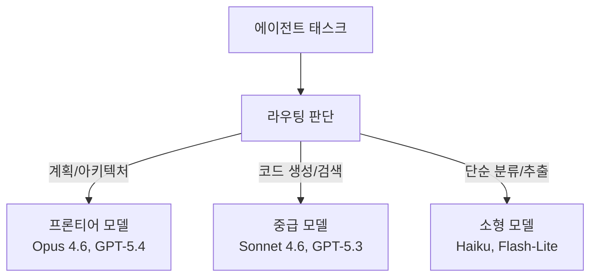

# 에이전트 모델 라우팅

에이전트 루프 내에서 **태스크 유형에 따라 다른 모델을 선택**하는 비용 최적화 패턴. 계획/판단은 프론티어 모델(Opus, GPT-5.4), 실행/검색은 소형 모델(Haiku, GPT-5.3-Instant)로 라우팅한다.

## 라우팅 전략

| 전략 | 원리 | 적용 |
|------|------|------|
| **태스크 타입 기반** | 도구 호출=소형, 추론=대형 | 가장 단순 |
| **신뢰도 기반** | 소형 모델 불확실 시 대형 에스컬레이션 | [[model-cascading]] |
| **비용 예산 기반** | 남은 토큰 예산으로 모델 선택 | [[agent-token-budget-management]] |

## 비용 절감 효과

Claude Code에서 Explore 서브에이전트에 Haiku를, 핵심 판단에 Opus를 쓰면 **70-80% 비용 절감** 가능 (Simon Willison 가이드). [[agent-cost-optimization|에이전트 비용 최적화]]의 핵심 전략.

## 관련 문서

- [[agent-cost-optimization]] -- 에이전트 비용 최적화
- [[llm-router]] -- LLM 라우터
- [[model-cascading]] -- 모델 캐스케이딩
- [[how-coding-agents-work]] -- 코딩 에이전트 동작 원리
