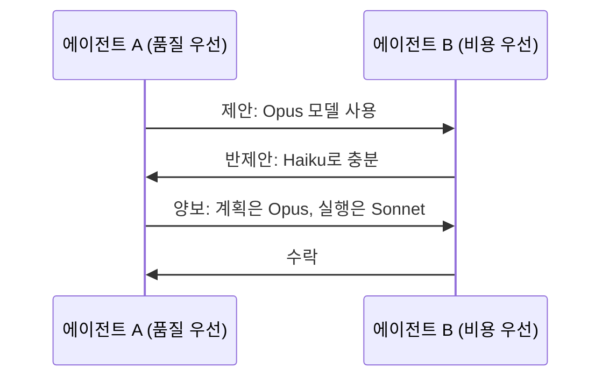

# 에이전트 협상

여러 에이전트가 **상충하는 선호도나 제약** 사이에서 합의점을 찾는 전략적 소통 프로토콜. [[contract-net-protocol|컨트랙트 넷]]이 태스크 할당에 초점이라면, 협상은 **자원 배분, 일정 조율, 품질-비용 트레이드오프** 등 더 넓은 의사결정을 다룬다.

## 협상 전략

| 전략 | 원리 | LLM 적용 |
|------|------|---------|
| **양보 (Concession)** | 점진적 양보 | 모델 등급 타협 |
| **통합 (Integrative)** | Win-win 창출 | 태스크 분할로 양측 만족 |
| **BATNA** | 최선의 대안 | 대안 모델/도구로 전환 |

## [[multi-agent-debate|디베이트]]와의 차이

디베이트는 **정답 탐색**(사실의 합의)이고, 협상은 **이해관계 조율**(선호의 합의)이다.

## 관련 문서

- [[contract-net-protocol]] -- 컨트랙트 넷 프로토콜
- [[agent-consensus-voting]] -- 합의와 투표
- [[multi-agent-orchestration]] -- 멀티에이전트 오케스트레이션
