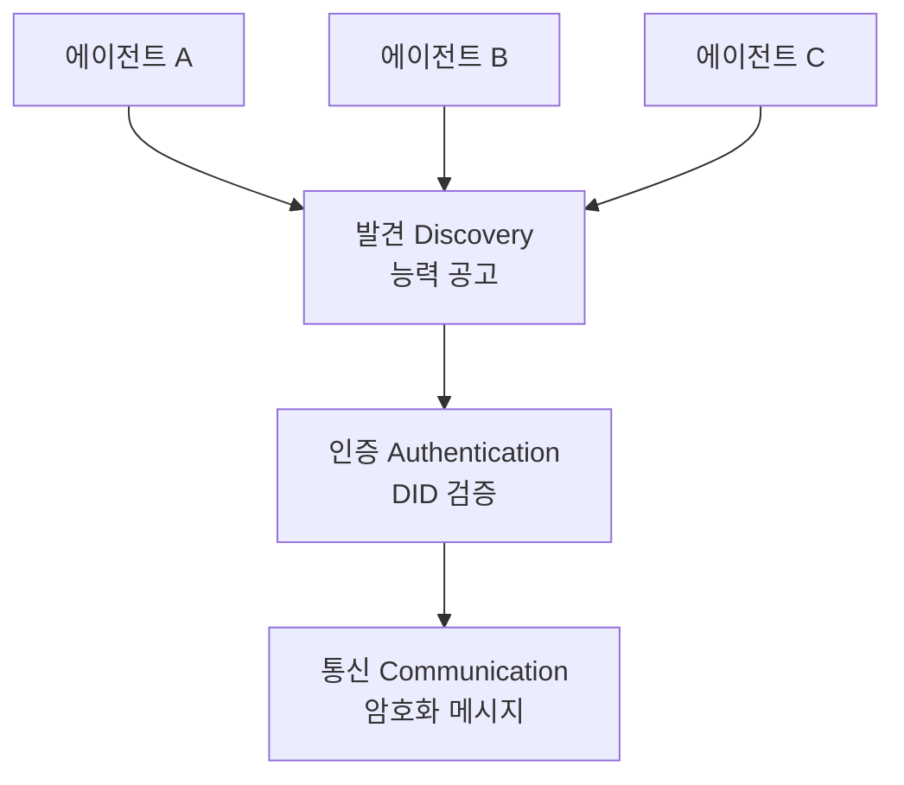

# 에이전트 네트워크 프로토콜 (ANP)

분산 에이전트 노드 간 **발견, 인증, 통신**을 다루는 프로토콜. [[a2a-protocol|A2A]]가 HTTP 기반 서버-클라이언트 모델이라면, ANP는 **P2P 탈중앙화** 네트워크에서 에이전트가 서로를 찾고 신뢰를 구축하는 메커니즘에 초점을 맞춘다.

## 3대 계층

| 계층 | 역할 | 기술 |
|------|------|------|
| 발견 | 에이전트 능력 공고/탐색 | Agent Card, 레지스트리 |
| 인증 | 신원 검증, 신뢰 구축 | DID, 검증 가능 자격증명 |
| 통신 | 메시지 교환 | 암호화 채널, 프로토콜 협상 |

## [[a2a-protocol|A2A]]와의 관계

A2A = Google이 주도하는 HTTP 기반 중앙화 프로토콜
ANP = 탈중앙 에이전트 네트워크 프로토콜

실전에서는 A2A를 기본으로 사용하되, 크로스 도메인/크로스 조직 에이전트 협업에서 ANP의 DID 인증을 활용하는 하이브리드 접근이 유망.

## 관련 문서

- [[a2a-protocol]] -- A2A 프로토콜
- [[agent-protocols-standards]] -- 에이전트 프로토콜 표준
- [[agent-capability-discovery]] -- 에이전트 능력 발견
- [[zero-trust-ai-agents]] -- 제로 트러스트 AI 에이전트
