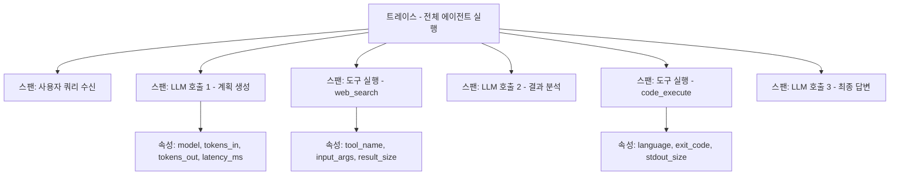
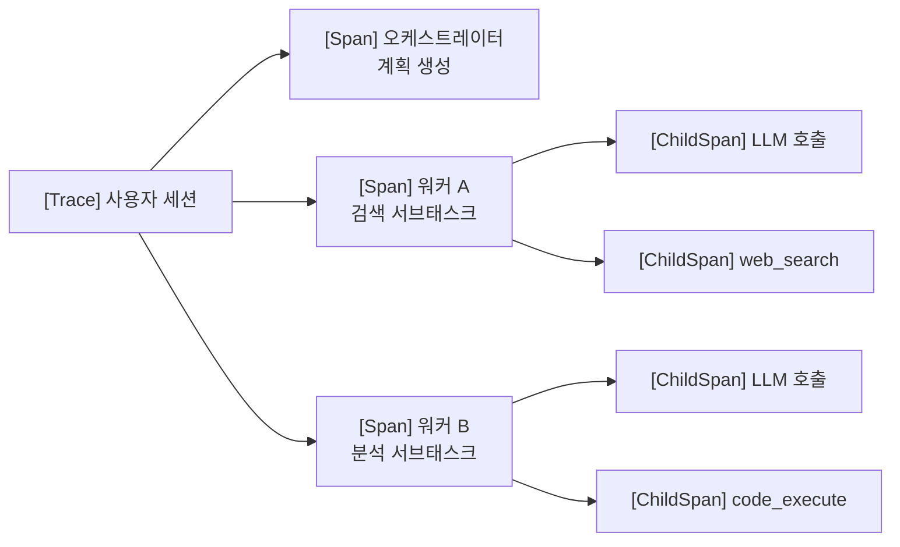

# 에이전트 옵저버빌리티 및 트레이싱 (Agent Observability & Tracing)

에이전트의 내부 동작을 분산 트레이싱(distributed tracing), 메트릭, 로그로 계측해 블랙박스 동작을 투명하게 만드는 관행. OpenTelemetry(OTel)를 표준 계측 레이어로 채택하는 추세가 강해지고 있다.

## 왜 중요한가

에이전트는 수십 번의 LLM 호출, 도구 실행, 외부 API 호출을 연쇄적으로 수행한다. 어떤 단계에서 오류가 났는지, 비용이 어디서 폭증했는지, 지연이 어느 호출에서 발생했는지를 추적하지 않으면 디버깅이 불가능하다. 또한 [[agent-trajectory-evaluation]] 같은 품질 평가도 트레이스 데이터 없이는 수행하기 어렵다.

## 핵심 개념: 스팬(Span)과 트레이스(Trace)

- **트레이스(Trace)**: 에이전트 실행 전체를 감싸는 루트 컨텍스트
- **스팬(Span)**: 트레이스 내 하나의 연산 단위 (LLM 호출 1회, 도구 실행 1회 등)
- **속성(Attribute)**: 스팬에 붙는 키-값 메타데이터 (모델명, 토큰 수, 지연 등)

## [[opentelemetry-genai-semconv]] 표준

OTel GenAI 시맨틱 컨벤션(Semantic Conventions)은 LLM 관련 스팬에 표준 속성 이름을 정의한다. 주요 속성:

| 속성 키 | 설명 | 예시 값 |
|---------|------|---------|
| `gen_ai.system` | LLM 공급자 | `openai`, `anthropic` |
| `gen_ai.request.model` | 요청 모델 ID | `claude-3-5-sonnet-20241022` |
| `gen_ai.request.max_tokens` | 최대 출력 토큰 | `4096` |
| `gen_ai.response.finish_reason` | 종료 이유 | `stop`, `tool_use`, `length` |
| `gen_ai.usage.input_tokens` | 입력 토큰 수 | `1523` |
| `gen_ai.usage.output_tokens` | 출력 토큰 수 | `412` |

이 표준을 따르면 Langfuse, Arize Phoenix, Honeycomb 등 서로 다른 옵저버빌리티 플랫폼 간 데이터 이식성이 확보된다.

## 계층적 스팬 구조

멀티에이전트 환경에서는 스팬이 중첩된다.

부모 스팬의 `trace_id`를 자식 에이전트에게 전파하면 분산 환경에서도 전체 실행 경로를 단일 트레이스로 조회할 수 있다.

## 핵심 메트릭

**지연(Latency)**
- `p50`, `p95`, `p99` LLM 호출 지연
- Time-to-First-Token (TTFT) - 스트리밍 시작까지 대기 시간

**비용(Cost)**
- 호출당 입력/출력 토큰 수
- 태스크당 누적 비용
- 캐시 히트율

**품질(Quality)**
- 도구 호출 성공률
- 에이전트 재시도 횟수
- 최종 답변의 평가 점수 (있는 경우)

## 주요 계측 도구

| 도구 | 특징 |
|------|------|
| **Langfuse** | 오픈소스, 셀프호스팅 가능, LLM 전문 |
| **Arize Phoenix** | 로컬 우선, 빠른 디버깅, OTel 호환 |
| **OpenLLMetry** | OTel 기반 LLM 계측 SDK (Python/TS) |
| **Honeycomb** | 범용 분산 트레이싱, 고급 쿼리 |
| **Langsmith** | LangChain 생태계 전용, 평가 기능 내장 |

## 실무 계측 패턴

**최소 계측(Minimal)**: LLM 호출 스팬만 수집. 비용 추적과 기본 디버깅에 충분하다.

**표준 계측(Standard)**: LLM 호출 + 도구 실행 + 에러 이벤트. 대부분의 프로덕션 환경에 권장.

**전체 계측(Full)**: 위에 더해 프롬프트/응답 전문, 사용자 피드백, A/B 테스트 메타데이터 포함. 개인정보 규정 검토 필요.

## [[agent-trajectory-evaluation]]과의 연결

트레이스 데이터는 [[agent-trajectory-evaluation]]의 핵심 입력이다. 각 스텝의 도구 선택, LLM 응답, 중간 결과를 트레이스에서 재구성하면 오프라인 평가 파이프라인을 구성할 수 있다.

## 관련 문서

- [[opentelemetry-genai-semconv]] - OTel GenAI 시맨틱 컨벤션 상세
- [[agent-trajectory-evaluation]] - 에이전트 궤적 평가
- [[agent-evaluation-framework]] - 에이전트 종합 평가 프레임워크
