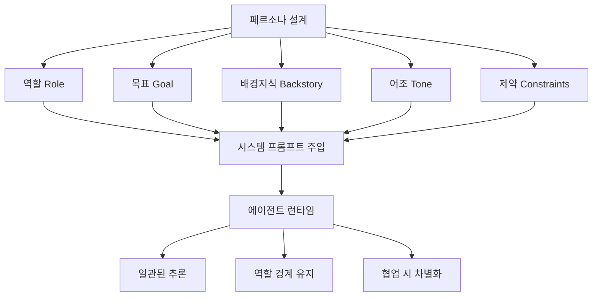
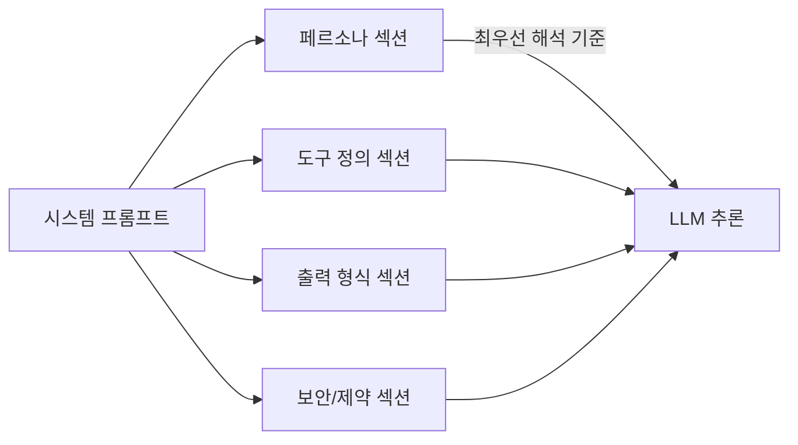

# 에이전트 페르소나와 아이덴티티

LLM 기반 에이전트에서 **페르소나(persona)**란 에이전트가 특정 역할·성격·전문성을 일관성 있게 유지하도록 시스템 프롬프트로 주입하는 정체성 레이어를 말한다. 단순한 "이름 붙이기"가 아니라 에이전트의 추론 방향, 어조, 판단 기준, 협업 방식에 직접 영향을 주는 아키텍처 결정이다.

## 왜 페르소나가 중요한가

멀티에이전트 시스템에서 각 에이전트는 서로 다른 전문 역할을 맡는다. 페르소나가 없거나 약하면 두 가지 문제가 발생한다.

- **역할 표류(role drift)**: 에이전트가 대화가 길어지면서 원래 맡은 역할 경계를 이탈해 중복 작업을 수행하거나 다른 에이전트의 결정에 무분별하게 동의한다.
- **아이덴티티 충돌**: 두 에이전트가 같은 판단 기준을 공유하면 비판적 검토가 사라지고 에코 체임버가 생긴다.

잘 설계된 페르소나는 에이전트가 자신의 관점을 유지하면서 협업할 수 있게 한다.

## 페르소나 설계 요소



위 다섯 요소는 시스템 프롬프트에 구조화된 형태로 주입된다. 배경지식(Backstory)이 특히 중요한데, 단순히 "당신은 보안 전문가입니다"가 아니라 "당신은 10년간 금융권 침투 테스트를 수행한 전문가로, 규정 준수와 실용성의 균형을 중시한다"처럼 맥락을 부여할수록 추론 일관성이 높아진다.

## CrewAI의 페르소나 패턴

[[agent-skills]] 프레임워크를 구현한 대표 사례인 CrewAI는 Agent 객체에 다음 필드를 요구한다.

```python
from crewai import Agent

researcher = Agent(
    role="선임 연구원",
    goal="최신 AI 트렌드를 심층 분석하여 실행 가능한 인사이트를 제공한다",
    backstory=(
        "학술 연구와 산업 적용 경험을 모두 갖춘 분석가. "
        "데이터 없이 결론을 내리지 않으며 불확실성을 명시한다."
    ),
    verbose=True,
    allow_delegation=False,
)
```

`allow_delegation` 플래그는 페르소나 경계와 직접 연결된다. False로 설정하면 해당 에이전트는 자신의 페르소나 범위 밖의 작업을 다른 에이전트에게 위임하지 않는다.

## 아이덴티티 일관성 유지 기법

멀티에이전트 대화가 길어질수록 페르소나가 희석되는 현상이 관찰된다. 이를 방지하는 주요 기법은 다음과 같다.

**1. 페르소나 앵커 반복**
시스템 프롬프트에 "당신의 핵심 역할은 X이며 이 대화 전반에 걸쳐 X로서 판단해야 한다"는 앵커 문장을 포함한다. 컨텍스트 창 중간에서도 앵커를 반복적으로 주입하면 표류를 줄일 수 있다.

**2. 역할 경계 명시화**
"당신은 코드를 직접 작성하지 않는다", "당신은 사용자와 직접 소통하지 않는다"처럼 하지 말아야 할 행동을 명시한다. 경계가 명확할수록 역할 혼동이 줄어든다.

**3. 내부 일관성 검사**
에이전트 응답을 파싱해 역할 위반(role violation)을 감지하는 가드레일 레이어를 오케스트레이터에 추가한다. [[multi-agent-orchestration]]의 오케스트레이터는 이 검사를 워크플로우 전체에 적용한다.

## 페르소나와 시스템 프롬프트의 관계

[[system-prompt]]는 페르소나를 실현하는 주요 매체이지만 동일하지 않다. 시스템 프롬프트는 페르소나 외에도 도구 목록, 출력 형식, 보안 지침 등 다양한 지시를 포함한다. 페르소나 섹션을 시스템 프롬프트 최상단에 배치하면 이후 지시와의 충돌을 최소화할 수 있다.



## 실무 관점

- 페르소나는 "역할 설명 + 판단 기준 + 행동 경계" 세 파트가 모두 있을 때 효과적이다.
- 에이전트 수가 많을수록 각 페르소나의 차별화 포인트를 명확히 해야 오케스트레이터의 태스크 라우팅이 정확해진다.
- 페르소나 일관성을 평가할 때는 [[agent-trajectory-evaluation]] 기법을 활용해 실제 궤적에서 역할 이탈 빈도를 측정한다.

## 관련 문서

- [[multi-agent-orchestration]] - 페르소나 기반 에이전트를 조율하는 오케스트레이터 설계
- [[system-prompt]] - 페르소나를 주입하는 구체적 매체
- [[agent-skills]] - CrewAI 등 프레임워크에서 에이전트 능력 패키지화 방식
- [[agent-trajectory-evaluation]] - 페르소나 일관성을 궤적으로 평가하는 방법
