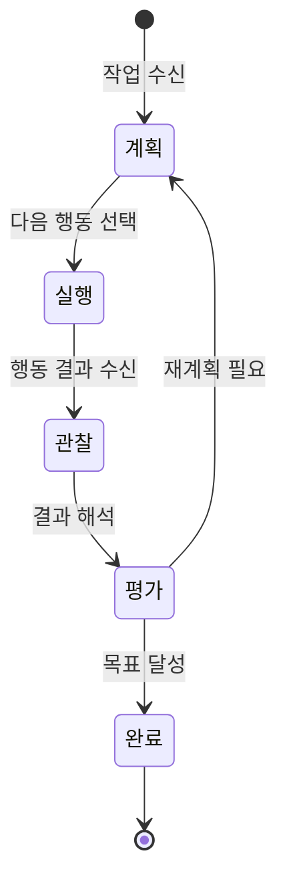
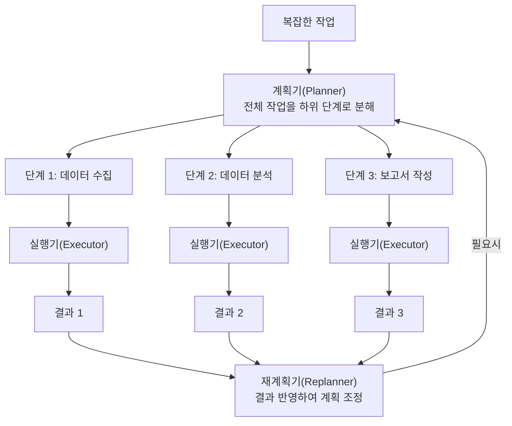
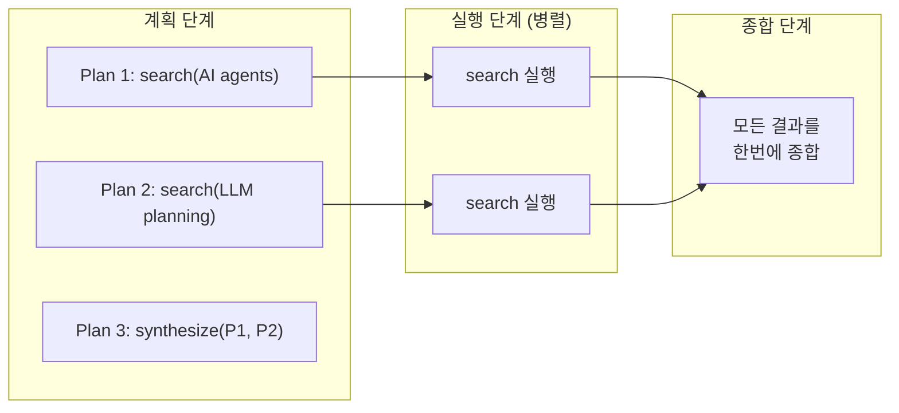
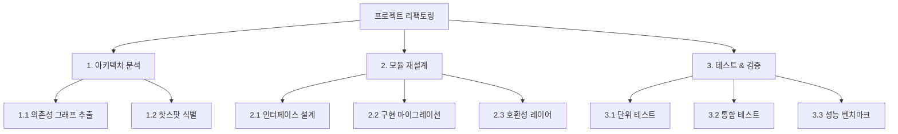

# 에이전트 계획 전략 (Agent Planning Strategies)

## 정의

**에이전트 계획 전략(Agent Planning Strategies)**은 LLM 기반 에이전트가 복잡한 작업을 수행하기 위해 하위 목표를 설정하고, 실행 순서를 결정하며, 중간 결과에 따라 계획을 조정하는 방법론의 총칭이다. 단순한 단일 턴 응답과 달리, 에이전트는 다단계 작업을 수행해야 하므로 "무엇을 어떤 순서로 할 것인가"를 결정하는 계획 능력이 핵심 역량이 된다.

계획은 에이전트의 성공과 실패를 가르는 결정적 요소다. 좋은 계획은 불필요한 도구 호출을 줄이고, 병렬 실행을 가능케 하며, 실패 시 빠른 복구를 돕는다. 반면 나쁜 계획은 무한 루프, 자원 낭비, 그리고 잘못된 결론으로 이어진다.

## 핵심 패턴

### 계획-실행-관찰 루프

대부분의 에이전트 계획 전략은 다음 기본 루프를 공유한다.



이 상태 다이어그램은 에이전트의 기본 동작 사이클을 보여준다. 계획 -> 실행 -> 관찰 -> 평가가 반복되며, 평가 결과에 따라 재계획 또는 완료로 분기한다.

## 계획 전략 분류

### 1. ReAct (Reasoning + Acting)

**ReAct**는 추론(Thought)과 행동(Action)을 교차 수행하는 패턴이다. Yao et al.(2023)이 제안했으며, 현재 가장 널리 사용되는 에이전트 패턴 중 하나다.

```
Thought: 사용자가 서울 날씨를 물어봤으니 날씨 API를 호출해야 한다
Action: weather_api(city="Seoul")
Observation: 서울 현재 기온 22도, 맑음
Thought: 결과를 얻었으니 사용자에게 답변하겠다
Action: respond("서울 현재 기온은 22도이며 맑은 날씨입니다")
```

ReAct의 강점은 단계별 추론 과정이 투명하게 드러나 디버깅이 쉽다는 것이다. 한계는 매 단계마다 LLM을 호출하므로 지연 시간이 누적된다는 점이다.

### 2. Plan-and-Execute

**Plan-and-Execute**는 작업을 먼저 전체 계획으로 분해한 뒤, 순차적으로 실행하는 2단계 패턴이다. Wang et al.(2023)의 "Plan-and-Solve Prompting"에서 비롯되었으며, LangChain의 Plan-and-Execute 에이전트로 구현되었다.



**장점**:
- 전체 작업 구조가 사전에 파악되어 자원 예측 가능
- 독립적 단계는 병렬 실행 가능
- 계획기와 실행기를 서로 다른 모델로 운용 가능

**한계**:
- 초기 계획이 부정확하면 전체 실행이 비효율적
- 예상치 못한 중간 결과에 대한 적응이 느림

### 3. ReWOO (Reasoning Without Observation)

**ReWOO**(Xu et al., 2023)는 ReAct의 직렬 실행 비효율을 해결하기 위해, 관찰(Observation) 없이 전체 계획을 먼저 수립하고, 도구 호출을 병렬로 실행한 뒤, 모든 결과를 한번에 종합한다.



ReWOO는 LLM 호출 횟수를 크게 줄여 비용과 지연 시간을 절감한다. 대신 중간 관찰에 따라 계획을 동적으로 조정하는 능력은 포기한다.

### 4. ADaPT (As-Needed Decomposition and Planning for Tasks)

**ADaPT**(Prasad et al., 2024)는 모든 작업을 사전에 분해하지 않고, 실행 중 필요할 때만 하위 작업으로 분해하는 적응적(adaptive) 전략이다.

1. 먼저 작업을 그대로 실행 시도
2. 실패하면 하위 작업으로 분해
3. 하위 작업도 실패하면 더 작은 단위로 재분해
4. 성공한 결과를 상위로 전파

이 전략은 단순한 작업에는 오버헤드를 줄이고, 복잡한 작업에는 필요한 만큼만 분해하여 효율성을 극대화한다.

## 계층적 계획 vs 평면적 계획

에이전트 계획의 구조적 깊이에 따라 두 가지 접근으로 나뉜다.

### 평면적 계획 (Flat Planning)

모든 하위 단계를 동일 레벨에서 관리한다. ReAct가 대표적이며, 단순한 작업에 적합하다.

```
1. 파일 읽기
2. 버그 찾기
3. 수정 코드 작성
4. 테스트 실행
5. 커밋
```

### 계층적 계획 (Hierarchical Planning)

상위 계획이 하위 계획을 포함하는 트리 구조다. [[orchestrator-worker-pattern]]이 대표적이며, 복잡한 다단계 작업에 적합하다.



| 구분 | 평면적 | 계층적 |
|------|--------|--------|
| 작업 복잡도 | 단순 (5-10단계) | 복잡 (10+단계, 다단계 분기) |
| 병렬화 | 제한적 | 하위 작업 간 병렬 가능 |
| 재계획 비용 | 낮음 | 높음 (하위 트리 재구성) |
| 디버깅 | 쉬움 | 중간 (계층 추적 필요) |
| 대표 패턴 | ReAct | [[orchestrator-worker-pattern]] |

## 하위 목표 분해 (Subgoal Decomposition)

계획의 핵심 능력은 복잡한 목표를 관리 가능한 하위 목표로 분해하는 것이다. 효과적인 분해는 다음 원칙을 따른다.

1. **독립성**: 하위 목표 간 의존성을 최소화하여 병렬 실행 가능하게
2. **검증 가능성**: 각 하위 목표의 완료를 명확히 판단할 수 있어야
3. **적절한 크기**: 너무 크면 실행이 어렵고, 너무 작으면 오버헤드 증가
4. **순서 명시**: 의존 관계가 있는 경우 실행 순서를 명확히

[[subagents|서브에이전트]]는 하위 목표를 별도 에이전트에 위임하여 격리된 환경에서 실행하는 구현 패턴이다. 각 서브에이전트는 자체 컨텍스트와 도구를 가지며, 상위 에이전트에 결과만 반환한다.

## 재계획 (Replanning)

초기 계획이 완벽할 수 없으므로, 실행 중 관찰에 기반한 재계획 능력이 중요하다.

### 재계획 트리거

- **실패 감지**: 도구 호출 실패, 예상과 다른 결과
- **새로운 정보**: 중간 결과가 초기 가정을 무효화
- **자원 제약**: 시간/토큰/비용 한도에 근접
- **더 나은 경로 발견**: 실행 중 더 효율적인 대안 인식

### 재계획 전략

1. **부분 재계획**: 실패한 단계와 이후만 재수립 (효율적)
2. **전체 재계획**: 현재까지의 결과를 반영하여 처음부터 재수립 (정확하지만 비용 높음)
3. **대안 경로 전환**: 미리 준비된 백업 계획으로 전환

## 실무 관점

### 전략 선택 가이드

| 작업 특성 | 권장 전략 | 이유 |
|-----------|-----------|------|
| 단순, 단계적 | ReAct | 오버헤드 최소, 투명한 추론 |
| 복잡, 사전 구조화 가능 | Plan-and-Execute | 병렬화, 자원 예측 |
| 도구 호출 중심, 독립적 | ReWOO | LLM 호출 절약, 병렬 실행 |
| 복잡도 불확실 | ADaPT | 필요시만 분해, 적응적 |
| 대규모, 다중 에이전트 | 계층적 + [[orchestrator-worker-pattern]] | 격리, 병렬, 확장성 |

### 실무 팁

1. **단순하게 시작**: ReAct로 시작하고, 성능이 부족하면 Plan-and-Execute로 전환
2. **계획 시각화**: 에이전트의 계획을 사용자에게 보여주면 신뢰도와 디버깅 효율이 높아짐
3. **계획 캐싱**: 유사한 작업의 이전 계획을 참조하면 계획 품질이 향상
4. **실패 예산**: 재계획 횟수에 상한을 두어 무한 루프 방지

## 관련 문서
- [[rewoo-efficiency-pattern]] -- ReWOO 효율 패턴 (Reasoning Without Observation)

- [[orchestrator-worker-pattern]] -- 계층적 계획의 대표적 구현 패턴
- [[subagents]] -- 하위 목표를 위임받는 서브에이전트 메커니즘
- [[how-coding-agents-work]] -- 코딩 에이전트의 계획 전략 실제 적용
- [[evolution-of-agentic-patterns]] -- 에이전트 패턴의 진화와 계획 전략의 발전
- [[agent-memory-systems]] -- 계획 수립에 필요한 메모리 시스템
- [[context-folding]] -- 긴 계획에서 컨텍스트를 효율적으로 관리하는 기법
