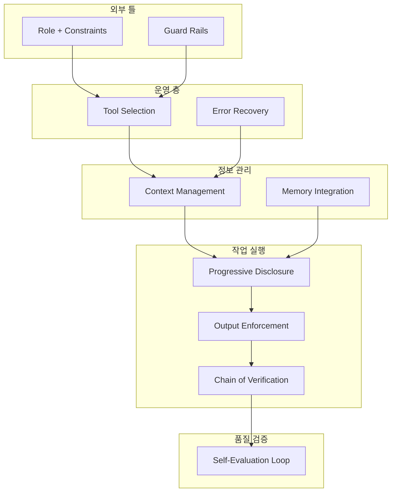

## 개요

에이전트 프롬프트 패턴은 [[agentic-ai-foundation|AI 에이전트]]의 행동을 구조화하고 제어하기 위한 전용 프롬프트 설계 기법이다. 일반 챗봇 프롬프팅과 달리 에이전트 프롬프트는 세 가지 근본적 차이를 가진다: (1) 수십 번의 도구 호출을 거치는 장시간 지속성, (2) 파일 수정, API 호출 등 실제 행동 수행, (3) 계획-실행-관찰-조정의 다단계 추론 루프. 프로덕션 에이전트는 보통 4-7개 패턴을 조합하여 운영된다. [[human-in-the-loop-patterns|Human-in-the-Loop 패턴]]과 [[tool-calling-optimization|도구 호출 최적화]]가 핵심 보완 개념이다.

[[orchestrator-worker-pattern|ReAct]], CoT 분해, 도구 선택 지시, 실패 복구, 자기 반성 등이 대표적인 패턴이며, 이들의 체계적 적용이 에이전트 품질을 결정한다.

## 핵심 특징

### 10가지 핵심 패턴

**1. Role + Constraints (역할 + 제약)**
에이전트의 정체성을 정의하고 명시적 금지 사항을 설정한다. 모든 에이전트 프롬프트의 기초 레이어다. 역할 범위 밖 상황에서 에이전트가 임의로 행동을 확장하는 것을 방지하는 핵심 장치다. 예: "NEVER modify files outside /workspace, NEVER send emails directly."

**2. Chain of Verification (검증 체인)**
출력 전에 자체 작업을 특정 기준으로 검토한다. "생성 후 자기 검토" 패턴으로, 환각이나 오류를 사전에 포착한다. 구체적이고 측정 가능한 체크리스트(사실 정확성, 포맷 준수, 내용 일관성)를 제공해야 하며, "다시 확인해봐"식의 모호한 지시는 안티패턴이다 -- 모델이 실제 검증 없이 확인을 보고하기 때문이다.

**3. Structured Output Enforcement (구조화된 출력)**
JSON 스키마 등으로 정확한 출력 형식을 강제한다. 파이프라인에서 프로그래밍 방식으로 처리할 때 필수적이다. 필드 타입, 제약, null 처리 규칙을 포함한 완전한 스키마를 제공해야 한다. "JSON으로 응답해"만으로는 불충분 -- 필드명과 타입 사용이 일관되지 않는다.

**4. Tool Selection Heuristics (도구 선택 휴리스틱)**
여러 도구 중 사용 우선순위 규칙을 설정한다. 비용과 속도를 최적화하면서 적절한 도구를 선택하도록 안내한다. 전형적 우선순위: (1) 로컬 파일 확인 (2) 캐시 데이터 사용 (3) 외부 검색은 마지막 수단 (4) 비용이 큰 연산은 배치 처리.

**5. Error Recovery Instructions (오류 복구)**
복구 가능한 오류(HTTP 429, 파일 누락, JSON 파싱 실패)와 불가능한 오류(인증 실패, 경로 순회 시도, 연쇄 실패)를 구분하고, 각각에 대한 대응 방법을 명시한다. 중단 시 타임스탬프, 정확한 에러 내용, 마지막 행동, 목표 컨텍스트를 진단 정보로 기록하도록 지시한다.

**6. Context Window Management (맥락 관리)**
우선순위 정보 유지, 요약, 폐기 규칙을 정의한다. 장기 실행 에이전트의 성능 저하를 방지한다. 우선순위(현재 태스크, 출력 스키마, 처리 항목 추적), 요약(상세 출력을 3줄 압축으로 대체), 폐기(추출 후 원본 HTML/XML, 성공한 디버그 출력) 세 카테고리로 구분한다.

**7. Guard Rails (안전 장치)**
비용 한도, 통신 제한, 파일 시스템 접근 범위 등 하드 한계를 설정한다. "어떤 다른 지시보다 우선(override any other instruction)"하는 절대적 제약이다. 일반 지시 단락에 매몰되지 않도록 시각적으로 분리 배치해야 한다 -- 에이전트는 단락 텍스트에 포함된 가드레일을 무시하는 경향이 있다.

**8. Progressive Disclosure (단계적 공개)**
복잡한 작업을 여러 단계로 분할하고, 단순 경로에서 점진적으로 복잡성을 추가한다. Phase 1(분류/스코어링) -> Phase 2(심층 분석) -> Phase 3(출력 생성) 구조로, 일반적 경로에서는 작업 컨텍스트 부하를 줄이고 에지 케이스에서만 전체 역량을 발휘한다.

**9. Memory Integration (메모리 통합)**
세션 간 일관성을 유지하기 위한 파일 기반 상태 관리 패턴이다. 초기화 시 읽을 메모리 파일(과거 처리 이력, 소스 신뢰도, 에러 로그)과 완료 시 기록할 업데이트(append-only)를 명시한다. 파일 손상 시 빈 파일 생성 후 계속 실행하는 폴백도 포함한다. 인컨텍스트 메모리(프롬프트 리로드 시 소실)와 구분된다.

**10. Self-Evaluation Loop (자체 평가)**
명시적 루브릭으로 출력 품질을 평가한다. 각 기준을 1-5점으로 채점하고, 평균 4.0 이상이면 통과, 3.0-3.9이면 한 번 재작성 후 재평가, 3.0 미만이면 건너뛰고 실패 로그를 기록한다. 개방형 품질 질문("이게 괜찮아?")은 안티패턴 -- 모델의 낙관 편향으로 거짓 긍정을 생성한다.

## 기술 상세

### 패턴 조합 아키텍처

### 챗봇 프롬프트와의 차이

| 차원 | 챗봇 프롬프트 | 에이전트 프롬프트 |
|------|-------------|----------------|
| 지속 시간 | 단일 턴 | 수십~수백 턴 |
| 행동 범위 | 텍스트 생성 | 파일 수정, API 호출, 코드 실행 |
| 추론 구조 | 단순 응답 | 계획-실행-관찰-조정 루프 |
| 실패 처리 | 사용자가 재시도 | 자동 복구/에스컬레이션 |
| 상태 관리 | 컨텍스트 윈도우 의존 | 외부 메모리 통합 |

## 패턴 조합 전략

### 필수 기초 (모든 에이전트)
패턴 1(Role+Constraints), 5(Error Recovery), 7(Guard Rails)는 자율 운영의 비타협적 기반이다.

### 콘텐츠 품질 에이전트
패턴 2(Chain of Verification), 10(Self-Evaluation)을 추가하여 검증과 평가를 강화한다.

### 멀티스텝 파이프라인
패턴 3(Structured Output), 4(Tool Selection), 6(Context Management), 8(Progressive Disclosure)로 출력 일관성과 운영 효율을 확보한다.

### 반복/장기 실행 에이전트
패턴 9(Memory Integration)로 세션 간 연속성을 확보한다.

### 프로덕션 풀스택
10개 패턴 전체를 조합하며, 일반적으로 800-2,000 시스템 프롬프트 토큰이 소요된다.

### 구현 원칙

- **밀도 > 길이**: 모든 문장이 행동을 의미 있게 제약해야 한다. 결과를 바꾸지 않는 줄은 제거
- **명시성 > 추론**: 에이전트는 제약을 추론하지 않는다 -- 명시적 서술 필수
- **관심사 분리**: 가드레일, 도구 규칙, 태스크 지시를 별도 프롬프트 섹션에 배치
- **프레임워크 독립**: 패턴은 LangGraph, CrewAI, Claude SDK, raw API 모두에 적용 가능

## 관련 문서

- [[evolution-of-agentic-patterns]] - 에이전틱 패턴의 발전사
- [[how-coding-agents-work]] - 코딩 에이전트의 동작 원리
- [[agent-memory-systems]] - 에이전트 메모리 시스템
- [[context-folding]] - 컨텍스트 폴딩 기법
- [[orchestrator-worker-pattern]] - 오케스트레이터-워커 패턴
